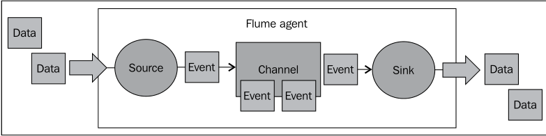
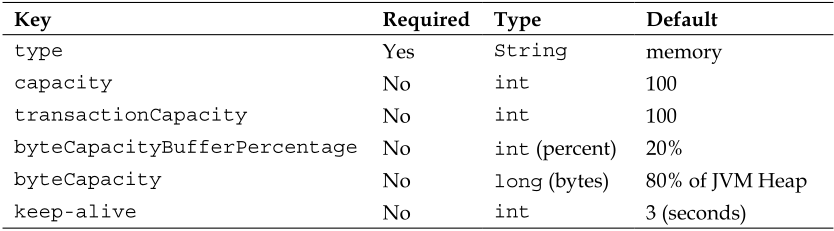
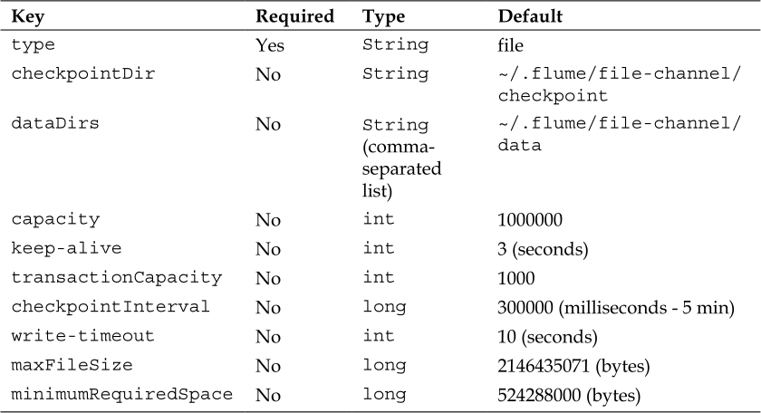
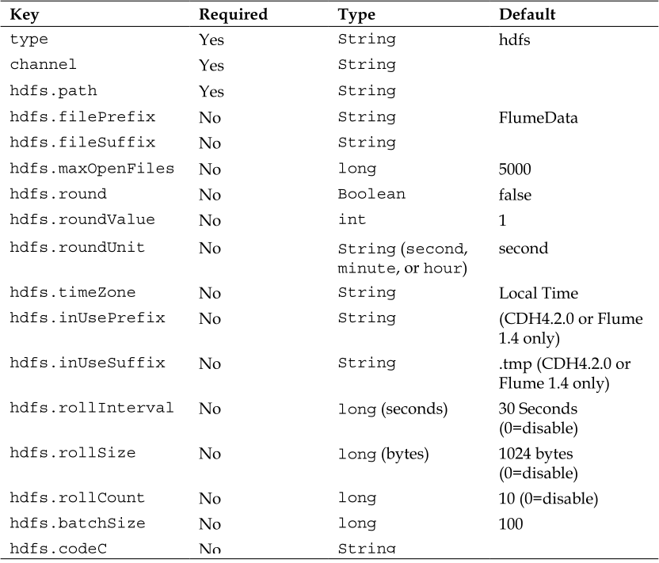

# Apache Flume - Distributed Log Collection For Hadoop
-------

# 1. Overview and Architecture

## The problem with HDFS and streaming data/logs

* HDFS isn't a real filesystem, and many of the things we take for granted with normal filesystems don't apply here
* In a regular Portable Operating System Interface (POSIX) style filesystem, if you open a file and write data, it still exists on disk before the file is closed.
    * if that writing process is interrupted, any portion that made it to disk is usable (it may be incomplete, but it exists)
    * In HDFS the file exists only as a directory entry, it shows as having zero length until the file is closed.
    * if data is written to a file for an extended period without closing it, a network disconnect with the client will leave you with nothing but an empty file for all your efforts
* This may lead you to the conclusion that it would be wise to write small files so you can close them as soon as possible
    * **Hadoop doesn't like lots of tiny files!**
    * If you have lots of tiny files, the cost of starting the worker processes can be disproportionally high compared to the data it is processing
    * This kind of block fragmentation also results in more mapper tasks increasing the overall job run times
* If the plan is to keep the data around for a short time, then you can lean towards the smaller file size.
* if you plan on keeping the data for very long time, you can either target larger files
    * or do some periodic cleanup to compact smaller files into fewer larger files to make them more MapReduce friendly

## Sources, channels, and sinks



* Running inside an **agent** daemon
    * An input is called a source and an output is called a sink
    * A channel provides the glue between a source and a sink
* **keep in mind**
    * A source writes events to one or more channels
    * A channel is the holding area as events are passed from a source to a sink.
    * A sink receives events from one channel only.
    * An agent can have many sources, channels, and sinks.

## Flume events
* basic payload of data transported by Flume is called an event
* An event is composed of zero or more headers and a body
* The headers are key/value pairs that can be used to make routing decisions or carry other structured information

## Interceptors, channel selectors, and sink processors

* An interceptor is a point in your data flow where you can inspect and alter Flume events
    * You can chain zero or more interceptors after a source creates an event or before a sink sends the event wherever it is destined
* Channel selectors are responsible for how data moves from a source to one or more channels
    * A replicating channel selector (the default) simply puts a copy of the event into each channel assuming you have configured more than one
    * a multiplexing channel selector can write to different channels depending on certain header information.
* a sink processor is the mechanism by which you can create failover paths for your sinks or load balance events across multiple sinks from a channel

-------------

# 2. Flume Quick Start

## Flume configuration file overview

```
agent.sources=<list of sources>
agent.channels=<list of channels>
agent.sinks=<list of sinks>
```

* Each agent is configured starting with three parameters
* Each source, channel, and sink also has a unique name within the context of that agent
* Example
    * if I'm going to transport my Apache access logs, I might define a channel named `access`
    * The configurations for this channel would all start with the prefix `agent.channels.access`
* Each configuration item has a type property that tells Flume what kind of source, channel, or sink it is

## Starting up with "Hello World"

```
agent.sources=s1
agent.channels=c1
agent.sinks=k1
agent.sources.s1.type=netcat
agent.sources.s1.channels=c1
agent.sources.s1.bind=0.0.0.0
agent.sources.s1.port=12345
agent.channels.c1.type=memory
agent.sinks.k1.type=logger
agent.sinks.k1.channel=c1
```

* Here I've defined one agent (called `agent`) that has a source named `s1`, a channel named `c1`, and a sink named `k1`.
* The s1 source's type is `netcat`, which simply opens a socket listening for events **(one line of text per event)**
* The source configuration also has a parameter called channels (plural) that is the name of the channel/channels the source will append events to, in this case c1
* The channel named `c1` is a memory channel with default configuration.
* The sink named `k1` is of type `logger` (mostly used for debugging and testing)
    * It will log all events at INFO level using log4j, which it receives from the configured channel, in this case `c1`
    * the channel keyword is singular because a sink can only be fed data from one channel

-------------------

# 3. Channels

* a channel is the construct used between sources and sinks.
* It provides a holding area for your in-flight events after they are read from sources until they can be written to sinks in your data processing pipelines
* The durable file channel flushes all changes to disk before acknowledging receipt of the event to the sender
    * considerably slower than using the non-durable memory channel
    * provides recoverability in the event of system or Flume agent restarts
* the memory channel is much faster
    * failure results in data loss
    * has much lower storage capacity when compared with the disks backing the file channel
* regardless of what channel you choose, if your rate of ingest from the sources into the channel is greater than the rate the sink can write data, you will exceed the capacity of the channel and you will throw a `ChannelException`
* ** you always want your sink to be able to write faster than your source input**
    * Otherwise, you may get into a situation where once your sink falls behind you can never catch up

## Memory channel

* a channel where in-flight events are stored in memory.
* events can be ingested much more quickly resulting in reduced hardware needs
* The downside of using this channel is that an agent failure results in loss of data
* To use the memory channel, set the    type parameter on your named channel to memory
    * `agent.channels.c1.type=memory`
* The default capacity of this channel is 100 Events
    * if you increase this value you may also have to increase your Java heap space
* transactionCapacity is the maximum number of events that can be written, in a single transaction, when moving data from the source to the channel
    * This is also the number of events that can be read, in a single transaction, when moving data from the channel to the sink
    * Increase it to decrease the overhead of the transaction wrapper, which may speed things up
    * The downside to increasing this, in the event of a failure, is that a source would have to roll back more data
* the keep-alive parameter is the time the thread writing data into the channel will wait when the channel is full before giving up
    * if space opens up before the timeout expires, the data will be written to the channel rather than throwing an exception back to the source



## File Channel

* a channel that stores events to the local filesystem of the agent
* should be used in use cases where a gap in your data flow is undesirable
* the durability is provided by a combination of a Write Ahead Log (WAL) and one or more file storage directories
* to use the file channel, set the    type parameter on your named channel to file
    * `agent.channels.c1.type=file`
* To specify the location where the agent should hold data, you set the `checkpointDir` and `dataDirs` properties
* For production deployments and development work with multiple file channels
    * use distinct directory paths for each file channel storage area
    * consider placing different channels on different disks to avoid IO contention
* Be sure you set the HADOOP_PREFIX and JAVA_HOME environment variables when using the file channel
    * java.lang.NoClassDefFoundError: org/apache/hadoop/io/Writable
* If the channel capacity is reached, a source will no longer be able to ingest data
* The checkpointInterval property is the number of milliseconds between performing a checkpoint
    * You cannot set this lower than 1000 milliseconds
* the `minimumRequiredSpace` property is the amount of space you **do not** want to use for writing of logs
    * The default configuration will throw an exception if you attempt to use the last 500 MB of the disk associated with the dataDir path
    * This limit applies across all channels, so if you have three file channels configured, the upper limit is still 500 MB, not 1.5 GB



-----------------

# 4. Sinks and Sink Processors

* The job of the HDFS sink is to continuously open a file in HDFS, stream data into it, and at some point close that file and start a new one.
* how long between files rotations must be balanced with how quickly files are closed in HDFS, thus making the data visible for processing
* To use the HDFS sink, set the    type parameter on your named `sink` to `hdfs`
    * `agent.sinks.k1.type=hdfs`
* specify the `path` in HDFS where you want to write the data
    * `agent.sinks.k1.hdfs.path=/path/in/hdfs`
    * this path can be specified in three different ways
        * absolute, absolute with server name, and relative
    * absolute: `/Users/flume/mydata`
    * absolute with server name: `hdfs://namenode/Users/flume/mydata`
    * relative: `mydata`
* **don't keep persistent data in HDFS user directories; use absolute paths with some meaningful path name** (/logs/apache/access)
* specify a name node if the target is a different Hadoop cluster entirely
    * This allows you to move configurations you've already tested in one environment into another without unintended consequences
* finally, set the `channel` parameter with the channel name to read from
    * `agent.sinks.k1.channel=c1`



## Path and filename
* Each time Flume starts a new file at `hdfs.path` in HDFS to write data into, the filename is composed of
    * `hdfs.filePrefix`
    * a period character
    * the epoch timestamp the file was started
    * (optional) a file suffix specified by the `hdfs.fileSuffix` property

### Use Cases

* add some kind of time element into the path to partition the files into subdirectories
    * `agent.sinks.k1.hdfs.path=/logs/apache/access/%Y/%m/%D/%H` will create a path like `/logs/apache/access/2013/03/10/18/`
* Another handy escape sequence mechanism is the ability to use Flume header values in your path
    * `agent.sinks.k1.hdfs.path=/logs/apache/%{logType}/%Y/%m/%D/%H`
    * both log types in the same directory path
        * `agent.sinks.k1.hdfs.path=/logs/apache/%Y/%m/%D/%H`
        * `agent.sinks.k1.hdfs.filePrefix=%{logType}`
* rounding down event times at a hour, minute, or second granularity while still maintaining those elements in file paths
    * Config
        * `agent.sinks.k1.hdfs.path=/logs/apache/%Y/%m/%D/%H%M`
        * `agent.sinks.k1.hdfs.round=true`
        * `agent.sinks.k1.hdfs.roundValue=15`
        * `agent.sinks.k1.hdfs.roundUnit=minute`
    * This would result in logs between 01:15:00 and 01:29:59 on 2013-03-10 to be written to files contained in /logs/apache/2013/03/10/0115/
    * Logs from 01:30:00 to 01:44:59 would be written in files contained in /logs/apache/2013/03/10/0130/
* TimeZone
    * set this property on my Flume agents to make the time zone issue just go away
    * `-Duser.timezone=UTC`
* **Temporary Files**
    * while files are being written to the HDFS, a `.tmp` extension is added
    * When the file is closed, the extension is removed
    * Since you typically specify a directory for input in your MapReduce job (or because you are using Hive), the temporary files will often be picked up by mistake as empty or garbled input
    * To avoid having your temporary files picked up before being closed, set the suffix to blank (rather than the default of `.tmp`) and the prefix to either a dot or an underscore character
        * `agent.sinks.k1.hdfs.inUsePrefix=_`
        * `agent.sinks.k1.hdfs.inUseSuffix=`

### File Rotation

* By default, Flume will rotate actively written to files every 30 seconds, 10 events, or 1024 bytes
    * This is done by setting the `hdfs.rollInterval`, `hdfs.rollCount`, and `hdfs.rollSize` properties respectively
* One or more of these can be set to zero to disable that particular rolling mechanism

## Compression codecs

* If you want to specify compression for your data, you set the `hdfs.codeC` property if you want the HDFS sink to write compressed files
* Flume supports
    * gzip, bzip2, lzo, and snappy
* Keep in mind that splittability of the file, especially if you are using plain text files, will greatly affect the performance of your MapReduce jobs
* **Impala** supports the following compression codecs:
    * Snappy - Recommended for its effective balance between compression ratio and decompression speed. Snappy compression is very fast, but GZIP provides greater space savings. Not supported for text files.
    * GZIP - Recommended when achieving the highest level of compression (and therefore greatest disk-space savings) is desired. Not supported for text files.
    * Deflate - Not supported for text files.
    * BZIP2 - Not supported for text files.
    * LZO - For Text files only. Impala can query LZO-compressed Text tables, but currently cannot create them or insert data into them; perform these operations in Hive.

## Event serializers

* An event serializer is the mechanism by which a Flume event is converted into another format for output
    * It is similar in function to the Layout class in log4j.
* Default serializer
    * `text` serializer
    * outputs just the Flume event body
* `header_and_text` outputs both the headers and the body
* `avro_event` can be used to create an Avro representation of the event

### Text output

* Each event has a new line character appender unless you override this default behavior by setting the `serializer.appendNewLine` property to `false`

|Key|Required|Type|Default|
|---|--------|----|-------|
|serializer|No|String|text|
|serializer.appendNewLine|No|boolean|true|

### Text with headers

* The output format consists of the headers, followed by a space, then the body payload, and finally terminated by an optionally disabled new line character

```
Example:

{key1=value1, key2=value2} body text here
```

|Key|Required|Type|Default|
|---|--------|----|-------|
|serializer|No|String|text_with_headers|
|serializer.appendNewLine|No|boolean|true|

### Apache Avro

* The format is self-describing using JSON
    * a good long-term data storage format, as your data format may evolve over time
* this serializer creates Avro data based on the Flume event schema
    * It has no formatting parameters, since Avro dictates the format of the data
    * the structure of the Flume event dictates the schema used
* If you want to use Avro, but want to use a different schema from the Flume event schema, you will have to write your own event serializer
* If you want your data compressed before being written to the Avro container, you should set the `serializer.compressionCodec` property to the file extension of an installed codec
* For Avro files to work in an Avro MapReduce job
    * files must end in .avro
    * explicitly set the `hdfs.fileSuffix` property
    * do not set the `hdfs.codeC` property on an Avro file

|Key|Required|Type|Default|
|---|--------|----|-------|
|serializer|No|String|avro_event|
|serializer.compressionCodec|No|String (gzip,bzip2,lzo, or snappy)||
|serializer.syncIntervalBytes|No|int (bytes)|2048000 (bytes)|

### File type

* By default the HDFS sink writes data to HDFS as Hadoop SequenceFiles
    * a common Hadoop wrapper that consists of a key and value field separated by binary field and record delimiters
* if you want the payload interpreted as a String, you can override the `hdfs.writeType` property so a `org.apache.hadoop.io.Text` will be used as the value field

|Key|Required|Type|Default|
|---|--------|----|-------|
|hdfs.fileType|No|String|SequenceFile|
|hdfs.writeType|No|String|text|

### Timeouts and workers

* The `hdfs.callTimeout` is the amount of time the HDFS sink will wait for HDFS operations to return a success (or failure) before giving up
    * if your Hadoop cluster is particularly slow you may need to set this value higher to avoid errors
    * Keep in mind that your channel will overflow if you cannot sustain higher write throughput than input rate to your channel
* The `hdfs.idleTimeout` property is the time Flume will wait to automatically close an idle file
    * use `hdfs.fileRollInterval` instead
* The first property you can set to adjust the number of workers is `hdfs.threadsPoolSize`, which defaults to 10
    * the maximum number of files that can be written to at the same time
    * be careful when increasing this value too much so as to not overwhelm the HDFS
* The `hdfs.rollTimerPoolSize` property is the number of workers processing timeouts set by the `hdfs.idleTimeout` property
    * ignore it if you don't use the `hdfs.idleTimeout`

|Key|Required|Type|Default|
|---|--------|----|-------|
|hdfs.callTimeout|No|long (milliseconds)|0 (0 = disable)|
|hdfs.threadsPoolSize|No|int|10|
|hdfs.rollTimerPoolSize|No|int|1|

## Sink groups

* In order to remove single points of failure in your data processing pipeline, Flume has the ability to send events to different sinks using either
    * load balancing or
    * failover
* A sink group is used to create a logical grouping of sinks
    *  The behavior of this grouping is dictated by something called the sink processor, which determines how events are routed.
* In order for Flume to know about the sink groups, there is a new top-level agent property called `sinkgroups`
    * `agent.sinkgroups=sg1`
* For each named sink group, you need to specify the sinks it contains using the `sinks` property consisting of a space-delimited list of sink names
    * `agent.sinkgroups.sg1.sinks=k1,k2`
* used to write to different Hadoop clusters, since even a well maintained cluster has periodic maintenance

# 5. Sources and Channel Selectors

## The problem with using tail

* If you had used any of the Flume 0.9 releases, you'll notice that the TailSource is no longer part of Flume
    * TailSource provided a mechanism to  tail any file on the system and create Flume events for each line of the file
* When you are tailing a file, there is no way to participate properly in a transaction
* if the rate of data written to a file exceeded the rate Flume could read the data, it is possible to lose one or more logfiles of input outright

## The exec source

* provides a mechanism to run a command outside of Flume and then turn the output into Flume events
* The only other required parameter is the  command property, which tells Flume what command to pass to the operating system
* Should you use the `tail -F` command in conjunction with the exec source, it is probable that the forked process will not shut down 100% of the time when the Flume agent shuts down or restarts
    * This will leave orphaned tail processes that will never exit
    * be sure to periodically scan the process tables for `tail -F` whose parent PID is 1. These are effectively dead processes and need to be killed manuall
* Not every command keeps running, either because it fails or the command is designed to exit immediately
    * you can use the `restart` and `restartThrottle` properties to run it periodically
* Sometimes commands write the output you want to capture to `StdErr`
    * If you want these lines included as well, set the `logStdErr` property to `true`

```
agent.sources=s1
agent.sources.s1.channels=c1
agent.sources.s1.type=exec
agent.sources.s1.command=tail -F /var/log/app.log
```

|Key|Required|Type|Default|
|---|--------|----|-------|
|type|Yes|String|exec|
|channels|Yes|String|Space-separated list of channels|
|command|Yes|String||
|restart|No|boolean|false|
|restartThrottle|No|long (milliseconds)|10000 milliseconds|
|logStdErr|No|boolean|false|
|batchSize|No|int|20|

## The spooling directory source
