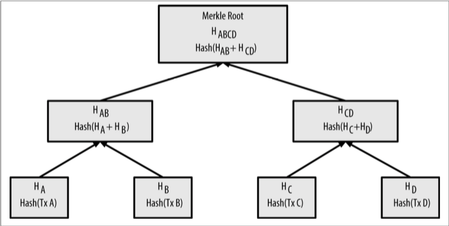

# Mastering Bitcoin

## Links

* https://github.com/hyperledger
* https://github.com/hyperledger/hyperledger
* https://github.com/hyperledger/fabric
* https://github.com/hyperledger/fabric-api

## Introduction

* Bitcoin is a collection of concepts and technologies that form the basis of a digital money ecosystem.
    * Units of currency called bitcoins are used to store and transmit value among participants in the bitcoin network.
    * Bitcoin users communicate with each other using the bitcoin protocol primarily via the Internet
* **Users of bitcoin own keys that allow them to prove ownership of transactions in the bitcoin network**, unlocking the value to spend it and transfer it to a new recipient
    * Those keys are often stored in a digital wallet on each user's computer.
    * Possession of the key that unlocks a transaction is the only prerequisite to spending bitcoins, putting the control entirely in the hands of each user.
* Bitcoin mining decentralizes the currency-issuance and clearing functions of a central bank and replaces the need for any central bank with this global competition.
* **The "double-spend problem"**
    * Physical money addresses the double-spend issue easily because the same paper note cannot be in two places at once.
    * In these cases [storing and digitally transfering money], the counterfeiting and double-spend issues are handled by clearing all electronic transactions through central authorities that have a global view of the currency in circulation
    * For digital money, which cannot take advantage of esoteric inks or holographic strips, cryptography provides the basis for trusting the legitimacy of a user's claim to value
* To be robust against intervention by antagonists, whether legitimate governments or criminal elements, a decentralized digital currency was needed to avoid a single point of attack.
* Bitcoin consists of:
    * A decentralized peer-to-peer network (the bitcoin protocol)
    * A public transaction ledger (the blockchain)
    * A decentralized mathematical and deterministic currency issuance (distributed mining)
    * A decentralized transaction verification system (transaction script)
* **The key innovation was to use a distributed computation system (called a "proof-of-work" algorithm) to conduct a global "election" every 10 minutes, allowing the decentralized network to arrive at consensus about the state of transactions. **
* The three main forms of bitcoin clients are:
    * A full client, or "full node", is a client that stores the entire history of bitcoin transactions (every transaction by every user, ever), manages the users' wallets, and can initiate transactions directly on the bitcoin network -> "standalone email server"
    * A lightweight client stores the user's wallet but relies on third-party–owned servers for access to the bitcoin transactions and network. The light client does not store a full copy of all transactions and therefore must trust the third-party servers for transaction validation -> "email client"
    * Web clients are accessed through a web browser and store the user’s wallet on a server owned by a third party -> "webmail"
        * If a web-wallet service is compromised, as many have been, the users can lose all their funds. Conversely, if users have a full client without adequate backups, they might lose their funds through a computer mishap
* Like email addresses, Bitcoin addresses can be shared with other bitcoin users who can use them to send bitcoin directly to your wallet
    * Unlike email addresses, you can create new addresses as often as you like, all of which will direct funds to your wallet.
    * A wallet is simply a collection of addresses and the keys that unlock the funds within.
    * You can increase your privacy by using a different address for every transaction (there is practically no limit to the number of addresses a user can create)
* There is nothing sensitive, from a security perspective, about the bitcoin address. It can be posted anywhere without risking the security of her account.

## How Bitcoin Works

* The bitcoin system, unlike traditional banking and payment systems, is based on decentralized trust
    * Instead of a central trusted authority, in bitcoin, trust is achieved as an emergent property from the interactions of different participants in the bitcoin system.
* The bitcoin system consists of
    * users with wallets containing keys
    * transactions that are propagated across the network
    * and miners who produce (through competitive computation) the consensus blockchain, which is the authoritative ledger of all transactions
* The payment request QR code encodes the following URL, defined in BIP0021:

```txt
bitcoin:1GdK9UzpHBzqzX2A9JFP3Di4weBwqgmoQA?
amount=0.015&
label=Bob%27s%20Cafe&
message=Purchase%20at%20Bob%27s%20Cafe
```

* Components of the URL
    * A bitcoin address: "1GdK9UzpHBzqzX2A9JFP3Di4weBwqgmoQA"
    * The payment amount: "0.015"
    * A label for the recipient address: "Bob's Cafe"
    * A description for the payment: "Purchase at Bob's Cafe"
* Transactions are like lines in a double-entry bookkeeping ledger.
    * In simple terms, each transaction contains one or more "inputs", which are debits against a bitcoin account
    * On the other side of the transaction, there are one or more "outputs", which are credits added to a bitcoin account
    * The inputs and outputs (debits and credits) do not necessarily add up to the same amount. Instead, outputs add up to slightly less than inputs and the difference represents an implied "transaction fee", which is a small payment collected by the miner who includes the transaction in the ledger
* Transactions move value from transaction inputs to transaction outputs.
    * An input is where the coin value is coming from, usually a previous transaction's output.
    * A transaction output assigns a new owner to the value by associating it with a key.
    * The destination key is called an encumbrance. It imposes a requirement for a signature for the funds to be redeemed in future transactions.
    * Outputs from one transaction can be used as inputs in a new transaction, thus creating a chain of ownership as the value is moved from address to address
* The most common form of transaction is a simple payment from one address to another, which often includes some "change" returned to the original owner. This type of transaction has one input and two outputs
    * Input 0: From Alice, signed by Alice
    * Output 0: To Bob
    * Output 1: To Alice (change)
* Another common form of transaction is one that aggregates several inputs into a single output. This represents the real-world equivalent of exchanging a pile of coins and currency notes for a single larger note (usually generated by wallet applications to clean up lots of smaller amounts that were received as change for payments)
* Another transaction form is one that distributes one input to multiple outputs representing multiple recipients. This type of transaction is sometimes used by commercial entities to distribute funds, such as when processing payroll payments to multiple employees.
* A wallet application can construct transactions even if it is completely offline. The transaction does not need to be constructed and signed while connected to the bitcoin network. It only has to be sent to the network eventually for it to be executed.
* Most wallet applications keep a small database of "unspent transaction outputs" that are locked (encumbered) with the wallet's own keys. Because a full-index client takes up a lot of disk space, most user wallets run "lightweight" clients that track only the user's own unspent outputs.

```bash
# Look up all the unspent outputs for Alice’s bitcoin address

curl -v 'https://blockchain.info/unspent?active=1Cdid9KFAaatwczBwBttQcwXYCpvK8h7FK'
```

* A transaction output is created in the form of a script that creates an encumbrance on the value and can only be redeemed by the introduction of a solution to the script.
    * In simpler terms, Alice's transaction output will contain a script that says something like, "This output is payable to whoever can present a signature from the key corresponding to Bob's public address". Because only Bob has the wallet with the keys corresponding to that address, only Bob's wallet can present such a signature to redeem this output. Alice will therefore "encumber" the output value with a demand for a signature from Bob.
* For the transaction to be processed by the network in a timely fashion, Alice's wallet application will add a small fee. This is not explicit in the transaction; it is implied by the difference between inputs and outputs.
* Any bitcoin network node (other client) that receives a valid transaction it has not seen before will immediately forward it to other nodes to which it is connected. Thus, the transaction rapidly propagates out across the peer-to-peer network, reaching a large percentage of the nodes within a few seconds.
* Bob's wallet application can also independently verify that the transaction is well formed, uses previously unspent inputs, and contains sufficient transaction fees to be included in the next block. At this point Bob can assume, with little risk, that the transaction will shortly be included in a block and confirmed.
    * A common misconception about bitcoin transactions is that they must be "confirmed" by waiting 10 minutes for a new block, or up to 60 minutes for a full six confirmations.
    * Although confirmations ensure the transaction has been accepted by the whole network, such a delay is unnecessary for small-value items.
    * A merchant may accept a valid small-value transaction with no confirmations, with no more risk than a credit card payment made without an ID or a signature, as merchants routinely accept today.
* The bitcoin system of trust is based on computation. Transactions are bundled into blocks, which require an enormous amount of computation to prove, but only a small amount of computation to verify as proven. The mining process serves two purposes in bitcoin
    * Mining creates new bitcoins in each block, almost like a central bank printing new money. The amount of bitcoin created per block is fixed and diminishes with time.
    * Mining creates trust by ensuring that transactions are only confirmed if enough computational power was devoted to the block that contains them. More blocks mean more computation, which means more trust.
    * At the time of this writing, the difficulty is so high that it is profitable only to mine with application-specific integrated circuits (ASIC), essentially hundreds of mining algorithms printed in hardware, running in parallel on a single silicon chip.
* Transactions are added to the new block, prioritized by the highest-fee transactions first and a few other criteria. Each miner starts the process of mining a new block of transactions as soon as he receives the previous block from the network, knowing he has lost that previous round of competition
* **Each block mined on top of the one containing the transaction is an additional confirmation. As the blocks pile on top of each other, it becomes exponentially harder to reverse the transaction, thereby making it more and more trusted by the network.**
* **By convention, any block with more than six confirmations is considered irrevocable, because it would require an immense amount of computation to invalidate and recalculate six blocks.**

## The Bitcoin Client

* Without a signature, this transaction is meaningless; we haven't yet proven that we own the address from which the unspent output is sourced.
* By signing, we remove the encumbrance on the output and prove that we own this output and can spend it. We use the `signrawtransaction` command to sign the transaction.
    * An encrypted wallet must be unlocked before a transaction is signed because signing requires access to the secret keys in the wallet.

## Keys, Addresses, Wallets

* Ownership of bitcoin is established through
    * digital keys
    * bitcoin addresses
    * and digital signatures
* The digital keys are not actually stored in the network, but are instead created and stored by users in a file, or simple database, called a wallet. Keys enable many of the interesting properties of bitcoin, including decentralized trust and control, ownership attestation, and the cryptographic-proof security model.
* In the payment portion of a bitcoin transaction, the recipient’s public key is represented by its digital fingerprint, called a **bitcoin address**
* Not all bitcoin addresses represent public keys; they can also represent other beneficiaries such as scripts
    * bitcoin addresses abstract the recipient of funds, making transaction destinations flexible, similar to paper checks
* Bitcoin uses elliptic curve multiplication as the basis for its public key cryptography.
* When spending bitcoins, the current bitcoin owner presents her public key and a signature (**different each time, but created from the same private key**) in a transaction to spend those bitcoins.
    * Through the presentation of the public key and signature, everyone in the bitcoin network can verify and accept the transaction as valid, confirming that the person transferring the bitcoins owned them at the time of the transfer.
* The bitcoin private key is just a number. You can pick your private keys randomly using just a coin, pencil, and paper: toss a coin 256 times and you have the binary digits of a random private key you can use in a bitcoin wallet.
* Creating a bitcoin key is essentially the same as "Pick a number between 1 and 2^256"
    * Do not write your own code to create a random number or use a "simple" random number generator offered by your programming language
    * Use a cryptographically secure pseudo-random number generator (CSPRNG) with a seed from a source of sufficient entropy.
* The algorithms used to make a bitcoin address from a public key are the Secure Hash Algorithm (SHA) and the RACE Integrity Primitives Evaluation Message Digest (RIPEMD), specifically SHA256 and RIPEMD160.
    * A bitcoin address is not the same as a public key. Bitcoin addresses are derived from a public key using a one-way function.
* Bitcoin addresses are almost always presented to users in an encoding called "Base58Check", which uses 58 characters (a Base58 number system) and a checksum to help human readability, avoid ambiguity, and protect against errors in address transcription and entry.
* Base58 is Base64 without the 0 (number zero), O (capital o), l (lower L), I (capital i), and the symbols "\", "+" and "/".
    * Base58Check is a Base58 encoding format, frequently used in bitcoin, which has a built-in error-checking code. The checksum is an additional four bytes added to the end of the data that is being encoded.
    * To convert data (a number) into a Base58Check format, we first add a prefix to the data, called the "version byte", which serves to easily identify the type of data that is encoded.
    * Next, we compute the "double-SHA" checksum, meaning we apply the SHA256 hash-algorithm twice on the previous result (prefix and data). From the resulting 32-byte hash (hash-of-a-hash), we take only the first four bytes. These four bytes serve as the error-checking code, or checksum. The checksum is concatenated (appended) to the end.
    * The result is composed of three items: a prefix, the data, and a checksum.

```bash
# bitcoin's Base58 alphabet
123456789ABCDEFGHJKLMNPQRSTUVWXYZabcdefghijkmnopqrstuvwxyz
checksum = SHA256(SHA256(prefix+data))
```

### Wallets

* Another method for making keys is deterministic key generation. Here you derive each new private key, using a one-way hash function from a previous private key, linking them in a sequence
    * In the first bitcoin clients, wallets were simply collections of randomly generated private keys. This type of wallet is called a "Type-0 nondeterministic" wallet.
    * the Bitcoin Core client pregenerates 100 random private keys when first started and gen‐ erates more keys as needed, using each key only once
    * The disadvantage of random keys is that if you generate many of them you must keep copies of all of them, meaning that the wallet must be backed up frequently
    * Address re-use reduces privacy by associating multiple transac‐ tions and addresses with each other. A Type-0 nondeterministic wallet is a poor choice of wallet, especially if you want to avoid address re-use because that means managing many keys, which creates the need for frequent backups
* Deterministic, or "seeded" wallets are wallets that contain private keys that are all derived from a common seed, through the use of a one-way hash function
    * The seed is a randomly generated number that is combined with other data to derive the private keys.
    * In a deterministic wallet, the seed is sufficient to recover all the derived keys, and therefore a single backup at creation time is sufficient
* Mnemonic codes are English word sequences that represent (encode) a random number used as a seed to derive a deterministic wallet.
    * The sequence of words is sufficient to re-create the seed and from there re-create the wallet and all the derived keys.
    * Mnemonic code words make it easier for users to back up wallets because they are easy to read and correctly transcribe, as compared to a random sequence of numbers.
*  Hierarchical deterministic wallets contain keys derived in a tree structure, such that a parent key can derive a sequence of children keys, each of which can derive a sequence of grandchildren keys, and so on, to an infinite depth.
    * the tree structure can be used to express additional organizational meaning, such as when a specific branch of subkeys is used to receive incoming payments and a different branch is used to receive change from outgoing payments.
    * users can create a sequence of public keys without having access to the corresponding private keys. This allows HD wallets to be used on an insecure server or in a receive-only capacity, issuing a different public key for each transaction. The public keys do not need to be preloaded or derived in advance, yet the server doesn’t have the private keys that can spend the funds.
    * having a child key does not make it possible to find its siblings, unless you also have the chain code. The initial chain code seed (at the root of the tree) is made from random data, while subsequent chain codes are derived from each parent chain code.
    * A child private key, the corresponding public key, and the bitcoin address are all indistinguishable from keys and addresses created randomly. The fact that they are part of a sequence is not visible, outside of the HD wallet function that created them. Once created, they operate exactly as "normal" keys.

### Pay-to-Script Hash (P2SH) and Multi-Sig Addresses

* Bitcoin addresses that begin with the number "3" are pay-to-script hash (P2SH) addresses, sometimes erroneously called multi-signature or multi-sig addresses. They designate the beneficiary of a bitcoin transaction as the hash of a script, instead of the owner of a public key.
* funds sent to "3" addresses require something more than the presentation of one public key hash and one private key signature as proof of ownership.
* The requirements are designated at the time the address is created, within the script, and all inputs to this address will be encumbered with the same requirements.
* P2SH is not necessarily the same as a multi-signature standard transaction. A P2SH address most often represents a multi-signature script, but it might also represent a script encoding other types of transactions.
* The bitcoin multi-signature feature is designed to require M signatures (also known as the "threshold") from a total of N keys, known as an M-of-N multi-sig, where M is equal to or less than N.

## Transactions

* a transaction needs to be delivered to the bitcoin network so that it can be propa‐ gated and included in the blockchain. In essence, a bitcoin transaction is just 300 to 400 bytes of data and has to reach any one of tens of thousands of bitcoin nodes.
* The senders do not need to trust the nodes they use to broadcast the transaction, as long as they use more than one to ensure that it propagates.
    * The nodes don't need to trust the sender or establish the sender's "identity".
    * **Because the transaction is signed and contains no confidential information, private keys, or credentials, it can be publicly broadcast using any underlying network transport that is convenient.**
* Bitcoin transactions can be transmitted to the bitcoin network over insecure networks such as WiFi, Bluetooth, NFC, Chirp, barcodes, or by copying and pasting into a web form.
    * In extreme cases, a bitcoin transaction could be transmitted over packet radio, satellite relay, or shortwave using burst transmission, spread spectrum, or frequency hopping to evade detection and jamming.
    * A bitcoin transaction could even be encoded as smileys (emoticons) and posted in a public forum or sent as a text message or Skype chat message.
* Once a bitcoin transaction is sent to any node connected to the bitcoin network, the transaction will be validated by that node.
    * If valid, that node will propagate it to the other nodes to which it is connected, and a success message will be returned synchronously to the originator.
    * If the transaction is invalid, the node will reject it and synchronously return a rejection message to the originator.
* The entire network forms a loosely connected mesh without a fixed topology or any structure, making all nodes equal peers. Messages, including transactions and blocks, are propagated from each node to the peers to which it is connected.
    * To prevent spamming, denial-of-service attacks, or other nuisance attacks against the bitcoin system, every node independently validates every transaction before propagating it further.
* A transaction is a data structure that encodes a transfer of value from a source of funds, called an input, to a destination, called an output. 
    * Transaction inputs and outputs are not related to accounts or identities.
    * Instead, you should think of them as bitcoin amounts -- chunks of bitcoin -- being locked with a specific secret that only the owner, or person who knows the secret, can unlock
* Transaction Locktime defines the earliest time that a transaction can be added to the blockchain. It is set to zero in most transactions to indicate immediate execution. If locktime is nonzero the transaction is not included in the blockchain prior to the specified time (Unix Epoch timestamp)
* **There are no accounts or balances in bitcoin; there are only unspent transaction outputs (UTXO) scattered in the blockchain.** Users cannot cut a UTXO in half any more than they can cut a dollar bill in half and use it as currency.
    * Sending someone bitcoin is creating an unspent transaction output (UTXO) registered to their address and available for them to spend.

### Transaction Fees

* Most wallets calculate and include transaction fees automatically. However, if you are constructing transactions programmatically, or using a command-line interface, you must manually account for and include these fees.
* Transaction fees serve as an incentive to include (mine) a transaction into the next block and also as a disincentive against "spam" transactions or any kind of abuse of the system, by imposing a small cost on every transaction.
    * Transaction fees are collected by the miner who mines the block that records the transaction on the blockchain.
* **Transaction fees are calculated based on the size of the transaction in kilobytes, not the value of the transaction in bitcoin.**
* Transaction fees affect the processing priority, meaning that a transaction with sufficient fees **is likely** to be included in the next-most-mined block, whereas a transaction with insufficient or no fees might be delayed, processed on a best-effort basis after a few blocks, or not processed at all.
    * **Transaction fees are not mandatory, and transactions without fees might be processed eventually; however, including transaction fees encourages priority processing.**
* The data structure of transactions does not have a field for fees. Instead, fees are implied as the difference between the sum of inputs and the sum of outputs. Any excess amount that remains after all outputs have been deducted from all inputs is the fee that is collected by the miners.
    * `Fees = Sum(Inputs) - Sum(Outputs)`
    * **you must account for all inputs, if necessary by creating change, or you will end up giving the miners a very big tip!**
    * **If you forget to add a change output in a manually constructed transaction, you will be paying the change as a transaction fee**

### Orphan Transactions

* When a chain of transactions is transmitted across the network, they don't always arrive in the same order. Sometimes, the child might arrive before the parent. In that case, the nodes that see a child first can see that it references a parent transaction that is not yet known.
* Rather than reject the child, they put it in a temporary pool to await the arrival of its parent and propagate it to every other node. The pool of transactions without parents is known as the orphan transaction pool.
* Transaction chains can be arbitrarily long, with any number of generations transmitted simultaneously.
* The mechanism of holding orphans in the orphan pool ensures that otherwise valid transactions will not be rejected just because their parent has been delayed and that eventually the chain they belong to is reconstructed in the correct order, regardless of the order of arrival.

### Transaction Scripts

* Bitcoin clients validate transactions by executing a script, written in a Forth-like scripting language
* Both the locking script (encumbrance) placed on a UTXO and the unlocking script that usually contains a signature are written in this scripting language.
    * When a transaction is validated, the unlocking script in each input is executed alongside the corresponding locking script to see if it satisfies the spending condition.
* Today, most transactions processed through the bitcoin network have the form "X pays Y" and are based on the same script called a "Pay-to-Public-Key-Hash" script
* Bitcoin's transaction validation engine relies on two types of scripts to validate transactions: a locking script and an unlocking script.
* A locking script is an encumbrance placed on an output, and it specifies the conditions that must be met to spend the output in the future
* First, the unlocking script is executed, using the stack execution engine. If the unlocking script executed without errors, the main stack (not the alternate stack) is copied and the locking script is executed. If the result of executing the locking script with the stack data copied from the unlocking script is "TRUE", the unlocking script has succeeded in resolving the conditions imposed by the locking script and, therefore, the input is a valid authorization to spend the UTXO
    * Only a valid transaction that correctly satisfies the conditions of the UTXO results in the UTXO being marked as "spent" and removed from the set of available (unspent) UTXO.

### Scripting Language

* The bitcoin transaction script language, called *Script*, is a Forth-like reverse-polish no‐tation stack-based execution language
* Bitcoin's scripting language is called a stack-based language because it uses a data structure called a stack
    * A stack allows two operations: push and pop. Push adds an item on top of the stack. Pop removes the top item from the stack.
* The scripting language executes the script by processing each item from left to right. Numbers (data constants) are pushed onto the stack. 
    * Operators push or pop one or more parameters from the stack, act on them, and might push a result onto the stack.
* Example
    * Use part of the arithmetic example script as the locking script: `3 OP_ADD 5 OP_EQUAL`
    * which can be satisfied by a transaction containing an input with the unlocking script: `2`
    * The validation software combines the locking and unlocking scripts and the resulting script is: `2 3 OP_ADD 5 OP_EQUAL`
* The bitcoin transaction script language contains many operators, but is deliberately limited in one important way -- there are no loops or complex flow control capabilities other than conditional flow control.
    * This ensures that the language is not Turing Complete, meaning that scripts have limited complexity and predictable execution times
* These limitations ensure that the language cannot be used to create an infinite loop or other form of "logic bomb" that could be embedded in a transaction in a way that causes a denial-of-service attack against the bitcoin network.
    * **every transaction is validated by every full node on the bitcoin network. A limited language prevents the transaction validation mechanism from being used as a vulnerability.**
* The bitcoin transaction script language is stateless, in that there is no state prior to execution of the script, or state saved after execution of the script. Therefore, all the information needed to execute a script is contained within the script.
* The five standard types of transaction scripts are
    * pay-to-public-key-hash (P2PKH)
    * public-key
    * multi-signature (limited to 15 keys)
    * pay-to-script-hash (P2SH)
    * data output (OP_RETURN)
* **Data Output (OP_RETURN)**
    * OP_RETURN allows developers to add 40 bytes of non‐payment data to a transaction output.
    * This operator creates an explicitly provably unspendable output, which does not need to be stored in the UTXO set
    * OP_RETURN scripts look like this: `OP_RETURN <data>`
    * The data portion is limited to 40 bytes and most often represents a hash, such as the output from the SHA256 algorithm (32 bytes). Many applications put a prefix in front of the data to help identify the application
    * A standard transaction can have only one `OP_RETURN` output. However, a single `OP_RETURN` output can be combined in a transaction with outputs of any other type.

## The Bitcoin Network

* Decentralization of control is a core design principle and that can only be achieved and maintained by a flat, decentralized P2P consensus network.
* A bitcoin node is a collection of functions
    * routing
    * the blockchain database
    * mining
    * wallet services
* All nodes
    * include the routing function to participate in the network
    * validate and propagate transactions and blocks
    * discover and maintain connections to peers
* full nodes maintain a complete and up-to-date copy of the blockchain. Full nodes can autonomously and authoritatively verify any transaction without external reference
* large companies interface with the bitcoin network by running full-node clients based on the Bitcoin Core client, with full copies of the blockchain and a network node, but without mining or wallet functions. These nodes act as network edge routers, allowing various other services (exchanges, wallets, block explorers, merchant payment processing) to be built on top.
* Types of Nodes
    * **Reference Client (Bitcoin Core)** -- Wallet, miner, full blockchain database, Network routing
    * **Full Blockchain Node** -- full blockchain database, Network routing
    * **Solo Miner** -- Mining function with a full copy of the blockchain and Network routing
    * **Lightweight wallet** -- Wallet and Network routing, without a blockchain
* How does a new node find peers?
    * Although there are no special nodes in bitcoin, there are some long-running stable nodes that are listed in the client as seed nodes.
    * Although a new node does not have to connect with the seed nodes, it can use them to quickly discover other nodes in the network
    * Alternatively, a bootstrapping node that knows nothing of the network must be given the IP address of at least one bitcoin node, after which it can establish connections through further introductions
* A node must connect to a few different peers in order to establish diverse paths into the bitcoin network.
    * Paths are not reliable -- nodes come and go -- and so the node must continue to discover new nodes as it loses old connections as well as assist other nodes when they bootstrap
* Full blockchain nodes maintain a complete and up-to-date copy of the bitcoin blockchain with all the transactions, which they independently build and verify, starting with the very first block (genesis block) and building up to the latest known block in the network
* **A full blockchain node can independently and authoritatively verify any transaction without recourse or reliance on any other node or source of information.**
* A full node is like a tourist in a strange city, equipped with a detailed map of every street and every address. By comparison, a Simplified Payment Verification (SPV) node is like a tourist in a strange city asking random strangers for turn-by-turn directions while knowing only one main avenue.
    * Although both tourists can verify the existence of a street by visiting it, the tourist without a map doesn't know what lies down any of the side streets and doesn't know what other streets exist.
    * The mapless tourist’s best chance is to ask enough people and hope some of them are not trying to mug him.
* An SPV node can definitely prove that a transaction exists but cannot verify that a transaction, such as a double-spend of the same UTXO, doesn’t exist because it doesn’t have a record of all transactions
    * For most practical purposes, well-connected SPV nodes are secure enough, striking the right balance between resource needs, practicality, and security. For infallible security, however, nothing beats running a full blockchain node.
* Unlike full blockchain nodes, which collect all transactions within each block, the SPV node's requests for specific data can inadvertently reveal the addresses in their wallet.
    * Bloom filters allow SPV nodes to receive a subset of the transactions without revealing precisely which addresses they are interested in, through a filtering mechanism that uses probabilities rather than fixed patterns.

## The Blockchain

* The blockchain data structure is an ordered, back-linked list of blocks of transactions, which can be stored as a flat file, or in a simple database
* Blocks are linked "back", each referring to the previous block in the chain. The blockchain is often visualized as a vertical stack, with blocks layered on top of each other and the first block serving as the foundation of the stack.
* Each block within the blockchain is identified by a hash, generated using the SHA256 cryptographic hash algorithm on the header of the block
    * Each block contains the hash of its parent inside its own header. The sequence of hashes linking each block to its parent creates a chain going back all the way to the first block ever created, known as the genesis block.
* The "previous block hash" field is inside the block header and thereby affects the current block's hash. The child's own identity changes if the parent's identity changes.
* When the parent is modified in any way, the parent's hash changes. The parent's changed hash necessitates a change in the "previous block hash" pointer of the child. This in turn causes the child's hash to change, which requires a change in the pointer of the grandchild, which in turn changes the grandchild, and so on.
    * This cascade effect ensures that once a block has many generations following it, it cannot be changed without forcing a recalculation of all subsequent blocks.
    * **Because such a recalculation would require enormous computation, the existence of a long chain of blocks makes the blockchain's deep history immutable**
    * After 100 blocks back there is so much stability that the coinbase transaction -- the transaction containing newly mined bitcoins -- can be spent.
    * A few thousand blocks back (a month) and the blockchain is settled history. It will never change.
* the average block contains more than 500 transactions
* Unlike the block hash, the block height is not a unique identifier. Although a single block will always have a specific and invariant block height, the reverse is not true -- the block height does not always identify a single block.
    * Two or more blocks might have the same block height, competing for the same position in the blockchain
* The genesis block: https://blockchain.info/block/000000000019d6689c085ae165831e934ff763ae46a2a6c172b3f1b60a8ce26f

### Merkle Trees



* Each block in the bitcoin blockchain contains a summary of all the transactions in the block, using a merkle tree.
* A merkle tree, also known as a binary hash tree, is a data structure used for efficiently summarizing and verifying the integrity of large sets of data.
    * Merkle trees are binary trees containing cryptographic hashes.
* Merkle trees are used in bitcoin to summarize all the transactions in a block, producing an overall digital fingerprint of the entire set of transactions, providing a very efficient process to verify whether a transaction is included in a block.
    * The tree is constructed by recursively hashing pairs of nodes until there is only one hash, called the root, or merkle root
    * When **N** data elements are hashed and summarized in a merkle tree, you can check to see if any one data element is included in the tree with at most 2*log2(N) calculations, making this a very efficient data structure.

## Mining and Consensus

* Mining is the process by which new bitcoin is added to the money supply.
* Mining also serves to secure the bitcoin system against fraudulent transactions or transactions spending the same amount of bitcoin more than once, known as a double-spend.
* Miners provide processing power to the bitcoin network in exchange for the opportunity to be rewarded bitcoin.
* Miners receive two types of rewards for mining: new coins created with each new block, and transaction fees from all the transactions included in the block
    * miners compete to solve a mathematical problem based on a cryptographic hash algorithm
    * The solution to the problem, called the proof of work, is included in the new block and acts as proof that the miner expended significant computing effort.
* The amount of newly created bitcoin a miner can add to a block decreases approximately every four years (or precisely every 210,000 blocks)
    * Bitcoin mining rewards decrease exponentially until approximately the year 2140, when all bitcoin (20.99999998 million) will have been issued. After 2140, no new bitcoins will be issued
* Although mining is incentivized by this reward, **the primary purpose of mining is not the reward or the generation of new coins.**
    * **Mining is the main process of the decentralized clearinghouse, by which transactions are validated and cleared.**
    * **Mining secures the bitcoin system and enables the emergence of network-wide consensus without a central authority.**
* The reward of newly minted coins and transaction fees is an incentive scheme that aligns the actions of miners with the security of the network, while simultaneously implementing the monetary supply.
* **The finite and diminishing issuance creates a fixed monetary supply that resists inflation. Unlike a fiat currency, which can be printed in infinite numbers by a central bank, bitcoin can never be inflated by printing.**
* All traditional payment systems depend on a trust model that has a central authority providing a clearinghouse service, basically verifying and clearing all transactions.
* The blockchain is not created by a central authority, but is assembled independently by every node in the network. Somehow, every node in the network, acting on information transmitted across insecure network connections, can arrive at the same conclusion and assemble a copy of the same public ledger as everyone else.

### Decentralized Consensus

* consensus is an emergent artifact of the asynchronous interaction of thousands of independent nodes, all following simple rules.
* Bitcoin's decentralized consensus emerges from the interplay of four processes that occur independently on nodes across the network
    * Independent verification of each transaction, by every full node, based on a comprehensive list of criteria
    * Independent aggregation of those transactions into new blocks by mining nodes, coupled with demonstrated computation through a proof-of-work algorithm
    * Independent verification of the new blocks by every node and assembly into a chain
    * Independent selection, by every node, of the chain with the most cumulative computation demonstrated through proof-of-work

### Mining Nodes

* The arrival of a new block has special significance for a mining node.
* The competition among miners effectively ends with the propagation of a new block that acts as an announcement of a winner.
* To miners, receiving a new block means someone else won the competition and they lost. However, the end of one round of a competition is also the beginning of the next round. 
* The new block is not just a checkered flag, marking the end of the race; it is also the starting pistol in the race for the next block.

### Aggregating Transactions into Blocks

* As Jing's node is mining, it receives block 277,315 through the bitcoin network. The arrival of this block signifies the end of the competition for block 277,315 and the beginning of the competition to create block 277,316.
* Jing's node immediately constructs a new empty block, a candidate for block 277,316. This block is called a candidate block because it is not yet a valid block, as it does not contain a valid proof of work. The block becomes valid only if the miner succeeds in finding a solution to the proof-of-work algorithm.
* To construct the candidate block, Jing's bitcoin node selects transactions from the memory pool by applying a priority metric to each transaction and adding the highest priority transactions first
* Jing's mining node then fills the rest of the block up to the maximum block size (MAX_BLOCK_SIZE in the code), with transactions that carry at least the minimum fee, prioritizing those with the highest fee per kilobyte of transaction.
* If there is any space remaining in the block, Jing's mining node might choose to fill it with no-fee transactions.
    * Some miners choose to mine transactions without fees on a best-effort basis.
    * Other miners may choose to ignore transactions without fees.
* The first transaction added to the block is a special transaction, called a generation transaction or coinbase transaction. This transaction is constructed by Jing's node and is his reward for the mining effort.
* Next, the mining node needs to add the "Previous Block Hash". That is the hash of the block header of block 277,315, the previous block received from the network, which Jing's node has accepted and selected as the parent of the candidate block 277,316.
* The next step is to summarize all the transactions with a merkle tree, in order to add the merkle root to the block header. The generation transaction is listed as the first transaction in the block.
* The node then fills in the difficulty target, which defines the required proof-of-work difficulty to make this a valid block. The difficulty is stored in the block as a "difficulty bits" metric, which is a mantissa-exponent encoding of the target. The encoding has a 1-byte exponent, followed by a 3-byte mantissa (coefficient)
* The final field is the nonce, which is initialized to zero.
* With all the other fields filled, the block header is now complete and the process of mining can begin. The goal is now to find a value for the nonce that results in a block header hash that is less than the difficulty target. The mining node will need to test billions or trillions of nonce values before a nonce is found that satisfies the requirement.
* In the simplest terms, mining is the process of hashing the block header repeatedly, changing one parameter, until the resulting hash matches a specific target.
    * The hash function's result cannot be determined in advance, nor can a pattern be created that will produce a specific hash value.
    * This feature of hash functions means that the only way to produce a hash result matching a specific target is to try again and again, randomly modifying the input until the desired hash result appears by chance.
    * The key characteristic of a cryptographic hash algorithm is that it is virtually impossible to find two different inputs that produce the same fingerprint.
    * As a corollary, it is also virtually impossible to select an input in such a way as to produce a desired fingerprint, other than trying random inputs.
* The number used as a variable in such a scenario is called a nonce. The nonce is used to vary the output of a cryptographic function, in this case to vary the SHA256 fingerprint of the phrase.
    * At the current difficulty in the bitcoin network, miners have to try quadrillions of times before finding a nonce that results in a low enough block header hash.
* In terms of probabilities, if the output of the hash function is evenly distributed we would expect to find a result with a `0` as the hexadecimal prefix once every 16 hashes (one out of 16 hexadecimal digits `0` through `F`).
* In numerical terms, that means finding a hash value that is less than `0x1000000000000000000000000000000000000000000000000000000000000000`.
    * We call this threshold the target and the goal is to find a hash that is numerically less than the target.
    * If we decrease the target, the task of finding a hash that is less than the target becomes more and more difficult.
* To give a simple analogy, imagine a game where players throw a pair of dice repeatedly, trying to throw less than a specified target.
    * In the first round, the target is 12. Unless you throw double-six, you win. In the next round the target is 11. Players must throw 10 or less to win, again an easy task.
    * Let's say a few rounds later the target is down to 5. Now, more than half the dice throws will add up to more than 5 and therefore be invalid. It takes exponentially more dice throws to win, the lower the target gets.
    * Eventually, when the target is 2 (the minimum possible), only one throw out of every 36, or 2% of them, will produce a winning result.

### Difficulty Target and Retargeting

* **Why is the difficulty adjustable, who adjusts it, and how?**
* To keep the block generation time at 10 minutes, the difficulty of mining must be adjusted to account for these changes [it is expected that computer power will continue to increase, the number of participants in mining and the computers they use will also constantly change].
* In fact, difficulty is a dynamic parameter that will be periodically adjusted to meet a 10-minute block target. In simple terms, the difficulty target is set to whatever mining power will result in a 10-minute block interval.
* **How, then, is such an adjustment made in a completely decentralized network?**
* Difficulty retargeting occurs automatically and on every full node independently. Every 2,016 blocks, all nodes retarget the proof-of-work difficulty.
* The equation for retargeting difficulty measures the time it took to find the last 2,016 blocks and compares that to the expected time of 20,160 minutes (two weeks based upon a desired 10-minute block time).
* The ratio between the actual timespan and desired timespan is calculated and a corresponding adjustment (up or down) is made to the difficulty.
* If the network is finding blocks faster than every 10 minutes, the difficulty increases. If block discovery is slower than expected, the difficulty decreases.
* Note that the target difficulty is independent of the number of transactions or the value of transactions. This means that the amount of hashing power and therefore electricity expended to secure bitcoin is also entirely independent of the number of transactions.
    * The increase in hashing power represents market forces as new miners enter the market to compete for the reward

### Successfully Mining the Block
