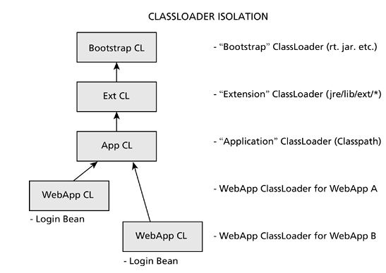

# State Management
* handling data is the only thing an enterprise system really does
* In a thin-client, HTML-browser-based application, transient state takes on a whole new dimension
* Judicious use of per-client session state is crucial to a system that wants to scale to more than five concurrent users
* durable state is state that we care about

## Use HttpSession sparingly
* storing data on the server on behalf of every client reduces the resources available on that server, meaning the maximum load capability of the server goes down proportionally
* state server
    * every request will incur an additional round-trip to the session state server, which increases the overall latency of the client request
    * all session state is now being stored in a centralized server, which creates a single point of failure within the cluster
* Before trusting a servlet container to handle this, make sure to ask the vendors exactly how they do it, in order to understand the costs involved

## Use objects-first persistence to preserve your domain model
* one of the great benefits of the objects-first persistence approach: no ugly SQL, no worries about whether we need to do an INSERT or an UPDATE, and so on
* in an objects-first persistence scenario, the atom of data retrieval is the object itself—to pull back something smaller than an object doesn't make sense from an object-oriented perspective, just as it doesn't make sense to pull back something smaller than a row in an SQL query
* Eager / lazy loading problem

## Use relational-first persistence to expose the power of the relational model
* The difficulty in achieving a good mapping between these two technologies even has its own name, the object-relational impedance mismatch.
* frequently it's easier to take a relational view of your data and embrace that fully by not hiding the relational access behind some other kind of encapsulatory wall
* it's the "relation" in the relational model that provides much of the power
* relational data access achieves what Date calls closure: results of one access can serve as the input to another
* a relational-first approach doesn't mean abandoning anything at a higher level than JDBC.
* SELECT * FROM table, which pulls every column in the table across, rather than just the data you're interested in, which means you're wasting bandwidth

## Use procedural-first persistence to create an encapsulation layer
* The single biggest challenge to learning SQL programming is unlearning procedural programming

## Recognize the object-hierarchical impedance mismatch
* problem is that XML is intrinsically a hierarchical way to represent data
* mapping objects to XML is not a simple thing - a mismatch between the free-form object model we're all used to and the strictly hierarchical model the XML Infoset imposes—is just around the corner
* simple object models map to XML pretty easily, but then again, simple object models map pretty easily to relational tables, too
* the problem with mapping objects to a hierarchical model is the same problem that occurs when mapping objects to a relational model: preserving object identity
* Cyclic references, which are actually much more common in object systems than you might think, will break a hierarchical data format every time
* JAXB and other Java-to-XML tools can take their best shot, but they're never going to match schema declarations one-for-one, just as schema and XML can't match objects one-for-one. In short, we have an impedance mismatch. Where does this leave us?
    * it takes just one reference to something other than an immediate child object to seriously throw off object-to-XML serializers
    * Use XML Schema to define your data types
    * Prefer a subset of the schema simple types - stick to the types in XSD schema that most closely model what Java can handle easily
    * Use XML Schema validating parsers to verify instances of your schema types when parsing those instances - schema-validating parsers are woefully slow compared to their non-schema-validating counterparts.
    * Understand that type definitions are relative - use schema to verify data being sent from one system to another, rather than trying to use it to define types that everybody agrees on
    * Avoid HAS-A relationships
* make sure that you understand the hierarchical data model and how it differs from relational and object models. Trying to use XML as an objects-first data repository is simply a recipe for disaster—don't go down that road

## Use in-process or local storage to avoid the network
* centralized, remote database server exists simply to provide a single gathering point for data, not because databases need to run on servers that cost well into five, six, or seven digits
* We put the data on the server because it was
    * a convenient place to put it
    * an easy way to put processing in one central place for all clients to use without having to push updates out (zero deployment)
    * a way to put the data close to the processing
* don't put any data on the remote database unless it's actually going to be shared across clients
* the remote database doesn't necessarily serve as the best repository for certain kinds of data - particularly those that desire or need to run in a disconnected fashion

## Never assume you own the data or the database
* If multiple systems or agents share a resource, the format or schema of that resource cannot change at the whim of one of those systems or agents without causing a ripple effect through the rest
* this is what keeps legacy systems alive for so long—it's extremely difficult to track down every client for a given resource or repository within the company
* by forcing clients (any clients, including your own code) to go through some kind of encapsulatory barrier, such as a stored procedure layer or Web Service endpoint layer, to gain access to the data, you essentially plan for the future and the fact that others will need access to the data even as you modify the underlying schema and data description definitions
* rely on database integrity constraints on the table to check the length of the string, rather than doing it in J2EE and setting the column's size to be something larger than that

## Lazy-load infrequently used data
* naive object-relational mapping mechanisms often map objects to tables in a one-to-one fashion, so that any request to retrieve a particular object from the database means every column for a particular row gets pulled across to completely fill out the object in question
* the key is to lazy-load infrequently used data, not just data that hasn't been used yet
* it's easy to find yourself in a situation where you're excessively lazy-loading data elements across the wire, resulting in what Fowler calls "ripple-loading" or as it's more commonly known, the N+1 query problem [Fowler, 270]. In those situations, sometimes it's better to eager-load the data in order to avoid network traffic

## Eager-load frequently used data
* the payoff—actually accessing the extra data—has to justify the cost of marshaling it across the wire from server to client
* If the data never gets used, eager-loading it is a waste of network bandwidth and hurts scalability
* eager-loading the complete set of data you'll need helps tremendously with concurrency situations
* eager-loading fosters a pass-by-value dynamic, as opposed to lazy-loading's pass-by-reference approach
* eager-loading shorter lock windows, which lower contention, which means better scalability
* also means there's a window of opportunity for other clients to modify the data
* you can apply eager-loading principles at scopes larger than just individual rows
    * we can apply eager-loading principles across tables and dependent data
* there's never any reason why a table that holds read-only values shouldn't be eager-loaded
* be sure to profile before doing either lazy- or eager-loading optimizations, but if an eager-load can save you a couple of network accesses, it's generally worth the extra bandwidth on the first trip and the extra memory to hold the eager-loaded data

## Batch SQL work to avoid round-trips
* By batching statements together, we can send several SQL statements in a single round-trip to the database, thus avoiding some of that overhead
* If you try to batch with AutoCommit set to true, the results are undefined by the JDBC Specification—which is shorthand for "quite likely to yield some kind of exception."

## Know your JDBC provider
* changing your code to use the ordinal form purely for performance reasons is a micro-optimization and should be avoided, particularly since you lose the inherent documentation hint that using the column names give
* Is it safe to invoke the driver from multiple threads? Do you need to synchronize on Connection, Statement, or ResultSet objects when accessing them from multiple threads?

## Tune your SQL
* if the database itself can't tell the difference between the two statements, it's highly unlikely that your object-relational layer will be able to
* In many cases, you need to know what SQL is actually being executed against your database before you can think about trying to tune it. For some object-relational systems this can be a difficult prospect if they don't expose the actual generated or dynamically constructed SQL code to you
* For those situations where your object-relational layer isn't doing the optimal SQL thing and the object-relational layer doesn't provide some kind of hook point to pass in optimal SQL, you have a few options:
    * Follow the Fast Lane pattern  - advocates the idea of doing direct JDBC access against the database, thereby giving you direct control over the SQL being sent. Drawbacks - the fact that if the object-relational layer is doing any sort of cache management, you'll be bypassing that cache management and any implicit Identity Mapthat's being maintained = concurrency problem
* Whichever method you choose, before you start caching off JNDI lookup results as an optimization, take a hard look at the SQL being executing on your behalf—more often than not, optimizations in the SQL can yield a far greater return on your investment in time and energy than anything else you attempt

# Presentation

## Consider rich-client UI technologies
* HTML also carries with it a number of disadvantages
    * Form controls are rendered entirely as the host (the browser) wishes, so HTML forms behave differently from platform to platform
    * an HTML-based thin-client application needs to hold all user state on the server, identified by an opaque token usually stored in a cookie or as part of subsequent requests
    * Control - HTML offers little in the way of control over how elements are rendered
    * Cross-platform differences - HTML is one of the least-obeyed standards on the Internet
    * Bandwidth - On every action by the user that requires a new interface, the entire interface must be sent to the browser, including both data and presentation elements
    * Lack of presentation elements - HTML forms are severely constrained

## Keep HTML minimal
* UI studies have shown that users will wait, on average, about five seconds before giving up and moving on to something else.
* It's worse than just end-user latency, though. All that stuff has to move from server to client, which means the pipeline between the two is being used to send gratuitous fluff. This in turn reduces the available bandwidth for other clients, meaning that the application's overall scalability is reduced
* keep a couple of good-neighbor HTML tips in mind
    * Minimize use of "heavy" tags. APPLET, OBJECT, and IMG...
    * Use frames to help separate portions of the page
    * Where possible, reuse images on a given page
    * Use HTML features rather than images
    * Subject to the guidelines of tasteful and useful user interfaces, avoid excessive page navigation. **Try to combine steps into a single form, or if possible, discard the wizard-style interface altogether**
* HTML is wonderful in the sense that it offers a machine-independent way to describe a presentation layer in a relatively concise way

## Separate presentation from processing
* directly embedding these business rules in the presentation code frequently leads to violations of what's called the Once- and-Only-Once Rule: a particular snippet of code should appear exactly once within the codebase
* keep presentation (JSP) separate from processing (servlets) and also from domain-related objects (beans)

## Keep style separate from content
* keep all stylistic decisions localized to a single place, once again to obey the Once-and-Only-Once Rule
* In this particular case, we're increasing the latency of the request, since the transformation process requires time to execute

## Pregenerate content to minimize processing
* this approach works well only for read-only or read-mostly presentation resources. Portals, for example, fit into this category, since most users select which parts of the portal they want to see and don't change those preferences very often
* if you take a caching approach, make sure that the only items cached are those usable by every user on the site; caching items on a per-user basis is a slippery slope that leads to massive memory requirements per user
* not all pages can render to static HTML, pregenerating the content when you can, particularly for the entry point of the Web application, can make a powerful first impression on users

## Validate early, validate everything
* When should we validate all this stuff?
    * As early as possible and as comprehensively as possible. the earlier we can get the user to correct them
* at the UI level, particularly for HTML applications, each user action requires a network round-trip to carry out the request
* we need to maximize the benefit from each network round-trip in order to keep the number of round-trips to an absolute minimum
* don't rely on coding the text red to signify validation errors—remember that many people in the world are red/green color-blind and won't be able to recognize the fact that the text is red
* client-side validation serves one purpose: to make it as gentle as possible on the user entering data into your system

# Security
* It's the white elephant in the middle of the room that everybody can see, everybody recognizes, yet everybody tries desperately to ignore and goes to great lengths to work around
* Alice, Bob, Mallory, Eve, and Trent.Alice always initiates the conversation with Bob. Mallory is the malicious individual trying to disrupt, change, or redirect the conversation, while Eve is the passive eavesdropper who just wants to listen in on the conversation. Trent is the third party known and trusted by both Alice and Bob.

## Security is a process, not a product
* "If you think technology can solve your security problems, then you don't understand the problems and you don't understand the technology" [Schneier01]
* the problem is in the belief that most developers have that cryptography holds the solution to all of our security needs
* Why bother going against SSL and its key exchange protocol when it's far easier for the attacker to engage in one of the dozens of other forms of attack, all of which end with the same result
* we need to ensure somehow that an attacker cannot "guess" a valid in-use JSESSIONID value and thus gain access to another user's session state.
* when verifying login credentials for the user against the database, make sure the username and password aren't hiding a SQL injection attack
* If the value is cached in a hidden field, an attacker can always bypass the browser entirely and hand-submit (via Telnet) an HTTP request that contains thousands of items in the shopping cart and that hidden field

## Remember that security is not just prevention
* The other two parts of any secure system are detection and reaction.
* The classic tactic, of course, is to allow only a finite number of bad logins before locking the user's account in a way that only an established, trusted system administrator can unlock
* If your servlet starts to get malformed input that should have been caught by client-side validation code (JavaScript in the HTML browser, for example), it's possible that an attacker is attempting to find the edges of your system's security; notify an administrator and/or log the source of the communication, the number of attempts, and so on

## Establish a threat model
* remember that security is more than just prevention, and many of the attacks against a security protocol or cryptographic algorithm assume an attacker has an infinite amount of time to attack a given system. The security code you put in will never be able to defend against an attacker who has that kind of advantage over you, so don't even think you'll be able to.
* most developers' intuition sucks and shouldn't be trusted—not for optimization, and not for security

## Assume insecurity
* you must assume everything is insecure, including any particular point in the system you're building, until you can establish beyond any sort of reasonable doubt that the system is secure against intrusion and attack
* even if we can prove that the system is secure today, a new vulnerability in the vendor's software could be discovered by the hacking community tomorrow, and suddenly our system has a vulnerability that we don't even know exists, at least not until it's used successfully on our system
* defense-in-depth strategy; rather than placing all the security eggs into the basket at the perimeter, they assume that at each level, the defense can be broken, so another defense needs to be ready just in case
* the goal is to slow the attacker down, so that a combination of intrusion detection systems and alert system administrators can detect the attack and take the appropriate reactionary steps, including shutting down accounts and/or systems if necessary

## Always validate user input
* as a developer, you have to assume that the client-side validation logic failed to execute somehow, and on every user input submission, go through a rigorous set of validation checks to ensure the user input has been thoroughly scrubbed for all sorts of nasty kinds of input-based attacks
* any time you take input directly from the user and feed it into a database query (or any other sort of interaction with a back-end system) you're taking it upon yourself to be more clever than the attacker, and that's a pretty arrogant assumption

## Turn on platform security
* running Java code with this lenient permissions policy effectively gives an attacker a free pass
* Turning the security manager on is a pretty simple thing: when executing the Java launcher (java.exe) to start up the J2EE container, set the java.security.manager system property by passing it via the -D option; you don't need to set it to anything, just add the JVM command-line parameter -Djava.security.manager to the script you use to launch the container. This will turn on the security manager, which in turn uses the java.policy file stored in the JRE's lib/security directory as the policy for the JVM. Assuming you're using independent JRE instances for the container, any changes required to the policy can be made directly within this file.

## Use role-based authorization
* Java JAAS - the standard platform security model now understands user-based authorization, which means that integrating role-based authorization into the platform security model is now possible

## Use SignedObject to provide integrity of Serialized objects
* ask your objects to prove their authenticity to you
* via a little-known class in the java.security package called SignedObject. This class wraps a Signature and a Serialized object (actually a copy of the source Serializable object, so future modifications to the Serialized object source won't be reflected in the SignedObject copy), and provides easy methods for verifying the object's authenticity given a PublicKey.
* you should never ship software with these keys distributed in this file-based form; it becomes too easy for even basic attackers to replace the files with their own versions on either client or server
* it provides no confidentiality whatsoever to the data itself

## Use SealedObject to provide confidentiality of Serializable objects
* Ensuring confidentiality is the province of the javax.crypto.SealedObject class
* rather than using a PublicKey/PrivateKey pair, the SealedObject needs a SecretKey that is shared somehow between both parties
* because asymmetric key cryptography (public-key/private-key cryptography) takes a huge amount of time to perform
* a more common use is to pass SealedObject instances back and forth across JMS message queues, particularly if the data is at all sensitive or if system administrators can view messages residing in the queue
* only the sensitive payload (the message itself) is protected
* create and sign the SignedObject, then use that to create a SealedObject

## Use GuardedObject to provide access control on objects
* what about the situation where even just simple access to the object itself requires permission?
* The JDK solves this problem by realizing that if every operation requires the security permission, it makes sense to require it once, at the time of object creation, and thereafter assume that since the caller had to have the permission to create it, they must still have the permission required in order to call the desired methods on it. So, the security check is done once, in the object constructor, and thereafter left out of the other methods.
* use the java.security.GuardedObject to provide access control
* this can be particularly powerful in the form of Message-Driven Beans or simple JMS consumers, since now we can ensure that the caller has the appropriate security context to access the contents of an object even across the wire

# System

## Aggressively release resources
* JVM's automatic memory management scheme isn't so great at managing resources outside of the JVM
* J2EE programmers need to get into the habit of being as explicit about resource deallocation as we are about allocation
* A system that allocates ResultSet objects at a rate of one per second and never releases them will quickly exhaust the database on the other side, regardless of the database server hardware underneath it
* calling close on a Connection typically closes all Statement objects created by that Connection, and calling close on a Statement typically closes all ResultSet objects created by that Statement
* most enterprise systems written today are more interested in scalability than in performance
* This acquire-use-release approach is called just-in-time activation (JITA)

## Tune the JVM
* client VM was optimized for short-running applications, favoring short-term optimizations to long-term ones
* server VM was optimized in the opposite direction
* System.gc will trigger a full garbage collection sweep

## Use independent JREs for side-by-side versioning
* searches for the key Software/JavaSoft/Java Runtime Environment under the HKEY_LOCAL_MACHINE hive
* the application server, servlet container, Java-powered database, and other Java services can each run under a precisely defined JVM environment

## Recognize ClassLoader boundaries
* ClassLoader architecture defines isolation boundaries so that classes of similar package/class naming won't necessarily clash with one another
* Consider an all-too-common scenario: a servlet Web application stores Beans in user session space for use during later processing
* my Web application shouldn't conflict in any way with your Web application, despite the fact that we're running in the same servlet container
* I can name my servlets and beans by names that exactly match those in your Web application, and the two applications should run side by side without any problems
* some fundamental rules about ClassLoaders
    * ClassLoaders form hierarchies. When a ClassLoader is created, it always defaults to a "parent" ClassLoader. By default, the JVM starts with three: a bootstrap loader written in native code to load the runtime library (rt.jar), a URLClassLoader pointing to the extensions directory (usually jre/lib/ext in your JRE directory) called the extensions loader, and another URLClassLoader pointing to the elements dictated by the java.class.path system property, which is set via the CLASSPATH. Containers like EJB or servlet containers will augment this by putting their own ClassLoaders into the tree, usually toward the bottom or leaf nodes. If a parent has already loaded a class, no further attempt at loading the class is made.
    * Classes are loaded lazily.
    * Classes are loaded by the ClassLoader that loaded the requesting class. In other words, if a servlet uses the class PersonBean, then when PersonBean needs to be loaded the JVM will go back to the ClassLoader that loaded the servlet
    * Classes are uniquely identified within the JVM by a combination of class name, package name, and ClassLoader instance that loaded them

* each LoginBean is uniquely identified by its class name and package name (LoginBean) and the ClassLoader instance that loaded it. Each Web application is loaded by a separate ClassLoader instance. Therefore, these are two entirely orthogonal classes that maintain entirely separate static data.
* **Moral: Singletons don't work unless you know where you are in the ClassLoader hierarchy.**
* the typical servlet container creates a ClassLoader instance each time a Web application changes—so, for example, when a developer recompiles a servlet and drops it into the Web application's WEB-INF/classes directory, the servlet container notes that the change has taken place and creates an entirely new ClassLoader instance. It reloads all the Web application code through that ClassLoader instance and uses those classes to answer any new incoming requests
* Now the developer touches a servlet (or hot deploys a new version of the Web application), which in turn forces the servlet container to reload the servlet, which in turn requires a new ClassLoader instance. When the servlet tries to extract the LoginBean object out of session space, the class types don't match: the LoginBean instance is of a type loaded by ClassLoader 1 but is asked to cast to a class loaded by ClassLoader 2. Even though the classes are identical (LoginBean in both cases), the fact that they were loaded by two different ClassLoader instances means they are entirely different classes, and a ClassCastException is thrown.
* Trick Number One is to define an interface, say, LoginBean, and put that high in the ClassLoader hierarchy, where it won't get loaded by the ClassLoader that loads the Web application. When the Web application is bounced, the assignment of the "old" LoginBeanImpl is being assigned to the interface LoginBean, which wasn't reloaded, so the assignment succeeds and no exception is thrown
* Trick Number Two is to store only objects from the Java base runtime library (e.g., String and Date objects) into session space, rather than custom-built objects
* Trick Number Three assumes you want or must have your custom objects but can't take the time to break them into interface and implementation pieces. In that case, mark the class as Serializable, then use Java Object Serialization to store a serialized copy of the objects into the session as a byte array

## Understand Java Object Serialization
* Serialization is a cornerstone on which other parts of J2EE are built
* one side effect of using Serialization as RMI's marshaling framework is that because Serialization is not concerned with confidentiality, all parameters passed through RMI are done in virtually clear-text fashion
* By taking control over how objects are serialized, however, individual parameter types can be massaged to encrypt (or at least obfuscate) their sensitive data when passed across during an RMI call
* The serialVersionUID field
    * **During Serialization, if such a field exists, this value will be used rather than calculating the hash**
    * While optional for basic Serialization, if a Serialized object evolves, calculating this value is crucial to supporting deserialization of "old" objects into "new" types
    * Even for classes that don't require evolutionary support, however, you can obtain a small performance enhancement by precalculating this hash anyway, thereby saving the necessary runtime CPU cycles to generate it
* you can design and implement the entire system up front to work entirely with "open" CreditCard instances, then later add the writeReplace/readResolve logic when confidentiality of these objects during serialization becomes an issue

## Don't fight the garbage collector
* generational collector, relies on the idea that most objects are short-lived beasts, while a small minority of objects survive for long periods of time
* a generational collector puts newly created objects into a young generation, a collection of all objects allocated recently
* When a garbage collection pass is requested, then, the collector needs to scan only the first generation looking for unused objects since that's the most likely place they will appear
* Only when not enough room is collected from the young generation does the collector begin to move up the generational stack, looking in successively older generations for objects to collect
* As an object survives for longer periods of time (usually measured in the number of collection passes successfully survived), it will be moved into successively older generations
* suffers the disadvantage that objects in older generations will not be collected for a long period of time, particularly if the young generation remains open enough to satisfy any new allocation requests
* the conventional wisdom that programmers should allocate objects out of object pools in order to speed up allocation depends entirely on the kind of garbage collector running underneath the hood
* **you have to trust the garbage collector to do the right thing**
* Code intentionally—don't try to fool the garbage collector because you'll only confuse it and produce worse results overall

## Prefer container-managed resource management
* now you start firing up threads from your servlets. Because the Servlet specification provides no way for a servlet developer to integrate with the servlet container's thread-management scheme, these threads are, by definition, outside the servlet container's control
* story gets even worse if this rogue thread is created when the servlet context is started up but the programmer doesn't shut down the thread on servlet context shutdown. every servlet context restart (which can happen for a variety of reasons as the system administrator requires), a new thread is being spun off without reaping the old one (**The Thread object will not be collected until the thread itself dies and all strong references are gone - any objects referenced from that thread will continue to be strongly referenced, meaning they cannot be garbage collected, meaning the JVM now has a larger memory footprint than it should; also, these Thread objects represent thread resources within the operating system itself that are heavier than simple memory-based objects**)
* it's more efficient and scalable to let the container keep track of those resources and to have components borrow them as necessary
* it's highly likely that the connection pool, if deployed into the Web application itself, is pooling connections only for that particular Web application—because of ClassLoader boundaries
* any code that doesn't explicitly return a Connection to the pool is "leaking" a Connection that cannot be recycled or garbage collected
* **By stripping out the pooling, you'll also potentially reduce the workload on the garbage collector because there are fewer long-lived objects to keep track of within your code.**

## Use reference objects to augment garbage collection behavior
* Java offers up three kinds of Reference objects: SoftReference, WeakReference, and PhantomReference
* subclasses of the base class Reference, and each has the basic property that they "wrap" another object, called the referent
* Reference objects reduce the "strength" of a reference to an object
* The upshot is that the garbage collector is now free to collect the referent, depending slightly on the semantics of the reference object itself
* SoftReference objects
    * when a SoftReference is created around an object, that object is now softly reachable, meaning that if no other strong (normal) references are held to the object, under low-memory conditions the JVM will release the softly referenced object, thus hopefully making more room for object allocations. When this happens, the SoftReference will no longer hold a valid reference to its object and will return null when asked for its referent.
    * Mapa Strong, SoftReference
    * When the SoftReference is cleared, the JVM will enqueue the SoftReference instance into the ReferenceQueue, where we can fetch it from the ReferenceQueue by calling remove (which blocks until an enqueued reference is available or a timeout expires) or poll (which returns immediately with either null or an enqueued Reference). So we can amend the Cache implementation shown earlier by making it more aware of when the softly reachable value objects are collected; in this case, we'll poll for enqueued references on each call to get or put, so that way we don't have to worry about setting up a separate Thread to do the blocking remove calls.
    * it's a direct signal to the garbage collector that the object on the other side of the reference isn't worth keeping around in low-memory situations. In each case, we're offering more information to the garbage collector than we could in earlier releases of Java
* WeakReference objects
    * Because a WeakReference doesn't keep an object alive, we can build an object pool by handing out strong references to pooled resources. When the client is finished, it simply drops the strong reference, which in turn leaves the object weakly reachable, and on the next garbage collection pass, the object will be collected and (by catching the ReferenceQueue notification) the resource can be returned to the object pool.
    * With WeakReference objects, we're asking the garbage collector to send a notification when the last reference to an object has been dropped, which in turn gives us the ability to perform some kind of reclamation of the object on the other side of the WeakReference

## Don't be afraid of JNI code on the server
* isolation provided by ClassLoaders doesn't extend to native libraries, and most operating systems will load a dynamic library only once
* if you're writing native libraries that will need to be hot deployed into a J2EE container (like a servlet container), make sure that each library has a differentiating name based on its version number; this will fool most operating systems into believing these are separate libraries and therefore will allow them to be loaded when the new version of the component is hot deployed into the container
