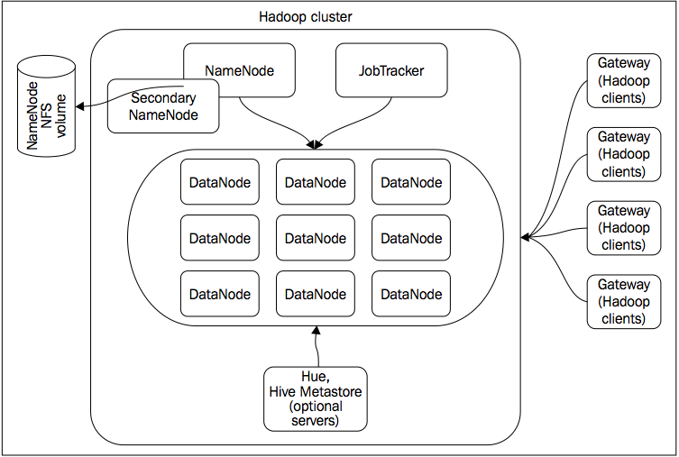
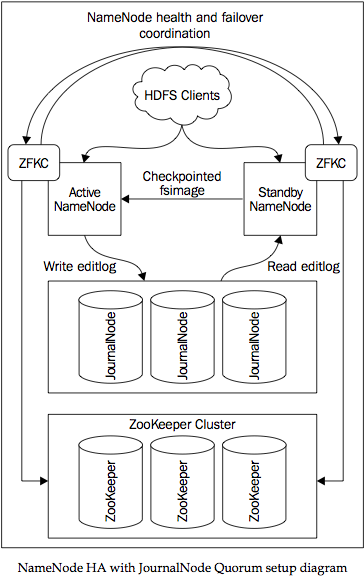

# 1. Setting Up Hadoop Cluster - from Hardware to Distribution
* questions related to cluster design
  * how much data will the cluster need to store
  * what are the projections of data growth rate
  * what would be the main data access pattern
  * will the cluster be used mostly for predefined scheduled tasks, or will it be a multitenant environment used for exploratory data analysis?
* several types of servers that comprise the Hadoop cluster
  * master nodes: NameNode, Secondary NameNode, and JobTracker
  * worker nodes: DataNodes



## Choosing the DataNode hardware
* DataNode is the main worker node in a Hadoop cluster
* it plays two main roles
  * it stores pieces of HDFS data
  * executes MapReduce tasks
* DataNodes are "disposable workers"
  * servers that are fast enough to do useful work as a part of the cluster
  * cheap enough to be easily replaced if they fail
* DataNode should be a balanced system with a reasonable amount of disk storage and processing power
* list of steps to estimate the required capacity for your cluster
  1. **Identify data sources** - List out all known data sources and decide whether full or partial initial data import will be required. reserve 15-20 percent of your total cluster capacity to accommodate any new data sources or unplanned data size growth
  2. **Estimate data growth rate**
  3. **Multiply your estimated storage requirements by a replication factor** - By default, each block is replicated three times. Setting the replication factor to 1 completely diminishes a cluster's reliability and should not be used. to get raw cluster storage capacity, you need to multiply your estimates by a replication factor.
  4. **Factoring in MapReduce temporary files and system data** - temporary data doesn't reside on HDFS, but you need to allocate about 25-30 percent of total server disk capacity for temporary files
* Another important metric is storage density, which is the total cluster storage capacity divided by the number of DataNodes in the cluster
  * Generally, you have two choices: either deploy lots of servers with low storage density, or use less servers with higher storage density.

### Low storage density cluster
* Cost is the main reason you will want to go this route. Having lots of storage on every DataNode, but not having enough RAM and CPU resources to process all the data, will not be beneficial in most cases.
* **There is little reason to choose faster 15000 rpm drives for your cluster. Sequential read/write performance matters much more for Hadoop cluster, than random access speed. 7200 rpm drives are a preferred choice in most cases.**
* 2 x 4 core CPUs match this requirement and will give reasonable processing power. Each map or reduce task will utilize a single CPU core, but since some time will be spent waiting on IO, it is OK to oversubscribe the CPU core. With 8 cores available, we can configure about 12 map/reduce slots per node.

## NameNode and JobTracker hardware configuration
* The server that is responsible for HDFS coordination is called NameNode
* The server responsible for MapReduce jobs dispatching is called JobTracker
* NameNode and JobTracker are just separate Hadoop processes, but due to their critical role in almost all cases, these services run on dedicated machines

### The NameNode hardware
* NameNode is **critical** to HDFS availability
* It stores all the filesystem metadata:
  * which blocks comprise which files
  * on which DataNodes these blocks can be found
  * how many free blocks are available
  * and which servers can host them
* Without NameNode, data in HDFS is almost completely useless
* NameNode has to store all HDFS metadata info, including files, directories' structures, and blocks allocation in memory.
* each HDFS block will occupy approximately 250 bytes of RAM on NameNode, plus an additional 250 bytes will be required for each file and directory
  * you have 5,000 files with an average of 20 GB per file. If you use the default HDFS block file size of 64 MB and a replication factor of 3, your NameNode will need to hold information about 50 million blocks, which will require 50 million x 250 bytes plus filesystem overhead equals 1.5 GB of RAM
  * Systems with 64-96 GB of RAM are a good choice for the NameNode server.
* To guarantee persistency of filesystem metadata, NameNode has to keep a copy of its memory structures on disk as well
  * NameNode maintains a file called `editlog`, which captures all changes that are happening to the HDFS
  * NameNode maintains a full snapshot of the current HDFS metadata state in an `fsimage` file
* NameNode delegates the task of periodically applying changes from `editlog` to `fsimage` to a separate server called **Secondary NameNode**.
* Hardware requirements
  * `fsimage` will not grow bigger than the amount of RAM you allocated for NameNode
  * `editlog` will be rotated once it has reached 64 MB by default
  * you can keep the disk space requirements for NameNode in the 500 GB range
* NameNode also has to process heartbeat messages from all DataNodes in the cluster. This type of workload requires significant CPU resources

### The JobTracker hardware
* JobTracker is responsible for submitting user jobs to TaskTrackers, which are services running on each DataNode
* TaskTrackers send periodic heartbeat messages to JobTracker, reporting current status of running jobs, available map/reduce slots, and so on
* By default, JobTracker doesn't save any state information to the disk and uses persistent storage only for logging purpose
  * disk requirements for this service are minimal
* JobTracker will need to be able to process
  * huge amounts of heartbeat information from TaskTrackers
  * accept and dispatch incoming user jobs
  * and also apply job scheduling algorithms to be able to utilize a cluster most efficiently
  * **highly CPU-intensive tasks!**

### Gateway and other auxiliary services
* Gateways are usually deployed outside of the primary cluster subnet and are used for data imports and other user programs
* Additional infrastructure components and different shells can be deployed on standalone servers, or combined with other services
* often you can deploy gateways on virtual machines

### Network considerations
* a smaller cluster of fast servers with lots of storage will most probably choke on a 1 GbE network and most of the server's available resources will be wasted.
* Most of the modern servers come with several network controllers. You can use bonding to increase network throughput.

## Hadoop distributions
* we will focus on stable Hadoop versions that provide proven solutions such as MRv1, but will also include important availability features for the NameNode.

### Cloudera Hadoop distribution
* What makes CDH appealing to the end user is
  * there are fewer code branches
  * version numbers are aligned
  * and critical bug fixes are backported to older versions
* the latest major CDH release version is CDH4
  * combines features from Apache 2.0 and 1.0 releases
  * it includes NameNode HA and Federation
  * supports both MRv1 and MRv2 (which none of the Apache releases does at the moment)
  * **integration of different Hadoop ecosystem projects**
* Impala
  * allows running real-time queries on Hadoop, bypassing MapReduce layer completely and accessing data directly from HDFS.

### Hortonworks Hadoop distribution
* HDP includes Apache Ambari
  * a web-based tool, similar to Cloudera Manager
  * 100 percent free and open source
  * with no distinction between free and enterprise versions.

# 2. Installing and Configuring Hadoop

## Choosing and setting up the filesystem
* If you favor stability over performance and advanced features, you might want to use EXT3, which is battle-tested on some of the largest Hadoop clusters
* We will use EXT4 for our cluster setup, since it provides better performance on large files, which makes it a good candidate for Hadoop.
* `mkfs –t ext4 –m 0 –O extent,sparse_super,flex_bg /dev/sdb1`
  * `-m 0` - reduces the space reserved for a super-user to 0 percent from the default value of 5 percent
  * `-O extent,sparse_super,flex_bg`
    * `extent` - enable extent-based allocation, which will increase performance on large sequential IO requests
    * `parse_super` - option is another disk space saving option. You can save space on large filesystems by allocating less superblock backup copies
    * `flex_bg` - option forces the filesystem to pack metadata blocks closed together, providing some performance improvements
* important options you need to know when mounting the filesystem: `noatime` and `noadirtime`
  * By default, a filesystem would keep track of all operations, including reading a file or accessing a directory, by updating a metadata timestamp field
  * This can cause a significant overhead on a busy system and should be disabled
  * to disable this feature in /etc/fstab
    * `/dev/sda1 /disk1 ext4 noatime,noadirtime 1 2`
    * `/dev/sdb1 /disk2 ext4 noatime,noadirtime 1 2`
* **these disk configuration options are applied only on DataNode data disks**
  * It is recommended to have RAID configured for NameNode volumes

## Other OS settings
* make sure that the hostname/IP resolution is working properly across the cluster
* it is important to configure proper hostnames for all nodes in the cluster, and to make sure they resolve to correct IP addresses using the `/etc/hosts` file
* To make sure the host reports the correct IP address, use the ping command and check the IP address returned

## Setting up the CDH repositories
* The first thing you need to do, is to add a new yum repository
  * To add a repository, download this file http://archive.cloudera.com/cdh4/redhat/6/x86_64/cdh/cloudera-cdh4.repo and place it into `/etc/yum.repos.d/` on your server
* add a repository GPG key
  * `rpm --import http://archive.cloudera.com/cdh4/redhat/6/x86_64/cdh/RPM-GPG-KEY-cloudera`

## Setting up NameNode
* think of a Standby NameNode as a secondary NameNode + hot standby
* NameNode HA relies on distributed services to synchronize two data nodes
* This setup is called Quorum Journal Manager and it introduces several new components
* There are two NameNodes: primary and standby
  * the primary NameNode writes an editlog to a cluster of JournalNodes (a new type of daemon introduced in CDH 4.1)
* The idea behind JournalNodes is that
  * the primary NameNode submits editlog changes to a group of JournalNodes, which store them on the local disks
  * The write is considered successful if a majority of JournalNodes are able to persist it on disk
  * One great thing about JournalNodes is that their operations are lightweight and you don't need to run those on separate hardware.
* A common practice is to run three JournalNodes
  * an odd number guarantees a proper quorum
  * Two of these can be run on the same server as NameNodes and one on a JobTracker
  * this setup is not a mandatory requirement and you can run JournalNodes on any of the servers in the cluster you choose
* NameNodes rely on ZooKeeper to track which NameNode is primary and which one is standby
  * Zookeeper provides distributed coordination services and is useful when many different nodes need to share a state, locking information, or any other data information
* ZKFC (ZooKeeper Failover Controller) is a daemon that runs on both primary and standby NameNodes, checks their health and status, and initiates a failover to a standby NameNode, if required
* When it comes to dealing with NameNode failures
  * Configure the **automatic failover** option
  * it relies on ZKFC to monitor the status of the active NameNode
  * ZKFC will initiate the failover if required and use the ZooKeeper cluster as a status synchronization point.



### SetUp
* Test cluster with the following nodes being set up and configured:
  * nn1.hadoop.test.com, nn2.hadoop.test. com, and jt1.hadoop.test.com
  * Names should be self-explanatory
    * nn1 and nn2 are primary and standby NameNodes respectively
    * jt1 is a JobTracker.
* We will start with installing packages required by the NameNode on nn1, nn2, and jt1. The reason we are installing HDFS-packages on a JobTracker server is because we will need to run a JournalNode there.
* run on **nn1, nn2, and jt1** servers as `root`
  * `yum install hadoop-hdfs-namenode`
  * along with the setup of HDFS packages, CDH will also create a new OS user named `hdfs`. All the daemon processes will be executed as this user.

## JournalNode, ZooKeeper, and Failover Controller
* run on **nn1, nn2, and jt1** servers as `root`
  * yum install hadoop-hdfs-journalnode
  * yum install zookeeper-server
* run on **nn1, nn2** servers as `root`
  * yum install hadoop-hdfs-zkfc
* nano /etc/zookeeper/conf/zoo.cfg
  * **nn1, nn2, and jt1** servers
  * adicionar no final do arquivo

```
server.1=a1-jak1.pateta:2888:3888
server.2=a1-jak2.pateta:2888:3888
server.3=a1-jak3.pateta:2888:3888
```

* zookeeper-server init
  * **nn1: ** service zookeeper-server init --myid=1
  * **nn2: ** service zookeeper-server init --myid=2
  * **jt1: ** service zookeeper-server init --myid=3
* zookeeper-service start
  * **ALL:** service zookeeper-server start
  * cat /var/log/zookeeper/zookeeper.log para verificar erros

## Hadoop configuration files
* There are three main configuration files for the core Hadoop components
  * core-site.xml - configuration options that are common for all servers in the cluster
  * hdfs-site.xml - configuration for HDFS component of the cluster
  * mapred-site.xml - configuration for MapReduce component of the cluster
* CDH - configuration files in `/etc/hadoop/conf`
* With the introduction of the Bigtop project, some of the settings were moved into a set of shell scripts in the `/etc/default` directory
* /etc/default/hadoop-hdfs-namenode
  * definir o tamanho do heap
  * `export HADOOP_NAMENODE_OPTS="-Xmx4g"`

## NameNode HA configuration

### Configurar `/etc/hadoop/conf/core-site.xml`
* `fs.default.name` is the logical name of the NameNode cluster
  * `hdfs://jak-cluster/` is specific to the HA setup. the servers that comprise it are defined in the `hdfs-site.xml` file
  * In a non-HA setup, this variable is assigned a host and a port of the NameNode, since there is only one NameNode in the cluster.
* `ha.zookeeper.quorum` variable specifies locations and ports of the ZooKeeper servers
  * The ZooKeeper cluster can be used by other services, such as HBase, that is why it is defined in `core-site.xml`

```xml
<configuration>
  <property>
    <name>fs.default.name</name>
    <value>hdfs://jak-cluster/</value>
  </property>
  <property>
    <name>ha.zookeeper.quorum</name>
    <value>a1-jak1.pateta:2181,a1-jak2.pateta:2181,a1-jak3.pateta:2181</value>
  </property>
</configuration>
```

### Configurar `/etc/hadoop/conf/hdfs-site.xml`

* property `dfs.name.dir`
  * NameNode will use the location specified by the `dfs.name.dir` variable to store the persistent snapshot of HDFS metadata
  * the volume on which this directory resides needs to be backed by RAID
  * **Losing this volume means losing NameNode completely**
  * You can actually specify several paths with a `dfs.name.dir value`, separating them by commas. NameNode will mirror the metadata files in each directory specified.
  * If you have a shared network storage available, you can use it as one of the destinations for HDFS metadata. This will provide additional offsite backups.
* property `dfs.nameservices`
  * The `dfs.nameservices` variable specifies the logical name of the NameNode cluster and should be replaced by something that makes sense to you
  * The value of `dfs.nameservices` must match the value of `fs.default.name` from the `core-site.xml` file
* property `dfs.ha.namenodes.{nameNodeAlias}`
  * Here, we specify the NameNodes that make up our HA cluster setup
  * These are logical names, not real server hostnames or IPs
* properties `dfs.namenode.rpc-address.{clusterName}.{nameNodeAlias}`
  * these properties provide mapping from logical names like nn1 and nn2 to the real host and port value.
  * By default, NameNode daemons use port 8020
* properties `dfs.namenode.http-address.{clusterName}.{nameNodeAlias}`
  * NameNode daemon runs a built-in HTTP server
  * Used by the NameNode web interface to expose various metrics and status information about HDFS operations
  * standby NameNode uses HTTP calls to periodically copy the fsimage file from the primary server, perform the checkpoint operation, and ship it back
* property `dfs.namenode.shared.edits.dir`
  * specifies the setup of the JournalNode cluster
  * Both primary and standby nodes will use this variable to identify which hosts they should contact to send or receive new changes from editlog
* property `dfs.journalnode.edits.dir`
  * specifies the location on the local filesystem where editlog changes will be stored
  * this path must exist on all JournalNodes and the ownership of all directories must be set to hdfs:hdfs
* property `dfs.client.failover.proxy.provider.{clusterName}`
  * In an HA setup, clients that access HDFS need to know which NameNode to contact for their requests
  * the class specified by this property will be used by clients for determining the active NameNode
* property `dfs.ha.automatic-failover.enabled`
  * indicates if the NameNode cluster will use a manual or automatic failover
* property `dfs.ha.fencing.methods`
  * to prevent a "split-brain" scenario - two NameNodes decide they both play an active role and start writing changes to the `editlog`
  * the HA configuration maintains a marker in ZooKeeper, clearly stating which NameNode is active, and JournalNodes accepts writes only from that node
  * fencing - to force the shutdown of the active NameNode before transferring the active state to a standby
    * require a passwordless ssh access as a user that starts the NameNode daemon, from the active NameNode to the standby and vice versa
    * user: `hdfs`
* property `dfs.ha.fencing.ssh.private-key-files`
  * the ssh key, which will be used by sshfence
  * Make sure you change the ownership for this file to `hdfs` user
  * Two keys need to be generated, one for the primary and one for the secondary NameNode

```xml
<configuration>
  <property>
    <name>dfs.name.dir</name>
    <value>/dfs/nn/</value>
  </property>
  <property>
    <name>dfs.nameservices</name>
    <value>jak-cluster</value>
  </property>
  <property>
    <name>dfs.ha.namenodes.jak-cluster</name>
    <value>nn1,nn2</value>
  </property>
  <property>
    <name>dfs.namenode.rpc-address.jak-cluster.nn1</name>
    <value>a1-jak1.pateta:8020</value>
  </property>
  <property>
    <name>dfs.namenode.rpc-address.jak-cluster.nn2</name>
    <value>a1-jak2.pateta:8020</value>
  </property>
  <property>
    <name>dfs.namenode.http-address.jak-cluster.nn1</name>
    <value>a1-jak1.pateta:50070</value>
  </property>
  <property>
    <name>dfs.namenode.http-address.jak-cluster.nn2</name>
    <value>a1-jak2.pateta:50070</value>
  </property>
  <property>
    <name>dfs.namenode.shared.edits.dir</name>
    <value>qjournal://a1-jak1.pateta:8485;a1-jak2.pateta:8485;a1-jak3.pateta:8485/jak-cluster</value>
  </property>
  <property>
    <name>dfs.client.failover.proxy.provider.jak-cluster</name>
    <value>org.apache.hadoop.hdfs.server.namenode.ha.ConfiguredFailoverProxyProvider</value>
  </property>
  <property>
    <name>dfs.ha.automatic-failover.enabled</name>
    <value>true</value>
  </property>
  <property>
    <name>dfs.ha.fencing.methods</name>
    <value>sshfence
      shell(/bin/true)
    </value>
  </property>
  <property>
    <name>dfs.ha.fencing.ssh.private-key-files</name>
    <value>/var/lib/hadoop-hdfs/.ssh/id_rsa</value>
  </property>
</configuration>
```

* Configurar o diretório do namenode
  * **ALL**
  * mkdir -p /dfs/nn
  * mkdir -p /dfs/journal
  * chown -R hdfs.hdfs /dfs
* nano /etc/ssh/ssh_config
  * StrictHostKeyChecking no
* sudo su hdfs
* ssh-keygen -t rsa -P ""
  * em cada máquina, montar um arquivo `/var/lib/hadoop-hdfs/.ssh/authorized_keys` com o valor das chaves das máquinas do cluster, obtido pelo comando `cat /var/lib/hadoop-hdfs/.ssh/id_rsa.pub`
  * ssh a1-jak1.pateta
  * ssh a1-jak2.pateta
  * ssh a1-jak3.pateta
* sync do arquivo `hdfs-site` em todas as máquinas
* service hadoop-hdfs-journalnode start
* Formatação inicial do HDFS
  * **a1-jak1**
  * sudo -u hdfs hdfs namenode -format
* Setup do Zookeeper
  * **a1-jak1**
  * sudo -u hdfs hdfs zkfc -formatZK
    * Y
  * service hadoop-hdfs-namenode start
  * service hadoop-hdfs-zkfc start
* activate the secondary NameNode
  * **a1-jak2**
  * sudo -u hdfs hdfs namenode -bootstrapStandby
  * service hadoop-hdfs-namenode start
  * service hadoop-hdfs-zkfc start
* At this point, you have a fully configured and functional NameNode HA setup.

## JobTracker configuration
* JobTracker plays a master role in the MapReduce framework
  * collects heartbeat messages from TaskTrackers in the cluster
  * maintains information about the cluster's current capacity
  * responsible for scheduling, submitting, and progress tracking of user-defined jobs
* JobTracker can automatically restart all the jobs that were running during the JobTracker crash or restart
* JobTracker HA is not as critical as NameNode HA
  * The Daemon process restarts or unplanned server reboots can be easily tolerated with jobs being automatically restarted by JobTracker upon startup
* In the case of a complete server failure, it is easy enough to set up a new JobTracker, since no previous state information is required to make JobTracker operational quickly

### SetUp
* **a1-jak3**
* yum install hadoop-0.20-mapreduce-jobtracker

### Configurar `/etc/hadoop/conf/mapred-site.xml`
* There is no real indication of whether the paths in the  mapred-site.xml file are referring to the local filesystem, or are using HDFS, so it's important to remember which variables are responsible for what.
* property `mapred.job.tracker`
  * hostname and port
  * used by TaskTrackers to know where to look for master node
* property `mapred.local.dir` (local directory)
  * JobTracker needs to store some of its system information on the local disk
  * This data is not critical
  * needs to be owned by the mapred user and group
* property `mapred.system.dir` (shared directory)
  * MapReduce jobs need to run on a large number of machines, so there is a need to be able to propagate job shared files, as job configuration files, jar files, among others to all of them
* property `mapreduce.jobtracker.staging.root.dir`
  * MapReduce also writes some information about the running and completed jobs into HDFS, so users who are submitting jobs can easily access it.
  * this variable needs to point to the root user directory, which is normally `/user` in HDFS
* property `mapred.job.tracker.persist.jobstatus.active`
  * JobTracker stored the job status information in memory, so in the case of a daemon restart, there was a possibility that MapReduce clients would never get the status of their submitted jobs
  * To fix this issue, Job Status Store was created, which is basically a directory in HDFS
* property `mapred.jobtracker.restart.recover`
  * allows restarting of the jobs that were running when JobTracker was restarted or crashed
  * JobTracker reads the job status from HDFS and restarts it
  * **There are several potential issues that can occur with this automatic job restart**
    * some clients may decide to restart jobs themselves, in the case of a failure, and this leads to a situation where multiple copies of the same job are submitted
    * JobTracker crashes can be actually related to the jobs that are currently running, and restarting all the jobs after JobTracker is back online, without proper investigation about what caused the crash, may not be the best idea
* property `mapred.job.tracker.persist.jobstatus.hours`
  * how long the job status information is being stored in HDFS
* property `mapred.jobtracker.taskScheduler`
  * One of the main roles of JobTracker is to schedule user jobs and submit them to the TaskTrackers
  * there will be several jobs submitted by different users and a valid question of how the cluster resources will be allocated for competing jobs
  * There are several algorithms that JobTracker can use to schedule concurrent jobs
  *  three different schedulers available: JobQueueTaskSchedule, FairScheduler, and CapacityTaskScheduler
* property `mapred.fairscheduler.poolnameproperty`
  * configure how pools will be created
  * `user.name` - each user submitting a job will get a separate pool
  * The value of the variable can be any job property
* property `mapred.fairscheduler.allocation.file`
  * An administrator can pre-define pools in a separate XML file called the `allocations` file
  * we will allow FairScheduler to dynamically create pools for every user submitting a job, with no additional options
  * the location of the `allocations` file

```xml
<configuration>
  <property>
    <name>mapred.job.tracker</name>
    <value>a1-jak3.pateta:8021</value>
  </property>
  <property>
    <name>mapred.local.dir</name>
    <value>/dfs/mapred/jt</value>
  </property>
  <property>
    <name>mapred.system.dir</name>
    <value>/dfs/mapred/shared</value>
  </property>
  <property>
    <name>mapred.job.tracker.persist.jobstatus.active</name>
    <value>true</value>
  </property>
  <property>
    <name>mapred.jobtracker.restart.recover</name>
    <value>false</value>
  </property>
  <property>
    <name>mapred.job.tracker.persist.jobstatus.hours</name>
    <value>24</value>
  </property>
  <property>
    <name>mapred.jobtracker.taskScheduler</name>
    <value>org.apache.hadoop.mapred.FairScheduler</value>
  </property>
  <property>
    <name>mapred.fairscheduler.poolnameproperty</name>
    <value>user.name</value>
  </property>
  <property>
    <name>mapred.fairscheduler.allocation.file</name>
    <value>/etc/hadoop/conf/empty-fair-scheduler.xml</value>
  </property>
  <property>
    <name>mapred.fairscheduler.allow.undeclared.pools</name>
    <value>true</value>
  </property>
</configuration>
```

* Configurar o diretório local das operações de mapreduce
  * **a1-jak3**
  * mkdir -p /dfs/mapred/jt
* sudo -u hdfs hdfs dfs -mkdir /dfs/mapred/shared
* sudo -u hdfs hdfs dfs -chown mapred:mapred /dfs/mapred/shared
* sudo -u hdfs hdfs dfs -mkdir /jobtracker
* sudo -u hdfs hdfs dfs -chown mapred:mapred /jobtracker
* nano /etc/hadoop/conf/empty-fair-scheduler.xml
  * chown -R mapred.mapred -R /etc/hadoop/conf/empty-fair-scheduler.xml
```xml
<?xml version="1.0"?>
<allocations>
</allocations>
```

## DataNode configuration

* DataNodes play a dual role; they host the DataNode HDFS daemon, as well as the TaskTracker from the MapReduce framework
* we will edit the  hdfs-site.xml file, which we already have, after we finish the NameNode configuration and propagate it on all the nodes in the cluster

### SetUp
* **a1-daxter**
* yum install hadoop-hdfs-datanode.x86_64

### Configurar `/etc/hadoop/conf/hdfs-site.xml`
* property `dfs.data.dir`
  * specify which volumes DataNode will use to store actual HDFS data
  * Since no RAID is usually configured for DataNodes, these volumes are actually separate disks
  * DataNode will use these disks in a round-robin fashion to store the HDFS data.
* property `dfs.block.size`
  * the default block size in bytes for files
  * these days in most production installations a 128 MB block size has became the standard
* property `dfs.replication`
  * how many times each file block will be replicated
  * default setting is  3 and in most cases, this is the optimal choice between cluster resilience and total usable cluster storage capacity
* property `dfs.namenode.replication.min`
  * what would be the minimal number of replicas for a given block to consider the block write completed
  * The default for this variable is 1, which means if at least one DataNode stored the block, the write operation is considered successful.
  * Such default behavior means that some files will be stored with a number of replicas less than those demanded by the dfs.replication setting.
  * This can happen when there is a network issue in the cluster or not all DataNodes are available.
* property `dfs.du.reserve`
  * Hadoop can reserve some space on the disks that are being used by DataNodes
  * Both the map and reduce phase of the jobs will generate temporary files, and having enough space in the MapReduce temporary directory is **critical**.

```xml
<configuration>
  <!-- NameNode hdfs-site.xml START -->
  <property>
    <name>dfs.name.dir</name>
    <value>/dfs/nn/</value>
  </property>
  <property>
    <name>dfs.nameservices</name>
    <value>jak-cluster</value>
  </property>
  <property>
    <name>dfs.ha.namenodes.jak-cluster</name>
    <value>nn1,nn2</value>
  </property>
  <property>
    <name>dfs.namenode.rpc-address.jak-cluster.nn1</name>
    <value>a1-jak1.pateta:8020</value>
  </property>
  <property>
    <name>dfs.namenode.rpc-address.jak-cluster.nn2</name>
    <value>a1-jak2.pateta:8020</value>
  </property>
  <property>
    <name>dfs.namenode.http-address.jak-cluster.nn1</name>
    <value>a1-jak1.pateta:50070</value>
  </property>
  <property>
    <name>dfs.namenode.http-address.jak-cluster.nn2</name>
    <value>a1-jak2.pateta:50070</value>
  </property>
  <property>
    <name>dfs.namenode.shared.edits.dir</name>
    <value>qjournal://a1-jak1.pateta:8485;a1-jak2.pateta:8485;a1-jak3.pateta:8485/jak-cluster</value>
  </property>
  <property>
    <name>dfs.client.failover.proxy.provider.jak-cluster</name>
    <value>org.apache.hadoop.hdfs.server.namenode.ha.ConfiguredFailoverProxyProvider</value>
  </property>
  <property>
    <name>dfs.ha.automatic-failover.enabled</name>
    <value>true</value>
  </property>
  <property>
    <name>dfs.ha.fencing.methods</name>
    <value>sshfence
      shell(/bin/true)
    </value>
  </property>
  <property>
    <name>dfs.ha.fencing.ssh.private-key-files</name>
    <value>/var/lib/hadoop-hdfs/.ssh/id_rsa</value>
  </property>
  <!-- NameNode hdfs-site.xml END -->
  <property>
    <name>dfs.data.dir</name>
    <value>/dfs/datanode/data1,/dfs/datanode/data2</value>
  </property>
  <property>
    <name>dfs.block.size</name>
    <value>134217728</value>
  </property>
  <property>
    <name>dfs.replication</name>
    <value>3</value>
  </property>
</configuration>
```

* configurar os volumes locais que irão armazenar os dados do HDFS
* **a1-daxter**
  * mkdir -p /dfs/datanode/data1
  * mkdir -p /dfs/datanode/data2
  * chown -R hdfs.hdfs /dfs/datanode

### Configurar JVM Heap Settings
* By default, DataNode will start with 1 GB heap memory size
* nano /etc/default/hadoop-hdfs-datanode
* export HADOOP_DATANODE_OPTS="-Xmx1024m"

### Configurar `/etc/hadoop/conf/core-site.xml`
```xml
<configuration>
   <property>
       <name>fs.default.name</name>
       <value>hdfs://jak-cluster/</value>
   </property>
   <property>
       <name>ha.zookeeper.quorum</name>
       <value>a1-jak1.pateta:2181,a1-jak2.pateta:2181,a1-jak3.pateta:2181</value>
   </property>
</configuration>
```

### Start DataNode
* service hadoop-hdfs-datanode start

### Hello World
* sudo -u hdfs hdfs dfs -mkdir /tmp
* sudo -u hdfs hdfs dfs -chmod 1777 /tmp
* hdfs dfs -put /root/test.txt /tmp

## TaskTracker configuration
* TaskTracker is to MapReduce framework what DataNode is to HDFS.
* TaskTrackers are responsible for launching and executing individual tasks for the jobs that JobTracker submits to them
* TaskTrackers' daemons run on the same servers as DataNodes. This is required to maximize local data access during the map phase.

### SetUp
* **a1-daxter**
* yum install hadoop-0.20-mapreduce-tasktracker
* The number of slots that each TaskTracker will be available to allocate depends on the server hardware configuration, specifically, the CPU and RAM available.
* The rule of thumb is to approximately match the number of available slots with the number of available cores.
* For faster servers, oversubscribing the CPU a little bit is OK
* slots = #CORE * 1.5
  * these are the total available slots, including map and reduce slots
* since map tasks do initial data processing and one map task is created for each input split, you can expect that there will be more demand for map slots than for reduce slots
* The exact ratio of an available map to reduce slots will depend on the actual workload
  * a good starting point would be to allocate 2/3 of all server slots to map tasks and 1/3 to reduce tasks

### Configurar `/etc/hadoop/conf/mapred-site.xml`
* property `mapred.tasktracker.map.tasks.maximum`
* property `mapred.tasktracker.reduce.tasks.maximum`
* property `mapred.java.child.opts`
  * set the memory that will be available to map and reduce processes
  * **an option string that will be passed to the task processes**
  *  you can include additional options, such as the amount of memory that will be allocated to the process initially with the -Xms option.

```xml
<configuration>
  <property>
    <name>mapred.job.tracker</name>
    <value>a1-jak3.pateta:8021</value>
  </property>
  <property>
    <name>mapred.local.dir</name>
    <value>/dfs/tasktracker/data1/mapred,/dfs/tasktracker/data2/mapred</value>
  </property>
  <property>
    <name>mapred.tasktracker.map.tasks.maximum</name>
    <value>4</value>
  </property>
  <property>
    <name>mapred.tasktracker.reduce.tasks.maximum</name>
    <value>2</value>
  </property>
  <property>
    <name>mapred.java.child.opts</name>
    <value>-Xmx32m</value>
  </property>
</configuration>
```

* configurar os volumes locais que irão armazenar os dados do HDFS
* **a1-daxter**
  * mkdir -p /dfs/tasktracker/data1/mapred
  * mkdir -p /dfs/tasktracker/data2/mapred
  * chown -R mapred.mapred /dfs/tasktracker

### Configurar JVM Heap Settings
* TaskTracker creates separate Java processes for each map and reduce tasks, so apart from its own heap memory settings, it needs to provide those settings to the child processes as well
* **not related to the memory that will be available to map and reduce processes**
* nano  /etc/default/hadoop-0.20-mapreduce
  * export HADOOP_TASKTRACKER_OPTS="-Xmx1024m"

### Start TaskTracker
* service hadoop-0.20-mapreduce-tasktracker start

### Hello World
* create a file /tmp/words.txt
* sudo -u hdfs hdfs dfs -mkdir -p /user/root
* sudo -u hdfs hdfs dfs -chown root:root /user/root
* hdfs dfs -mkdir -p /user/root/words_input
* hdfs dfs -put /tmp/words.txt /user/root/words_input
* hadoop jar /usr/lib/hadoop-0.20-mapreduce/
* cd /usr/lib/hadoop
  * ln -sf ../hadoop-0.20-mapreduce/hadoop-core.jar hadoop-core.jar
  * ln -sf ../hadoop-0.20-mapreduce/hadoop-ant.jar hadoop-ant.jar
  * sudo -u hdfs hdfs hadoop jar \`/usr/lib/hadoop-0.20-mapreduce/hadoop-examples.jar wordcount /user/root/words_input /user/root/words_output\`

# 2. Impala

# 0. Links
* http://blog.cloudera.com/blog/2014/01/how-to-create-a-simple-hadoop-cluster-with-virtualbox/
* https://amplab.cs.berkeley.edu/benchmark/
* https://martin.atlassian.net/wiki/display/lestermartin/Build+a+Virtualized+5-Node+Hadoop+2.0+Cluster#BuildaVirtualized5-NodeHadoop2.0Cluster-PreConfigureHosts
