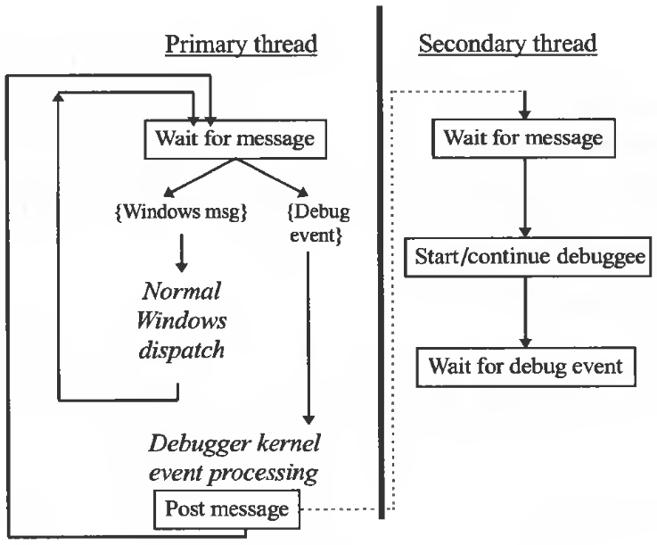

Introduction
============

-   Debuggers are very difficult tools to build robustly because they depend heavily on relatively weak portions of operating systems and because they tend to stress the underlying operating system's capabilities

Basic Concepts of Debuggers
---------------------------

-   a debugger is a tool to help track down, isolate, and remove bugs from software programs
    -   they are used to understand a program as well as find and fix defects

### What Are They?

-   software tools that help determine why the program does not behave correctly
-   is a tool that controls the application being debugged so as to allow the programmer to follow the flow of program execution and, at any desired point, stop the program and inspect the state of the program to verify its correctness

### Why Are They Used?

-   Debuggers are a necessary part of the engineering process when dealing with something as complex as software systems
-   All interactions cannot be predicted, specifications usually are not written to the level of programming details, and implementation is an inherently difficult and error-prone process

### How Do They Work?

-   There are numerous approaches to debugging
    -   A few of the techniques used include using print statements, printing to log files, sprinkling the code with assertions, using post-mortem dumps, stack-traces, profiling, reverse execution and interactive source-level debugging
-   Interpretive programming environments (Smalltalk, Java) provide very effective debugging solutions because the debugger is well integrated into the run-time interpreter and has very tight control over the running application
-   Source Level Symbolic Debugging is presented to the user is that the user's high-level language source code is executed directly by the CPU
-   they need to be well-designed, efficient, robust, and highly usable

Current State-of-the-Art
------------------------

-   Current debuggers can all control the execution of the program under scrutiny by using breakpoints and instruction-level single-step
-   Most CPUs have special instructions for breakpointing, provided explicitly for use by a debugger
-   number of debuggers have provided modes where mixed interpreted and compiled code can be handled
    -   important when dealing with high levels of compiler optimization or sophisticated reverse execution schemes as well
    -   switching to a mode where the actual source code is interpreted may remove a major source of confusion for the programmer
-   Another important debugging technology is called "fix-and-run"
    -   to minimize the turnaround time between creating a fix to test and the ability to actually test the system with the modification in place
-   performance analysis is not yet the accepted state-of-the-art

Debugger Basic Principles
-------------------------

### The Heisenberg Principle

-   the act of debugging an application should not change the behavior of the application.
-   Non-intrusiveness
-   a debugger violates the pure Heisenberg Principle in a lot of ways.
    -   The simple fact that the debugger is in memory and is controlled by the same operating system as the application being debugged can affect the application.
    -   even more problematic on event-based programming
    -   On newer and more robust operating systems a running application is better protected.

### Truthful Debugging

-   **always** provide truthful information during debugging.
-   any misinformation will devastate the user, send the user off in the wrong direction potentially, and cause a general lack of trust
-   **when it could not be truthful**
    -   reporting the effects of optimization accurately.
    -   a stack back-trace gets corrupted, and the debugger may try to work around the problem
    -   when reporting the values of variables. This can easily happen due to a high degree of optimization or register allocation optimization.
    -   The debugger may be fooled that the variable the user wishes to inspect is in memory when it actually is in a register.

### Context Is the Torch in a Dark Cave

-   the most important information the programmer needs during debugging: **program context information**. could be
    -   source code
    -   stack back-trace
    -   variable values (global and local)
    -   thread information
    -   CPU View
        -   disassembly information
        -   register values
        -   memory dump facility
        -   other machine-specific information

### Debugging Trails Systems Developments

-   there is almost no pressure from the market to force vendors to build the necessary debugging support.
-   Debugger developers need to push the systems vendors to provide the necessary infrastructure to enable support of the latest technologies.

Debugger Classification
-----------------------

### Source-level (Symbolic) versus Machine-level

-   Mapping the machine instructions back to the original source text is not trivial for the debugger to do.
-   The goal is to give the illusion that the debugger is directly executing the source code for you
    -   The trick is to have the compiler provide extensive debug information about the source code and how it was mapped into machine code.

### Stand-alone versus Integrated Development Environments

-   the biggest benefit of integrated development environments that include debuggers is programmer productivity.
-   the major limitation of a stand-alone debugger is the lack of access to the persistent compiler symbol tables and to the compiler itself.
-   Direct access to the compiler means that when it is necessary for the debugger to evaluate an expression, that expression will be interpreted in exactly the same way and with the exact same resulting behavior as if that same code were part of the compiled application.

### 4GL versus 3GL

-   4GL tools are based on an interpreted language such as Basic or Smalltalk.
-   Being based on an interpreter offers distinct advantages.
    -   it can give direct and immediate feedback
    -   the interpreter provides a safe, protected environment in which both the target application and the debugger can run.
-   Implementation of standard debugger functionality is much simpler in this interpreted environment than in a native mode debugger.
    -   Breakpoints are just special p-code entries inserted into the stream of codes being scanned by the interpreter.
    -   No special interactions with the operating system or underlying hardware need take place.
-   To set a breakpoint, you modify the source code to contain the halt keyword and re-execute that function.
-   Inspecting variables is done by inserting code that displays the values desired and re-executing.

### OS Kernel versus Application-level

-   Kernel debugging is a necessary part of developing device drivers.
-   Kernel debugging is normally set up in such a way that two machines are involved: the host machine and the target machine being debugged.
    -   As the machine crashes, there would be no way for a debugger on the crashing machine to report the scenario
-   Another way in which kernel debugging is used is to catch user application problems in the way they deal with OS resources.

### Application-specific versus In-clrcuit Emulation

-   Application-specific debuggers are general-purpose, high-level debuggers that control one or just a few applications at one time.
-   In-circuit emulators sit between the operating system and the bare hardware and can watch and monitor all processes and all interactions between applications and the OS.

Debugger Architecture
=====================

-   **a generic architecture for the state-of-the-art debugger**


Architecture Overview
---------------------

-   the most commonly used type of debugger: symbolic
    -   maps underlying machine representation back to user-created source code
    -   graphical user-interface-based
    -   application-oriented debugger

User Interface
--------------

-   More and more in modern applications, more than one process is involved in the correct execution of an application.
    -   those processes may include multiple threads of execution that require debugger visibility into their inner workings.
-   The source view gives the user the illusion that the debugger is actually executing the originally typed source code directly.
    -   When this is not possible, an alternate view must be shown that represents the machine-level execution directly.
-   the second-most important view during debugging is the stack view.
    -   A stack trace consists of a series of stack frames.
    -   Each frame represents a single function call, also known as an activation record.
-   Breakpoints are probe points placed into the executable via the debugger where the programmer wishes execution to halt so that more information about the program can be ascertained.
    -   Unverified breakpoints have been set in code that has not yet been loaded into the process's address space.
    -   This might occur if the program source has been edited since last execution and the location of existing or new breakpoints is no longer known to map to a specific location in memory.
-   The evaluator allows virtual "programming-on-the-fly" because additional code that was not placed into the executing program can now be executed as if it were in the executable.

Debugger Kernel
---------------

-   At the end of a debug session, the debugger kernel must terminate the process being debugged and disentangle the debugger from it.
-   is also responsible for symbol table access.
    -   The symbol table must be consulted to determine a mapping between source statements and byte addresses of executable instructions.
-   The symbol table also contains information about program variables so that the debugger can map a source-level variable or data structure to a specific location or locations in the data memory of the debuggee.
-   Expression evaluation the debugger must
    -   access a compiler parser to parse the textual expression;
    -   access the symbol table to look up addresses of variables;
    -   read debuggee memory to get the current values of these variables;
    -   use the execution engine to execute function calls in the expression;
    -   combine the subexpression results using the specified operators in order to present to the user interface a final result.

Operating System Interface
--------------------------

-   debug application program interface (API) portion of the operating system provides the basic functions to
    -   create debuggable processes
    -   to read and write this process's memory
    -   to control the execution of this process
-   this API provides a way of notifying the debugger whenever anything "important" happens to the debuggee.
-   the debug API must be nonintrusive so that it has minimal impact on the debugged application.

Debugger Main Loop
------------------

-   major differences among different OS's debugging APIs
    -   Single-threaded versus multithreaded
        -   A thread is a single path of execution with its own context that includes program and hardware state.
        -   Processes are collections of one or more threads;
        -   sharing data between processes requires special calls to the operating system.
    -   Debug OS call blocking versus non-blocking
    -   Direct use of OS message system versus separate notification mechanism

Hardware Debugger Facilities
============================

Necessary and Sufficient Hardware Debugging Support
---------------------------------------------------

-   The minimal basic requirements a debugger places on the underlying hardware are
    -   A way to specify a breakpoint. **can be provided for by simply writing some illegal instruction into the code stream for the debuggee**
    -   A notification system that notifies the operating system that an important event has occurred with respect to the running process
    -   The ability to read and write directly out of and into the hardware registers when the interrupt occurs
-   the processor does not need to support a single-step or instruction trace capability because that can be provided equivalently via breakpoints alone.

Generic Hardware Debugging Mechanisms
-------------------------------------

### Breakpoint Support

-   usually implemented as a special instruction that causes a trap to the operating system
-   On architectures with varying length instructions it is normal to be the length of the shortest possible instruction.
-   This makes it much simpler for the debugger to guarantee breakpoints are placed on instruction boundaries.
-   Algorithm
    -   Given an address where a breakpoint needs to be set, the debugger reads the current instruction at that location and save it for later replacement.
    -   Then, the debugger writes the special breakpoint instruction at that location.
    -   \[Normal execution until breakpoint is reached\]
    -   Execution stops at the breakpoint
    -   Debugger collects information/context
    -   **IF the debugger wants to execute the instruction where the breakpoint is**
        -   must go back to the instruction it saved earlier and replace it
        -   have the debuggee single-step this one instruction
        -   replace the breakpoint instruction before allowing the debuggee to go on (to keep the breakpoint for later)

### Single-step Support

-   Single-step means that the processor is instructed to execute a single machine instruction when it is next processing instructions for the debuggee.
-   Most processors provide a mode bit that controls single-step operation.
    -   Typically directly manipulated only by the OS on behalf of the debugger
-   one thread (or process) being single-stepped does not cause other threads (or processes) to also single-step when the OS decides to give control to another thread (or process) not being debugged.
-   can be simulated through
    -   decoding the instruction at the current program counter
    -   setting a breakpoint on the very next instruction
    -   causing the debuggee to run

### Fault Detection Support

-   one of the most critical requirements for a debugger
-   the OS notifies the debugger that its debuggee has received a fault before the debuggee actually is allowed control again

### Watchpolnt (Data Breakpoint) Support

-   Watchpoints are notifications presented to the debugger when specified portions of the debuggee's address space are modified.
-   point out locations in the application where these writes to memory occur
-   in the absence of data breakpoint registers
    -   to mark a complete data page as read only, and then, when a page access violation occurs, check to see if the address in that page being accessed is part of the offending data range.

### Multiprocessor Support

-   multiple instruction multiple data (MIMD) and single instruction multiple data (SIMD)
    -   stall detection is very important to debuggers
    -   debuggers controlling asynchronous multithreaded programs may need to operate only one thread at a time so that no thread can "run away" in an uncontrolled fashion.
-   deadlocks occur on uniprocessor systems, but the problem is more common and the result more deadly on multiprocessor systems.

Contemporary CPU Debug Architectures
------------------------------------

-   basic set of features
    -   A special instruction that halts execution
    -   A special mode of the processor to execute a single instruction
    -   Page protection mechanisms
    -   Exception or fault detection mechanisms
    -   In some cases, special debug registers

Future CPU Debug Architecture Trends
------------------------------------

-   multiple instruction pipelines
-   systems built with multiple processors working in cooperation
-   special performance features such as
    -   branch prediction
    -   speculative execution
-   debuggers reporting test coverage statistics

Operating System Debugger Infrastructure
========================================

Necessary and Sufficient OS - Debugger Cooperation
--------------------------------------------------

-   a debugger needs
    -   a mechanism to notify the operating system about the executable program it wishes to control.
    -   to be able to modify that debuggee's code memory in order to modify the instruction stream with the special breakpoint instructions.
    -   to be able to tell the operating system to run the debuggee but notify the debugger if any sort of exceptions (or traps) occur before the debuggee itself gets notified or terminated.
-   Once the debuggee does stop for some reason, the debugger needs
    -   to be able to gather information from the debuggee's register set and data memory.
    -   enough information to know what address in data memory should be read to present stack and variable value information.

Generic OS - Debugger Interaction Model
---------------------------------------

-   A debugger is a user-level and highly specialized application
    -   It uses special calls to alert the OS that it is a debugger and that it wants to debug some application or applications.
-   it is not
    -   part of the operating system
    -   a privileged application.
-   for security reasons, interactions between the debugger and the debuggee must go through the operating system.
-   On a simple breakpoint, where the debuggee is running and the debugger is waiting for some notification:
    -   Debuggee running hits breakpoint. Transition \#1 to OS to deal with trap.
    -   Transition \#2 to debugger waiting for event. Debugger now running.
    -   Debugger requests state info on debuggee. Transition \#3 to OS to deal with request.
    -   Transition \#4 to debuggee context to get information. Debuggee context now active.
    -   Transition \#5 to OS to return information.
    -   Transition \#6 to debugger to handle information. Debugger active.
-   to minimally support debugging of a multithreaded application the debugger must
    -   be notified as soon as the application creates or destroys a thread
    -   be able to inquire and set thread-specific program state
    -   be able to detect when the application stops and which thread was executing when it stopped

Legacy OS Debugging Support
---------------------------

-   Windows 3.11 - TOOLHELP.DLL
-   UNIX - ptrace()
    -   one of the first dedicated APIs designed to support production-quality debuggers.
-   Mac OS
    -   based on a series of callbacks.
    -   the debugger and the debuggee as well as the OS are in the same process context.

Contemporary OS Debugging Support
---------------------------------

-   UNIX /proc
    -   It presents all processes as files in a directory
    -   the debugger can just use standard accesses to a device driver to control any process in the system according to standard UNIX file protection mechanisms.
    -   a debugger can "attach" to any process, even one that was not initiated by the debugger.
    -   is able to trace entry and/or exit from system calls
    -   does not explicitly provide a breakpoint mechanism (**illegal opcode**)
-   Win32 Debug API
    -   a blocking debug API meaning that the system call does not return to the caller until the request is satisfied.
    -   the debuggee does nothing special to allow itself to be debugged.
    -   the debugger calls CreateProcess () with a special flag or uses DebugActiveProcess () on an existing process.
    -   debugger must explicitly wait for a state change in the debuggee by blocking or polling
    -   Weaknesses
        -   Windows 95 fails to save the debug registers of the Intel x86 processor on context switches.
        -   gives the debugger no notification when one or more of the independent threads controlled by the debugger blocks.
        -   No abstraction is provided for single-step and data breakpoints or watchpoints
        -   While Win32 provides on attach capability, there is no detach which is limiting.

Hybrid OS Debugging Support
---------------------------

-   16-bit debugging on a natively 32-bit operating system.
-   16-bit Debugging under Windows NT
    -   The Windows-on-Windows (Virtual DOS Machine) subsystem creates a self-contained 16-bit environment within the 32-bit operating system.
        -   not provided on Windows 95
    -   a complete simulated x86 environment.
    -   the cost in design and special-case code is high because the debugging logic is quite specialized
    -   the standard two-thread Win32 debugging main loop is used
    -   Because the debugger and the debuggee are in completely different environments, the method of communicating between has to be via exceptions
-   16-bit Debugging under Windows 95
    -   16-bit debuggers can control 16-bit applications by using TOOLHELP
    -   32-bit debuggers can control 32-bit processes using the standard Win32 debug API
    -   **Do not write a 32-bit debugger that will try to control a 16-bit process**



Java Debugging Support
----------------------

-   A debugger for Java applications runs as part of the Java run-time system local to the user.
-   The Java application being debugged may be running locally, running remotely, or a combination of both.
-   key requirements for a debugger for the Java programming language
    -   The interface should be object-oriented in the same manner as the language.
    -   Java language runtime features such as threads should be fully supported.
    -   Remote debugging should be possible
    -   Security should not be compromised under normal operation.

### The Java Debugger API

[Java Platform Debugger Architecture](http://java.sun.com/javase/technologies/core/toolsapis/jpda/index.jsp)

-   is included as part of the standard system packages
-   is a set of Java Objects (written in Java and fully integrated into the Java system)
-   uses the notion of a proxy for objects under observation
-   it assumes all Java applications un remotely (local is just a special loop-back case).
-   the remote debugger that our client user interface is talking to will create references to objects we wish to examine
    -   this is necessary to prevent objects being destroyed by the remote run-time's garbage collector
-   The debugger communicates with the Java interpreter being debugged via a socket-based, proprietary protocol
-   the remote agent creates a reference to the requested object and returns to the local debugger this RemoteObject class for querying.
-   breakpoints are always specified with respect to a class and a line number within that class.
-   the stack is maintained exclusively in the Java run-time machine

```java
    public RemoteDebugger (String host, String password,
        DebuggerCallback/*breakpointEvent(RemoteThread)*/ client,
        PrintStream console, boolean verbose) throws Exception { }
```

Controlling Execution
=====================

Initiating Program Execution
----------------------------

-   The first job of a debugger with respect to controlling execution is the creation of the debuggee
    -   from scratch
    -   or via attachment to an existing process.

### Creating the Debuggee

-   The first thing the debugger must do is to initiate the calls to the OS that create the debuggee.
-   The OS needs either
    -   create the debuggee process for the debugger explicitly through a special call
    -   or attaches the debugger to an existing process.
-   Typically the new process is loaded but it doesn't have its first instruction executed
-   The debugger gets notifications from the OS whenever a material event occurs with the debuggee
    -   all notifications result in the debuggee being stopped for examination.
    -   Instead of the normal handling of exceptions, the debugger is notified first.
-   **special events like "breakpoint hit" and "single-step completed" are exceptions that notify the debugger that something of interest has happened.**
-   other events include
    -   process created
    -   thread created
    -   process exited
        -   occurs when the debuggee process terminates. No other events from the debuggee can occur after this.
        -   a chance for the debugger to clean up its internal record keeping and to release any resources it maintained on behalf of the debuggee process.
    -   thread exited
    -   module loaded (DLLs or EXEs)
    -   module unloaded
    -   output string (just like Eclipse's Inspect)
    -   exception

### Attaching to Running Program

-   For multiprocess debugging, the debugger, needs to be able to debug any and all processes that interact with the debuggee.
-   Post-mortem debugging is the process of examining the memory image of a process that has faulted and was terminated. Its state at the time it faulted was saved to disk for examination.
-   Just-in-time debugging is related, but instead of an image written to disk, when the OS issues a fatal exception but before the process is flushed from memory, the OS allows a debugger to attach to the process to examine its memory image.

### Setting a Breakpoint

-   Breakpoints are special instructions inserted into the executable text image by the debugger that, when executed by the debuggee, cause it to halt execution immediately and to "trap" to the operating system.
-   the basic mechanism used by a debugger to control the debuggee process.
-   defined by the CPU architecture
    -   Sometimes just a special value of a general "interrupt" instruction
    -   or a special dedicated breakpoint instruction
-   uses for breakpoints
    -   user breakpoint - specified by the user
    -   single-step - Breakpoints are used to advance the execution short amounts to get the effect of statement single-step.
    -   run-to-here - "once only" breakpoint.
        -   once the debuggee stops for any reason all these "once only" breakpoints are permanently removed.
    -   finish function - a convenient way to complete whatever function the current execution point is in.
    -   function evaluation - When a function within the debuggee must be executed in isolation from the normal path of execution
        -   The stack must be manipulated prior to calling the function, and a breakpoint must catch execution as the function exits so that only the desired function is executed.

### Causing the Debuggee to Run

-   Execution may be either "run full speed until some debug event occurs" or it may be "execute a single machine instruction" and then generate a debug event.
-   In either case, the operating system has been directed to context switch from the debugger to the debuggee.
-   What actually occurs is
    -   The debugger is the active process and it makes a call into the operating system to initiate the debuggee;
    -   operating system to completes this system call;
    -   the operating system gets the debuggee process ready to run and context switches to it;
    -   the debuggee now is the active process and runs according to the scheduling algorithms in the operating system.
    -   once a debugging event occurs, the debuggee is stopped, the operating system saves its stopped context (the values of all hardware registers), and control transfers to the waiting debugger.
        -   the debugger must discover why the debuggee stopped, where it stopped, and what is its context.
        -   why is usually indicated by a special flag or value set in a return code either from the blocking debug execution function or in the blocking wait function.
        -   The where is usually available in the saved context that contains the values of all the processor registers at the time debuggee execution halted
        -   the context just requires reading an OS-maintained buffer of all the registers saved when the debuggee halted.
    -   One or more hardware registers gives the debugger enough information to reconstruct the stack, which itself resides in debuggee data memory.

Debuggee-generated Events during Execution
------------------------------------------

-   the most challenging aspect of a debugger's execution control is the event-driven nature of debug notifications.
-   debugging control APIs are notification based

### Breakpoint, Single-step Events

-   the debugger needs to check its stored list of breakpoints to find out which breakpoint has been hit.
-   this is done by getting the saved state for the debuggee and querying the stop location (that is, the program counter).

### Thread Creation/Deletion Events

-   When the debuggee process creates or deletes a thread of execution the user interface must be notified so that user-visible changes can occur.
-   It is critical that the debugger is aware of each thread and maintains context information about each one because one of the more important functions the debugger provides is its ability to control these separate threads and to detect problems in multithreaded applications.

### Process Creation/Deletion Events

-   notification from the initially started process that it has spawned a new process is important for the debugger to be able to track the new process.
    -   the debugger must be provided with the "attach" capability.
-   this new process is controlled in the same fashion as the process that was initially created by the debugger.
-   As processes exit, the debugger must clean up all internal data structures related to the process just exiting.
-   if it is the initially debugged process that is exiting, this is the last notification the debugger will get about the debuggee

### Data Access (Watchpoint) Events

-   one of the more important features a debugger can provide
    -   **because data corruption is a common and very difficult type of bug to isolate.**
-   In other operating systems, while not explicitly exposed, there are usually mechanisms to bypass the operating system and work directly with the hardware if it supports watchpoints.
-   Watchpoint notification, whether direct or indirect through hardware register examination, indicates that a location or region in memory was accessed.
-   The program counter will point to the offending instruction or one instruction past the offending instruction.

### Module Load/Unload Events

-   occur whenever a dynamic load library (DLL) is loaded or unloaded by the debuggee.
-   symbol table information that contains important debugging information may need to be examined and processed on module loads.
-   at the moment the DLL load notification occurs, the debugger must resolve these breakpoints—compute the correct location in the text space and immediately get them inserted into the newly loaded DLL text.
-   when a DLL is unloaded, the corresponding symbol table information must be noted by the debugger, and any breakpoints in this DLL must be remarked as unresolved in case this DLL gets reloaded at a later time.

### Exception Events

-   These are the kinds of bugs the debugger must help the user find and eliminate.
-   Some of these may be automatically ignored by the debugger with execution proceeding immediately, such as software timer interrupts.

### Other Events

-   allows users to programmatically control when the debuggee generates an exception through special system calls the user can insert in the source code of the program being debugged.
-   this call accepts a string as an argument that is then emitted to a special debug string monitoring tool; it also causes an exception when run under the debugger.
-   Another type of debug exception allows one to stop the debuggee whenever it is about to execute an operating system call.

Continuing Execution
--------------------

-   several options for the debugger do exist.
    -   First is the issue of changing the program counter location. If the stop is at a breakpoint, the PC and breakpoint must be dealt with
    -   If the restart is to execute a function to be evaluated in the debuggee context, the PC must be adjusted first and reset later.
-   there is the issue of whether to pass into the debuggee any idea of why it was stopped
    -   if the stop was due to an exception caused within the debuggee's executing environment, then a real choice exists as to whether the debuggee should "see" the exception.

Terminating Execution
---------------------

-   can be quite tricky and problematic
    -   **because the logic in the operating system associated with process termination in conjunction with the debug APIs can be fragile**

Breakpoints and Single Stepping
===============================

Breakpoints
-----------

-   key to all debugger execution control
    -   almost all execution control algorithms, at some point, involve breakpoints.

### Requirements for Breakpoint Algorithms

1.  User may insert source-level or instruction level breakpoints
2.  Breakpoints may have associated conditions
3.  Breakpoints may have side effects
4.  Breakpoints set in not-yet-loaded modules must be resolved when these modules get loaded.
5.  On multiprocessor architectures, high-level breakpoints may require interprocessor synchronization.

### Breakpoint Data Structures

-   at least two "levels" of breakpoint representation
    -   logical breakpoints
        -   usually set by the user, associated with a point in the source code
    -   physical breakpoints
        -   related directly to executable machine instructions
        -   the points in the text space where actual hardware breakpoint instructions get written
        -   It is the physical level that must store the original instruction that must be replaced if the breakpoint is to be removed
-   conditional breakpoints may or may not actually stop when the breakpoint "fires" depending on the value of an associated condition
    -   conditions that must evaluate to true for valid stop are also maintained at the logical level.
-   stored as Map<Address,PhysicalBreakpoint> that maps to a Map<Address, List<LogicalBreakpoint>&gt;
    -   Logical-to-physical on set, modify or deletion of breakpoints.
    -   Physical-to-logical whenever a hardware breakpoint event occurs.
    -   An Entry<Address,PhysicalBreakpoint> is actually removed, and its original instruction restored only when its reference count drops to zero.

### Breakpoint Setting and Activation

1.  Request symbol table agent map given file name and line number information into physical address
2.  Create logical breakpoint object with this information contained
3.  Create (or increment reference count if already exists) physical breakpoint object
4.  Physical breakpoint agent must now insert breakpoint instruction and save original instruction at that location

### Breakpoint Validation

-   When a breakpoint is set there may not be an address at which to physically place the breakpoint instruction yet.
    -   there may not yet be a valid mapping from the source code to the executable code
    -   the breakpoint may be in code in a dynamically loaded library (DLL) that has not yet been loaded
    -   no process is loaded at all
-   In either case, the breakpoint set by the user, a logical breakpoint, **will exist without any associated physical breakpoint until some later time**
-   Once the process finally gets loaded (or DLL loaded) a validation algorithm must complete the mapping of invalidated logical breakpoint to physical.
-   When the process is first created no instructions are executed before the debugger has a chance to process all the invalidated breakpoints and get physical breakpoints inserted.
    -   operating systems provide a debugging event when a module load or unload occurs. This causes the debuggee to stop execution whenever a DLL is loaded

but before any instruction in that DLL actually executes.

### Temporary Breakpoints

-   used to implement features such as "run-to-main" or "run-to-here."
    -   Run-to-main is used at debuggee startup to quickly execute past all startup code and to stop on a program's main routine
    -   Run-to-here allows the user to point to source code where he or she desires the program counter to be and quickly have the debuggee execute up to that point.
-   A temporary breakpoint is set, the debuggee is started running, and once it stops the temporary breakpoint removed.

### Internal Breakpoints

-   can be just an attribute associated with a breakpoint object.
-   invisible to the user
-   The basic source-level single-step algorithm uses a combination of internal breakpoints and full-speed run to key internal breakpoints placed for optimal stepping speed
-   critical on source statement step over
    -   a statement step in the context of the current function scope running any descendent functions full speed to completion.
    -   we typically use an internal breakpoint on a function's return address to allow that function and all its descendents to run at full speed.
-   step into uses internal breakpoints to quickly run over stretches of code as long as possible up to some branch instruction, again for performance reasons.
-   During expression evaluation, when the debugger must use the debuggee to evaluate a function in an expression entered by the user, internal breakpoints are used to carefully control execution so that just the desired function is executed

### Side Effects

-   We can program the debugger to execute associating actions to be performed when a breakpoint evaluates its condition (if any) to be true.
-   Logging is a simple action that can be performed at a breakpoint.
    -   This is very similar to inserting print statements directly in the source code that record some sort of history of execution when the program runs.
    -   has the advantage of not requiring the program to be recompiled.
-   The debugger could also record the number of times this particular breakpoint has activated.
    -   This information is compared against a threshold
    -   for bugs that follow the pattern "it happens after N times through the loop."
-   These uses of expression evaluation are a way to have the debugger "patch" the debuggee program without modifying the program or even compiling it at all.

### Code Patching by the Debugger

-   Instead of inserting a special breakpoint instruction at a given location and saving the original instruction away in debugger memory, any instruction could be inserted into the executable code stream by the debugger.
    -   a branch or jump instruction could be inserted meaning that very general code patching is possible.
-   sometimes rebuilding the entire program may take so long that some faster way to verify if the proposed fix works is frequently required.
    -   solution: allow users to modify the debuggee program with new and/or different code without re-compilation.

Single-step
-----------

-   It is important to understand the side effects occurring close to the failure point, which stepping allows.
-   To fully support breakpoints and single-step in its various forms, the debugger needs to have a very sophisticated execution control mechanism.
-   This requires a fairly involved set of states maintained by the debugger that correctly describes the state of the debuggee with respect to its current execution algorithm.
    -   this is best handled by a finite state machine that gets its initial state from the user-requested command.
    -   Each notification from the OS about the debuggee stopping is a transition in this finite state machine, possibly to a new state.

### Step Into versus Step Over

-   "step into" means execution proceeds into any function in the current source statement and stops at the first executable source line in that function.
    -   decodes instructions and advances the processor via breakpoint plus full-speed run.
-   "step over" treats a call to a function as an atomic operation and proceeds past any function calls to the textually succeeding source line in the current scope.
    -   a breakpoint is inserted at the return address of this function by looking at the current stack frame.
    -   Once this return address breakpoint is reached, there is breakpoint cleanup and the basic source step algorithm is continued.

```java
public class StepInto {

    private boolean movedFlag;
    private ProgramCounterEntry simulatedPC;
    public ProgramCounterEntry output;

    public StepInto(ProgramCounterEntry entry) {
        movedFlag = false;
        onDebugNotification(entry);
    }

    public void onDebugNotification(ProgramCounterEntry arg) {
        //iii
        simulatedPC = arg;

        //iv
        if (movedFlag && isBeginningOfStatement(simulatedPC)) {
            //step into is completed
            output = simulatedPC;
            return;

        } else if (isSourceAvailable(simulatedPC)) {
            //run or run to first source
        }

        //v
        String instruction = getInstructionFrom(simulatedPC);

        //vi
        if (!isBranch(instruction) && !isBeginningOfSourceStatement(instruction)) {
            simulatedPC = ProgramCounter.get(simulatedPC.nextInstruction);
            onDebugNotification(simulatedPC);
        }

        //vii
        if (isBeginningOfSourceStatement(instruction) && arg != simulatedPC) {
            BreakPoint tempBp = setTemporaryBreakPoint(instruction);
            movedFlag = true;
            ProgramCounterEntry realPC = debugee.runAndWait();
            tempBp.cleanUp();
            onDebugNotification(realPC);
        }

        //viii
        if (isBranch(instruction)) {
            instruction = getBranchInstructionTarget(instruction);
            BreakPoint tempBp = setTemporaryBreakPoint(instruction);
            movedFlag = true;
            ProgramCounterEntry realPC = debugee.runAndWait();
            tempBp.cleanUp();
            onDebugNotification(realPC);
        }
    }
}
```

### Smart, Fast Source-Step

-   There is a tremendous cost to a call to the OS debug API due to several context switches and OS scheduling delays as well as CPU overhead.
-   **Instruction decoding** involves reading a debuggee text address (at the current program counter usually) and applying a CPU-specific lookup to determine the type of instruction at this location.
    -   If the instruction is a procedure call instruction, the debugger knows one machine step will execute that instruction and end up at the first instruction inside that function.
    -   Then, the debugger gets the return address where a breakpoint can be set to enable skipping over the entire function rapidly.
-   Sequences of in-line (non-branching instructions) can be grouped together and executed all at once
    -   it just requires detecting branching instructions versus non-branching instructions.
-   **three areas that are processor-specific and non-portable are the following**
    1.  Instruction decoding as used in stepping algorithms
    2.  Stack back-trace unwinding or "walking"
    3.  Disassembly and CPU view register presentation

    -   keep these area isolated to enable easier porting to new processors!

### Pathologic Stepping Problems

-   Nothing is as simple as being able get the correct behavior out of single-step in all cases.
-   Two examples of commonly found anomalous behavior are
    -   single-line for loops
    -   attempting to step into "missing" routines.
-   **Single-line For Loops**
    -   book example will generate only one breakpointable address
    -   Debugger stepping algorithms need to be prepared to deal with this single-line for-loop situation.
    -   notice if the CPU branch instruction within a single-source statement branches backward to an address still within the same statement and consider this branch instruction as a stoppable location
-   **multiple return instructions from within a single function**
    -   there is no one-to-one mapping between source and statement line number tables.
    -   many breakpointable locations for a single source line
-   **Step into "Missing" User Routines**
    -   stepping through a mixture of functions with debug information (the ones supplied by the user) with functions without debug information (run-time library, for example).
    -   a user routine calls a library function that in turn calls a user routine (a "callback")
    -   The "hidden" user routine (called by the immediately contained library (no debug)) will never be seen by source step.
    -   two workable solutions to this problem
        -   build into the stepping algorithms a "run to first source" feature. a breakpoint is placed on all procedure entry points.
        -   use page protection set for all user-written code pages that will cause a page protection violation as soon as user code is about to execute again.

### Step-related Algorithms

-   Animation is used to dynamically show the progress of execution through the program.
-   Software watchpoints
    -   are data access breakpoints that are not implemented via hardware assist. It stops the debuggee if any modification is attempted.
    -   mark a page of debuggee data memory as read-only, then an attempt to write into that page would cause an exception that the debugger would catch.
    -   the debugger would check the exact address of the access attempt, and if it intersects a watchpoint, activate that watchpoint.
    -   Otherwise, the page must be made writable, the process stepped a bit, and then re-marked read-only before a full-speed run can be resumed.
-   finish the current function
    -   Once a user finds that he has stepped into a function inadvertently he might like to run quickly to a point just after the call to this function.
    -   implementation of this is the latter half of the step-over algorithm. take the user to the source line immediately succeeding the call to the current function.
-   **Reverse Execution**
    -   Some interpretive language systems can perform true reverse execution
    -   many instructions are simply not reversible, such as I/O instruction or any calls to OS or library routines.
-   Slime Trail
    -   "where am I" and "how did I get here"
    -   "how did I get here" is not completely answered by a stack trace.
    -   Functions entered but already left do not appear on a stack back-trace.
    -   some debuggers have a "slime trail" mode that shows all statements and functions executed up to the current execution point.
-   C++ Exceptions
    -   consist of a "throw" and a "catch"
    -   users can be given the option of running immediately to the catch point or stepping through each destructor in succession

### Event-driven Stepping Models

-   strictly event-driven systems such as that provided by Visual Basic and Delphi.
-   user functions are only directly called from system dispatch routines (without debugging information)
-   solution
    -   have the debugger detect when it is about to step off the end of a user function and at that moment set breakpoints at the beginning of every user routine in the entire system.
    -   Once the user routine returns, the debugger must cause the debuggee to run at full speed.
    -   Eventually, it will hit one of the special breakpoints and stop at the start of another user routine.

Discovering Program Context
===========================

Source-level View
-----------------

-   Users think in terms of their source code.
-   **directory location, file name, routine, and actual source line** are all critical to answering the key context questions.

The Program Stack <http://en.wikipedia.org/wiki/Call_stack>
-----------------------------------------------------------


-   is a data structure supported by the hardware, the operating system, and the compiler.
-   is composed of stack frames
    -   Each stack frame corresponds to a call to a subroutine which has not yet terminated with a return
    -   For example, a subroutine named DrawLine is currently running, having been called by a subroutine DrawSquare
-   the stack pointer indicates the current top of the stack
    -   **the return address back to the routine's caller**
    -   As each routine is called via these special instructions, more and more return addresses are stored there in successive memory locations, creating a stack.
    -   As a routine executes its final instruction (return) it
        -   resets its instruction pointer to the return address stored on the stack and
        -   "pops" that frame off the stack and discards it.
-   the frame pointer is set up at procedure entry to point to a fixed location in the frame structure (such as the return address)
-   the stack also stores local variables used just within the associated function.
-   **A stack trace is a list of the procedure activation records or frames currently on the call stack.**
-   **the procedure calling conventions** dictate where various pieces of data, such as the return address, lie within each frame.
    -   Once the debugger knows the boundaries of a frame, it can retrieve the return address saved within that frame and map it to the name of the procedure containing that address.
    -   the debugger can also retrieve the values of local variables belonging to frames below the topmost.
-   unwinding a stack takes a three-step approach
    1.  teach the debugger to deal with the general case
    2.  if possible, get the compiler to indicate via the debugging tables whenever it diverges from the general case
    3.  teach the debugger to disassemble the code and figure out for itself how the stack was built
-   If the debugger wants to show the values of local variables in frames prior to the topmost one, the unwinding algorithm must also restore saved registers.

### Special Problems in Unwinding the Stack

-   If, for example, the stack overflows due to an unlimited-recursion bug, the user will want to see the topmost few frames on the stack while ignoring the thousands lying below.
-   the debugger is designed to work on buggy programs, not just ones that work totally as expected.
-   problems can occur during the prologue (the code that constructs the stack frame) and epilogue (the process removes its own frame and restores registers)

### Tracing a Corrupted Stack

-   Bugs sometimes destroy part of the current stack frame.
-   damage to the current frame can prevent it from showing any of the earlier frames, even if they are undamaged.

Inspecting Data and Variables
=============================

-   Execution control lets the user understand the "where" of a bug; data inspection lets the user understand the "how."

Evaluating Expressions
----------------------

-   a symbolic debugger can display data by evaluating an expression that uses the same identifiers and syntax that appear in the source program.
    -   the debugger needs to implement an interpreter for the expression syntax and semantics of one source language.
-   the debugger's interpreter does not allocate its own storage for variables
    -   it accesses them within the debugger's child process at the addresses specified by the debugging tables emitted by the compiler.
-   Approach
    1.  The adapted compiler reads the text typed by the user and builds its parse tree
    2.  It consults the debugging tables to obtain the identifier and data type information
    3.  a piece of debugger-specific code walks the tree, replacing variables with values obtained from the child process.
    4.  the usual constant-folding code within the compiler combines the values and delivers a result.
-   the debugging tables are unlikely to use the same data structures as the normal compiler symbol table.
    -   a solution is to provide pairs of symbol-table access methods, for the compiler and the other to translate (**lazy**) the object file debugging tables into the data structures the compiler expects to see.

Invoking Functions during Evaluation
------------------------------------

-   Although the debugger can interpret most expressions, as opposed to generating native code, an expression that invokes a function poses a problem.
-   generally it is not practical to parse, process and then use the function resulting tree to drive an interpreter.
-   most debuggers that permit expressions containing function calls employ a trick.
    -   Instead of interpreting the function invocation, the debugger builds an argument list using the stack within the child process, sets a breakpoint at the function return address, and starts the child process running at the beginning of the function.
    -   When the child process reaches the breakpoint, the debugger retrieves its return value and restores the child process stack and registers to their original state.
    -   The debugger must also anticipate that the function may not return
    -   and treat a fault as an error that reports failure to the user and restores the child process state.
    -   **don't allow breakpoints during function evaluation.** (Eclipse does!)

Compiler-generated Debugging Information
----------------------------------------

-   A symbolic debugger depends on the compiler and linker to emit debugging tables that describe the mapping from names and statements within the source program onto the object program
-   the debugging symbol table provides only the information the debugger is thought to need.
-   A debugging symbol table must deal with a number of issues:
    -   Does the symbol table cater to the compiler or to the debugger?
        -   The symbol table is a database, and is organized in terms of which queries need to be fast.
        -   queries that are important to the debugger may not occur at all within the compiler
    -   How does it divide the work among compiler, linker, and debugger?
    -   Does it permit incremental processing and caching of information?
        -   Reading and processing the entire symbol table for a large program can cause an annoying delay.
        -   If the debugger can read the symbol table in a lazy or incremental fashion, it may entirely avoid reading most of the symbol table (less than 15% generally needed)
    -   Can it support a variety of target machines?
        -   differ with respect to word size, address range, registers, the use of segments, and so on.
    -   Can it support a variety of compilers?
        -   Compilers vary in the way they build runtime structures

Accessing Symbol Tables
-----------------------

-   How the debugger accesses the symbol table depends on which services the debugger provides to the user
-   common set of queries
    -   Map instruction address onto the enclosing scope.
        -   used when the user asks to evaluate an expression. the debugger must use the appropriate scope.
    -   Map scope onto statically enclosing parent scope.
        -   For statically scoped languages, evaluating an expression often requires searching a hierarchy of scopes.
    -   Map scope plus identifier onto type and location
        -   When evaluating an expression, the debugger must search for an identifier within a scope, and then use its type plus its location to fetch from the child process the number of bits indicated by the data type.
        -   where location may be a memory address, a register, a constant value, or some combination
    -   Map instruction address onto source statement
        -   When the program stops, it must show the current source statement.
    -   Map code or data address onto statically allocated variable or procedure
        -   When the debugger disassembles instructions, it may show the names of the variables and procedures to which they refer.
    -   Map source statement onto instruction address range
        -   When the user sets a breakpoint on a source statement, the debugger must find the first instruction of that statement.
        -   When the user asks to step through a source statement, the debugger must find the end of the statement.

Multithreaded Debugging
=======================

Threads and Processes
---------------------

-   the process is a unit of resource ownership and of work to be done
    -   the operating system uses the process as a way of organizing its work and resource allocation.
    -   The responsibility of the operating system is to guarantee that processes get a chance to execute in an orderly and timely fashion and that processes are protected from each other
    -   processes each have private, protected address spaces.
-   The thread is the smallest entity within the operating system
    -   the thread is one of many possible subtasks needed to accomplish the overall job of a process.
    -   **a single unit of execution**
    -   Threads are not separate and protected from each other and all threads within a process share the same address space
-   Each thread has its own stack and set of processor registers.
    -   Heap space is per process
    -   The stack provide a private, non-shared data called thread local storage

Operating System Thread Control
-------------------------------

-   every process begins life as a single thread That can create other threads
-   Threads must be able to synchronize with each other

Thread-created Problems (Bugs)
------------------------------

-   Data Corruption
    -   one thread modifies data that another thread was counting on not changing
    -   thread local storage should be used
-   Inadvertent Data Sharing
-   Synchronization
-   Deadlock
    -   when two or more threads find themselves in a mutually unsatisfiable situation.
-   OS inadequacies
    -   the lack of any debug notification when a thread blocks
    -   there is no clear answer to the user's question "So what is this thread waiting for?"

Threads Impact on Debugger Architecture
---------------------------------------

### Thread-specific OS Events

-   require that the debugger internally modify its internal thread-related data structures.
-   **EXCEPTION DEBUG EVENT**
    -   can be divide-by-zero, illegal memory reference, hit a breakpoint, complete single-step, or the like.
    -   This happens because all threads but one are "suspended" at a given moment of time, and it is the one single thread currently active on the processor that gets or generates the exception that causes this event.
-   **CREATE THREAD DEBUG EVENT**
    -   this event allows the debugger to set up any thread-specific data structures when the thread is first created but has not yet been allowed to execute even one instruction
-   **CREATE PROCESS DEBUG EVENT**
    -   This event allows the debugger to initialize its process-specific internal data structures before any further debugging activity occurs
-   **EXIT THREAD DEBUG EVENT**
    -   allows for cleanup of internal structures as threads are destroyed
-   **EXIT PROCESS DEBUG EVENT**
    -   when the last thread of a process exits or some thread explicitly calls the OS call to terminate a process
    -   the debugger knows that there is no longer a debuggee to control

### Thread-specific Program Context

-   When a debug event occurs the debugger obtains the context for that thread using GetThreadContext()
-   Thread context contains all OS and CPU information about the thread: its program counter, stack pointer, and the other processor register values
-   If the debugger wants to change any value of a register in the thread context write it back to the debuggee using SetThreadContext()

Thread Debugging Model
----------------------

-   Isolating a Single Thread
    -   the user should be able to stop one thread in isolation from all other threads
    -   Once viewing two or more threads simultaneously, the user will want to act on one thread and then another independently
-   User Freeze/Thaw of Threads
    -   The functionality needs to be exposed to the user so sometimes all but two threads are frozen, for example
    -   a user can step a single thread, run a single thread, control precisely which threads are frozen, and run or step all non-frozen threads
    -   The debug step API always affects only a single thread
    -   multithreaded debuggers must have a very reliable, user-accessible stop mechanism
-   Source-Stepping
    -   instead of execute to the next line of source in my textual source view, it is execute until some thread hits the next source statement in its context
-   Breakpoints
    -   not intrinsically thread-specific
    -   providing thread-specific breakpoints may be important
    -   test at the time a breakpoint is hit to see which thread just executed the breakpoint instruction

Debugging GUI Applications
==========================

The Heisenberg Principle in GUI Debuggers
-----------------------------------------

-   The debugger changes
    -   the layout of memory
    -   the number of threads and processes in tables in the operating system's data structures
    -   the scheduling behavior
    -   the ordering and volume of windows messages traveling through the system
-   Solution
    -   text-based debuggers that do not use messages
    -   A second machine controlling its debuggee

Specialized Debugger Applications
=================================

Memory (Heap) Corruption Bugs
-----------------------------

-   a common bug is memory overruns
-   it may occur a long time after and nowhere near its cause
-   some sort of memory view may be needed, especially if it can examine the special portion of memory where the program heap is located
-   Watchpoints may help determine where in the program execution a detected corruption first occurs
-   In order to correctly track accesses into user data areas and to the stack, compiler support is needed.

Reverse Execution
-----------------

-   The ability to "undo" the most recent "step" or "continue" command or commands
-   to record a trace of each user-level command that alters the state of the child process
    -   The "undo" command reruns the program from the beginning, re-executing all the saved commands prior to the one the user wishes to stop at
    -   It may fail if the program has side effects
-   to record a checkpoint of the state of the child process before performing each command that changes that state
    -   may require the debugger to save a large amount of data
    -   may make the normal execution of each command much slower
    -   it fails only if irreversible side effects occurred after the checkpoint in question
-   to trace the execution of the program at the machine level
    -   the "undo" comand must read the trace backward, restoring the recorded values as it does so, until it reaches the marker for the desired command
-   this feature is so much work and still fraught with so much error that is not worth the engineering investment
    -   Implementing reverse execution is much simpler on an interpreter because the interpreter affords a completely controlled run-time environment where complete state snapshots and checkpoints are feasible

Remote Debugging
----------------

-   useful to avoid the Heisenberg Principle
-   almost no effect on the target process that could change its behavior
-   errors in the remote program cannot impact the debugger and confuse it
-   can debug very large programs and programs that destabi- lize the operating system
-   it needs a small proxy debugger on the target machine
-   it surfers from poor performance
-   Important tradeoffs
    -   Where does the source live?
    -   Where does the executable get created on the local or remote system?
    -   Where should evaluation be done?
    -   where are symbols managed?

Distributed Object Debugging
----------------------------

-   the debugger should make this as transparent as possible
-   Given special notifications that a remote call is about to occur, plus the ability to attach over the network to the remote object, the debugger is able to provide the necessary functionality

### Scenario: Single-step into Remote Function

-   an application that has some object or objects residing remotely is being debugged
-   The developer is about to single-step into a function
-   assume that the infrastructure of the RPC is essentially part of the operating system and is not something to worry about
-   the scenarios that need to be considered are stepping from the client to the server and stopping in a breakpoint first in the server and then stepping off the end of a function back to the client
-   the architecture must support
    -   the messages necessary to activate a new debugger remotely
    -   control that debugger remotely
    -   get all the necessary notifications and data about the process remotely
    -   be able to create a new debugger locally if one is not already active

Parallel Architecture Debugging
-------------------------------

-   Parallel processing uses multiple independent processing units joined together in some network topology to speed execution of a single program
-   Single Instruction Multiple Data (SIMD)
    -   typically over 1000, relatively simple processors, all acting in lock-step on different data but executing the same instruction at the same time on that data
-   Multiple Instruction Multiple Data (MIMD)
    -   has a relatively smaller number of more complex, even standard off-the-shelf microprocessors, each operating on independent threads of execution, occasionally synchronizing with each other to complete a single program
-   The goal is to present large quantities of data in such a fashion that patterns that point to problems can be discerned and isolated quickly
-   **SIMD Multiprocessor Breakpoint Issues**
    -   source statements can generate code for two or more cooperating processors
    -   An issue for a debugger then is the correct handling of a stop at a breakpoint set on such a statement
-   **SIMD Multiprocessor Source Stepping**
    -   an issue occurs when a single line of source code emits code that will be executed either synchronously or asynchronously on more than one processor
    -   can be achieved through This stall detection
        -   The debugger gets a notification that the currently executing processor is about to stall just as it gets notifications about breakpoints
        -   The stalling processor is now stopped so it cannot execute any further, and the single-step algorithm proceeds on the newly activated processor

Debugging Optimized Code
========================

-   the importance of compiler optimizations for better performing final applications versus how these optimizations are in direct conflict with the goal of a debugger in trying to present as much truthful information about the application as possible
-   Optimizations
    -   decrease execution time or space utilization
    -   may cause statements to be moved or deleted
    -   Unused variables may be eliminated

Difficulty of Debugging Optimized Programs
------------------------------------------

-   When statements move during optimization the compiler and debugger need to be in very close communication about what changed
-   when an exception occurs and the debugger is responsible for reporting the source location for that exception
-   If variables get moved (to new memory locations, registers or completely eliminated) the debugger may not be able to report their values

Quick Overview of Compiler Optimizations
----------------------------------------

-   Code Hoisting
    -   an expression can be computed and its value saved for subsequent use
    -   very effective in saving space because an expression that might have been computed many times (but is invariant) is now computed once in a common ancestor basic block
-   Code Motion
    -   the movement of code that is invariant from within the loop to outside the loop
-   Constant Folding
    -   deducing at compile time that the value of an expression is a constant and saving that constant for use instead of the expression
    -   the expression cannot be evaluated at debug time and that the components of the expression cannot be examined
-   Copy Propagation
    -   to delay an assignment (or copy) from one variable to another and instead use the right-hand value
    -   ex: A = B;
-   Dead Store Elimination
    -   If a variable or expression is stored but is never used
-   Dead Variable Elimination
    -   is about removing the use of a variable that is never used after a certain point
-   Induction Variable Elimination
    -   An induction variable is a variable within a loop that each time through the loop is modified by a constant amount
    -   It is possible in many cases to eliminate one induction variable because it is related to another and one can always be derived from the other
-   In-line Procedure Expansion
    -   the body is substituted for the call in the caller with the actual parameters literally substituting for the formal parameters
    -   the surprise occurs when trying to "step into" the function body (which does not exist)
-   Loop Unrolling
    -   the compiler take the body of the loop and replicate it the number of times we were to pass through the loop
-   Cross Jumping
    -   two portions of code share a common tail of execution
    -   one of the two is eliminated and its execution jumps to the common thread

Problems Optimizations Create for Debuggers
-------------------------------------------

-   Variable Is Unknown to Debugger due to
    -   Constant propagation
    -   Induction variable elimination
    -   Dead variable elimination
    -   Storage overlaying
    -   Copy propagation
    -   Global register allocation
    -   Code motion
-   Reported Variable Value Is incorrect
    -   could be caused by having the compiler optimization delay the assignment
    -   Storage allocation optimizations can mean that the variable's value is reported incorrectly because the value is actually being stored somewhere else, such as in a register
-   No Corresponding Object Code
    -   caused by eliminated code
    -   the user cannot place breakpoints on the statement eliminated
-   One-to-Many and Many-to-One Mapping Problems
    -   Many-to-one problems are created in optimizations like cross-jumping, where duplicate code paths are merged into one common tail and the duplicate path is deleted
    -   one-to-many problems are created in optimizations like in-line procedure expansion
        -   a single piece of source code now exists in multiple locations

Optimizations Debugged in Practice
----------------------------------

-   half of the work takes place within the compiler itself, which must give to the debugger a description of the transformations it has made
-   the debugger must make use of the compiler's description of these transformations
-   in many cases, it is impossible to provide transparent debugging of the original source code

```c
for (i =0; i < limit; i++) {
    j = limit / 2;
    if (x[i] > x[j])
        swap(x, i, j);
}
```

-   The compiler chooses to execute the assignment to j before entering the loop
-   Two very different approaches have been proposed to deal with setting a breakpoint on the assignment statement
    -   Let the user operate on the source program, but deny requests that have no validity within the transformed program
    -   Let the user operate on the transformed program instead of the source, requiring the user to understand the correspondence
-   **Register Allocation Optimizations**
    -   A good register allocator strives to hold any frequently used value in a register to avoid the cost of loading it from memory prior to each computation and storing it back after each assignment
    -   the value of a particular variable may live in memory during some portion of its lifetime and in one or more registers during other portions
    -   debugging tables solve the "stale memory" problem by associating with each variable an array of triples
        -   the first element gives an instruction address
        -   the second element gives a number of instructions
        -   the third gives a location (memory address or register name)
    -   it gives a lifetime. the debugger checks the program counter and check it against the debugging table. It tells the computer, where, at that point of execution, to retrieve the correct value
