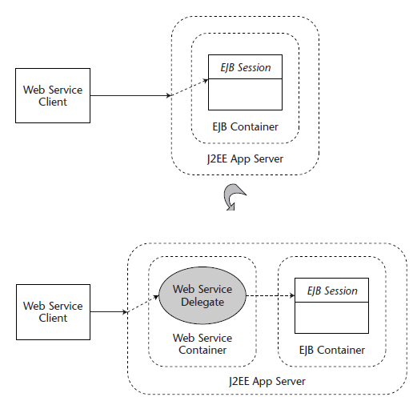

Distribution and Scaling
------------------------

-   a matter of planning ahead

## Plan Ahead

-   Plan ahead, looking at data and network architecture as a core piece of the design
-   Mechanics
    -   Look at in-memory data - When you have to up grade or fix a particular system, you will loose all of the data it has in memory. you need to have a mechanism for saving that data.
    -   Evaluate message persistence - Most JMS servers support various levels of persistence, messages will be safe if the JMS server is taken offline. make sure that your subscribers register correctly on startup
    -   Analyze the effect of shutting down applications - When one application is offline, it may have an effect on other applications. determine the shutdown and startup order
    -   Think about adding administrative signals - have administrative signals that are part of your design. Stop message.

## Choose the Right Data Architecture

-   Refactor your design to optimize the network architecture
-   Motivation
    -   three main data architectures
        -   you can pass data between applications in messages (passing everything to each node or application)
        -   database style design - each endpoint gets the minimum information in a message that tells it to go and get everything else it needs from a central database
        -   use a central server of some kind to store most of the data, and to have it pass data as needed to the other applications - Servlet coordenando EJBs

-   Mechanics
    -   List data requirements
    -   Map out data dependencies - services' clients
    -   Look for hubs that can capture and hold temporary data
    -   Look for your permanent data stores (DB or file)
    -   Analyze performance requirements - Putting data in messages reduces network hops, so it can make a solution fast, but it also increases your bandwidth. Using a database can increase or reduce traffic, depending on how much data each part of an application needs
    -   Assign your central controllers
    -   Look for places where you have already persisted the data - If the customer info goes to the database, then is used to validate other information, the other application elements can just get it from the database. **don’t have to pass it around**
    -   Look for places that message-based data works efficiently
        -   when you want to do notifications or synchronizations and you can trust the JMS server to hold the notification until you can process it
        -   when you have low data requirements and high performance requirements - minimize network hops

    -   Connect the remaining pieces - Look at your flow and figure out where these elements should get the data they need

## Partition Data and Work

-   Look for ways to partition the data and work. Break it on logical boundaries such as time and geography.
-   Motivation
    -   In a large project, there may be too much data to send through a single processor or database
    -   Process automation has some fundamental architecture issues that may make it hard to scale on a single machine
    -   Sometimes, you can solve the problem of data overload or processor performance using transparent load balancing and when it isn't an option, you may have to partition
        -   build in knowledge at the client level to manage the splitting up of the work

-   Mechanics
    -   Identify the overloaded application
        -   hub is a data storage application - partition data
        -   hub is a processor - partition the work

    -   Determine if you can scale the application directly - add hardware or use transparent load balancing?
    -   Look for an attribute, or axis, to partition on
        -   If the work is basic, you might be able to just split the data up randomly
        -   or you need to pick some metric for breaking up the work or data

    -   Think about partitioning in time - optimizing for one type of operation during the day and another at night
    -   Find the job foreman - someone that does the actual splitting
    -   Analyze the implications - Partitioning data has some very obvious implications
    -   Look at existing data - What if the existing data is in the form of messages in a durable subscribers queue? once you have a running system, you probably don’t want to start partitioning work in a way that you didn’t plan for. **easier and cheaper to solve with hardware**
    -   Plan ahead - might add a simple field to every message that is always the same by default, but that you can use later for partitioning

-   Example
    -   If you use JMS, you might think about using topics more than queues when sending messages to custom code, even for single-subscriber situations. This will allow you to add clients if necessary to handle messages

## Plan for Scaling (Enterprise-Scale Object Orientation)

-   Organize reusable code into reusable network components such as EJBs, JMS clients, and servlets
-   Mechanics
    -   Organize work into tiers
    -   Leverage JNDI and dynamic discovery (allows you to look up resources by a name or key) - similar to the separation of interface and implementation provided by OOP.
    -   Use EJBs and JMS destinations to hide work
        -   think of an EJB as an interface to an unspecified amount of work
        -   Any technology that goes over the network has the opportunity to work as an encapsulator for hiding implementation

-   Example
    -   **reusability is handled via the network, not libraries**

## Plan Realistic Network Requirements

-   The data for the deployed application may be very different from the data in tests. Plan realistic data from the beginning to avoid problems upon deployment
-   Motivation
    -   plan realistically for this bandwidth usage

-   Mechanics
    -   Build a realistic network map. Write down every network component and every connection - **Don’t forget round trips for request-reply messages**
    -   doublecheck your assumptions over time - Is the process using more bandwidth in the morning or at night?
    -   Determine data sizes. a database query may be very small, and the results very large
    -   Analyze technology requirements (JMS envelope, HTTP header, IIOP wrapper) - usually small, but think about them, and make some estimates
    -   Estimate latency times
    -   Identify unnecessary network hops - look at how to minimize network hops

## Use Specialized Networks

-   Your network is overloaded.
-   Create specialized networks for specific functionality.
-   Mechanics
    -   Identify network bottlenecks
    -   Look for clusters of machines that work together
    -   Analyze security requirements
    -   Talk to your network administrator

## Be Paranoid

-   Be more paranoid at the beginning. Plan for failure and build in reasonable solutions for it.
-   Motivation
    -   You can’t deploy applications and not be ready for the consequences of failure.

-   Mechanics
    -   Analyze network connections
    -   Analyze data storage
        -   How much disk space is available on the persistent servers such as JMS, the database, and so on?

    -   Build in monitoring
    -   Perform standard risk analysis
    -   Identify your highest risks

## Throw Hardware at the Problem

-   You have performance problems.
-   Buy more boxes and throw hardware at the problem.
-   Motivation
    -   can you use a grid to solve a processing problem, or do you have to get a mainframe

-   Mechanics
    -   Identify performance choke points
    -   Determine the possible hardware options - Can you just upgrade a computer to fix the problem? If so, that may be the cheapest path
    -   Rule out architectural solutions - maybe you can solve the problem purely with architecture. **it has a price too**.

Persistence
-----------

## Light Query

-   Your application must present large lists of shallow information items to its users and allow those users to select an item in order to reveal its detailed, deep information.
-   Use lightweight JDBC queries and scrollable result sets to select potentially vast numbers of shallow list items. Use an additional JDBC query or Entity Bean fetch to retrieve the deep information for a selected shallow item.
-   Mechanics
    -   locating instances of the application that uses deep queries to produce potentially large lists of information
    -   next use of a DTOFactory façade, which will use lightweight JDBC queries in order to generate the shallow lists

## Version

-   Your application must allow multiple users to update the same data, with thinktime, but must prevent updates from being trampled by stale data.
-   Use version numbers in the data components, underlying database, and any DTOs used to convey related information. Check version numbers for staleness before allowing any update to proceed.
-   Motivation
    -   If logical business transactions involve user think-time, they cannot be wrapped within a single, ACID transaction

-   Mechanics
    -   Determine the beans that must support an optimistic locking strategy within the application.
    -   Introduce versioning mechanisms into the entity layer - Add a version number attribute along with a version number column in their respective underlying tables
    -   Implement a method in each optimistic Entity Bean that atomically checks version numbers and throws an exception if these numbers do not match.
    -   Enforce version checking in the services layer - Implement the procedure of invoking the version-checking method prior to updating an optimistically locked Entity Bean

## Component View

-   Your application’s component object model was designed from a relational database perspective
-   Use solid object-oriented analysis and design principles to create an application object model
-   Motivation
    -   it is not uncommon to see database organizations that are charged with the responsibility of designing the enterprise component model - **a**

serious mistake

-   -   Such models often consider data without functionality
    -   a data-centric view often gives rise to components that are merely artifacts of relational database design

-   Mechanics
    -   Identify pseudocomponents
    -   Think OO and components

## Pack

-   Your database-intensive Java applications suffer from poor performance, yet your database and network resources are largely idle
-   Use data sources to encourage connection pooling and abstract driver details out of the application code.
-   Use batched SQL instructions to take advantage of any network bandwidth available between the application and database servers
-   Mechanics
    -   Switch to DataSources
    -   Use batched SQL statements

-   stored procedures
    -   severely hampers the portability of the application
    -   complicate application maintenance, because critical business logic is now implemented within the application and database servers

Service-Based Architecture
--------------------------

## Interface Partitioning

-   A service interface has methods, which cover multiple abstractions and business process areas.
-   Partition the interface into separate services to yield better, more usable abstractions.
-   Motivation
    -   A significant aspect that affects a service’s use and reuse is how correctly and completely the service supports its abstraction or concern

-   Mechanics
    -   examining the methods within a service interface, and determining which of those apply to the specific abstraction that the service is intended to support

## Interface Consolidation

-   An abstraction and related processes are scattered across a number of services.
-   Consolidate separate interface methods that support the same abstraction, to form a more cohesive, self-contained, and usable abstraction.
-   Motivation
    -   key benefit intended to accrue from the use of SBA is the ability to locate, understand, and use and reuse core business and technical functionality within a number of different end-user requirements and even separate applications.
    -   well-defined business service implements all the relevant processes associated with a specific business abstraction or entity
    -   it is inherently coupled to the attributes and properties of that entity
    -   **join together into one unit the parts of separate services that actually support a single abstraction**

-   Mechanics
    -   locate the methods across a set of services that support one specific abstraction or entity
    -   aggregate them together into a single service
    -   first examining the service and method names, because these often indicate related items
    -   all the services that interact with either the Order entity EJB or OrderDTO Data Transfer Object may actually be supporting the Order abstraction

## Technical Services Layer

-   A number of services contain duplicated implementations of common technical functions
-   Factor out the duplicated technical functions within the service implementations into an underlying layer of shared technical services
-   Motivation
    -   consequences
        -   greater overall development effort
        -   inconsistent behavior across different services
        -   significantly longer time to perform maintenance and enhancements to meet technical, nonfunctional requirements

-   Mechanics
    -   identify the duplicated common functionality across a set of services
    -   factor this out into another (usually technical) service or component

    1.  Review implementation classes of services to identify common or similar private or protected methods
    2.  Factor out the common code into new, technical service(s)
    3.  Refactor business services to remove any duplicated versions of these functions, and replace them with references to the new technical services

## Cross-Tier Refactoring

-   Nonfunctional requirements such as data validation are implemented in client code and not in the underlying service, resulting in an incomplete service when it is used by some other client.
-   Move the client-based functionality into the service so that it is truly complete and self-contained.
-   Motivation
    -   **common when SBA-based applications implement one client approach to start with**
    -   easier to bleed service functionality up into client components, because the overall system functionality is still complete

-   Mechanics
    -   to move or duplicate client-based implementation down into middle-tier services

    1.  Identify service-related functions that are currently implemented in client components
    2.  Refactor these methods down to an appropriate service

JSP Use and Misuse
------------------

## Beanify

-   You have code in your JSP that refers to data stored in the session
-   Encapsulate the data into a JavaBean and use jsp:useBean to access the data
-   Motivation
    -   business logic should not be embedded in the JSPs
    -   embedding code in the JSP diminishes maintainability and clouds the division of labor
    -   JSP is intended to provide the user interface and should get data from a model and not have to have any business logic embedded in it

-   Mechanics
    1.  Create a JavaBean to hold the data for the JSP. If you already have a bean you can reuse it.
    2.  Add an attribute to the bean for each unique key used in a session.setAttribute() or session.getAttribute() call
    3.  Add a jsp:useBean action to the JSP
    4.  Remove all calls to session.getAttribute() and replace with expression language statements
    5.  Remove all calls to session.setAttribute() - putting the data manipulation code into the delegate controller or replacing the setAttribute calls with jsp:setProperty tags

## Introduce Traffic Cop

-   You have several hrefs that explicitly name a JSP in your application. Furthermore, the links are conditional or in some other way dependent on application logic
-   Move the forwards and the condition checks out of the JSP and into a controller
-   Background
    -   navigational information in JSPs makes a Web site harder to maintain
    -   the way that users move through the site is spread out over all the JSPs instead of being maintained in one spot

-   Mechanics
    1.  Build a page transition diagram that depicts the links between your pages
    2.  Create a Servlet that will act as your Traffic Cop and will front the requests made to the application
    3.  Initialize this Traffic Cop with the navigational information captured earlier in your diagram
    4.  Name each of the arcs or lines between the pages - Action-oriented names work best
    5.  Replace any direct references to other JSPs with the names of the arcs - Look for jsp:include, jsp:forward, and/or href attributes
    6.  Move any conditional checks from the JSP into your Traffic Cop

## Introduce Delegate Controller

-   Your code to manage application flow is one big if/else if/else block and is impossible to maintain
-   Create specialized controllers that can be delegated to
-   Motivation
    -   Even if the system is not that big there can be an unmanageable amount of code in the doGet and doPost methods on the Traffic Cop

-   Mechanics
    1.  Define an interface with a single method that will perform the delegated behavior
    2.  Build a delegate controller that implements the interface for each conditional statement in the main method of the Traffic Cop
    3.  Copy the code from the conditional branch into the body of the newly defined method
    4.  Add a Map instance variable to the Traffic Cop to hold the group of delegate controllers
    5.  Create an instance of the newly defined controller in the init method and add it to the map
    6.  Replace the code in the Traffic Cop in the body of the conditional with a call to the delegate controller

## Introduce Template

-   You have copied and pasted pieces of JSP code into many different JSPs
-   Introduce reusable pieces of JSP and include them instead of copying and pasting the code
-   Mechanics
    1.  Identify the sections of your user interface that you want to be common
    2.  Identify pages that currently implement these pieces of the UI
    3.  Move the common pieces into their own files
    4.  Identify the simplest page that can use the templates and start there
    5.  Remove the code that implements the common piece from the JSP
    6.  Include the template in the JSP. Use jsp:include or the JSTL import tag

## Remove Session Access

-   You have code in your tag that uses the session to access data
-   Change the tag so that the required data is passed in as a parameter
-   Motivation
    -   Accessing data stored in the session from your TagLib causes maintenance headaches and often leads to unintended consequences when the data in the session changes
    -   Having the tag use data directly from the session also inhibits reuse of the tag

-   Mechanics
    1.  Identify the data that is being accessed through the session
    2.  Add an attribute to your tag for each piece of data
    3.  Update your JSP to pass in the required data

## Remove Template Text

-   You have code that merely writes out large amounts of template text
-   Move the template text back into the JSP and have the tag build only the HTML that involves calculations or other programming tasks
-   Motivation
    -   it is best to leave template text out of the tag and in the JSP

-   Mechanics
    1.  Identify the template text that can be moved
    2.  Put the template text into all the JSPs that invoke this tag
    3.  Remove the code from the tag that was generating the template text

Entity Beans
------------

## Alias

-   Code makes explicit references to the actual JNDI locations of EJBs and services
-   Use EJB References to introduce a level of abstraction between the code and desired EJBs and services so that the actual location of these dependents can be specified at deployment time
-   Motivation
    -   Hard-coding references to EJBs will introduce brittleness to an application

-   Mechanics
    1.  Determine and list the EJBs and services upon which a given application component depends
    2.  Replace explicit, hard-coded links to dependent EJBs and services with aliases or EJB References
    3.  Modify deployment descriptors - Each component that uses an EJB Reference must contain a deployment descriptor definition that provides additional information about the reference

## Exodus

-   Entity Beans are held responsible for manipulating view-based, custom data transfer object (DTO) classes
-   Move DTO manipulations out of the Entity Beans and into special DTO Factory classes, which can operate within the higher-order service layer
-   Mechanics
    1.  Create a DTO Factory class or a Session Bean within the service layer
    2.  Remove DTO dependencies from the entity layer

Session EJBs
------------

## Session Façade

-   A client remotely invokes many attribute-level accessors and mutators on an Entity Bean, resulting in a chatty interaction that exhibits poor performance
-   Introduce a session as a façade over the entity, and aggregate the fine-grained attribute accessors into a single, coarse-grained method, reducing the network interactions and improving performance
-   Motivation
    -   reduce the number of remote method invocations between remote clients and server-side components, improving performance
    -   create subsystem layering, implementing coarse-grained methods that aggregate and coordinate interactions with finer-grained process components (sessions, entities, or POJOs) to implement business logic and workflow
    -   creates simpler interfaces for clients to use, and encapsulates the sequencing and workflow steps associated with a business process within a session method

-   Mechanics
    1.  Determine the coarse-grained process(es) that the Session façade should implement
    2.  Refactor the Session façade to implement the coarse-grained process
    3.  Refactor the client(s) to use the new, coarse-grained Session façade method
    4.  Remove the fine-grained methods from the Session façade

## Split Large Transaction

-   Atransactional session method enlists many other transactional resources, and executes a lengthy, coarse-grained process, resulting in poor performance and transaction timeouts at higher loads
-   Split the large transactional method into a number of smaller transactions, and refactor clients to invoke these methods separately.
-   Motivation
    -   reduce issues of performance and deadlock that result from having large transactions that lock many shared resources over significant amounts of time
    -   to create smaller, more manageable and encapsulated processes that each can be executed in a single invocation step, and allow reimplementation using Stateless Session Beans, which are more scalable

-   Mechanics
    1.  Refactor the LargeTransaction method into a nontransactional equivalent - changing the transactional attribute value to NotSupported
    2.  Refactor all the subordinate transactional steps into transactional session methods, for example, using a transactional attribute value of Required or RequiresNew
    3.  Add code to handle transaction monitoring to catch failures and rollbacks emitted from individual steps
    4.  Add code to implement compensating actions when transactional subprocesses fail - The actual compensating action is dependent on the business process being executed. In most cases, it involves recording information about before and after values, utilizing a set of business rules to determine what the compensating action should be, and computing the compensating value to use based on those previously recorded values

Message-Driven Beans
--------------------

## Architect the Solution

-   JMS decouples the sender and receiver, but this can lead to poor planning
-   You can't think just of the endpoints of a JMS solution, you have to think about the entire solution, including the network and JMS provider
-   Motivation
    -   developers think about individual components in a J2EE solution often ignore the supporting roles played by JMS providers, application servers, databases,

and other middleware

-   -   **In doing so, it is easy for the developer to overimplement or underimplement their code**

-   Mechanics
    1.  Draw a network map - Include in the map all of the endpoints, all of the edges, and all of the middleware that gets you from one endpoint to another
    2.  Analyze reliability requirements - For each edge in the system, think about what kind of persistence it needs.
    3.  Evaluate technology features - JMS is not a truly synchronous communication scheme
    4.  Select technology features
    5.  Feed information about the edges into the nodes - If you mark all of the edges in your network map persistence and say that they all use JMS, then you need to take this into account at the endpoints. The endpoints shouldn’t need much persistence code or reliability. They should, however, handle duplicate messages and acknowledge messages appropriately
    6.  Look at the data model

## Plan Your Network Data Model

-   Your network is overrun with data from your JMS.
-   Plan for the actual use cases.
-   Motivation
    -   One of the key elements of your architecture will be the set of messages you will be sending
    -   Messages for message-driven beans are the primary data-transfer mechanism
    -   building a set of messages that can be extended and improved, and that also have room for new endpoints and messages to be added easily and reliably

-   Mechanics
    1.  Consider a common data model - When you are in a situation where there are multiple representations of the same data, such as a customer or invoice, you should consider making a common data model to use on the network
    2.  Think about administrative messages - informing the various message beans that they need to shut down or stop message processing **poison message**.
    3.  Plan for filtering - provide selectors to help identify administrative messages. Do you have to read an entire message to filter it or are there shortcuts?
    4.  Think about bandwidth
    5.  Build tools - Example: the message hospital, designed to fix or handle bad messages
    6.  Analyze security concerns - Data may be encrypted, obfuscated, signed, or marked in some other way for security reasons

## Leverage All Forms of EJBs

-   You only use session beans
-   Use all types of beans appropriate for the problem you are trying to solve
-   Motivation
    -   Message-driven beans are generally restricted to a single destination - it can limit you when you have multiple message formats
    -   MDBs require a JMS provider - a potential problem when you need to communicate with an enterprise bean from a non-Java application
    -   MDBs are also nonpersistent, unlike entity beans that represent application data
    -   **a great J2EE solution probably can't restrict itself to one type of Enterprise Bean**

-   Mechanics
    1.  Consider why you are using MDBs - if you start from scratch and just need to make requests from a custom client to an EJB, you may be better off with a Session Bean that relies on a more synchronous, less heavy protocol. Message beans require the JMS provider, while Session Beans do not.
    2.  Look for overloaded destinations - when you have multiple messages that need to use the same business logic, implement the messaging with message-driven beans that call Session and Entity Beans to perform the logic. This allows each message bean a unique destination with a simple data model, without duplicating code.
    3.  Look for data persistence - Beans that represent or store data are often best implemented as Entity Beans rather than message-driven beans with custom persistence code.

Web Services
------------

## RPC to Document Style

-   A synchronous RPC-style Web Service operation implements a CRUD-type operation with a lot of parameters, custom types, and/or SOAP document fragments, leading to significant implementation effort, problems related to unmarshaling of complex types, and poor performance due to heavy synchronous interactions
-   Change the Web Service definition to document style, and translate the data exchange to an XML document and asynchronous message delivery
-   Motivation
    -   RPC style is intended for method invocation, whereas document style is intended for B2B document exchanges
    -   use of the document-style exchange model is motivated by several issues
        1.  the RPC-style model defines a specific interface with arguments, types, and so on. As changes occur, this interface changes, and clients that are coupled to it need to be updated or they break. Document style always just passes a document, so the actual mechanical interface doesn’t change, just the content of the document itself
        2.  validation of the data being sent or received is easier with XML documents, because a validating XML parser can quickly attempt to parse them and determine where any parts of the document violate the associated XML schema
        3.  actions can be included in the document itself, enabling content-based processing, and removing the specific action or handling indicator from the SOAP header itself. When actions are added or changed, only the content of the document and the back-end handlers change, not the mechanisms that generate or parse the SOAP headers

-   Mechanics
    1.  Define an XML schema for the document - needs to include all the attributes that were being passed as parameters. Publish the XML schema to a network-accessible location
    2.  Make WSDL changes
    3.  Make service endpoint changes
    4.  Make service client changes (for each client)

## Web Service Business Delegate

-   J2EE system components (servlets, Session EJBs) are used as the underlying implementation for a Web Service, containing the core business logic of the system. However, those components are coupled to Web-Service-specific tasks and data types (for example, SOAP, XML, JAX-RPC), severely limiting the reuse of that business logic by other clients
-   Interject an adaptor component between the Web Service container handler servlet and the underlying business logic component to decouple the business logic component from the Web Service tier and allow it to be reused by a variety of clients

-   Motivation
    -   Business process logic should generally not be coupled to any particular client-tier mechanism, because of the concrete or likely future goal of utilizing that logic for different client types, and so on
    -   to support content-based processing and dispatching. Having an intermediary delegate class provides a convenient place to implement general-purpose content-based dispatching

-   Mechanics
    -   Define a new servlet class to be the handler for the Web Service
    -   Create a servlet implementation to perform Web Service-related processing
    -   Create a servlet implementation to convert Web-Services-specific data types to types applicable for middle-tier Session Beans

J2EE Services
-------------

## Parameterize Your Solution

-   Your application has hard-coded location identifiers
-   Use parameters and JNI to make your solution more dynamic
-   Motivation
    -   Most J2EE projects are developed in one environment and deployed in a different one
    -   Changing code is hazardous because it opens up an opportunity for the introduction of errors

-   Mechanics
    1.  Identify strings that are hard-coded
    2.  Use JNDI
    3.  Leverage existing parameter-passing schemes
    4.  Build custom schemes when necessary

## Fully Leverage J2EE Technologies

-   You have code to handle load balancing and fault tolerance
-   Leverage application servers for the hard-coding
-   Motivation
    -   When you write custom code to handle something you could use off-the-shelf, you are throwing away a lot of work

-   Mechanics
    -   **you have to make a decision to trust your J2EE vendor's code**

    1.  Can your server be an EJB or a set of EJBs?
    2.  Can your server be implemented as a servlet?
    3.  Can your server be load balanced?
