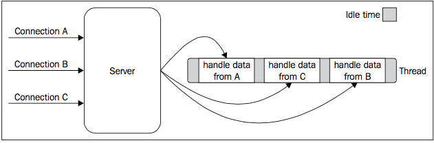
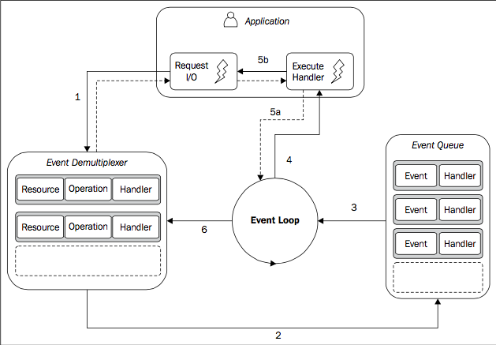

# Node.js Design Fundamentals

* Some principles and design patterns literally define the Node.js platform and its
ecosystem
    * the most peculiar ones are probably its asynchronous nature and its programming style that makes heavy use of callbacks
* However, there are other fundamental components that characterize the platform;
    * for example, its module system, which allows multiple versions of the same dependency to coexist in an application
    * and the observer pattern, implemented by the `EventEmitter` class, which perfectly complements callbacks when dealing with asynchronous code.

## The Node.js philosophy

### Small core

* The Node.js core itself has its foundations built on a few principles
* one of these is, having the smallest set of functionality, leaving the rest to the so-called **userland (or userspace)**
    * the ecosystem of modules living outside the core

### Small modules

* Node.js uses the concept of module as a fundamental mean to structure the code of a program. It is the brick for creating applications and reusable libraries called packages
* In Node.js, one of the most evangelized principles is to design small modules, not only in terms of code size, but most importantly in terms of scope.
* This principle has its roots in the Unix philosophy, particularly in two of its precepts, which are as follows:
    * "Small is beautiful."
    * "Make each program do one thing well."
* Node.js helps solving the dependency hell problem by making sure that each installed package will have its own separate set of dependencies
    * thus enabling a program to depend on a lot of packages without incurring in conflicts

### Small surface area

* Node.js modules usually also have the characteristic of exposing only a minimal set of functionality
* The main advantage here is an increased usability of the API, which means that the API becomes clearer to use and is less exposed to erroneous usage.
* a very common pattern for defining modules is to expose only one piece of functionality, such as a function or a constructor, while letting more advanced aspects or secondary features become properties of the exported function or constructor
* **modules are created to be used rather than extended**

### Simplicity and pragmatism

* Designing a simple, as opposed to a perfect, feature-full software, is a good practice for several reasons
    * it takes less effort to implement
    * allows faster shipping with less resources
    * is easier to adapt
    * is easier to maintain and understand

## The reactor pattern

* the heart of the Node.js asynchronous nature

### I/O is slow

* I/O is usually not expensive in terms of CPU, but it adds a delay between the moment the request is sent and the moment the operation completes

### Blocking I/O

* In traditional blocking I/O programming, the function call corresponding to an I/O request will block the execution of the thread until the operation completes.
* a web server that is implemented using blocking I/O will not be able to handle multiple connections in the same thread
    * each I/O operation on a socket will block the processing of any other connection
* For this reason, the traditional approach to handle concurrency in web servers is to kick off a thread or a process (or to reuse one taken from a pool) for each concurrent connection that needs to be handled
* Unfortunately, a thread is not cheap in terms of system resources, it consumes memory and causes context switches
    * so having a long running thread for each connection and not using it for most of the time, is not the best compromise in terms of efficiency.

### Non-blocking I/O

* In this operating mode, the system call **always returns immediately without waiting for the data to be read or written**
    * If no results are available at the moment of the call, the function will simply return a predefined constant, indicating that there is no data available to return at that moment.
* The most basic pattern for accessing this kind of non-blocking I/O is to actively poll the resource within a loop until some actual data is returned; this is called **busy-waiting**
    * the loop will consume precious CPU only for iterating over resources that are unavailable most of the time
    * Polling algorithms usually result in a huge amount of wasted CPU time

### Event demultiplexing

* modern operating systems provide a native mechanism to handle concurrent, non-blocking resources in an efficient way
* this mechanism is called **synchronous event demultiplexer** or **event notification interface**
    * This component collects and queues I/O events that come from a set of watched resources, and block until new events are available to process

```js
//### PSEUDOCODE
socketA, pipeB;
watchedList.add(socketA, FOR_READ); //[1]
watchedList.add(pipeB, FOR_READ);
while (events = demultiplexer.watch(watchedList)) { //[2]
    //event loop
    foreach (event in events) { //[3]
       //This read will never block and will always return data
       data = event.resource.read();
       if (data === RESOURCE_CLOSED) {
           //the resource was closed, remove it from the watched list
           demultiplexer.unwatch(event.resource);
       } else {
           //some actual data was received, process it
           consumeData(data);
       }
   }
}
```

1. The resources are added to a data structure, associating each one of them with a specific operation, in our example a read.
2. The event notifier is set up with the group of resources to be watched. This call is synchronous and blocks until any of the watched resources is ready for a read. When this occurs, the event demultiplexer returns from the call and a new set of events is available to be processed.
3. Each event returned by the event demultiplexer is processed. At this point, the resource associated with each event is guaranteed to be ready to read and to not block during the operation. When all the events are processed, the flow will block again on the event demultiplexer until new events are again available to be processed. This is called the **event loop**.



* with this pattern, we can now handle several I/O operations inside a single thread, without using a busy-waiting technique
* the previous image helps us understand how concurrency works in a single-threaded application using a synchronous event demultiplexer and non-blocking I/O
    * The tasks are spread over time, instead of being spread across multiple threads. This has the clear advantage of minimizing the total idle time of the thread
    * To have only a single thread has a beneficial impact on the way programmers approach concurrency in general. The absence of in-process race conditions and multiple threads to synchronize allows us to use much simpler concurrency strategies.


### The reactor pattern

* The reactor pattern is a specialization of the event demultiplexing algorithm
* The main idea behind it is to have a handler (which in Node.js is represented by a `callback` function) associated with each I/O operation, which will be invoked as soon as an event is produced and processed by the event loop
* **Pattern (reactor): handles I/O by blocking until new events are available from a set of observed resources, and then reacting by dispatching each event to an associated handler.**



1. The application generates a new I/O operation by submitting a request to the Event Demultiplexer. The application also specifies a handler, which will be invoked when the operation completes. Submitting a new request to the Event Demultiplexer is a non-blocking call and it immediately returns the control back to the application.
2. When a set of I/O operations completes, the Event Demultiplexer pushes the new events into the **Event Queue**
3. At this point, the Event Loop iterates over the items of the Event Queue
4. For each event, the associated handler is invoked
5. The handler, which is part of the application code, will give back the control to the Event Loop when its execution completes (**5a**). However, new asynchronous operations might be requested during the execution of the handler (**5b**), causing new operations to be inserted in the Event Demultiplexer (**1**), before the control is given back to the Event Loop.
6. **When all the items in the Event Queue are processed, the loop will block again on the Event Demultiplexer which will then trigger another cycle**

### The non-blocking I/O engine of Node.js – libuv

* Node.js core team created a C library called [libuv](http://nikhilm.github.io/uvbook/), with the objective to make Node.js compatible with all the major platforms and normalize the non-blocking behavior of the different types of resource
    * libuv today represents the low-level I/O engine of Node.js

## The callback pattern

* Callbacks are functions that are invoked to propagate the result of an operation
and this is exactly what we need when dealing with asynchronous operations.
    * They practically replace the use of the return instruction that, as we know, always executes synchronously
* [closures](https://developer.mozilla.org/pt-BR/docs/Web/JavaScript/Guide/Closures) are an ideal construct for implementing callbacks
    * With closures, we can in fact reference the environment in which a function was created
    * we can always maintain the context in which the asynchronous operation was requested, no matter when or where its callback is invoked.

### The continuation-passing style

* In JavaScript, a callback is a function that is passed as an argument to another
function and is invoked with the result when the operation completes.
    * called **continuation-passing style**
    * it simply indicates that a result is propagated by passing it to another function (the callback), instead of directly returning it to the caller.

#### Synchronous continuation-passing style

### Synchronous or asynchronous?

### Node.js callback conventions
