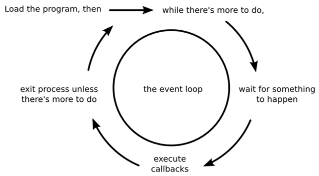
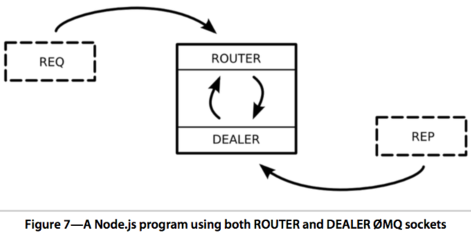
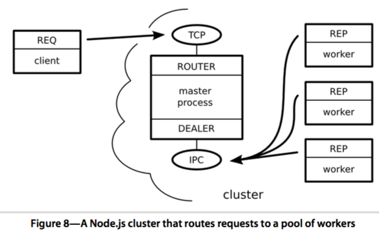

# Getting Started

## How Node Applications Work

* Node.js couples JavaScript with an event loop for quickly dispatching operations when events occur.
* Node's philosophy is to give you low-level access to the event loop and to system resources.



* As long as there's something left to do, Node's event loop will keep spinning. Whenever an event occurs, Node invokes any callbacks (event handlers) that are listening for that event.
* **Any number of callbacks can respond to any event, but only one callback function will ever be executing at any time.**
    * Your application code will never be executed at the same time as anything else. It will always have the full attention of Node's JavaScript engine while it's running.
    * Node is a single-threaded environment. At most, only one line of your code will ever be executing at any time.


# Wrangling the File System

### Watching a File for Changes

**file-system/watcher.js**

[file-system/watcher.js](the_right_way_code/file-system/watcher.js)

* Launch the watcher program using node, like so: `$ node --harmony watcher.js`

### Reading Command-Line Arguments

* This program uses `process.argv` to access the incoming command-line arguments.
`argv` stands for argument vector; it's an array containing node and the full path to the `watcher-argv.js` as its first two elements.
The third element (that is, at index 2) is target.txt, the name of our target file.
* Any unhandled exception thrown in Node will halt the process. The exception output shows the offending file, and the line number and position of the exception.

[file-system/watcher-argv.js](the_right_way_code/file-system/watcher-argv.js)

## Spawning a Child Process

[file-system/watcher-spawn.js](the_right_way_code/file-system/watcher-spawn.js)

* Strict mode was introduced in ECMAScript version 5
    * it disables certain problematic JavaScript language features and makes others throw exceptions.
    * Generally speaking, it's a good idea to use strict mode.

* Strict mode is also required to use certain ECMAScript Harmony features in Node,
* `let` declares a variable, but a variable declared with `let` can be assigned a value more than once.
* by using Harmony features (like `let`), your code will require the `--harmony` flag until these features become enabled by default.
* The first parameter to `spawn()` is the name of the program we wish to execute
    * The second parameter is an array of command-line arguments. It contains the flags and the target file name.
    * The object returned by `spawn()` is a [ChildProcess]("http://nodejs.org/api/child_process.html"). Its stdin, stdout, and stderr properties are Streams that can be used to read or write data.
    * the `pipe()` method sends the standard output from the child process directly to our own standard output stream.

## Capturing Data from an EventEmitter

* [EventEmitter]("http://nodejs.org/api/events.html") provides a channel for events to be dispatched and listeners notified.
    * Many objects -- like Streams -- inherit from EventEmitter
* let's modify our previous program to capture the child process's output by listening for events on the stream

[file-system/watcher-spawn-parse.js](the_right_way_code/file-system/watcher-spawn-parse.js)

* The `on()` method adds a listener for the specified event type.
    * **We listen for data events because we're interested in data coming out of the stream.**
    * Events can send along extra information, which arrives in the form of parameters to the callbacks.
    * Data events in particular pass along a [buffer]("http://nodejs.org/api/buffer.html") object.

## Reading and Writing Files Asynchronously

* two common error-handling patterns in Node
    * error events on EventEmitters
    * and err callback arguments

[file-system/read-simple.js](the_right_way_code/file-system/read-simple.js)

`$ node --harmony read-simple.js`

* If `readFile()` is successful, then err will be false
    * Otherwise the err parameter will contain an Error object
    * This is a common error-reporting pattern in Node, especially for built-in modules

[file-system/write-simple.js](the_right_way_code/file-system/write-simple.js)

`$ node --harmony write-simple.js`

### Creating Read and Write Streams

* You create
    * a read stream by using `fs.createReadStream()`
    * a write stream by using `fs.createWriteStream()`

[file-system/cat.js](the_right_way_code/file-system/cat.js)


* The `require()` function returns a module object, so we can call methods on it directly
* You can also listen for data events from the file stream instead of calling `pipe()`.

[file-system/read-stream.js](the_right_way_code/file-system/read-stream.js)

* When working with an EventEmitter, the way to handle errors is to listen for error events.
* If you don’t listen for error events, but one happens anyway, Node will throw an exception.
    * And as we saw before, an uncaught exception will cause the process to terminate.

### Blocking the Event Loop with Synchronous File Access

* The file-access methods we've discussed in this chapter so far are asynchronous
    * They perform their I/O duties - waiting as necessary - completely in the background, only to invoke callbacks later.
    * This is by far the preferred way to do I/O in Node
* many of the methods in the `fs` module have synchronous versions as well.
    * These end in `*Sync`, like `readFileSync()`
* When you use the `*Sync` methods, the Node.js process **will block until the I/O finishes**
    * Node won’t execute any other code, won’t trigger any callbacks, won’t process any events, won’t accept any connections
    * It'll just sit there indefinitely waiting for the operation to complete.
    * synchronous methods are simpler to use since they lack the callback step. They either return successfully or throw an exception, without the need for a callback function.

```js
const
    fs = require('fs'),
    data = fs.readFileSync('target.txt');
process.stdout.write(data.toString());
```

### Performing Other File-System Operations

* The `fs` module has many other methods that map nicely onto POSIX conventions.
* To name a few examples
    * you can `copy()` files and `unlink()` (delete) them.
    * You can use `chmod()` to change permissions and `mkdir()` to create directories.
* They’re all asynchronous by default, but many come with equivalent `*Sync` versions.

## The Two Phases of a Node Program

* To understand when it's OK to use synchronous file-access methods, you can think of Node programs as having two phases.
* In the initialization phase, the program is getting set up, bringing in libraries, reading configuration parameters, and doing other mission-critical tasks. If something goes wrong at this early stage, not much can be done, and it’s best to fail fast.
    * **The only time you should consider synchronous file access is during the initialization phase of your program.**

# Networking with Sockets

## Listening for Socket Connections

* Networked services exist to do two things: connect endpoints and transmit information between them
* No matter what kind of information is transmitted, a connection must first be made.

### Binding a Server to a TCP Port

* In Node.js, the bind and connect operations are provided by the net module.

```js
"use strict"
const
    net = require('net'),
    server = net.createServer(function(connection) {
        //use connection object for data transfer
    });
    server.listen(5432);
```

* Node invokes the callback function whenever another endpoint connects
* The connection parameter is a Socket object that you can use to send or receive data.

### Writing Data to a Socket

[networking/net-watcher.js](the_right_way_code/networking/net-watcher.js)

### Listening on Unix Sockets

`client: nc -U /tmp/watcher.sock`

[networking/net-watcher-unix-sockets.js](the_right_way_code/networking/net-watcher-unix-sockets.js)

* Unix sockets can be faster than TCP sockets because they don’t require invoking network hardware. However, they’re local to the machine.

## Implementing a Messaging Protocol

### Switching to JSON Messages

* use `JSON.stringify()` to encode message objects and send them out through `connection.write()`


```js
//...
connection.write(JSON.stringify({
    type: 'watching',
    file: filename
}) + '\n');
//...
connection.write(JSON.stringify({
    type: 'changed',
    file: filename,
    timestamp: Date.now()
}) + '\n');
//...
```

### Creating Socket Client Connections

* a client program in Node to receive JSON messages from our `net-watcher-json-service` program

[networking/net-watcher-json-client.js](the_right_way_code/networking/net-watcher-json-client.js)

## Testing Network Application Functionality

### Understanding the Message-Boundary Problem

* When you develop networked programs in Node, they'll often communicate by passing messages.
* In the best case, a message will arrive all at once
    * sometimes messages will arrive in pieces, split into distinct data events.
    * To develop networked applications, you'll need to deal with these splits when they happen.
* In the previous example, each line of output corresponds to a single data event in the connected client, i.e, the data event boundaries exactly match up with the message boundaries.
* Consider what would happen if a message were split down the middle, and arrived as two separate data events
    * Such a split could easily happen in the wild, especially for large messages.

### Implementing a Test Service

* Writing robust Node applications means gracefully handling network problems like split inputs, broken connections, and bad data.

[networking/net-watcher-json-test-service.js](the_right_way_code/networking/net-watcher-json-test-service.js)

* The JavaScript function `setTimeout()` takes two parameters: a function to invoke and an amount of time in milliseconds. After the specified amount of time, the function will be called.
* Finally, whenever the connection ends, we use `clearTimeout()` to unschedule the callback.
    * Unscheduling the callback is necessary since it would fail if it were to execute.
    * After the connection has closed, any calls to `connection.write()` will trigger error events.

* what happens when we connect with the client program?
    * **Unexpected end of input**
    * The error tells us that the message was not complete and valid JSON.

## Extending Core Classes in Custom Modules

* The client program has two jobs to do
    * One is to buffer incoming data into messages
    * The other is to handle each message when it arrives.
* Rather than cramming both of these jobs into one Node program, the right thing to do is to turn at least one of them into a Node module.
    * **create a module that handles the input-buffering piece so that the main program can reliably get full messages.**

### Extending EventEmitter

#### Inheritance in Node

**networking/ldj.js**

```js
//The following code sets up LDJClient to inherit from EventEmitter
const
    events = require('events'),
    util = require('util'),
    //client constructor
    LDJClient = function (stream) {
        events.EventEmitter.call(this);
    };
util.inherits(LDJClient, events.EventEmitter);
```

* LDJClient is a constructor function, which means other code should call new `LDJClient(stream)` to get an instance.
* The stream parameter is an object that emits data events, such as a Socket connection.
* Inside the constructor function, we call the EventEmitter constructor on `this`.
    * That line of code is roughly equivalent to calling `super()` in languages with classical inheritance.
* we call `util.inherits()` to make LDJClient's prototypal parent object the EventEmitter prototype.
    * equivalent of **"class LDJClient inherits from EventEmitter"**
* There are other ways to do inheritance in JavaScript, but this is how Node.js's own modules are structured.
* Code to use LDJClient might look like this:

```js
const client = new LDJClient(networkStream);
client.on('message', function(message) {
  // take action for this message
});
```

* Even though the client object doesn't have an `on()` method directly, its prototypal grandparent, EventEmitter, does.

#### Buffering Data Events

* The goal is to take the incoming raw data from the stream and convert it into `message` events containing the parsed message objects.
* The updated constructor function appends incoming data chunks to a running buffer string and scans for line endings (which should be JSON message boundaries).

```js
LDJClient = function (stream) {
    events.EventEmitter.call(this);
    let self = this,
        buffer = '';
    stream.on('data', function(data) {
        buffer += data;
        let boundary = buffer.indexOf('\n');
        while (boundary !== -1) {
            let input = buffer.substr(0, boundary);
            buffer = buffer.substr(boundary + 1);
            self.emit('message', JSON.parse(input));
            boundary = buffer.indexOf('\n');
        }
    });
};
```

* In JavaScript, the value of `this` is assigned inside each function when it is invoked, at runtime.
    * The value of `this` is not tightly bound to any particular object like in classical languages. It’s more like a special variable.
* Setting a separate variable (`self`) to the same value guarantees that we're referring to the correct object inside our data event handler.
* Inside the data event handler, we append raw data to the end of the buffer and then pull completed messages off the front.

#### Exporting Functionality in a Module

[networking/ldj.js](the_right_way_code/networking/ldj.js)

* In a Node module, the `exports` object is the bridge between the module code and the outside world.
    * Any properties you set on `exports` will be available to code that pulls in the module.
* we export the LDJClient constructor function and a convenience method called `connect()`. This method makes it a little easier for upstream code to create an LDJClient instance.
* Code to use the LDJ module will look something like the following.
* When a path is provided to `require()`, it will attempt to resolve the path relative to the current file.

```js
const
    ldj = require('./ldj.js'),
    client = ldj.connect(networkStream);

client.on('message', function(message) {
    // take action for this message
});
```

#### Importing a Custom Node Module

* instead of sending data buffers directly to `JSON.parse()`, this program relies on the ldj module to produce `message` events.

[networking/net-watcher-ldj-client.js](the_right_way_code/networking/net-watcher-ldj-client.js)

## Wrapping up

* The LDJClient takes care of two separable concerns: splitting incoming data into lines, and parsing lines as JSON.
    * How would you further separate LDJClient into two modules, one for each of these concerns?

# Robust Messaging Services

## Importing External Modules with npm

* Modules managed by npm can be pure JavaScript or a combination of JavaScript and native addon code.
    * Addons are dynamically linked shared objects - they provide the glue for working with native libraries written in C or C++.

### Installing the ZMQ Base Library

[Install ZMQ guide](https://github.com/jaeheum/qzmq/blob/master/how-to-install-zeromq-czmq.md)

* http://brew.sh/

```sh
ruby -e "$(curl -fsSL https://raw.githubusercontent.com/Homebrew/install/master/install)"
brew install zmq
```

### Installing the zmq Node Module

```sh
mkdir ~/Devel/nodejs/messaging
cd ~/Devel/nodejs/messaging
brew install pkg-config
npm install zmq

#testing it
node --harmony -p -e 'require("zmq")'
```

## Message-Publishing and Subscribing

### Publishing Messages over TCP

[messaging/zmq-watcher-pub.js](the_right_way_code/messaging/zmq-watcher-pub.js)

* instead of requiring the `net` module, now we’re requiring `zmq`. We use it to create a publisher endpoint by calling `zmq.socket('pub')`
* we have only one call to `fs.watch()`
    * we have just one file-system watcher, which invokes the publisher's `send()` method

`node --harmony zmq-watcher-pub.js target.txt`

### Subscribing to a Publisher

[messaging/zmq-watcher-sub.js](the_right_way_code/messaging/zmq-watcher-sub.js)

* Calling `subscriber.subscribe("")` tells ZMQ that we want to receive all messages.
    * If you only want certain messages, you can provide a string that acts as a prefix filter.
    * You must call `subscribe()` at some point in your code - you won't receive any messages until you do.
* The subscriber object inherits from `EventEmitter`.
    * It emits a message event whenever it receives one from a publisher, so we use `subscriber.on()` to listen for them.
    * Lastly, we use `subscriber.connect()` to establish the client end of the connection.

### Automatically Reconnecting Endpoints

* Our code had the publisher bind a TCP socket (as the server) and the subscriber connect (as the client), but ZMQ doesn’t force you to do it this way. We could have flipped it around and had the subscriber bind a socket to which the publisher connects.
* When you design a networked application, you’ll typically have the stable parts of your architecture bind and have the transient parts connect to them.
    * With ZMQ, you get to decide which parts of your system will be stable, and you get to decide which messaging pattern best suits your needs.

## Responding to Requests

* In ZMQ, a REQ/REP pair communicates in lockstep
    * A request comes in, then a reply goes out
    * Additional incoming requests are queued and later dispatched by ZMQ
    * Your application, however, is only aware of one request at a time.

### Implementing a Responder

* a responder waits for a request for file data, then serves up the content when asked. We’ll start with the responder -- the REP (reply) part of the REQ/REP pair.

[messaging/zmq-filer-rep.js](the_right_way_code/messaging/zmq-filer-rep.js)

* When a message event happens
    * We parse out the request from the raw data
    * Next we call `fs.readFile()` to asynchronously retrieve the requested file's content
    * When it arrives, we use the responder's `send()` method to reply with a JSON serialized response, including the file content and a timestamp
    * We also include the process ID (pid) of the Node process in the response
* The responder binds to TCP port 5433 of the loopback interface (IP 127.0.0.1) to wait for connections. This makes the responder the stable endpoint of the REP/REQ pair.

### Issuing Requests

[messaging/zmq-filer-req.js](the_right_way_code/messaging/zmq-filer-req.js)

### Trading Synchronicity for Scale

* There is a catch to using ZMQ REP/REQ socket pairs with Node.
    * **Each endpoint of the application operates on only one request or one response at a time. There is no parallelism.**

[messaging/zmq-filer-req-loop.js](the_right_way_code/messaging/zmq-filer-req-loop.js)

* We see that the loop queued three requests, and then we received three responses.
* The responder program sent a response to each request before even becoming aware of the next queued request.
    * **This means Node's event loop was left spinning while the `fs.readFile()` for each request was being processed.**
    * For this reason, a simple REQ/REP pair is probably not going to suit your high-performance Node.js needs.

## Routing and Dealing Messages

* The REQ/REP socket pair makes request/reply logic easy to code by operating sequentially
    * A given requester or responder will only ever be aware of one message at a time
* **For parallel message processing, ZMQ includes the more advanced socket types ROUTER and DEALER.**

### Routing Messages

* You can think of a `ROUTER` socket as a **parallel REP socket**
    * Rather than replying to only one message at a time, a ROUTER socket can handle many requests simultaneously
    * It remembers which connection each request came from and will route reply messages accordingly
* ZMQ uses the ZeroMQ Message Transport Protocol for exchanging messages
    * This protocol uses a sequence of low-overhead frames to compose messages
    * A ROUTER socket uses these frames to route each reply message back to the connection that issued the request.
* Most of the time your Node programs can ignore the underlying details of ZMQ frames because the simpler socket types only need one frame per message
    * **But the ROUTER socket type uses multiple frames.**

```js
const
    zmq = require('zmq'),
    router = zmq.socket('router');

router.on('message', function() {
    let frames = Array.prototype.slice.call(null, arguments);
    // ...
});
```

* The arguments object inside a function is an array-like object that contains all the arguments that were passed in. Using `Array.prototype.slice.call(null, arguments)` returns a real JavaScript Array instance with the same contents.

### Dealing Messages

* A `DEALER` socket can send multiple requests in parallel.
* Next, a dealer and router working together in Node.

```js
const
    zmq = require('zmq'),
    router = zmq.socket('router'),
    dealer = zmq.socket('dealer');

router.on('message', function() {
    let frames = Array.prototype.slice.call(null, arguments);
    dealer.send(frames);
});

dealer.on('message', function() {
    let frames = Array.prototype.slice.call(null, arguments);
    router.send(frames);
});
```

* Here we create both a ROUTER socket and a DEALER socket. Whenever either receives a message, it strips out the frames and sends them to the other socket.
    * incoming requests to the router will be passed off to the dealer to send out to its connections.
    * incoming replies to the dealer will be forwarded back to the router, which directs each reply back to the connection that requested it.
* When the REP connection produces a reply, it follows the reverse route. The DEALER receives the reply and bounces it back to the ROUTER. The ROUTER looks at the message's frames to determine its origin and sends the reply back to the connected REQ that sent the initial request.
* From the perspective of the REQ and REP sockets, nothing has changed. Each still operates in lockstep, handling one message at a time from the application's perspective. Meanwhile, the ROUTER/DEALER pair can load-balance among the REQ and REP sockets connected on both ends.



## Clustering Node.js Processes

* Node.js uses a single-threaded event loop, so **to take advantage of multiple cores or multiple processors on the same computer, you have to spin up more Node processes.**
    * This is called clustering and it’s what Node's built-in `cluster` module does.
* Clustering is a useful technique for scaling up your Node application when there's unused CPU capacity available.
* Scaling a Node application is a big topic with lots of choices based on your particular scenario, but no matter how you end up doing it, you'll probably start with clustering.
* we'll end up with a short and powerful program that combines cluster-based, multiprocess work distribution and load-balanced message-passing to boot.

### Forking Worker Processes in a Cluster

* `child_process` module's `spawn()` works great for executing non-Node processes from your Node program.
    * **For spinning up copies of the same Node program, forking is a better option.**
* Each time you call the `cluster` module's `fork()` method, it creates a worker process running the same script as the original.

```js
const cluster = require('cluster');
if (cluster.isMaster) {
    // fork some worker processes
    for (let i = 0; i < 10; i++) {
        cluster.fork();
    }
} else {
    // this is a worker process, do some work
}
```

* The forked processes are called workers. They can intercommunicate with the master process through various events.
* For example, the master can listen for workers coming online with code like this:

```js
cluster.on('online', function(worker) {
    console.log('Worker ' + worker.process.pid + ' is online.');
});
```

* Similarly, the master can listen for processes exiting:

```js
cluster.on('exit', function(worker, code, signal) {
    console.log('Worker ' + worker.process.pid + ' exited with code ' + code);
});
```

### Building a Cluster

* We'll build a program that distributes requests to a pool of worker processes.
* Our master Node process will create ROUTER and DEALER sockets and spin up the workers. Each worker will create a REP socket that connects back to the DEALER.
* The cluster's worker processes and clients of the service all connect to endpoints bound by the master process.
    * **the flow of messages is decided by the socket types, not which socket happens to bind or connect.**




* the DEALER socket binds an interprocess connection (IPC) endpoint. This is backed by a Unix socket like [net-watcher-unix-sockets.js](the_right_way_code/networking/net-watcher-unix-sockets.js)
    * By convention, ZMQ IPC files should end in the file extension .ipc. In this case, the `filer-dealer.ipc` file will be created in the current working directory that the cluster was launched from
* The reported process ID (pid) is different for each response received. This shows that the master process is indeed load-balancing the requests to different workers.

## Pushing and Pulling Messages

* Besides publish/subscribe and request/reply, there's one more pattern offered by ZMQ that's sometimes good to use with Node.js - **PUSH/PULL**.

### Pushing Jobs to Workers

* The PUSH and PULL socket types are useful when you have a queue of jobs that you want to fairly assign among a pool of available workers.
* with a PUB/SUB pair, each subscriber will receive all messages sent by the publisher. In a PUSH/PULL setup, only one puller will receive each message sent by the pusher.
* PUSH will round-robin-distribute messages to connected sockets, just like the DEALER. But unlike the DEALER/ROUTER flow, there is no backchannel.
    * **A message traveling from a PUSH socket to a PULL socket is one-way; the puller can't send a response back through the same socket.**

#### PUSH

```js
const
    zmq = require('zmq'),
    pusher = zmq.socket('push');

    // wait until pullers are connected and ready, then send 100 jobs ...
    for (let i = 0; i < 100; i++) {
        pusher.send(JSON.stringify({
        details: "details about this job."
    });
}
```

#### PULL

```js
const
    zmq = require('zmq'),
    puller = zmq.socket('pull');

    // connect to the pusher, announce readiness to work, then wait for work ...
    puller.on('message', function(data) {
        let job = JSON.parse(data.toString());
        // do the work described in the job
    });
```

### Avoiding Common Pitfalls

#### The First-Joiner Problem

* Since it takes time to establish a connection, the first puller to successfully connect will pull many or all of the available messages before the second joiner even has a chance to get into the rotation.
    * To fix this problem, the pusher needs to wait until all of the pullers are ready to receive messages before pushing any.
* Before the master can start pushing, the workers need a way to signal back to the master that they're ready to start pulling jobs. They also need a way to communicate the results of the jobs that they'll eventually complete.
* Since all of the processes are local to the same machine, it makes sense to use IPC for the transport.

#### The Limited-Resource Problem

* Node.js is at the mercy of the operating system with respect to the number of resources it can access at the same time. In Unix-speak, these are called **file descriptors**.
* Whenever your Node program opens a file or a TCP connection, it uses one of its available file descriptors. When there are none left, Node will start failing to connect to resources when asked.
* Strictly speaking, this problem isn’t limited to the PUSH/PULL scenario, but it's very likely to happen there
* Since Node.js is asynchronous, the puller process can start working on many jobs simultaneously.
    * Every time a `message` event comes in, the Node process invokes the handler and starts working on the job.
    * If these jobs require accessing system resources you're liable to exhaust the pool of available file descriptors.
    * Then jobs will quickly start failing.

# Accessing Databases

* We'll use CouchDB for exploring databases with Node.
* CouchDB uses REST for everything, from creating databases to reporting the system status to executing mapreduce queries.

## Advantages of CouchDB

* install CouchDB

```bash
sudo chown -R $USER:admin /usr/local/share
brew install couchdb
```

## Creating a Package

[databases/package.json](the_right_way_code/databases/package.json)

* In a Node.js project, the `package.json` file describes many aspects of the project and its dependencies.
    * For your own projects, use `npm init`
* When you install a module through `npm`, you have the choice of saving it as a dependency in the `package.json`. You do this with the `--save` flag.

```bash
npm install --save request
```

* This will install the `request` module and record it as a dependency in your `package.json`.
* When you describe your dependencies in a `package.json` file, `npm` can install them all for you.
    * most useful when distributing your module, or when collaborators work on the same code base.
    * to install all of the dependencies for the current project, just run `npm install` with no additional arguments.

## Making RESTful Requests

### REST from the Command Line

* Node's built-in `http` module has functions for making HTTP requests, but the `request` module makes it much easier
* we'll first put together a command-line interface (CLI) tool for working with CouchDB

[databases/dbcli.js](the_right_way_code/databases/dbcli.js)

* Unlike the modules we've seen so far (which were JavaScript Objects) the request module object is actually a function. The main way you use the module it is by calling it.

### Using the CLI for CouchDB REST

* A database in CouchDB is basically a big collection of documents. Each database lives at a URL path one level down from the root.

```bash
chmod +x dbcli.js
./dbcli.js GET books #404
./dbcli.js PUT books #201
./dbcli.js GET books #200
```

## Importing Real Data

### Downloading Project Gutenberg Data

```bash
curl -O http://www.gutenberg.org/cache/epub/feeds/rdf-files.tar.bz2
tar -xvjf rdf-files.tar.bz2
```

* The important pieces of information that we’d like to extract are as follows:
    * The Gutenberg ID
    * The book’s title
    * The list of authors (agents)
    * The list of subjects

### Parsing XML Data with Node

* To parse the XML files, we’ll use cheerio, a jQuery-like library for working with XML documents in Node.

```bash
npm install --save cheerio
```

* RDF parsing utility as a module

[databases/lib/rdf-parser.js](the_right_way_code/databases/lib/rdf-parser.js)

* Users of the module will call this function, passing in a path to a file and a callback to invoke with the extracted data.
* The main module function reads the specified file asynchronously, then loads the data into cheerio. Cheerio gives back an object we assign to the `$` variable.
    * This object works much like the jQuery global function `$` - it provides methods for querying and modifying elements.

```bash
node --harmony -e 'require("./lib/rdf-parser.js")("cache/epub/132/pg132.rdf", console.log)'
```

## Unit Testing with Nodeunit

* There are many unit-testing frameworks available through npm. A few of the most popular ones are [mocha](http://visionmedia.github.io/mocha/), [vows](http://vowsjs.org/), and [nodeunit](https://npmjs.org/package/nodeunit).
* Many Node modules are meant to be used as a library, but some modules, like nodeunit, are intended to run as stand-alone programs on the command line, too
    * To install such a module globally, use npm's -g flag

```bash
npm install -g nodeunit
which nodeunit
mkdir test
cp cache/epub/132/pg132.rdf test/
```

* Create the file [databases/test/pg132.json](the_right_way_code/databases/test/pg132.json)
* Now we can write a unit test that uses these fixtures.

[databases/test/test-rdf-parser.js](the_right_way_code/databases/test/test-rdf-parser.js)

* we're using `require()` to read the contents of a JSON file, as opposed to a Node module. For your convenience, when you require a file that ends in .json, Node will parse it and return the object as though it were assigned to exports.
* `__dirname` always points to the directory containing the module file being executed.
    * Without this, the path would be calculated relative to the current working directory -- where the nodeunit command was called from.

```bash
node --harmony $(which nodeunit) test/
```

## Throttling Node.js

* to crawl the cache directory, we'll use a module called `file`, which is available through `npm`
* The `file` module has a convenient method called `walk()` that traverses a directory
tree and calls a callback for each file it finds.

```bash
npm install --save file
```

### Naive File Parsing at Scale

[databases/list-books.js](the_right_way_code/databases/list-books.js)

* The problem here is masked by the innocuous-looking Error: EMFILE. This kind of error occurs when you’ve exhausted the number of file descriptors available on the system (typically just over 10,000).
* One way to fix it is to increase the maximum number of file descriptors in the operating system. However, that’s only a temporary fix, until you run into even bigger file sets
* Another way would be to modify the rdf-parser module to retry when it receives an EMFILE error. A third-party module called [graceful-fs](https://npmjs.org/package/graceful-fs) does this
* you can't always count on your dependency modules to be graceful with file handling, so we'll use another approach: **work queuing**.
    * Rather than immediately sending each file path into the RDF parser, we'll queue them as work to be done and let the queue throttle the number of concurrently running tasks.

### Queuing to Limit Work in Progress

* For this we’ll use the async module
* Async offers low-overhead mechanisms for managing asynchronous code.
    * it has methods for executing a sequence of asynchronous tasks sequentially or in parallel, with a callback to invoke when they're all done
    * We need the ability to run a whole bunch of tasks, but limit the number that are running at any time. For this we need `async.queue()`.

```bash
npm install --save file
```

[databases/list-books-queued.js](the_right_way_code/databases/list-books-queued.js)

* The worker function we used to create the queue takes two arguments: `path` and `done`.
    * The `path` argument is the path to an RDF file discovered by walking the directory tree.
    * `done` is a callback that our worker function has to call to signal to the work queue that it's free to dequeue the next path.
* In Node.js, it's common for the last argument to a callback to be a `done` or `next` function
    * naming it `done` or `next` signals that this is a callback function that takes **no arguments** and **should be called exactly once when you're finished doing whatever it is that you're doing**
    * By contrast, `callback` functions named callback often take one or more arguments, starting with an `err` argument.

### Putting It All Together

[databases/import-books.js](the_right_way_code/databases/import-books.js)

* The error ECONNRESET means that the TCP connection to the database died abruptly.
* The easiest thing we can do is dial back the concurrency for the work queue. Rather than allowing 1,000 concurrent jobs, change it to only 10.

## Querying Data with Mapreduce Views

* With CouchDB, you write mapreduce functions, which produce views. A view is a kind of index that maps values back to documents. With a view, you can query for documents with particular attributes or fields -- like finding a book by its author.
* We'll create two views for our Gutenberg data set: one for finding books by author, and one for finding books on a given subject.

### Cross-Environment Scripting with Node

* cross-environment scripting: writing JavaScript in one environment but executing it in another.
    * In our case, we'll be writing functions in Node that we intend to run in CouchDB.

[databases/lib/views.js](the_right_way_code/databases/lib/views.js)

* The first view is the **by_author** view -- this will let us find books by a particular author.  
    * Its `map()` function emits a key for each author of each document that has an authors array (that is, each book we've imported).
* The second view is **by_subject**. For each subject in the subjects array, we emit the whole subject as well as each part (separated by two dashes). For example, say a book has the subject "Assassins - Drama". The **by_subject** mapper would emit "Assassins - Drama", "Assassins", and "Drama". This lets us find books by full or partial subject.
* Both views' map functions have to be encoded as strings so we can put them into CouchDB, since it allows only JSON documents

### Callback Chaining with async.waterfall

* CouchDB stores views in special documents called design documents
    * You use regular REST commands to add and remove design documents, just like you would any other document

[databases/make-views.js](the_right_way_code/databases/make-views.js)

* This program uses the `async` module's `waterfall()` method to execute a sequence of asynchronous functions. Using the waterfall method cleans up code that would otherwise have to be highly indented due to nested callbacks.
* `waterfall()` takes two arguments: an array of functions to execute sequentially and a summary function to call when everything is finished.
    * Each function in the array takes some number of arguments and finally a `next` callback to pass results forward into the next function.


1. Our first function kicks off a request for the design document called `_design/books`, using the `next` function as its callback.
2. The second function checks to see whether we got a 404 Not Found or a 200 OK. For a 200 OK, we just want to parse out the JSON returned in the response body and pass that forward. For a 404 Not Found, we have to create a skeleton design document to pass to the next function.
3. The third function copies the views we put in the `views.js` module onto the design document. Then it issues a PUT request to the database to save the newly created or updated document.
4. Finally, the summary function reports the returned status code and response body from the last request.


```bash
chmod +x make-views.js
./make-views.js
```

* To get a list of all authors and the number of books to their name

```bash
./dbcli.js GET books/_design/books/_view/by_author?group=true
```

* To process the map function, CouchDB sends every document in the database through it to produce the view. As new documents are added, CouchDB will incrementally update the generated views
* The `group=true` parameter tells CouchDB that we want the result of running the reduce function as well
    * Since our reduce function is a basic count, the value field of each row is the number of books attributed to that author.

# Scalable Web Services

## Advantages of Express

Express is a web application framework for Node modeled after the Ruby project [Sinatra](http://www.sinatrarb.com/).

[web-services/server.js](the_right_way_code/web-services/server.js)

* What's remarkable about this example isn't what it does, but rather what it doesn't do. There are lots of little jobs a typical web server would take care of that this code doesn't touch. Here are some examples:
    * Routing based on URL paths
    * Managing sessions via cookies
    * Parsing incoming requests (like form data or JSON)
    * Rejecting malformed requests
* The Express framework helps with these and myriad other tasks.

## Serving APIs with Express

```bash
npm install --save express
```

[web-services/hello/server.js](the_right_way_code/web-services/hello/server.js)

* this program brings in the express module and creates an app -- the express module is itself a function
    * When you call this function, Express creates an application context for you
    * By convention, we name this variable app.
* Express functionality is provided through something called **middleware**, which are asynchronous functions that manipulate the request and response objects.
    * To specify middleware for your app, you call `app.use()`, passing in the middleware you want.
    * we're using the logger middleware set to `dev` mode, which will log to the console all requests coming in
* we use `app.get()` to tell Express how we want to handle HTTP GET requests to the `/api/:name` path. The `:name` chunk in the path is called a named route parameter
    * When the API is hit, Express will grab that part of the URL and make it available in `req.params`.
    * In addition to `get()`, Express has `put()`, `post()`, and `del()`

### Running a Server with npm

```bash
npm start
```

* Instead of starting the server with node directly, this time we’ll use npm
* npm knows how to run this server because of the scripts hash in the [package.json](the_right_way_code/web-services/hello/package.json) file.
* You can add more scripts to the scripts hash
    * it's common to add a `test` item so that you can run npm test to execute your project's unit tests.

### Testing REST Endpoints with curl

```bash
curl -i http://localhost:3000/api/jimbo
```

* curl is a useful command-line tool for issuing HTTP requests to a given server. Adding the `-i` flag tells curl that it should output the HTTP headers in addition to the JSON body.

## Writing Modular Express Services
