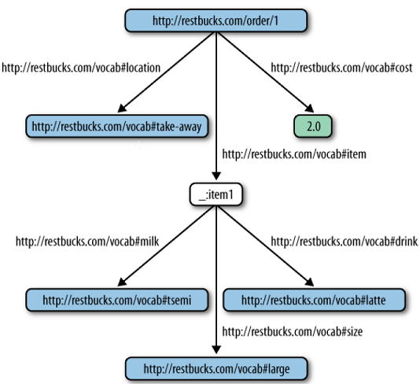
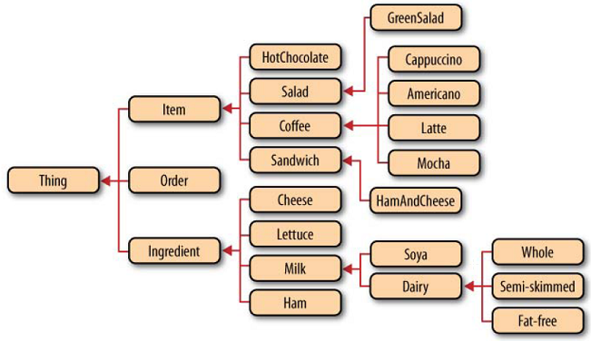

Web Security
============

-   the four core pillars of secure computing
    -   **Confidentiality** - The ability to keep information private while in transit or in storage
    -   **Integrity** - The ability to prevent information from being changed undetectably
    -   **Identity** - The ability to authenticate parties involved in an interaction
    -   **Trust** - Authorizing a party to interact with a system in a prescribed manner

HTTP Security Essentials
------------------------

### HTTP Authentication and Authorization

-   When a consumer attempts to access a privileged resource, credentials must be provided in an Authorization header, or the consumer will be refused access.
-   **Example**
    -   the consumer system sends a GET request to the Restbucks payment service.
    -   Restbucks responds with the challenge shown below

```
<!-- Accessing a payment resource -->
GET /payment/1234 HTTP/1.1
Host: restbucks.com

<!-- Restbucks challenges the consumer -->
401 Unauthorized
WWW-Athenticate: Basic realm="payments@restbucks.com"
```

-   The challenge tells the consumer that Restbucks requires a Basic digest to access some resources in the realm payments@restbucks.com.\*
-   HTTP Basic authentication is not secure
    -   the base64-encoded text is easily intercepted and decoded
-   To make HTTP authentication less susceptible to simple attacks
    -   we need either a secure channel such as HTTPS
    -   HTTP Digest authentication provides a mechanism that allows credentials to be passed securely through an insecure channel

```
401 Unauthorized
WWW-Athenticate: Digest realm="payments@restbucks.com",
qop="auth",
nonce="1e8c46a7d793433490cb8303f18a86e5",
opaque="ff1eccda9ef442b3b38cabb2435d5967"
```

-   **qop**
    -   Quality of Protection metadata that determines whether the consumer's response to the challenge should be based on the HTTP method and digest URI only (qop="auth")
    -   or whether it should include the entity body too (qop="auth-int").
    -   If auth-int is chosen, the entity body can be transferred in a tamper-resistant manner since it is hashed in subsequent interactions
-   **nonce**
    -   used to prevent replay attacks against the service
    -   typically created by hashing a representation and a timestamp so that services can uniquely identify requests and reject any suspicious repetitions
    -   may be per request or for several requests within a limited time depending on the security requirements of the service
-   **opaque**
    -   Information generated by the service that should be returned unchanged in the Authorization header of subsequent requests
    -   The service can use this header to provide context for successive interactions
-   Based on the information presented in the challenge, the consumer retries the request with credentials attached to the Authorization header

```
GET /payment/1234 HTTP/1.1
Host: restbucks.com
Authorization: Digest username="beancounter",
realm="payments@restbucks.com",
nonce="1e8c46a7d793433490cb8303f18a86e5",
uri="/payment/1234"
qop="auth",
nc=00000001,
cnonce="cf45f0087f33bce12332aef430945dff",
response="ff14aa3457acd60aa2091232a98756ff",
opaque="ff1eccda9ef442b3b38cabb2435d5967"
```

-   much of the information in the initial challenge is returned without modification in the response
-   the consumer produces additional metadata to fulfill its part of the authentication protocol
-   **username**
-   **uri**
    -   The URI of the resource to which the request is targeted
    -   identical to the path in the HTTP request, but is repeated since intermediaries can rewrite that address
-   **nc**
    -   hexadecimal count of how many requests the consumer has made using the service's nonce
-   **cnonce**
    -   The consumer's nonce, generated for each request to prevent replay attacks against the service
-   **response**
    -   The result of applying a set of hash functions to the nonce
    -   This is the value the service will ultimately check to see whether the consumer has valid credentials for the realm
    -   The response is calculated by
        1.  The MD5 hash of the username, realm, and password is computed
        2.  The MD5 hash of the method and digest URI is computed
        3.  The MD5 hash of the value produced by step 1 and the result from step 2 is calculated, yielding the consumer's response value.
    -   Since the consumer and service both know the shared secret the consumer's request can be checked by the service by repeating the calculation
-   **HTTP Digest authentication can still be broken using a man-in-the-middle attack if transport-level security isn't also used**
    1.  an interloper mimicking the behavior of the remote service intercepts the initial authentication and responds with a Basic authentication challenge to the consumer.
    2.  Basic authentication is easily broken; when the consumer responds to the Basic authentication challenge, the man in the middle is able to compromise the credentials
    3.  the consumer may not know this has happened if the man in the middle presents a faithful reproduction of the target service

    -   **If you are going to use HTTP authentication, transport-level security should be considered mandatory.**
-   there is a third scheme, called WSSE
    -   The WSSE scheme borrows an authentication approach from WS-Security's UsernameToken profile and maps those features onto HTTP headers
    -   it doesn't transmit passwords in clear text, requiring instead shared secrets between client and server
    -   WSSE is vulnerable to man-in-the-middle attacks in the absence of transport-level security

### Transport-Level Confidentiality and Integrity

-   HTTPS is a well-understood and researched protocol that routinely provides the underlay for secure interactions at global scale
-   Instead of exchanging HTTP requests and responses over TCP, we transmit those same requests and responses over Transport Layer Security, or TLS.
-   The TLS protocol has three phases, each of which must be completed before we can transfer representations via HTTPS
    1.  Handshake
    2.  Secure session
    3.  Channel setup
-   To initiate a secure session, the consumer begins by sending a ClientHello message to the remote service, which includes
    -   consumer's highest supported TLS version
    -   the ciphers and hashing algorithms that the consumer understands
    -   an optional session identifier
    -   some pseudorandom data for service-side key generation
-   Following on from the ServerHello message, the service transmits a Certificate message to the consumer.
    -   The Certificate message contains the service's public key, and optionally the service name and certificate authority
    -   The consumer uses this information to authenticate the service; it does this by matching the name of the service and the certificate to the name (or domain) of the server
    -   **we are only as secure as the DNS infrastructure we are using**
-   The negotiation of a shared secret is secure and cannot be eavesdropped, even by a man-in-the-middle attack. An attacker cannot modify the messages in the handshake without being detected, making the negotiation reliable

### Network and Performance Considerations

-   If all a service's resources are secured with HTTPS its attack surface is significantly reduced.
-   forcing every interaction over a secure channel may limit scalability
-   The use of a secure channel
    -   incurs cryptography costs
    -   prevents caching in the network
-   we only have consumer-side caching (which does not permit cached representations to be shared among many consumers) to help reduce load on servers
-   **consider instead patterns that allows us to encrypt content on unencrypted (and therefore cacheable) channels**
-   Cacheable and secure representations broadcast over an insecure channel with Atom
    -   The feed and its entries are cacheable, and therefore scale well at modest latencies
    -   the content of each atom:entry can be encrypted so that it is meaningless for any consumers that don't have the key to decrypt it
    -   **Having to share keys increases coupling, and in practice can be tricky to implement and scale**

Identity and the OpenID Protocol
--------------------------------

-   HTTP authentication and HTTPS (with client-side certificates) can be used to identify consumers but the burden of identity management is on the service
-   it shouldn't be our problem as business service providers
-   OpenID is a protocol that allows consumers to present claims about their identity to services where an identity provider trusted by the service has authenticated those claims.
-   OpenID allows a service or relying party to delegate the responsibility for storing consumer credentials to one or more OpenID providers
-   The providers are responsible for checking OpenID consumers' credentials and informing the relying party if an identity claim is valid
-   OpenID allows consumers to keep their personal details from relying parties, while still being able to present an authenticated identity claim to that party

### Protocol Flow

1.  Initiation - A customer submits an OpenID that it claims to own
2.  Discovery - The service discovers the OpenID provider for the presented OpenID
3.  Key exchange - Secrets are exchanged between the service and the OpenID provider
4.  The Service redirects to OpenID provider to authenticate
5.  Authentication - The consumer authenticates with its OpenID provider
6.  OpenID provider redirects to the Service - The redirect includes an OpenID payload.
7.  Present credentials - Finally, the OpenID payload containing the validated identity claim is sent to the Service.

-   If the consumer has successfully authenticated against the OpenID provider, it receives a 200 OK response from the Service
-   If the consumer has not successfully authenticated against the OpenID provider, it receives a 401 Unauthorized response from the Service

The OAuth Protocol
------------------

-   When third parties provide services to the enterprise, for example, sharing usernames is normally undesirable and impractical, if not downright impossible
-   The OAuth protocol enables services and applications to interact with resources hosted securely in third-party services, without requiring the owners of those resources to share their credentials
-   roles in the OAuth protocol
    -   **Server** - The service hosting the protected resources. In our example, the server is the Coffee Voucher service. This voucher service hosts protected coffee vouchers
    -   **Resource owner** - The owner of the protected resources hosted by the server. The resource owner drives the overall workflow.In our example, Restbucks' customers play this role
    -   **Client** - The service that needs access to the protected resources. Restbucks plays the client role in this example, having first established trust with the voucher service through an out-of-band mechanism
-   OAuth defines three different types of credentials: client, temporary, and token.
    -   Each set of credentials comprises a unique identifier and a shared secret

### Protocol Example

-   Restbucks must establish trust with the voucher service
-   Restbucks and the voucher service needs to establish an electronic domain of trust by sharing a set of client credentials
-   These credentials comprise a consumer key and a consumer secret
-   OA uth is permissive about the way protocol messages are transferred between the client and server.
    -   Using the HTTP Authorization header is the preferred mechanism
    -   transferring application/x-www-form-urlencoded data in an entity body or request URI is also permitted

### Practical Considerations for OAuth

-   OAuth 2.0 is due toward the end of 2010 and will not be backward-compatible with version 1.0

Service Hacks and Defenses
--------------------------

### Denial of Service (Large Payload Attacks)

-   the Content-Length header might not help defend against these simple attacks, even if it is present
-   Where it is present and is suspiciously large representations can be dropped early in the processing life cycle, before they can do any damage
-   A more realistic scenario is one in which the web server drops any representation whose size does not correspond to the Content-Length header
-   establish a policy whereby the service will accept representations up to a reasonable content length. any larger representations can be dropped before they have a chance to do too much damage
-   If the Content-Length header is missing
    -   **permissive** - accept the representation
    -   **secure** - immediately cease processing the representation and respond with 411 Length Required
-   consumers can also use chunked transfer encoding
    -   the consumer sets the request header to Transfer-Encoding: chunked
    -   Chunking a message allows the consumer to stream a request of unknown length to the service
    -   Unless your service trusts the consumer, reject chunked requests with 411 Length Required
-   Provided our service implementation doesn't allow an exception to be thrown while servicing one request to shut down the entire service, we can always reject the offending consumer and continue processing for others
-   **When dealing with a malicious request, it's important not to leak information to an attacker—even when the service is under severe stress**
    -   immediately terminate the connection
    -   or return a 400 Bad Request response code

### Keep Secrets Secret

-   Security through obscurity is a poor strategy by itself, but that doesn't mean a service should be liberal with the information it gives out
-   In certain circumstances, however, a service might respond with a more general status code so as to avoid giving too much information away
-   **Example**
    -   an attacker has obtained the internal URI templates for the Restbucks payments and ordering services
    -   the service responds
        -   405 Method Not Allowed to requests for a valid payment
        -   404 Not Found to requests for payments that do not exist
    -   that information is helpful to attackers, a 405 response allows an attacker to infer the URI of orders, and thereafter meddle with them
    -   The 405 response indicates that a resource exists, as well as indicating that the consumer can't use any of the HTTP verbs to interact with it at this moment and it does give malicious agents a peek into the service
    -   we might consider always responding with 404 Not Found should any consumer try to interact with a payment resource once it's been created
-   **Defaulting to a 404 Not Found response is commonplace on the Web in situations where a consumer can't make any forward progress**
-   Normally, an unauthenticated consumer receives a 401 Unauthorized response to a payment request, but this suggests that a resource is available, and it allows an attacker to make inferences about other resources
    -   a 404 Not Found response is safer in this situation
    -   One strategy here is simply to reduce the attack surface **by responding with 401 for entry points into a service, and 404 where we want to hide the existence of otherwise secure resources**
-   One way of preventing attackers from guessing the URIs associated with a live DAP is to scramble those readable URIs into something much more opaque
    -   a link's semantics are in the rel attribute, not the uri attribute; this allows us to supply opaque URIs while maintaining semantic clarity
    -   By using hard-to-guess URIs, we make it difficult for attackers to infer valid URIs.
    -   In this way, we prevent attackers outside the network path between a consumer and Restbucks from interrupting other consumers' workflows
    -   software agents that are on the network path between a consumer and Restbucks will see the opaque URIs
    -   these agents will therefore still be able to interfere with the service
    -   To thwart this last attack vector, techniques to ensure confidentiality (HTTPS) must be used to make the approach robust

```xml
<order xmlns="http://schemas.restbucks.com/order" xmlns:dap="http://schemas.restbucks.com/dap">
    <location>takeAway</location>
    <item>
        <name>latte</name>
        <quantity>1</quantity>
        <milk>whole</milk>
        <size>small</size>
    </item>
    <cost>2.0</cost>
    <status>unpaid</status>
    <!-- Restbucks Domain Application Protocol -->
    <dap:link rel="http://relations.restbucks.com/payment"
        uri="https://restbucks.com/a/d77620fe-9dad-14d1-87bc-de432fdc9841"
        mediaType="application/vnd.restbucks+xml"/>
    <dap:link rel="http://relations.restbucks.com/latest"
        uri="https://restbucks.com/b/8877ef49-774c-11bc-bbce-abf47e0923fe"
        mediaType="application/vnd.restbucks+xml"/>
    <dap:link rel="http://relations.restbucks.com/update"
        uri="https://restbucks.com/b/8877ef49-774c-11bc-bbce-abf47e0923fe"
        mediaType="application/vnd.restbucks+xml"/>
    <dap:link rel="http://relations.restbucks.com/cancel"
        uri="https://restbucks.com/b/8877ef49-774c-11bc-bbce-abf47e0923fe"
        mediaType="application/vnd.restbucks+xml"/>
</order>
```

### Act Defensively (Malicious Value)

-   Example - <quantity>2147483648</quantity>
    -   the attacker intends to create an order with a negative number of coffees (due to wraparound), hoping to cause unexpected exceptions, which it can then exploit
-   URIs themselves can present vulnerabilities if we haven't built services defensively
-   Example - a GET request that has been crafted to steal the password file from a service hosted on a Unix server
    -   GET /order/../../../../etc/passwd HTTP/1.1
    -   The attack will succeed if we are lax on two fronts
        -   The service does not validate URI paths, constraining them to legal URIs for resources in the service implementation
        -   The user under which the service runs has read access to the file being targeted by the attacker
-   Another attack that uses carefully crafted URIs is one designed to cause a denial of service rather than obtain information
    -   Example - GET /order/../../../../dev/random HTTP/1.1
    -   The device /dev/random on Unix systems provides a continuous stream of random(ish) bytes when read
    -   any process—including a service — reading from that location will never stop
    -   In the worst case, this could once again use up available memory on the server and so cause a denial of service

### Less Is Best

-   speculative code is like a tumor
-   It might be benign or remain forever undiscovered
-   Or it might be malignant and become active when an attacker happens across it
-   **in order to reduce the attack surface of a service, the simplest thing we can do is to write less code**
-   we advocate building only immediately useful features, while at all times leaving the service implementation in a state that can be rapidly evolved to meet new requirements
-   We should be proportionate when securing services
-   use as little code/infrastructure/configuration as possible to get the job done

### Defend in Depth

-   maintain simplicity in each layer
-   Many enterprise systems fall foul of this, believing that HTTPS solves security, and that a large lock on the front door is enough to foil any hackers
-   **SSL (which underpins HTTPS) doesn't concern itself with humannotions of security; it only helps with confidentiality and integrity**
-   Securing certain resources with HTTPS is a good first step toward protecting services
-   good in-depth defense demands more layers
-   In a production environment, we need to secure all layers of the stack, starting with the network
    -   For web-based systems, this task can be achieved by using firewalls
-   run the service at the lowest possible user level. In the event of a successful attack, the attacker is sandboxed by lowly privileges on the server
-   Enforcing strong passwords (or certificates) and checking logs for suspicious activity are sensible procedures
-   Don't allow your production network to be accessed from poorly secured wireless networks

Semantics
=========

-   document formats matter
-   The semantics behind the data and information in a document must be understood by both parties in an interaction in order to successfully achieve a business goal.

Syntax Versus Semantics
-----------------------

-   With distributed systems individual services need to have a common understanding of how to interpret the information they exchange so as to ensure meaningful interactions
-   the use of link relations to provide semantic context for a hypermedia control takes us a small way toward creating this common understanding

Structure and Representation of Information
-------------------------------------------

-   structure is about the relationship between the different information pieces that make up the details of a document, concept, or business entity
-   representation is about choices in representing that information
    -   The choice of representation might have a significant impact on our ability to share the information in an interoperable manner

### Data, Information, Knowledge

-   **data** refers to the raw, uninterpreted bits that make up a business entity (e.g., an invoice, a receipt, the customer details
-   **information** is the interpretation of data within the context of a particular application domain
-   **knowledge** represents our understanding of a domain after we collect, analyze, and reason over the available data and information
-   XML
    -   explicitly expresses hierarchical structure and often it can be self-describing
    -   We can copy, query, or transform the XML document without having to interpret or reason over the information it conveys
    -   allows us to maintain a separation between the structured data and the represented information.
-   **Interpretation**
    -   a software agent usually needs more than just assumptions
    -   As developers, we need to encode the information used by our application's business logic in the document formats we use
    -   We also need to capture and externalize the context so as to allow correct interpretation of that information
    -   **Services can only interact correctly if this information is shared**
-   **Shared Understanding**
    -   When we deal with the exchange of data in an integration scenario, it's critical that all parties interpret the conveyed information in the same way
    -   the key challenge is to actually make sure all parties in an interaction interpret the information consistently
    -   The process of converting a specification written in a natural language to a computer program is difficult and error-prone
    -   that's the predominant mechanism for implementing a shared understanding of exchanged information
    -   The web community is trying to address this problem through techniques that automate how applications represent and describe data and information
    -   The goal is for machines rather than developers to reason over the semantics of any information in transferred representations
-   **Semantics**
    -   the shared understanding defined by a contract
    -   the meaning of a sequence of request-response exchanges
    -   or the manner in which a resource representation should be interpreted
    -   Representing and sharing semantics makes it possible for humans and computers to meaningfully exchange information

The Semantic Web
----------------

-   The Semantic Web promises to enable machines to meaningfully process, combine, and infer information from the world's data
-   Semantic Web technologies attempt to standardize the mechanics of information sharing so that it can be more easily supported in software
-   **resources and URIs are the building blocks on top of which the Semantic Web is built**

### RDF (Resource Description Framework)

-   provides a model for describing data as a directed, labeled graph
-   it makes easy for us to evolve data representations, merge different graphs, and reason over the results
-   RDF supports statements of the form \[subject, predicate, object\], also known as triples
-   The subject and the predicate here are always URIs, whereas the object can be either a URI or a literal
-   In the case of an order, we could use a literal object value to define whether the order is "take-away" or "to be consumed in house."
-   By combining URIs and literals in a structured way, RDF allows us to make statements about resources
-   This is because URIs have meaning attached to them, either because
    -   there is another RDF graph that describes them
    -   or because they are "well-known" URIs with well-understood semantics defined by either a natural language specification or a folksonomy (A collection of terms defined by a community through collaborative tagging)
-   There are occasions, however, where it is not an application requirement to refer to a node in a graph outside an RDF document
-   Anonymous RDF nodes allow us to build graphs without having to make all its subjects and objects explicitly identifiable outside its context
-   There are multiple representation formats for RDF graphs
    -   Notation 3\*
    -   RDF/XML



```xml
<?xml version="1.0"?>
<!DOCTYPE rdf:RDF [<!ENTITY xsd "http://www.w3.org/2001/XMLSchema#">]>
<rdf:RDF xmlns:rdf="http://www.w3.org/1999/02/22-rdf-syntax-ns#"
    xmlns:restbucks="http://restbucks.com/vocab#">
    <rdf:Comment>This graph represents a simple Restbucks order</rdf:Comment>
    <rdf:Description rdf:about="http://restbucks.com/order/1">
        <restbucks:location rdf:resource="http://restbucks.com/vocab#take-away"/>
        <restbucks:cost rdf:datatype="&xsd;decimal">2.0</restbucks:cost>
        <restbucks:item rdf:resource="_:item1" />
    </rdf:Description>
    <rdf:Description rdf:about="_:item1">
        <restbucks:milk rdf:resource="http://restbucks.com/vocab#semi" />
        <restbucks:size rdf:resource="http://restbucks.com/vocab#large" />
        <restbucks:drink rdf:resource="http://restbucks.com/vocab#latte" />
    </rdf:Description>
</rdf:RDF>
```

-   The strength of RDF lies in its processing model and use of URIs to build statements
    -   all aspects of a Restbucks order can be further described using additional RDF statements
    -   These additional statements can be either embedded directly in our order representation or delivered to consumers through other means
-   an existing vocabulary to describe the currency node is [GoodRelations](http://www.heppnetz.de/ontologies/goodrelations/v1) which includes terms to describe the cost of products and the requested currency
-   RDF makes it simple to combine information from different graphs, as long as matching URIs are used
-   Due to the absence of a widely used coffee industry vocabulary, Restbucks has defined its own. The Semantic Web community refers to such vocabularies as **ontologies**.

### OWL (Ontology Web Language)

-   is a family of knowledge representation languages
-   These languages allow us to define, represent, and share the meaning of things, concepts, relationships, and abstractions
-   **provides the building blocks for creating vocabularies specific to a particular domain of interest**
-   Each term in the vocabulary can be associated with semantics in a machine-readable way
-   it possible for applications to reason over the set of facts expressed using one or more defined vocabularies
-   Developers can use available software libraries, such as Jena, to incorporate inferencing capabilities into their applications, allowing them to generate new information by processing facts captured in OWL and RDF documents
-   it provides the mechanics for defining classes, relationships, properties/predicates, instances, constraints, and axioms
-   OWL uses RDF Schema (RDFS) to describe basic class hierarchies, class properties, and type constraints for property values
-   In addition to the description of concepts, OWL's vocabulary can also be used to describe instances of those concepts, known as individuals

#### The Restbucks ontology



-   There are multiple renderings of an OWL document
    -   OWL/XML
    -   RDF/XML
    -   [Manchester](http://www.w3.org/TR/owl2-manchester-syntax/)
    -   Turtle
    -   Functional

```owl
    Ontology: <http://restbucks.com/vocab#>
    Class: <Order>
    Class: <Item>

    ObjectProperty: <containsItem>
      Domain: <Order>
      Range: <Item>

    DataProperty: <quantity>
      Domain: <Item>
      Range: xsd:positiveInteger

    DataProperty: <size>
      Domain: <Item>
      Range: {"12oz" , "6oz"}
```

-   The links between nodes in graphs are always one-way
-   If we were describing individuals, rather than concepts, we would have to record both statements for every pair of individuals
-   With OWL we can declare two object properties as being the inverse of each other

```owl
    Class: <Coffee>
      SubClassOf: <Item>
      EquivalentTo: <hasMilk> max 1 <Milk>

    ObjectProperty: <hasMilk>
      Domain: <Coffee>
      Range: <Milk>

    Class: <Latte>
      SubClassOf: <Coffee>

    Class: <Mocha>
      SubClasSOf: <Coffee>
```

-   the example allows us to make a statement such as "A coffee may have one, but no more, milk individuals."

### SPARQL

-   SPARQL is the query language for the RDF and OWL documents combined into a single information graph of subject-predicate-object triples
-   Using SPARQL, we can match patterns within a graph or subgraphs
-   Unlike relational database technologies, RDF allows us to combine information in arbitrary ways, without having to adhere to a data layout defined and fixed in advance of an application's deployment.
-   SPARQL supports an evolutionary approach to data and application design

### RDFa

-   RDF in attributes (RDFa) brings RDF to the human Web
-   The premise of RDFa is that web documents such as XHTML can convey both presentation and semantic information
-   We can leverage RDFa statements in XML documents in order to avoid the expensive transition to RDF and OWL for computer-to-computer interactions
-   we could use familiar XML representations together with RDFa statements to create self-describing documents
-   **Assume that recipients of a XML+RDFa document understand the OWL defined**
-   RDFa reuses the <link> element and rel attribute but allows terms from different vocabularies, rather than just strings, to be used as values

```xml
<order xmlns="http://restbucks.com"
    xmlns:rv="http://restbucks.com/vocab#"
    xmlns:xsd="http://www.w3.org/2001/XMLSchema#">
    <location>takeAway</location>
    <link about="rv:coffee-beans" rel="rv:origin" href="http://coffeebeans.com" /><!-- !! -->
    <cost property="rv:uk-pounds" typeof="xsd:decimal">12.0</cost>
    <item>
        <name>latte</name>
        <quantity>1</quantity>
        <milk rel="rv:supplier" href="http://localfarmer.com/">whole</milk><!-- !! -->
        <size>12</size>
    </item>
    <item>
        <name>cookie</name>
        <kind rel="rv:recipe"
        href="http://restbucks.com/recipes/choc-cookie">chocolate-chip</kind><!-- !! -->
        <quantity>2</quantity>
    </item>
</order>
```

Microformats
------------

-   [Microformats](http://microformats.org) are a collection of community-driven specifications for conveying machineprocessable information
-   The goal is to design small document formats that can be reused by humans first and machines second
-   microformats use existing HTML attributes — the class attribute in particular—to transport machine-readable semantic information
-   Microformats and RDFa are alike in that they separate semantics from document structure
-   Microformats and RDFa can insert the very same semantics into many different document structures
-   **Despite being widely used on the Web today, microformats may soon lose out to RDFa, which will likely be included in future HTML standards**

```html
<div class="hrecipe">
    <h1 class="fn">Restbucks Chocolate Cookies</h1>
    <p class="summary">This is how you can make Restbucks chocolate cookies</p>
    <h2>Ingredients</h2>
    <ul>
        <li class="ingredient">
            <span class="value">2.25</span>
            <span class="type">cups</span> flour.
        </li>
        <li class="ingredient">
            <span class="value">1</span>
            <span class="type">teaspoon</span> baking soda.
        </li>
        <li class="ingredient">
            <span class="value">1</span>
            <span class="type">teaspoon</span> salt.
        </li>
        <!-- More ingredients -->
    </ul>
    <h2>Preparation instructions</h2>
    <ul class="instructions">
        <li>Preheat oven to 375o F.</li>
        <li>Combine flour, baking soda, and salt in small bowl... </li>
        <!-- More instructions -->
    </ul>
</div>
```

Summary
-------

-   It is important that a shared understanding of the exchanged information doesn't get translated into a shared way of processing that information.
-   Participants in loosely coupled distributed applications are free to deal with the documents they receive in any way they wish
-   Semantic technologies are a great asset in our development toolbox whenever we want to represent information that machines can "understand."
-   The intention of a service provider can be captured in semantically rich documents
-   These documents can be consumed directly by applications, removing the need for humans to read specifications and create programs from them.
-   **As a result, the correctness of our distributed system can be improved and the integration process accelerated.**
