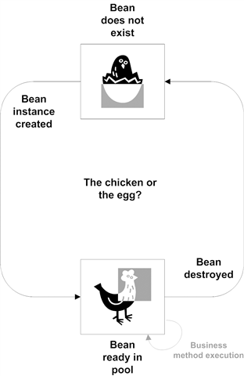
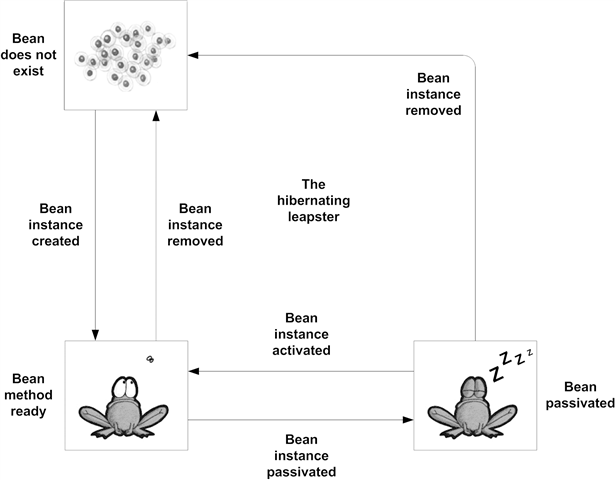
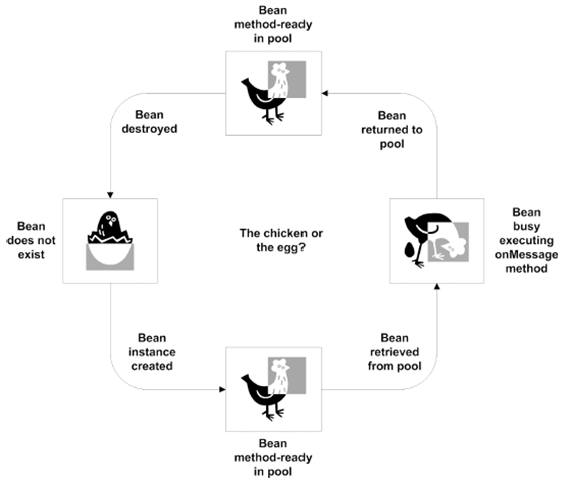

Building business logic with session beans
==========================================

Getting to know Session Beans - The programing rules
----------------------------------------------------

```java
@Stateless
public ChildBean extends AbstractBean implements BeanBusiness { ... }
```

-   a session bean must have at least one business interface.
-   The session bean class must be concrete.
-   You must have a no-argument constructor in the bean class.
-   A session bean class can subclass another session bean or any other POJO.
-   The business methods and lifecycle callback methods may be defined either in the bean class or in a superclass.
    -   the bean type annotation @Stateless or @Stateful in the superclass will be ignored.
    -   any annotations in the superclasses used to define lifecycle callback methods and resource injections will be inherited by the bean class.

-   **Business method names must not start with "ejb"**
-   You must define all business methods as public, but not final or static.
-   If you are exposing a method in a remote business interface of the EJB, all the arguments and the return type of the method must implement the java.io.Serializable interface.
-   O Bean pode ter um método void ejbCreate()

Understanding lifecycle callbacks
---------------------------------

-   Callback methods are bean methods that are marked with metadata annotations such as @PostContruct and @PreDestroy.
-   They can be public, private, protected, or package-protected.
-   stateful session beans have two additional ones: PrePassivate and PostActivate
-   You can define a lifecycle callback method either in the bean class or in a separate interceptor class.

| Callback Annotation             | EJB Type                 |
|---------------------------------|--------------------------|
| @javax.annotation.PostConstruct | Stateless, Stateful, MDB |
| @javax.annotation.PreDestroy    | Stateless, Stateful, MDB |
| @javax.annotation.PrePassivate  | Stateful                 |
| @javax.annotation.PostActivate  |                          |

```xml
<ejb-jar version="3.0">
    <enterprise-beans>
        <session>
            <ejb-name>ServiceBean</ejb-name>
            <post-construct>
                <lifecycle-callback-method>up</lifecycle-callback-method>
            </post-construct>
        </session>
    </enterprise-beans>
</ejb-jar>
```

Stateless session beans
-----------------------

```java
@Remote
public interface BidManager extends java.rmi.Remote { ... }
```

-   Stateless session instances are dedicated to an EJB object only for the duration of a single method call
-   The reference returned does not cause a session bean instance to be created or pulled from the pool until a method is invoked on it
-   **Remote interface**
    -   Clients residing outside the EJB container's JVM instance must use some kind of remote interface
    -   A remote business interface may extend java.rmi.Remote, although this is optional.
    -   **The methods of the business interface may only throw the java.rmi.RemoteException if the interface extends java.rmi.Remote**
    -   Remote business interfaces do have one special requirement: all parameters and return types of interface methods must be Serializable.

-   **Web service endpoint interface**
    -   is specific to stateless session beans

-   **Working with multiple business interfaces**
    -   a business interface can extend another interface, and you can remove code duplication by creating a business interface that has common methods and business interfaces that extend the common "parent" interface.
    -   If you want, you can apply the @Local or @Remote annotation in the bean class without having to implement the business interface

```java
@Remote(BidManager.class)
@Stateless
public class BidManagerBean { ... }
```

### Using bean lifecycle callbacks



1.  Creates bean instances using the default constructor as needed
2.  Injects resources such as database connections.
3.  Puts instances in a managed pool.
4.  Pulls an idle bean out of the pool when an invocation request is received from the client
5.  Executes the requested business method invoked through the business interface by the client.
6.  When the business method finishes executing, pushes the bean back into the "method-ready" pool

-   As you know, there are two types of stateless session bean lifecycle callback methods
    1.  PostConstruct callbacks are invoked immediately after a bean instance is created and set up, and all the resources are injected
    2.  PreDestroy callbacks are invoked right before the bean instance is retired and removed from the pool

-   Callbacks must follow the pattern of void <METHOD\>() and '''cannot throw checked exceptions'''
-   PostConstruct is invoked only once in the life cycle of an instance: when it is transitioning from the Does Not Exist state to the Method-Ready Pool
-   The bean class may define only one @PreDestroy method
-   The bean class may define only one @PostConstruct method
-   During @PreDestroy method, the SessionContext and access to the JNDI ENC are still available to the bean instance

### The XML Deployment Descriptor

```xml
<ejb-jar version="3.0">
    <enterprise-beans>
        <session>
            <ejb-name>ServiceBean</ejb-name>
            <business-local>bean.Service</business-local> <!-- Não é local! -->
            <ejb-class>bean.ServiceBean</ejb-class>
            <session-type>Stateless</session-type>
            <env-entry>
                <env-entry-name>code</env-entry-name>
                <env-entry-type>java.lang.Integer</env-entry-type>
                <env-entry-value>46</env-entry-value>
                <injection-target>
                    <injection-target-class>bean.ServiceBean</injection-target-class>
                    <injection-target-name>code</injection-target-name>
                </injection-target>
            </env-entry>
            <resource-env-ref>
                <resource-env-ref-name>SessionContext</resource-env-ref-name>
                <resource-env-ref-type>javax.ejb.SessionContext</resource-env-ref-type>
                <injection-target>
                    <injection-target-class>bean.ServiceBean</injection-target-class>
                    <injection-target-name>sessionContext</injection-target-name>
                </injection-target>
            </resource-env-ref>
        </session>
    </enterprise-beans>
</ejb-jar>
```

Stateful session beans
----------------------

-   Stateful bean instance variables used to store conversational state may consist of primitive values, objects that are serializable, and the following special types
    -   javax.ejb.SessionContext
    -   javax.jta.UserTransaction
    -   javax.naming.Context
    -   javax.persistence.EntityManager
    -   javax.persistence.EntityManagerFactory
    -   References to managed resource factories (e.g., javax.sql.DataSource)
    -   References to other EJBs

-   we have to define a business method for removing the bean instance by the client using the @Remove annotation.
-   In addition to the PostConstruct and PreDestroy lifecycle callback methods, stateful session beans have the PrePassivate and PostActivate lifecycle callback methods.
-   a stateful session bean cannot have a web service endpoint interface.
-   **Every time you look up a stateful session bean in JNDI, a new session is created.**
-   **System exceptions (java.lang.RuntimeException, java.rmi.RemoteException, javax.ejb.EJBException**
    -   Whenever a system exception is thrown by a bean method, the container invalidates the EJB object and destroys the bean instance
    -   **@PreDestroy call methods are not invoked**

### Stateful bean lifecycle callbacks

1.  Always creates new bean instances using the default constructor whenever a new client session is started
2.  Injects resources.
3.  Stores the instance in memory.
4.  Executes the requested business method invoked through the business interface by the client
5.  Waits for and executes subsequent client requests
6.  If the client remains idle for a period of time, the container passivates the bean instance.
7.  If the client invokes a passivated bean, it is activated
8.  If the client does not invoke a passivated bean instance for a period of time, it is destroyed
9.  If the client requests the removal of a bean instance, it is first activated if necessary and then destroyed
10. When a timeout occurs in the Method-Ready state, the container may, but is not required to, call any @PreDestroy callback methods
    -   **A stateful bean cannot time out while a transaction is in progress**

11. **transient fields can contain arbitrary values when the bean is activated**
12. **When a timeout occurs in the Passivated state, any @PreDestroy callback methods are not invoked**



### Main Differences

| Features                    | Stateless                 | Stateful                                              |
|-----------------------------|---------------------------|-------------------------------------------------------|
| Conversational state        | No                        | Yes                                                   |
| Pooling                     | Yes                       | No                                                    |
| Performance problems        | Unlikely                  | Possible                                              |
| Lifecycle events            | PostConstruct, PreDestroy | PostConstruct, PreDestroy, PrePassivate, PostActivate |
| Timer                       | Yes                       | No                                                    |
| Session Synchronization     | No                        | Yes                                                   |
| Web services                | Yes                       | No                                                    |
| Extended PersistenceContext | No                        | Yes                                                   |

### XML Deployment

```xml
<ejb-jar version="3.0">
    <enterprise-beans>
        <session>
            <ejb-name>MultiStepFormBean</ejb-name>
            <business-local>beans.MultiStepForm</business-local>
            <ejb-class>beans.MultiStepFormBean</ejb-class>
            <session-type>Stateful</session-type>
            <persistence-context-ref>
                <persistence-context-ref-name>formPersistence</persistence-context-ref-name>
                <persistence-unit-name>Entities</persistence-unit-name>
                <persistence-context-type>Transaction</persistence-context-type>
                <injection-target>
                    <injection-target-class>beans.MultiStepFormBean</injection-target-class>
                    <injection-target-name>em</injection-target-name>
                </injection-target>
            </persistence-context-ref>
        </session>
    </enterprise-beans>
</ejb-jar>
```

Session Bean Clients
--------------------

```java
EJB private BidManagerLocal bidManager;

@EJB(name="BidManagerRemote") private BidManager bidManager;

@Stateful
public class UserAccountRegistrationBean implements UserAccountRegistration {
    @EJB private BidderAccountCreator bidderAccountCreator;
    ...
}
```

-   If the client removes the instance of UserAccountRegistrationBean, the associated instance of BidderAccountCreatorBean will also be automatically removed
-   you must not inject a stateful session bean into a stateless object, such as a stateless session bean or servlet that may be shared by multiple concurrent clients
-   injecting an instance of a stateless session bean into a stateful session bean is perfectly legal

Nested Stateful Session
-----------------------

```java
@Stateful
public class ShoppingCartBean implements ShoppingCart{
    @EJB AnotherStatefulLocal another;
    @Remove void checkout {}
}
```

-   When a stateful bean reference is injected into another stateful session bean, the containing bean owns the injected session
-   when the containing bean is created, a unique session is created for the injected reference
-   **When the containing bean is removed, the contained stateful bean is also removed**
    -   allows you to cleanly aggregate conversational business processes without having to worry about managing the life cycle of the contained stateful sessions

-   When stateful session beans injects an EXTENDED persistence context that also exists in the containing stateful bean both containing and contained stateful session beans **share the same EXTENDED persistence context**
    -   works only when a reference to a local stateful session interface is injected
    -   otherwise, the beans would not share the same EXTENDED persistence context

Messaging and developing MDBs
=============================

-   In order to send a JMS message, we need
    -   a connection to the JMS provider (makes the connection to the provider possible)
    -   a destination address for the message (identified by a Topic or Queue object)

Messaging Models
----------------

-   **Point-to-point (message-in-a-bottle)** - a single message travels from a single producer (point A) to a single consumer (point B). PTP message destinations are called queues. Note that PTP doesn't guarantee that messages are delivered in any particular order. if more than one potential receiver exists for a message, a random receiver is chosen.
-   **Publish-subscribe (RSS)** - a single producer produces a message that is received by any number of consumers who happen to be connected to the destination at the time. the message destination in this model is called a topic and a consumer is called a subscriber. works particularly well in broadcasting information across systems.

JMS and Message-Driven Beans
----------------------------

```java
@Resource(mappedName="jms/queueFactory") ConnectionFactory connectionFactory;
@Resource(mappedName="jms/events") Queue eventsQueue;
public void produce() {
    conn = connectionFactory.createConnection();
    Session session = conn.createSession(false, Session.AUTO_ACKNOWLEDGE);
    session.createProducer(eventsQueue).send(session.createTextMessage(message));
    session.close();
    connection.close();
}
```

```java
@MessageDriven(mappedName="jms/events",
    activationConfig=
        @ActivationConfigProperty(propertyName="destinationType", propertyValue="javax.jms.Queue"))
public class EventConsumer implements MessageListener {
    public void onMessage(Message message) {
        System.out.println("Message [" + ((TextMessage) message).getText() + "]");
    }
}
```

-   **Opening the connection and session**
-   We've decided that our session should be transactional and therefore set the parameter to true. This means that the requests for messages to be sent won't be realized until either the session's commit method is called or the session is closed. (If the session isn't transactional, messages will be sent as soon as the send method is invoked.)
-   Because messaging is inherently decoupled and asynchronous, the transactions and security contexts of the sender are not propagated to the receiver
    -   the sender and receiver often operate in environments with different security domains

-   **transactions are never propagated from the sender to the receiver**
-   A JMS client can, however, have a distributed transaction with the JMS provider so that it manages the send or receive operation in the context of a transaction
-   **Message properties** - are just like headers, but are explicitly created by the application instead of being standard across messages.

```java
/* A property can be a boolean, byte, double, float, int, long, short, String, or Object */
message.setBooleanProperty("Fragile", true);
```

### Connection and Session

```java
createSession(boolean transacted, int acknowledgeMode)
```

-   Session objects use a single-threaded model, which prohibits concurrent access to a single Session from multiple threads
-   According to the EJB specifications, these arguments are ignored at runtime because the EJB container manages the transaction and acknowledgment mode of any JMS resource obtained from the JNDI ENC
-   The specification recommends that developers use the arguments true for transacted and 0 for acknowledgeMode

JMS-Based Message-Driven Beans
------------------------------

-   it does not have a remote or local business interface
-   **MessageDrivenContext**
    -   simply extends the EJBContext ; it does not add any new methods

-   **throws RuntimeException**
    -   getEJBHome()
    -   getEJBLocalHome()
    -   getCallerPrincipal()
    -   isCallerInRole()

-   MDBs usually implement the javax.jms.MessageListener interface

Programming Rules
-----------------

-   The MDB class must directly (by using the implements keyword in the class declaration) or indirectly (through annotations or descriptors) implement a message listener interface
-   The MDB class must be concrete. It cannot be either a final or an abstract class
-   **The MDB must be a POJO class and not a subclass of another MDB.**
-   The MDB class must be declared public
-   The bean class must have a no-argument constructor
-   **You cannot define a finalize method in the bean class**. If any cleanup code is necessary, it should be defined in a method designated as PreDestroy
-   You must implement the methods defined in the message listener interface. These methods must be public and cannot be static or final.
-   **You must not throw the javax.rmi.RemoteException or any runtime exceptions. If a RuntimeException is thrown, the MDB instance is terminated**. Não tem ninguem pra capturar!!!

Using the @MessageDriven annotation
-----------------------------------

```java
@MessageDriven(activationConfig={
    @ActivationConfigProperty(propertyName="destinationType",propertyValue="javax.jms.Queue"),
    @ActivationConfigProperty(propertyName="messageSelector",propertyValue="MessageFormat = 'Version 3.4'"),
    @ActivationConfigProperty(propertyName="acknowledgeMode", propertyValue="Auto-acknowledge")})
public class ReservationProcessorBean implements javax.jms.MessageListener {
}
```

-   **name** specifies the name of the MDB. If the name element is omitted, the code uses the name of the class
-   **messageListenerInterface** specifies which message listener the MDB implements.
-   **activationConfig** is used to specify listener-specific configuration properties.

### acknowledgeMode

-   A JMS acknowledgment means that the JMS client notifies the JMS provider (message router) when a message is received
-   Acknowledging a message tells the JMS provider that an MDB container has received and processed the message
-   Without an acknowledgment, the JMS provider does not know whether the MDB container has received the message, and unwanted redeliveries can cause problems
-   Two values can be specified for acknowledgment mode
    -   Auto-acknowledge
        -   tells the container that it should send an acknowledgment to the JMS provider soon after the message is given to an MDB instance to process

    -   Dups-ok-acknowledge
        -   tells the container that it doesn't have to send the acknowledgment immediately; anytime after the message is given to the MDB instance will be fine
        -   can cause the JMS provider to assume the message was not received and send a "duplicate" message

-   the acknowledgment mode is ignored most of the time unless the MDB executes
    -   with bean-managed transactions
    -   with the container-managed transaction attribute NotSupported

### destinationType

-   javax.jms.Queue
-   javax.jms.Topic

### subscriptionDurability

-   When a JMS-based MDB uses a **javax.jms.Topic**, the deployment descriptor **must declare whether the subscription is Durable or NonDurable**
-   If the subscription is NonDurable, any messages the bean would have received while it was disconnected are lost
-   Durable MDBs are tolerant of disconnections, whether intentional or the result of a partial failure

### messageSelector

-   Message selectors use Message properties as criteria in conditional expressions
-   Message selectors are also based on message headers


### XML

-   Se declarar o <messaging-type/\>, a classe não precisa implementar javax.jms.MessageListener
-   basta implementar o método **public void onMessage(javax.jms.Message arg)**
-   visibilidade menor do que public não funciona!

```xml
<ejb-jar version="3.0">
    <enterprise-beans>
        <message-driven>
            <ejb-name>EventConsumer</ejb-name>
            <mapped-name>jms/events</mapped-name>
            <ejb-class>event.EventConsumer</ejb-class>
            <messaging-type>javax.jms.MessageListener</messaging-type>
            <activation-config>
                <activation-config-property>
                    <activation-config-property-name>destinationType</activation-config-property-name>
                    <activation-config-property-value>javax.jms.Queue</activation-config-property-value>
                </activation-config-property>
                <activation-config-property>
                    <activation-config-property-name>acknowledgeMode</activation-config-property-name>
                    <activation-config-property-value>Auto-acknowledge</activation-config-property-value>
                </activation-config-property>
            </activation-config>
            <resource-env-ref>
                <resource-env-ref-name>MessageDrivenContext</resource-env-ref-name>
                <resource-env-ref-type>javax.ejb.MessageDrivenContext</resource-env-ref-type>
                <injection-target>
                    <injection-target-class>event.EventConsumer</injection-target-class>
                    <injection-target-name>ctx</injection-target-name>
                </injection-target>
            </resource-env-ref>
        </message-driven>
    </enterprise-beans>
</ejb-jar>
```

Using bean lifecycle callbacks
------------------------------

-   **The MDB lifecycle has two states: does not exist, method-ready.**
-   There are only two lifecycle callbacks corresponding to bean creation and destruction; you can use PostConstruct and PreDestroy methods to receive these callbacks
-   MDBs are not subject to activation, so they can maintain open connections to resources for their entire life cycles
-   @PreDestroy method should close any open resources before the stateless session bean is evicted from memory at the end of its life cycle

1.  Creates MDB instances and sets them up
2.  Injects resources, including the message-driven context
3.  Places instances in a managed pool


