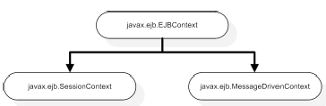

EJB internals
=============

EJB behind the scenes
---------------------

-   **For each bean instance,** the container automatically generates a proxy called an EJB object. The EJB object has access to all the functionality of the container, including the JNDI registry, security, transaction management, thread pools, session management, and pretty much anything else that is necessary to provide EJB services.

### SessionContext

```java
public class MyService implements Service {
    @Resource javax.ejb.SessionContext ctx;
}

public interface javax.ejb.SessionContext extends javax.ejb.EJBContext {
    EJBLocalObject getEJBLocalObject() throws IllegalStateException
    EJBObject getEJBObject() throws IllegalStateException;
    MessageContext getMessageContext() throws IllegalStateException;
    <T> getBusinessObject(Class<T> businessInterface) throws IllegalStateException;
    Class getInvokedBusinessInterface();
}
```

-   The getEJBObject() and getEJBLocalObject() methods are obsolete and will throw an exception if invoked on
-   The SessionContext.getBusinessObject() method returns a reference to the current EJB that can be invoked on by other clients
    -   equivalent to Java's this pointer
    -   The businessInterface parameter must be one of the EJB's remote or local interfaces
    -   it allows the bean instance to get its own EJB object reference, which it can then pass to other beans

-   It is illegal for a bean instance to pass a this reference to another bean
    -   The SessionContext.getInvokedBusinessInterface() method allows you to determine whether your EJB was invoked on through its remote, local, or web service interface

EJB context: accessing the runtime environment
----------------------------------------------

```java
public interface EJBContext {
    public Principal getCallerPrincipal();
    public boolean isCallerInRole(String roleName);
    public EJBHome getEJBHome();
    public EJBLocalHome getEJBLocalHome();
    public boolean getRollbackOnly();
    public UserTransaction getUserTransaction();
    public void setRollbackOnly();
    public TimerService getTimerService();
    public Object lookup(String name);
}
```

| getCallerPrincipal, isCallerInRole | useful when using in bean-managed security. |
|------------------------------------|------------------------------------------------------------------------------------|
| getEJBHome getEJBLocalHome | A RuntimeException is thrown if these methods are executed |
| getRollbackOnly, setRollbackOnly | used for EJB transaction management in the case of container-managed transactions. |
| getUserTransaction | used for EJB transaction management in the case of bean-managed transactions. |
| getTimerService | used to get access to the EJB timer service |
| lookup |  |



-   **Using EJBContext**
    -   getEJBLocalObject and getEJBObject methods are meant for EJB 2 beans and will generate exceptions if used with EJB 3 beans.
    -   MessageDrivenContext throws exceptions if the isCallerInRole, getEJBHome, or getEJBLocalHome methods are called
    -   It is illegal to inject a MessageDrivenContext into a session bean or a SessionContext into an MDB.

Accessing resources using DI and JNDI
=====================================

```java
@Stateless
public class PlaceBidBean implements PlaceBid {
    ...
    @Resource(name="jdbc/actionBazaarDB") private javax.sql.DataSource dataSource;
```

```xml
<resource-ref>
    <res-ref-name>jdbc/actionBazaarDB</res-ref-name>
    <res-type>javax.sql.DataSource</res-type>
</resource-ref>
```

-   the value specified by the name parameter is actually interpreted further by the container similar to a value specified in the res-ref-name in the `<resource-ref\>` tag in the deployment descriptor.
-   The value of the name parameter in @Resource (or res-ref-name) is translated to a fully qualified JNDI mapping in the form java:comp/env/[value of the name parameter]
-   If you don’t specify the name element in the @Resource annotation, the JNDI name for the resource will be of the form java:comp/env/[bean class name including package]/[name of the annotated field/property] (**java:comp/env/actionbazaar.buslogic.PlaceBidBean/dataSource**)
-   **environment naming context**
    -   Global JNDI names for resources differ between application server implementations
    -   ENC allows you to use a JNDI location that starts with java:comp/env/ instead of hard-coding the actual global JNDI name
    -   EJB 3 essentially assumes that all JNDI names used in code are local references and automatically prepends names with the java:comp/env/ prefix
    -   Since you cannot use global names with the name parameter, you have to make sure that you perform the mapping between the ENC and global JNDI names in all cases

```java
@Resource(name="jdbc/actionBazaarDB",type=javax.sql.DataSource.class) private DataSource dataSource;
```

-   If omitted, the type of the injected resource is assumed to be the same as the type of the instance variable or property

Using @Resource at the class level
----------------------------------

```java
@Resource(name="jdbc/actionBazaarDB",mappedName="jdbc/actionBazaarDS",type=javax.sql.DataSource.class)
@Stateless
public class PlaceBidBean implements PlaceBid
```

-   You can look up the resource either from the EJB or the helper class as follows:

```java
Context ctx = new InitialContext();
DataSource ds = (DataSource) ctx.lookup("java:comp/env/jdbc/ActionBazaarDB")
```

Accessing environment entries
-----------------------------

```xml
<env-entry>
    <env-entry-name>censorship</env-entry-name>
    <env-entry-type>java.lang.Boolean</env-entry-type>
    <env-entry-value>true</env-entry-value>
</env-entry>
```

```java
@Resource private boolean censorship;
/* can also be injected by name */
@Resource(name="censorship") private boolean censorship;
```

-   the values of the `<env-entry-type\>` tag are limited to these Java types: String, Character, Byte, Short, Integer, Long, Boolean, Double, and Float

@Resource and annotation inheritance
------------------------------------

```java
@Stateless public class PlaceBidBean implements PlaceBid {
    @Resource(name="censorship") private boolean censorship;
    ...
}

@Stateless public class BidManagerBean extends PlaceBidBean implements BidManager {
...
}
```

-   The environment entry defined in the PlaceBidBean will be inherited by the BidManagerBean and dependency injection will occur when an instance of Bid-ManagerBean is created.

Interceptors
============

-   interceptors are objects that are automatically triggered when an EJB method is invoked
-   The @Interceptors annotation allows you to specify one or more interceptor classes for a method or class
-   interceptors instances associated with stateful session beans are **passivated upon bean instance passivation and activated when the bean instance is activated**.
-   **interceptor class instances are not shared among the different stateful session bean instances**. Each bean instance has its own instances of interceptor classes

Specifying interceptors
-----------------------

```java
@Stateless @Interceptors({MethodName.class, ExecutionTime.class})
public class ServiceBean implements Service {
    public void execute() {}
    public void execute(String arg) {}
}

@Stateless
public class ServiceBean implements Service {
    public void execute() {}
    @Interceptors({MethodName.class, ExecutionTime.class}) public void execute(String arg) {}
}
```

```xml
<!-- Interceptor para a Aplicação -->
<ejb-jar version="3.0">
    <assembly-descriptor>
        <interceptor-binding>
            <ejb-name>*</ejb-name>
            <interceptor-class>aspect.MethodName</interceptor-class>
        </interceptor-binding>
    </assembly-descriptor>
</ejb-jar>
<!-- Interceptor por Bean -->
<ejb-jar version="3.0">
    <assembly-descriptor>
        <interceptor-binding>
            <ejb-name>ServiceBean</ejb-name>
            <interceptor-class>aspect.ExecutionTime</interceptor-class>
        </interceptor-binding>
    </assembly-descriptor>
</ejb-jar>
<!-- Interceptor por Método -->
<ejb-jar version="3.0">
    <interceptor-binding>
        <ejb-name>ServiceBean</ejb-name>
        <interceptor-class>aspect.ExecutionTime</interceptor-class>
        <method>
            <method-name>execute</method-name>
            <!-- method-params só é necessário se tiver método sobrecarregado
                 e deseja interceptar apenas uma assinatura específica    -->
            <method-params>
                <method-param>java.lang.String</method-param>
            </method-params>
        </method>
    </interceptor-binding>
</ejb-jar>

<!-- Especificando a Ordem -->
<ejb-jar version="3.0">
    <assembly-descriptor>
        <interceptor-binding>
            <ejb-name>*</ejb-name>
            <interceptor-order>
                <interceptor-class>aspect.ExecutionTime</interceptor-class>
                <interceptor-class>aspect.MethodName</interceptor-class>
            </interceptor-order>
        </interceptor-binding>
    </assembly-descriptor>
</ejb-jar>
```

-   you cannot specify an application interceptor by using annotations and must use deployment descriptor settings instead
-   If more than one interceptor is applied at any given level, they are executed in the order in which they are specified.
-   the only way to alter this execution order is to use the interceptor-order element in the deployment descriptor;
-   there are no annotations for changing interceptor order
-   Interceptors são executados na ordem abaixo
    1.  de aplicação (XML)
    2.  herdados (XML/@)
    3.  da classe (XML/@)
    4.  do método (XML/@)

Disabling interceptors
----------------------

```java
@Stateless @ExcludeDefaultInterceptors
public class ServiceBean implements Service {
    public void execute() {}
    public void execute(String arg) {}
}

@Stateless @Interceptors(MethodName.class)
public class ServiceBean implements Service {
    @ExcludeDefaultInterceptors public void execute() {}
    @ExcludeClassInterceptors public void execute(String arg) {}
}
```

```xml
<ejb-jar version="3.0">
    <assembly-descriptor>
        <interceptor-binding>
            <ejb-name>ServiceBean</ejb-name>
            <exclude-default-interceptors>true</exclude-default-interceptors>
            <exclude-class-interceptors>true</exclude-class-interceptors>
        </interceptor-binding>
    </assembly-descriptor>
</ejb-jar>
```

-   Applying the @javax.interceptor.ExcludeDefaultInterceptors annotation on either a class or a method disables all default interceptors on the class or method
-   the @javax.interceptor.ExcludeClassInterceptors annotation disables class-level interceptors for a method

Implementing business interceptors
----------------------------------

```java
public class MethodName {
    @AroundInvoke
    public Object execute(InvocationContext ctx) throws Exception {
	System.out.println("method to execute " + ctx.getMethod().getName());
	return ctx.proceed();
    }
}
```

```xml
<!-- Se o método NÃO estiver anotado com @AroundInvoke -->
<ejb-jar version="3.0">
    <interceptors>
        <interceptor>
            <interceptor-class>aspect.MethodName</interceptor-class>
            <around-invoke>
                <class>aspect.MethodName</class>
                <method-name>execute</method-name>
            </around-invoke>
        </interceptor>
    </interceptors>
</ejb-jar>

<!-- Se o método estiver anotado com @AroundInvoke -->
<ejb-jar version="3.0">
    <interceptors>
        <interceptor>
            <interceptor-class>aspect.MethodName</interceptor-class>
        </interceptor>
    </interceptors>
</ejb-jar>
```

-   **Around invoke methods**
    -   It's important to realize that an interceptor must always have only one method that is designated as the around invoke (AroundInvoke) method
    -   Around invoke methods must not be business methods, which means that they should not be public methods in the bean's business interface(s).
    -   any method designated AroundInvoke must follow this pattern: **`Object <METHOD>(InvocationContext) throws Exception`**

-   If a business method interceptor throws an exception before invoking the proceed method, the processing of other interceptors in the invocation chain and the target business method will be terminated

The InvocationContext interface
-------------------------------

```java
public interface InvocationContext {
    public Object getTarget();
    public Method getMethod();
    public Object[] getParameters();
    public void setParameters(Object[]);
    public java.util.Map<String,Object> getContextData();
    public Object proceed() throws Exception;
}
```

-   The getTarget method retrieves the bean instance that the intercepted method belongs to
-   particularly valuable for checking the current state of the bean through its instance variables or accessor methods
-   The getMethod method returns the method of the bean class for which the interceptor was invoked
-   For AroundInvoke methods, this is the business method on the bean class
-   **for lifecycle callback interceptor methods, getMethod returns null**
-   setParameters method allows us to change these values at runtime before they are passed to the method
-   contexts are shared across the interceptor chain for a given method
-   **data attached to an InvocationContext can be used to communicate between interceptors**
    -   getContextData() method returns a Map object that is active for the entire method invocation
    -   Interceptors can use this map to pass contextual data between each other within the same method invocation

Lifecycle callback methods in the interceptor class
---------------------------------------------------

```java
public class MethodName {
    @AroundInvoke
    public Object execute(InvocationContext ctx) throws Exception {
	System.out.println("method to execute " + ctx.getMethod().getName());
	return ctx.proceed();
    }
    @PostConstruct
    public void postConstruct(InvocationContext ctx) throws Exception {
	System.out.println("post-construct " + ctx.getTarget().getClass());
	ctx.proceed();
    }
}
```

```xml
<ejb-jar version="3.0">
    <interceptors>
        <interceptor>
            <interceptor-class>aspect.MethodName</interceptor-class>
            <around-invoke>
                <class>aspect.MethodName</class>
                <method-name>execute</method-name>
            </around-invoke>
            <!-- Sem @PostConstruct no Método -->
            <post-construct>
                <lifecycle-callback-class>aspect.MethodName</lifecycle-callback-class>
                <lifecycle-callback-method>postConstruct</lifecycle-callback-method>
            </post-construct>
        </interceptor>
    </interceptors>
</ejb-jar>

<!-- Com @PostConstruct no Método -->
<ejb-jar version="3.0">
    <interceptors>
        <interceptor>
            <interceptor-class>aspect.MethodName</interceptor-class>
            <around-invoke>
                <class>aspect.MethodName</class>
                <method-name>execute</method-name>
            </around-invoke>
        </interceptor>
    </interceptors>
</ejb-jar>
```

Interceptor Life Cycle
----------------------

-   Lifecycle callbacks defined in an interceptor class are known as lifecycle callback interceptors or lifecycle callback listeners
-   When the target bean transitions lifecycles, annotated methods in the interceptor class are triggered
-   **Differences between lifecycle and business method interceptors.**
    -   Lifecycle interceptors are created to handle EJB lifecycle callbacks.
    -   Business method interceptors are associated with business methods, and are automatically invoked when a user invokes the business method

-   Interceptor classes have the same life cycles as the EJBs they intercept
    -   They are created along with bean instances
    -   They are destroyed, passivated, and activated along with their bean instances as well

-   you cannot inject an extended persistence context into an interceptor class if that interceptor does not intercept a stateful session bean

Summary
-------

| Supported Feature | Lifecycle Callback Methods | Business Method Interceptor |
|----------------------------------|---------------------------------------------------------------------------------------------------------------------------------------------------------------------------------|-----------------------------------------------------------------------------------------------------------------------------------------------------------------------------------------------------------------------------------|
| Invocation | Gets invoked when a certain lifecycle event occurs. | Gets invoked when a business method is called by a client. |
| Location | In a separate Interceptor class or in the bean class. | In the class or an interceptor class. |
| Method signature | `void (InvocationContext)` - in a separate interceptor class. `void()` - in the bean class. | Object (InvocationContext) throws Exception |
| Annotation | @PreDestroy, @PostConstruct, @PrePassivate, @PostActivate | @AroundInvoke |
| Exception handling | May throw runtime exceptions but must not throw checked exceptions. May catch and swallow exceptions. No other lifecycle callback methods are called if an exception is thrown. | May throw application or runtime exception. May catch and swallow runtime exceptions. No other business interceptor methods or the business method itself are called if an exception is thrown before calling the proceed method. |
| Transaction and security context | No security and transaction context. |  Share the same security and transaction context within which the original business method was invoked. |

Timer Service
=============

What are timers?
----------------

-   We can only use timers in stateless session beans and MDBs because of their asynchronous, stateless nature.
-   unlike stateless session beans and MDBs, timers are persistent and can survive a container crash or restart
-   **Timers are also transactional**
-   TimerService's methods can throw
    -   IllegalArgumentException
        -   thrown if a negative number is used for one of the duration parameters
        -   a null value is used for the expiration parameter, which is of type java.util.Date

    -   IllegalStateException
        -   if the enterprise bean attempts to invoke one of the TimerService methods from a method where it's not allowed
        -   TimerService methods can be invoked from anywhere except the EJBContext methods
            -   setEntityContext()
            -   setSessionContext()
            -   setMessageDrivenContext()

    -   javax.ejb.EJBException
        -   thrown when some type of system-level exception occurs in the Timer Service

Timer Service API
-----------------

-   To use the Timer Service, an enterprise bean must implement the javax.ejb.TimedObject interface, which defines a single callback method, ejbTimeout()
-   @javax.ejb.Timeout annotation can be applied to a method whose signature returns void and has one javax.ejb.Timer parameter

```java
package javax.ejb;
public interface TimedObject {
    public void ejbTimeout(Timer timer) ;
}

public class EventConsumer implements MessageListener, TimedObject {
    @Resource private MessageDrivenContext ctx;
    public void onMessage(Message message) {
        try {
            System.out.println("Message [" + msg + "]");
            ctx.getTimerService().createTimer(1000, 1000 * 3, msg.replaceAll("schedule:", ""));
        } catch (JMSException e) {
            e.printStackTrace();
        }
    }
    public void ejbTimeout(Timer timer) {
        System.out.println(new Date() + " " + timer.getInfo());
    }
}

public class EventConsumer {
    private MessageDrivenContext ctx;

    public void onMessage(Message message) {
        try {
            String msg = ((TextMessage) message).getText();
            ctx.getTimerService().createTimer(1000, 1000 * 3, msg.replaceAll("schedule:", ""));
        } catch (JMSException e) {
            e.printStackTrace();
        }
    }
    public void executa(Timer timer) {
        System.out.println(new Date() + " " + timer.getInfo());
    }
}
```

```xml
<ejb-jar version="3.0">
    <enterprise-beans>
        <message-driven>
            <ejb-name>EventConsumer</ejb-name>
            <mapped-name>jms/events</mapped-name>
            <ejb-class>event.EventConsumer</ejb-class>
            <messaging-type>javax.jms.MessageListener</messaging-type>
            <timeout-method>
                <method-name>executa</method-name>
            </timeout-method>
            <activation-config>
                <activation-config-property>
                    <activation-config-property-name>destinationType</activation-config-property-name>
                    <activation-config-property-value>javax.jms.Queue</activation-config-property-value>
                </activation-config-property>
            </activation-config>
            <resource-env-ref>
                <resource-env-ref-name>SessionContext</resource-env-ref-name>
                <resource-env-ref-type>javax.ejb.SessionContext</resource-env-ref-type>
                <injection-target>
                    <injection-target-class>bean.ServiceBean</injection-target-class>
                    <injection-target-name>sessionContext</injection-target-name>
                </injection-target>
            </resource-env-ref>
        </message-driven>
    </enterprise-beans>
</ejb-jar>
```

Using the timer service
-----------------------

```java
public class PlaceBidBean implements PlaceBid {
    @Resource TimerService timerService; /** INJEÇÃO DIRETA */
    public void addBid(Bid bid) {
        timerService.createTimer(15*60*1000, 15*60*1000, bid);
    }

    @Timeout
    public void monitorBid(Timer timer) {
        Bid bid = (Bid) timer.getInfo();
    }
}
public class PlaceBidBean implements PlaceBid {
    @Resource SessionContext context;
    TimerService timerService = context.getTimerService(); /** ACESSO VIA CONTEXTO INJETADO */
    public void addBid(Bid bid) {
        timerService.createTimer(15*60*1000, 15*60*1000, bid);
    }
    @Timeout
    public void monitorBid(Timer timer) {
        Bid bid = (Bid) timer.getInfo();
    }
}
```

Using the TimerService interface
--------------------------------

```java
timerService.createTimer(/* argumentos */, bid);

public interface javax.ejb.TimerService {
    /** depois de duration em milissegundos, executa apenas 1 vez */
    public Timer createTimer(long duration, java.io.Serializable info);

    /** depois de duration em milissegundos, executa e repete a cada intervalDuration em milissegundos */
    public Timer createTimer(long initialDuration, long intervalDuration, java.io.Serializable info);

    /** na hora expiration, executa apenas 1 vez */
    public Timer createTimer(java.util.Date expiration, java.io.Serializable info);

    /** na hora expiration executa e repete a cada intervalDuration em milissegundos */
    public Timer createTimer(java.util.Date initialExpiration, long intervalDuration, java.io.Serializable info);

    /** obtem todos os Timers associados ao EJB corrente */
    public Collection getTimers();
}
```

-   When a bean calls createTimer(), the operation is performed in the scope of the current transaction
-   If the transaction rolls back, the timer is undone: it's not created
-   the timeout callback method on beans should have a transaction attribute of RequiresNew

Implementing timeout methods
----------------------------

-   methods marked with the @Timeout annotation are expected to follow this convention: **`void <METHOD>(Timer timer)`**
-   **A bean can have at most one timeout method**, which can be specified (through annotation @Timeout or deployment descriptor timeout-method) either on the bean class or on a superclass.
-   If the bean class implements the **javax.ejb.TimedObject** interface, the **ejbTimeout** method is the bean's timeout method
-   The Timer for which the callback was invoked is passed in as a parameter for the method as processing context

Using the Timer interface
-------------------------

```java
@Timeout
public void monitorBid(Timer timer) {
    Bid bid = (Bid) timer.getInfo();
    ... Code to monitor the bid ...
}

public interface javax.ejb.Timer {
    public void cancel();
    public long getTimeRemaining();
    public java.util.Date getNextTimeout();
    public javax.ejb.TimerHandle getHandle();
    public java.io.Serializable getInfo();
}
```

-   It is vital to invoke the cancel method for recurring Timers when they are no longer needed
-   **Otherwise, the EJB will spin in an infinite loop unnecessarily**
-   **EJB timers and transactions**
    -   EJB Timers are transactional objects
    -   the timeout method can be executed in a transactional context
    -   You can specify a **transactional attribute for the timeout method: Required or RequiresNew** and the container will start a transaction before invoking the timeout method

-   The TimerHandle is only valid as long as the timer has not expired (if it's a single-action timer) or been canceled
    -   If the timer no longer exists, it will throw a javax.ejb.NoSuchObjectException

-   TimerHandle objects are local, which means they cannot be used outside the container system that generated them
    -   passing the TimerHandle as an argument to a remote or endpoint interface method is illegal
    -   a TimerHandle can be passed between local enterprise beans using their local interface

-   All the methods defined in the Timer interface declare two exceptions
    -   javax.ejb.NoSuchObjectLocalException
        -   thrown if you invoke any method on an expired single-action timer or a canceled timer

    -   javax.ejb.EJBException
        -   thrown when some type of system-level exception occurs in the Timer Service

When to use EJB timers
----------------------

-   By default, EJB timers are persisted and survive EJB lifecycles and container restarts

Stateless Session Bean Timers
-----------------------------

-   Stateless session bean timers are associated with only a specific type of session bean
-   When a timer for a stateless session bean goes off, the container selects an instance of that stateless bean type from the instance pool and calls its timeout callback method
-   The stateless session bean can access an injected TimerService from the SessionContext in the @PostConstruct, @PreDestroy , or any business method
    -   it **cannot** access the Timer Service from any setter injection method

-   Setting a timer on the @PostConstruct method is problematic
    -   there is no guarantee that an @PostConstruct callback will ever be called
    -   @PostConstruct is called on every instance before it enters the pool

-   you should never use the @PreDestroy callback method to cancel or create timers
    -   @PreDestroy callback is called on individual instances before they are evicted from memory.
    -   @PreDestroy callback doesn't correspond to an undeployment of a bean; it's specific to only a single instance

-   The Timer Service pulls an instance of the bean from the instance pool when a timer expires
    -   **if there are no instances in the pool, the container creates one**

Message-Driven Bean Timers
--------------------------

-   Timers are associated only with the type of bean
-   When a timer expires, a message-driven bean instance is selected from a pool to execute the timeout callback method
