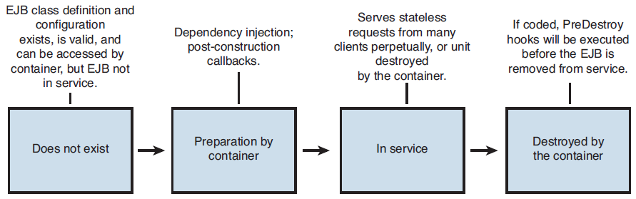
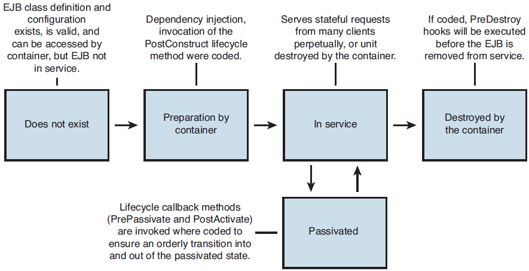
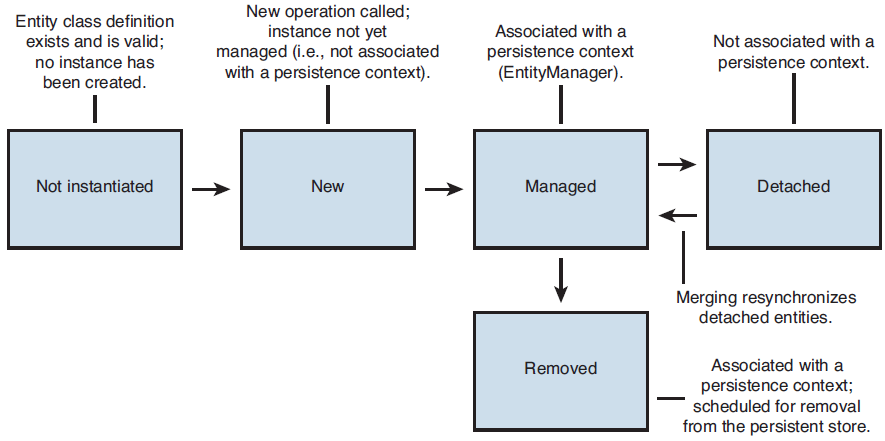

Objectives
==========

-   Explain and contrast uses for entity beans, entity classes, stateful and stateless session beans, and message-driven beans and understand the advantages and disadvantages of each type
-   Explain and contrast the following persistence strategies: Container Managed Persistence (CMP), BMP, JDO, JPA, and ORM, and using Data Access Objects (DAOs) and direct JDBC-based persistence under the following headings: ease of development, performance, scalability, extensibility, and security
-   Explain how Java EE supports the deployment of server-side components implemented as web services and the advantages and disadvantages of adopting such an approach
-   Explain the benefits of the EJB3 development model over previous EJB generations for ease of development, including how the EJB container simplifies EJB development.

Prerequisite
============

-   The exam does not test your knowledge of how good or bad earlier EJB specifications were or how good or bad implementations that use EJB are over non-EJB implementations
-   You are simply expected to display an advanced/expert level of knowledge of how to use EJBs to solve a given business problem in the most correct way

Enterprise Java Bean
--------------------

-   is a serverside component used in JEE architectures to encapsulate a specific piece of business logic
-   common characteristics
    -   They are distributed components. accessed either locally or remotely.
    -   A common contract with EJB clients and EJBs is enforced by a set of well-defined interfaces
    -   implemented as Java classes
    -   managed at runtime by the EJB container, with the container providing important services such as transaction management, security, and concurrency control to the EJBs under its management
    -   They do not explicitly manage either inbound or outbound data - the container manages all client access
    -   They are configured using a combination of metadata annotations, deployment descriptors, and container-supplied variables
    -   If written to use only those services defined by the EJB specification, they can be ported with minimal effort to run on other EJB containers.

-   the EJB component model allows the following high-level characteristics
    -   A stateless service, including the ability to act as a web service end point.
    -   A stateful service
    -   A service invoked asynchronously by a separate component
    -   An entity object - a component that interfaces with a data store to persist an object representation of a domain object

### Session Bean

-   EJBs that contain business logic
-   business logic relating to the implementation of a workflow or process.
-   considered as server-side proxies for the client

#### Stateless Session Bean

-   maintain no internal client-specific state across separate client invocations
-   A small pool of stateless session beans can be used to service a significantly larger number of concurrent requests
-   stateless session beans register once with the EJB Timer Service to receive event notifications by adding an @Timeout annotation

#### Stateful Session Bean

-   stateful session beans maintain internal conversational state across multiple invocations from the same client
-   the programming model is less restrictive and more natural
-   applications that use stateful session beans are not as scalable as an equivalent application that uses stateless session beans
-   can be activated and passivated by the container
-   can also optionally implement the javax.ejb.SessionSynchronization interface
    -   which enables a stateful session bean to participate in a well-defined transaction, and either commit as part of the wider transaction or roll back—because of an error encountered directly, or in response to a rollback directive from the container

-   **cannot be registered with the EJB Timer Service**

### Entity Beans

-   Entity beans persist data
-   entity beans as they existed in the EJB 2.1 specification must be supported by EJB 3.0-compliant containers/application servers, and they will also remain current for a long time due to their widespread usage.
-   entity beans have been replaced by Java Persistence API entities and this fact should be reflected in your Part II solution

#### CMP Entity Bean

-   delegate the persistence of their internal state to the container
-   has the advantage of improving developer productivity, but control of the generated code is lost to the container
    -   the architect must ensure that the CMP implementation of the vendor's EJB container is at least as good as the SQL code that would be generated by hand

#### BMP Entity Bean

-   require developers to explicitly code how their internal state (such as data contained in instance variables) is updated to a persistent store—typically using SQL code.
-   it does require that the developer handcode every single aspect of data persistence
-   best suited to those specific scenarios where a CMP implementation is simply not capable of delivering the performance needed
    -   or no CMP implementation exists for the persistent store being used

#### Entity Class

-   is a plain old Java object (POJO) with annotations that provide a Java Persistence API (JPA) implementation information on how to update the persistent store with the values stored in the instance variables of the entity class.
-   entities can exist even when completely detached from an EntityManager—something not possible in the world of session beans

### Persistence Strategies

-   two major persistence strategies
    -   delegate the actual persistence to the EJB container or an Object-Relational Mapping (ORM) tool
    -   or retain the responsibility of writing that code in return for increased control over the code and, in some cases, to generate code that is more optimal than its auto-generated equivalent

Message-Driven Bean
-------------------

-   receives and processes messages from a JMS destination (queue or topic)
-   provides the JEE platform with the capability to process messages asynchronously
-   can actually be used to consume messages from any Connector 1.5 resource adaptor

Discussion
==========

EJB Advantages and Disadvantages
--------------------------------

-   The decision-making process to use or not use EJB is similar to that when considering whether or not to use a framework
-   Do the benefits of the framework outweigh the overheads for the application under consideration (System under Development [SuD])?

### Scalability

-   Using EJBs provides scalability through one key characteristic: the ability of the EJB container to manage the pool of EJBs, taking into account the number, frequency, and duration of incoming client requests
-   in general, stateless session beans are far more scalable than their stateful equivalent.

### Security

-   one of the core services offered to the EJB developer by the container
-   built-in security capabilities of EJBs are one of the primary reasons for choosing to implement an architecture as EJB-centric rather than web or framework-centric

### Contrasting Persistence Strategies

#### Ease of Development

-   Approaches that abstract the developer away from explicitly coding data access and update logic are, in general, easier to develop with
-   Examples: JPA and other ORM tools and CMP entity beans
-   persistence approaches that require the developer to explicitly code SQL code tend to require longer development durations

#### Performance

-   the trade-off of using ORM, JPA, or CMP is that there is a runtime penalty to be paid for the productivity gains realized in the development phase
-   explicit persistence strategies such as raw SQL executed via a JDBC connection take longer to develop and are more arduous to maintain

#### Extensibility

-   As new columns are added to tables or new business rules need to be encoded into the persistence tier, additional effort must be expended to upgrade the persistence tier to meet these new requirements
-   The JEE 5 specification does not explicitly address how JPA or container providers should address this requirement, so the ease of extensibility varies widely by implementation

### EJB and Web Services

#### EJBs as Web Service End Points

-   A developer can export all public methods on a Java class (including an EJB) simply by placing the @WebService annotation on the class definition
-   The platform automatically publishes the public methods of the class as web service operations, using parts of the JEE 5 platform, such as JAXB 2.0, to map the arguments for each operation into an XML schema

#### EJBs Consuming Web Services

-   any Java class can access web services using the JAXWS API
-   JAX-WS replaces JAX-RPC as the primary API used to access web services in JEE applications.

#### Advantages and Disadvantages

-   **Advantages**
    -   Developer productivity
    -   Rapidly consume web services to meet new business requirements.
    -   Rapidly expose business logic as web services for external applications to meet new business requirements

-   **Disadvantages**
    -   Potential for a disordered application architecture - Architects should strive for a well-defined integration layer in the architecture
    -   Potential for security concerns - Data and information previously accessible only to authenticated users of the application is now available to external users and applications
    -   Potential for data validation to be broken or circumvented - A previously robust component may integrate a new web service, and not check the data returned and damage the referential integrity of a database or break a business rule by using unvalidated data.

### EJB 3

#### Ease of Development

-   the single biggest driver for the EJB 3.0 specification was to improve developer productivity and simplify the process of developing EJBs of all types.
-   The 3.0 specification and implementations of that specification reduce significantly that overhead, while still retaining all of the advantages of EJBs.

#### Container in EJB 3

-   has not changed significantly from an architect/developer perspective
-   It still provides a base set of plumbing or infrastructure services, designed to allow the developer to focus on implementing the business logic for a specific application

#### JPA in EJB 3

-   it is important to note that there are certain cases where JPA is not a silver bullet or panacea, specifically the following
-   **When raw performance is necessary** - statements need to be explicitly tuned by hand
-   **When minor modifications are being made to a persistence tier already implemented** - the benefits in rewriting the entire tier to use JPA are outweighed by the cost and risk in doing so
-   **When the underlying datastore is not well supported by mainstream JPA implementations** - if the application does not persist to a relational database
