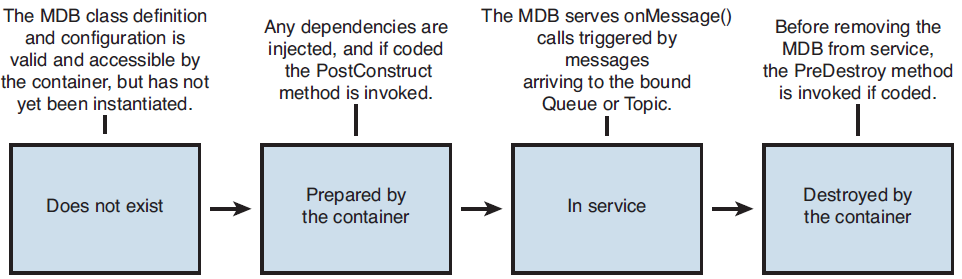

Objectives
==========

-   Explain possible approaches for communicating with an external system from a Java EE-based system given an outline description of those systems and outline the benefits and drawbacks of each approach.
-   Explain typical uses of web services and XML over HTTP as mechanisms to integrate distinct software components
-   Explain how JCA and JMS are used to integrate distinct software components as part of an overall JEE application
-   Given a scenario, explain the appropriate messaging strategy to satisfy the requirements

Prerequisite
============

Web Services
------------

-   is a piece of software designed to allow system-to-system communication over a network
-   The vast majority of web services in existence today communicate using SOAP or XML over the HTTP or HTTPS protocols
    -   the more general concept of a web service, as defined by the W3C, allows for multiple transport and data protocols
-   started out as a simple concept
-   addresses the issues of security, reliability, and transactions through the WS-Security, WS-ReliableMessaging, WS-Coordination, and WS-AtomicTransactions specifications
-   From an exam perspective, you must understand at a high level what each of these specifications does and how it is or is not addressed in the JEE platform

SOAP
----

-   Simple Object Access Protocol (SOAP) is an XML-based extensible method of representing data.
-   Web services can be written to consume and emit SOAP-based messages or XML messages
-   SOAP has the benefit of adding more information (via the envelope, encoding rules, and data representation conventions) over "raw XML"
-   has the drawback of being more complex and introduces more overhead - both in terms of on-the-wire transmission size and message parsing resources

WSDL
----

-   is a descriptor for web services, defining the information needed to access and consume a web service

JAX-RPC
-------

-   Java API for XML-based Remote Procedure Call
-   Your study of this API for the exam should focus on why JAX-WS is a better replacement for it

JAX-WS
------

-   is the primary Java API for XML-based web services, both SOAP based and RESTful.
-   the preferred way to access web services in the Java EE 5 platform
-   JAX-WS 2.0 is a follow-on to JAX-RPC 1.1, extending it as described in the following sections

JAXB
----

-   Java API for XML Binding
-   enables developers to create mappings from Java object representations to their XML equivalents (both schemas and data) and vice versa
-   JAXB is used heavily by the main web services specification in the JEE platform: JAX-WS

JAXR
----

-   Java API for XML Registries
-   this API has seen little adoption since its inception and is not an important part of the platform to focus on
-   the vision for web services was that architects would access central repositories like UDDI using JAXR to somehow create system architectures on the fly that would meet business requirements

JMS
---

-   the non-web services integration elements of the Java EE platform.
-   is the core messaging infrastructure used within the JEE platform to allow asynchronous Java to Java integration via queues or topics
-   the preferred mechanism for intra-company integrations, where the architect can control both the message producer and consumer
    -   In that scenario, JMS can provide a better solution than the main competing alternative: web services
-   In a JEE application, MDBs are the most logical way to consume messages from a JMS Provider

JCA
---

-   Java Connector Architecture (JCA) provides a standardized access mechanism to Enterprise Information Sources or EISs from the Java EE platform
-   it still has its place, especially in wrapping legacy applications that still have business value and exposing their functionality as a well-formed API for consumption

by Java EE applications

-   Web 2.0 companies building social network applications have no need for JCA whatsoever
-   Financial services companies, with a substantial investment in legacy systems that still meet business requirements, use JCA widely to expose these EISs to a Java EE application server and thus lend the EIS a new lease of life

Discussion
==========

-   Integration is the process by which information is passed between two or more distinct software entities
-   expand that definition by asking the following series of questions
    -   Is the transfer of information synchronous or asynchronous?
    -   Is the transfer of information acknowledged?
    -   Is the transfer of information transactional?
    -   Does the transfer of information occur in batches composed of multiple messages or one message at a time?
    -   Does the transfer of information require message-level or transport-level encryption?
    -   Does the transfer of information occur between systems built using the same technology or different technologies?
    -   Does the transfer of information use a technology-specific messaging/transport protocol or a technology-independent protocol?

Java to Java Integration
------------------------

-   A substantial class of integration projects require two systems implemented on the Java platform to pass information between each other
-   adopting a solution that introduces overhead in the form of a more verbose data representation or that is Java-independent is, on the face of it, only warranted if a non-Java system can be expected to also integrate with the systems currently under consideration
-   there is one major component of the Java EE 5 platform that deals precisely with the Java to Java requirement: Java Messaging Service (JMS)

### Java Messaging Service (JMS)

-   intrinsically asynchronous
-   synchronous semantics can be emulated,
-   JMS supports the following
    -   Publish-subscribe and point-to-point messaging models
    -   Message delivery acknowledgments
    -   Message-level encryption
    -   Distributed transactions via integration with the Java Transaction API (JTA), using the XAConnectionFactory, XAConnection, and XASession objects/interfaces

Java to Non-Java Integration
----------------------------

-   When integrating a Java system to an external system not owned or controlled by the architect, web services are typically needed and used
-   JMS is not appropriate
-   there are two options open to the software architect using JEE
    -   Web services using SOAP or RESTful semantics
    -   and the Java Connector Architecture (JCA)

### Web Services

-   Web services are more suitable because:
    -   Web services were intrinsically designed to facilitate the integration of heterogeneous systems; JMS wasn't
    -   JMS is optimized for Java producers and consumers of messages
    -   Using web services ensures that if the underlying implementation of the other system changes, as long as the web services contract as described in the WSDL is maintained, the other system(s) will not be impacted
    -   Using web services is truly technology independent, admitting non-Java implementations as both producers and consumers of messages
-   Within web services, the architect faces another decision: whether to embrace SOAP messages or to use a simpler, but less self-describing message format such as simple XML
    -   Proponents of XML-RPC are proponents because of its simpler programming model, on-thewire representation of data, and lower runtime overhead
    -   Adherents of SOAP value its total commitment to self-describing interoperability, at the expense of a steeper learning curve, more verbose representation, and higher runtime overhead to construct and parse SOAP messages than a leaner alternative

### Java Connector Architecture (JCA)

-   is used to provide standardized access to an existing enterprise information system (EIS) from the JEE platform
-   A complete JCA system will have three main components
    -   the EIS itself
    -   the resource adaptor that implements the connector specification
    -   the Java EE-compliant application server, which uses the resource adaptor to access the EIS
-   JCA focuses on
    -   full support for transaction context propagation to preserve Atomicity, Consistency, Isolation, and Durability (ACID)
    -   semantics across application boundaries
    -   scalability
    -   correct recovery from failed/interrupted operations

Essential Points
================

-   The choice of which mechanism to use should always be driven by the business requirements and existing architecture.
-   The Java EE 5 platform provides comprehensive support for web services, through multiple specifications. Of these specifications, JAX-WS 2.0, along with JAXB, is the most important to revise
