Core Java EE Patterns
=====================

Presentation Tier
-----------------

### Intercepting Filter

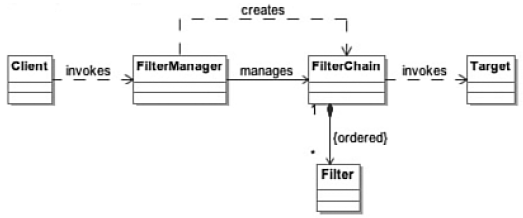

-   provides the ability to manipulate a request prior to processing or to manipulate the response before sending the results of the request
-   **Benefits**
    -   Centralizes pre/post processing of requests
-   **When to Use**
    -   You need to pre/post process a request or response

### Context Object

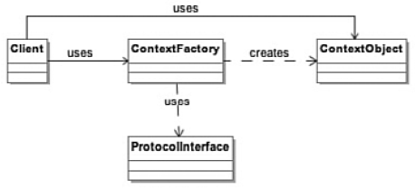

-   is used to encapsulate the specifics of protocol implementation to be shared
-   **Benefits**
    -   Improves reusability and maintainability
    -   Allows code to be portable across operating systems
-   **When to Use**
    -   Components need access to system information
    -   Decouple application from underlining protocols and system interfaces

### Front Controller

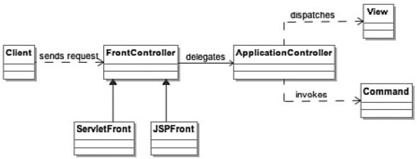

-   creates central control logic for presentation request handling
-   the Front Controller is determining processing based on the request
-   **Benefits**
    -   Centralizes control logic
    -   Improves reusability
    -   Improves separation of concerns
-   **When to Use**
    -   Apply common logic to multiple requests
    -   Separate processing logic from view

### Application Controller

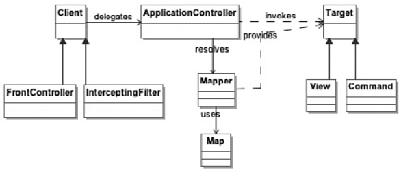

-   is used to centralize retrieval and invocation of request-processing components, such as commands and views
-   **Benefits**
    -   Improves extensibility
    -   Improves separation of concerns
-   **When to Use**
    -   Apply common control logic
    -   Have centralized view management

### View Helper

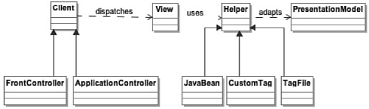

-   separates the processing logic from the view
-   **Benefits**
    -   Separates logic from the view
-   **When to Use**
    -   Encapsulate view-processing logic

### Composite View

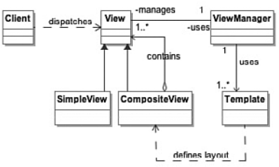

-   combines simple views into a more complex view without handling the content or layout
-   **Benefits**
    -   Code duplication is reduced because you can create common headers, footers, and other components
    -   Views can be changed based on access authorization
-   **When to Use**
    -   You want common view components
    -   You view component changes based on authorization

### Dispatcher View

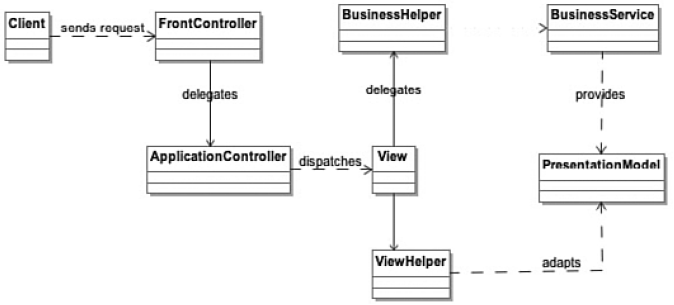

-   handles the request and generates a response while managing limited business processing
-   **Benefits**
    -   Separates processing logic from view
    -   Improves reusability
-   **When to Use**
    -   You have static views
    -   You have limited business processing

### Service to Worker

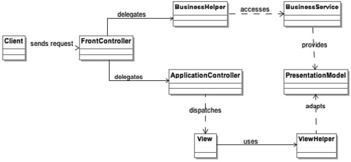

-   performs request handling and invokes business logic before control is passed to the view
-   **Benefits**
    -   Improves separation of concerns
-   **When to Use**
    -   Centralize business logic for requests

Business Tier
-------------

### Business Delegate

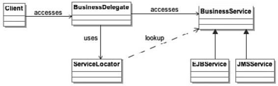

-   hides the complexity of remote communication with business components from the client
-   **Benefits**
    -   Minimizes coupling of clients to business services
    -   Hides remoteness
    -   Improves performance
-   **When to Use**
    -   Want to encapsulate access to business services from multiple client types
    -   Translate exceptions into application exceptions
    -   Hide details of service creation

### Service Locator

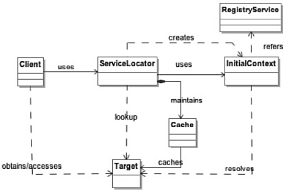

-   uses a consistent approach to locating business components regardless of the type of components
-   **Benefits**
    -   Standardized approach to retrieving business components
-   **When to Use**
    -   You have many different business services that are located in different ways

### Session Façade

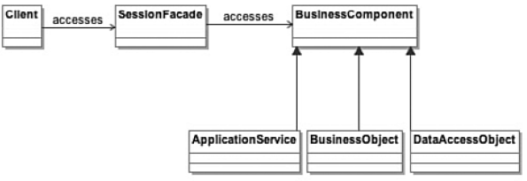

-   provides a coarse-grained service of business components to remote clients
-   same as a Façade pattern, but just provides an interface to a service instead of code
-   **Benefits**
    -   Reduces coupling between the tiers
    -   Improves performance by reducing fine-grained calls from client
-   **When to Use**
    -   You have a series of calls to make to business components from the client

### Application Service

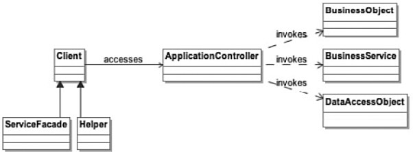

-   centralizes and aggregates business components
-   a helper to the Session Façade that takes care of all the business logic and workflow
-   **Benefits**
    -   Centralizes and improves reusability of business logic
    -   Simplifies the Session Façade by eliminating the business logic
-   **When to Use**
    -   Start to see duplicated business logic in the Session Façade

### Business Object

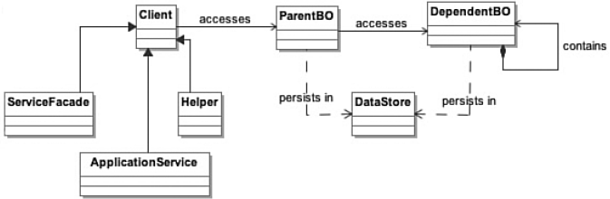

-   separates business data from logic
-   **Benefits**
    -   Separates persistence from business logic
-   **When to Use**
    -   Want to increase reusability of business logic

### Composite Entity

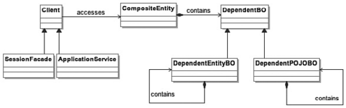

-   aggregates business entities into a coarse-grained entity
-   **Benefits**
    -   Increases maintainability
    -   Improves network performance
-   **When to Use**
    -   Avoid remote entity beans
    -   Leverage bean managed persistence (BMP) with custom persistence implementation
    -   Encapsulate POJO business objects

### Transfer Object

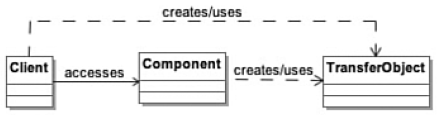

-   uses an object to carry data across tiers
-   **Benefits**
    -   Reduces network traffic
    -   Reduces code duplication
-   **When to Use**
    -   You need to send objects between tiers

### Transfer Object Assembler

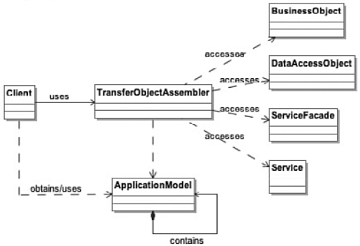

-   builds a composite transfer object and returns to the client
-   **Benefits**
    -   Improves network performance
-   **When to Use**
    -   You have several transfer objects that are sent between tiers

### Value List Handler

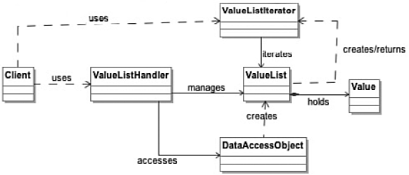

-   caches results and allows the client to traverse and select from the results
-   **Benefits**
    -   Caches search results
    -   Improves network performance
    -   Improves separation of concerns
-   **When to Use**
    -   Want to iterate through a set of objects
    -   Implement read-only lists without transactions

Integration Tier
----------------

### Data Access Object

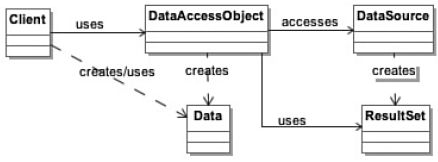

-   encapsulates access to a persistent store by managing the connection with the data store
-   **Benefits**
    -   Reduces code complexity in client
    -   Improves code reuse
    -   Provides easier migration to new data store
-   **When to Use**
    -   Decouple data access from the business logic
    -   Provide all data access from in a separate layer

### Service Activator

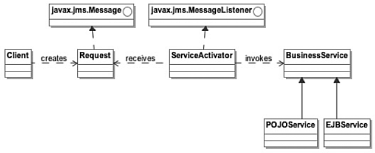

-   handles asynchronous requests to business components
-   **Benefits**
    -   Allows the client to continue processing
    -   Integrates JMS into application
-   **When to Use**
    -   You need to invoke a business service in an asynchronous manner

### Domain Store

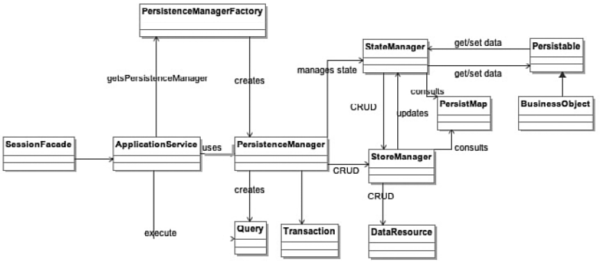

-   separates the persistence of an object from the object model
-   **Benefits**
    -   Decouples business logic from persistence logic
-   **When to Use**
    -   You do not want to use entity beans
    -   Object model uses are complex

### Web Service Broker

-   exposes and brokers services using XML and web protocols
-   **Benefits**
    -   Exposes existing services to web
-   **When to Use**
    -   Need to expose services as web services
