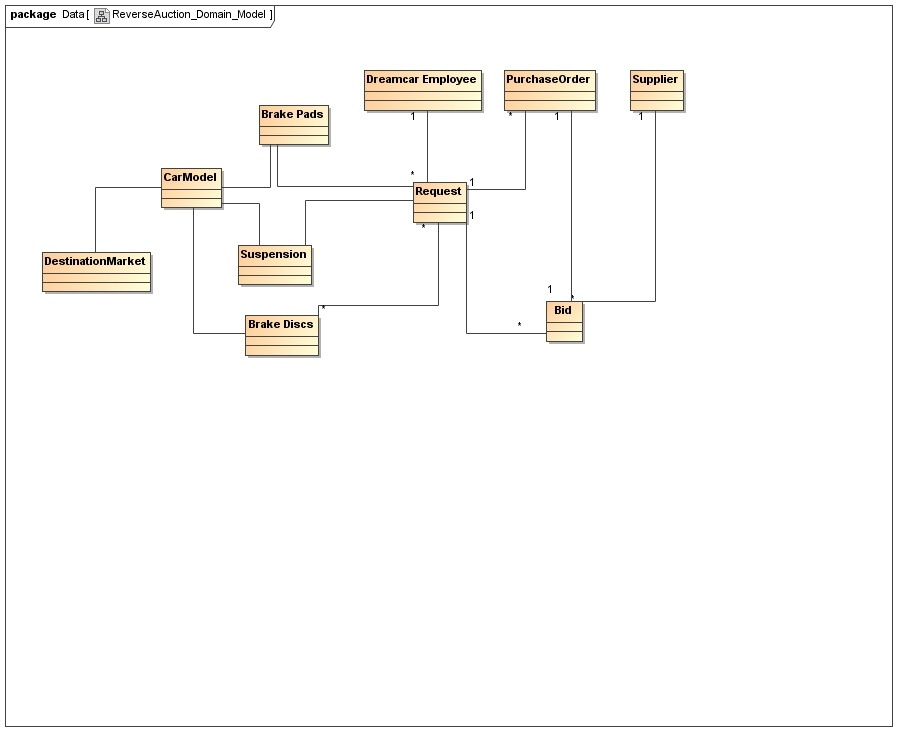
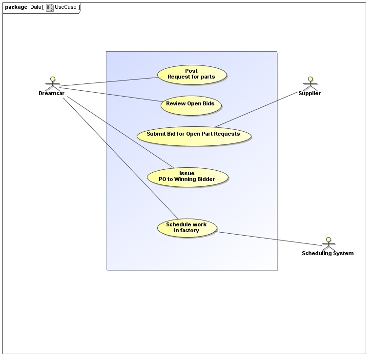

Dreamcar
========

Dreamcar is a successful car manufacturer with sales and distribution channels in the Asia-Pacific markets of South Korea, Australia, Malaysia, and Vietnam. However, the company plans to expand into three new markets over the next seven years - Japan, Western Europe, and North America. To do this, the company has identified a need to improve the build quality of completed cars and also the component quality. Initial procurement studies have predicted a cost saving of up to 30 percent if Dreamcar can procure standard components, such as wheels, tires, suspension, brake discs, and pads using a reverse auctioneering application open to international participation rather than relying on local importers and a traditional procurement process.

Workshop Output
===============

You are the architect for the reverse auctioneering application at Dreamcar. You have been tasked by Dreamcar management to lead the team responsible for the design, implementation, and ongoing management of the complete system as a turnkey or complete solution. After an intensive series of discovery workshops with in-house business analysts and subject matter experts, you know the following facts:

Dreamcar relies on a Just In Time (JIT) manufacturing process to reduce idle and out of date inventory within the company. Phase one of the application will focus on three main components – brake pads, brake discs, and suspension components, with additional part types coming in a later phase once the marketplace has successfully launched.

Dreamcar has recently invested in a state of the art stock inventory system that predicts demand for components up to one month in advance so that orders for a specific marketplace can be manually placed into a reverse auctioneering application to get the best possible price for the parts required. This inventory system is accessed using a web services API. International participation in the reverse auctioneering application is proven to make similar marketplaces more competitive than purely local participation, but international companies must be satisfied that the marketplace mechanisms are both transparent and impartial, including the speed of any API integration mechanisms. Dreamcar has committed to a system uptime of 99.99 percent during core working hours (8 am – 8 pm GMT +7) and an average API response time of five (5) seconds or less for 95 percent of all requests with a maximum response time of ten (10) seconds for all requests.

Note on Reverse Auctions
========================

A reverse auction is a method of procurement used by the procuring party to create more competition between potential suppliers for a given bid request. A reverse auction operates as follows:

The procurer places a request for bids to supply an item or service with multiple potential suppliers; Interested suppliers make their best offer to supply the requested item or service – taking into account that they may not be the only supplier bidding and that they must be competitive in order to win the business;

A reverse auction can be blind (none of the suppliers know what the other suppliers are bidding) or open (each supplier can review each other's bids and decide whether or not to outbid a competitor); and finally, after a pre-defined criteria is met (time period, price threshold met), the procuring party ends the auction and selects a winning supplier.

Dreamcar intend to use the open method of reverse auctioning in this application in order to heighten inter-supplier competitiveness.

Business Domain Model
=====================

The following business domain model describes the key objects identified during the workshops. All of these objects and the relationships between them should be addressed in your design and implementation. 

Use Case Diagrams
=================

The following use case diagram captures the main use cases that must be supported by your proposed design and implementation.

The use case specifications provided are a first pass at the use cases and provide enough detail in order for you to architect a solution.

Use Case Specification - Post Request for Parts
===============================================

Brief Description

The Post Request use case allows an authorized Dreamcar representative to place a request for a required quantity of parts.

Basic Flow

1.  Dreamcar representative inputs a part category and quantity.
2.  System responds with a validation that the part and quantity is a valid bid request.
3.  The system makes the bid request status open so that bidders can view and bid for the request.

Use Case Specification - Review Open Bids
=========================================

Brief Description

The Review Open Bids use case allows an authorized Dreamcar representative to review open bids placed in response to an open bid request.

Basic Flow

1.  Dreamcar representative searches for open bids and selects one of interest.
2.  System responds with all bid requests relating to the selected bid request.

Use Case Specification - Submit Bid for Open Parts Request
==========================================================

Brief Description

The Submit Bid for Open Parts Request use case allows an authorized supplier to bid on open bid requests of interest that exist in the system.

Basic Flow

1.  Supplier representative searches for open bid requests.
2.  System responds with all bid requests relating to the search criteria.
3.  Supplier representative selects open bid request of interest.
4.  Supplier representative places a bid for the open bid request.
5.  System records the supplier bid against the bid request.

Use Case Specification - Issue PO to Winning Bidder
===================================================

Brief Description

The Issue PO to Winning Bidder use case allows a Dreamcar representative to select a winning bid for a specific bid request and issue a PO to the supplier associated with that bid.

Basic Flow

1.  Dreamcar representative searches for closed bid requests.
2.  System responds with all bid requests relating to the search criteria.
3.  Dreamcar representative selects closed bid request of interest.
4.  Dreamcar representative reviews all bids to ensure that the most valid bid has been chosen.
5.  Dreamcar representative accepts the most suitable bid.
6.  The system issues a PO to the winning supplier.

Use Case Specification - Schedule Work in Factory
=================================================

Brief Description

The Schedule Work in Factory use case allows an authorized Dreamcar representative to schedule work in the car assembly plant, which relies on the successful bid requests placed with suppliers in the auction system.

Basic Flow

1.  Dreamcar representative searches for closed bid requests with a PO raised.
2.  System responds with all bid requests relating to the search criteria.
3.  Dreamcar representative selects the bid of interest.
4.  Dreamcar representative changes the status of the bid to "scheduled."
5.  System sends the bid details to the inventory system so that the work that relies on the parts request can now be scheduled.
