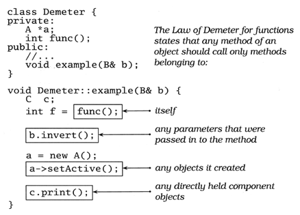
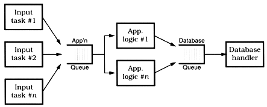

A Pragmatic Philosophy
----------------------

## The Cat Ate My Source Code

-   Take Responsibility
    -   You have the right not to take on a responsibility for an impossible situation, or one in which the risks are too great. You'll have to make the call based on your own ethics and judgment.
    -   When you do accept the responsibility for an outcome, you should expect to be held accountable for it. When you make a mistake (as we all do) or an error in judgment, admit it honestly and try to offer options.
    -   it is up to you to provide solutions, not excuses.

## Software Entropy

-   Entropy is a term from physics that refers to the amount of "disorder" in a system
-   When disorder increases in software, programmers call it "software rot."
-   What makes the difference? **A broken window.**
    -   instills in the inhabitants of the building a sense of abandonment;
    -   a sense that the powers that be don't care about the building

-   Take some action to prevent further damage and to show that you're on top of the situation
-   neglect accelerates the rot faster than any other factor
-   Even if there's a fire raging (deadline, release date, trade show demo, etc.), you don't want to be the first one to make a mess

## Stone Soup and Boiled Frogs

-   "It's easier to ask forgiveness than it is to get permission."
-   **Be a Catalyst for Change**
-   **Remember the Big Picture**
-   if you take a frog and drop it into boiling water, it will jump straight back out again. However, if you place the frog in a pan of cold water, then gradually heat it, the frog won't notice the slow increase in temperature and will stay put until cooked.
-   In the Broken Window Theory, people lose the will to fight entropy because they perceive that no one else cares. The frog just doesn't notice the change.
-   Don't be like the frog. Keep an eye on the big picture. Constantly review what's happening around you, not just what you personally are doing.

## Good-Enough Software

-   you can discipline yourself to write software that's good enough—good enough for your users, for future maintainers, for your own peace of mind.
-   users be given an opportunity to participate in the process of deciding when what you've produced is good enough.

-   Involve Your Users in the Trade-Off
    -   The scope and quality of the system you produce should be specified as part of that system's requirements.
    -   **Make Quality a Requirements Issue**
    -   Great software today is often preferable to perfect software tomorrow.

## Your Knowledge Portfolio

-   Your knowledge and experience are your most important professional assets.
-   Unfortunately, they're expiring assets. Your knowledge becomes out of date as new techniques, languages, and environments are developed.
-   Serious investors invest regularly—as a habit.
    -   Diversification is the key to long-term success.
    -   Smart investors balance their portfolios between conservative and high-risk, high-reward investments.
    -   Investors try to buy low and sell high for maximum return.
    -   Portfolios should be reviewed and rebalanced periodically.

A Pragmatic Approach
--------------------

## The Evils of Duplication

-   knowledge isn't stable. It changes—often rapidly
-   Programmers are constantly in maintenance mode. Our understanding changes day by day
-   maintenance is not a discrete activity, but a routine part of the entire development process.
-   Every piece of knowledge must have a single, unambiguous, authoritative representation within a system.
-   **DRY—Don't Repeat Yourself**
-   How Does Duplication Arise?
    -   Imposed duplication. Developers feel they have no choice—the environment seems to require duplication.
        -   Think also about comments in header and implementation files. There is absolutely no point in duplicating a function or class header comment between the two files.
        -   Use the header files to document interface issues, and the implementation files to document the nitty-gritty details that users of your code don't need to know.

    -   Inadvertent duplication. Developers don't realize that they are duplicating information.
    -   Impatient duplication. Developers get lazy and duplicate because it seems easier.
        -   shortcuts make for long delays

    -   Interdeveloper duplication. Multiple people on a team (or on different teams) duplicate a piece of information.
        -   hardest type of duplication to detect and handle
        -   Set up forums to discuss common problems
        -   make a point of reading other people's source code and documentation - You're not snooping—you're learning from them
        -   **Make It Easy to Reuse**

## Orthogonality

-   Two or more things are orthogonal if changes in one do not affect any of the others
-   the database code will be orthogonal to the user interface: you can change the interface without affecting the database, and swap databases without changing the interface
-   When components of any system are highly interdependent, there is no such thing as a local fix.
-   **Eliminate Effects Between Unrelated Things**
-   two major benefits
    -   increased productivity
        -   Simple components can be designed, coded, unit tested, and then forgotten—there is no need to keep changing existing code as you add new code.
        -   The more loosely coupled your systems, the easier they are to reconfigure and reengineer.
        -   if the two components are not orthogonal, there will be overlap.

    -   reduced risk
        -   Diseased sections of code are isolated
        -   resulting system is less fragile
        -   will probably be better tested

-   When teams are organized with lots of overlap, members are confused about responsibilities. Every change needs a meeting of the entire team, because any one of them might be affected.
    -   Each major infrastructure component (database, communications interface, middleware layer, and so on) gets its own subteam. Each obvious division of application functionality is similarly divided.
    -   see how many people need to be involved in discussing each change that is requested. The larger the number, the less orthogonal the group

-   layered approach is a powerful way to design orthogonal systems
-   Layering also reduces the risk of runaway dependencies between modules
-   Are you using a telephone number as a customer identifier? What happens when the phone company reassigns area codes? Don't rely on the properties of things you can't control.
-   There are several techniques you can use to maintain orthogonality:
    -   Keep your code decoupled. If you need to change an object's state, get the object to do it for you. This way your code remains isolated from the other code's implementation.
    -   Avoid global data.
        -   Be careful with singletons—they can lead to unnecessary linkage.

## Reversibility

-   The mistake lies in assuming that any decision is cast in stone—and in not preparing for the contingencies that might arise. Instead of carving decisions in stone, think of them more as being written in the sand at the beach.
-   **There Are No Final Decisions**
-   While many people try to keep their code flexible, you also need to think about maintaining flexibility in the areas of architecture, deployment, and vendor integration.
-   Normally, you can simply hide a third-party product behind a well-defined, abstract interface.

## Tracer Bullets

-   Like the gunners, you're trying to hit a target in the dark. Because your users have never seen a system like this before, their requirements may be vague.
-   we're looking for something that gets us from a requirement to some aspect of the final system quickly, visibly, and repeatably.
-   **Use Tracer Bullets to Find the Target**
-   Tracer code is not disposable: you write it for keeps. It contains all the error checking, structuring, documentation, and self-checking that any piece of production code has.
-   It simply is not fully functional.
-   Tracer development is consistent with the idea that a project is never finished: there will always be changes required and functions to add. It is an incremental approach.
-   A small body of code has low inertia—it is easy and quick to change.
-   Prototyping generates disposable code. Tracer code is lean but complete, and forms part of the skeleton of the final system.
-   Think of prototyping as the reconnaissance and intelligence gathering that takes place before a single tracer bullet is fired.

## Prototypes and Post-it Notes

-   Post-it notes are great for prototyping dynamic things such as workflow and application logic.
-   If you find yourself in an environment where you cannot give up the details, then you need to ask yourself if you are really building a prototype at all.
-   What sorts of things might you choose to investigate with a prototype? Anything that carries risk, that hasn't been tried before, that is absolutely critical to the final system, unproven, experimental, or doubtful. **Anything you aren't comfortable with.**
-   **Prototyping is a learning experience. Its value lies not in the code produced, but in the lessons learned. That's really the point of prototyping.**
-   Details that can be ignored
    -   Correctness. You may be able to use dummy data where appropriate.
    -   Completeness. The prototype may function only in a very limited sense.
    -   Robustness. Error checking is likely to be incomplete or missing entirely.

-   look for in the architectural prototype: Does every module have an access path to the data it needs during execution? Does it have that access when it needs it?
-   set the right expectations

## Domain Languages

-   Computer languages influence how you think about a problem, and how you think about communicating.
-   **Program Close to the Problem domain**
-   why would you choose a more complex grammar? trade-off is extendibility and maintenance.

## Estimating

-   **Estimate to Avoid Surprises**
-   record your estimates so you can see how close you were
-   When an estimate turns out wrong Find out why it differed from your guess.
-   take some time to uncover what happened
-   What to Say When Asked for an Estimate: "I'll get back to you."

The Basic Tools
---------------

## The Power of Plain Text

-   our base material is knowledge
-   We gather requirements as knowledge, and then express that knowledge in our designs, implementations, tests, and documents.
-   **Keep Knowledge in Plain Text** - With plain text, however, you can achieve a self-describing data stream that is independent of the application that created it.
-   Some developers may worry that by putting metadata in plain text, they're exposing it to the system's users. This fear is misplaced.
    -   Binary data may be more obscure than plain text, but it is no more secure.
    -   If you worry about users seeing passwords, encrypt them.
    -   If you don't want them changing configuration parameters, include a secure hash of all the parameter values in the file as a checksum.

-   As long as the data survives, you will have a chance to be able to use it
-   You can parse such a file with only partial knowledge of its format

## Debugging

-   Embrace the fact that debugging is just problem solving, and attack it as such.
-   in the technical arena, you want to concentrate on fixing the problem, not the blame.
-   It doesn't really matter whether the bug is your fault or someone else's. It is still your problem.
-   remember the first rule of debugging: **Don't Panic**
-   Where to Start
    -   make sure that you are working on code that compiled cleanly — without warnings.
    -   you can't afford to waste time debugging coincidences

-   The best way to start fixing a bug is to make it reproducible
-   explain it to someone else
-   having to verbalize some of these assumptions, you may suddenly gain new insight into the problem
-   is generally more profitable to assume that the application code is incorrectly calling into a library than to assume that the library itself is broken
-   Don't gloss over a routine or piece of code involved in the bug because you "know" it works. Prove it. Prove it in this context, with this data, with these boundary conditions.

Pragmatic Paranoia
------------------

-   **You Can't Write Perfect Software**
-   No one in the brief history of computing has ever written a piece of perfect software.
-   It's unlikely that you'll be the first.

## Design by Contract

-   Preconditions - What must be true in order for the routine to be called; the routine's requirements.
    -   A routine should never get called when its preconditions would be violated.
    -   It is the caller's responsibility to pass good data.

-   Postconditions - What the routine is guaranteed to do; the state of the world when the routine is done.
    -   The fact that the routine has a postcondition implies that it will conclude: infinite loops aren't allowed.

-   Class invariants - A class ensures that this condition is always true from the perspective of a caller.
    -   During internal processing of a routine, the invariant may not hold, but by the time the routine exits and control returns to the caller, the invariant must be true.
    -   A class cannot give unrestricted write-access to any data member that participates in the invariant.

Mais informações [aqui](http://sustainablesoftware.wordpress.com/2008/04/13/contracts-in-java-using-icontract/ "http://sustainablesoftware.wordpress.com/2008/04/13/contracts-in-java-using-icontract/").

-   Emphasis is on "lazy" code: be strict in what you will accept before you begin, and promise as little as possible in return.

-   you might want to establish a contract for setFont such as the following, which ensures that the font you set is the font you get:

`[java,N] /**`

\* @pre f != null \* @post getFont() == f \*/ public void setFont(final Font f) { // ...

-   The greatest benefit of using DBC may be that it forces the issue of requirements and guarantees to the forefront.

-   Assertions
    -   there is no support for propagating assertions down an inheritance hierarchy
    -   the contract is not automatically enforced
    -   there is no built-in concept of "old" values; that is, values as they existed at the entry to a method.

-   runtime system and libraries are not designed to support contracts

-   Who is repondible for cheeking the precondition, the caller or the routine being called? when implemented as part of the language, the answer is neither: the routine but before the routine itself is entered.
    -   The sqrt function has a precondition — its argument must not be negative. If the user enters a negative number at the console, it is up to the calling code to ensure that it never gets passed to sqrt. Whater its choice, this is definitely not sqrt's problem.
    -   By expressing the domain of the square root function in the precondition of the sqrt routine, you shift the burden of correctness to the call—where it belongs. You can then design the sqrt routine secure in the knowledge its input will be in range.

## Dead Programs Tell No Lies

-   **Crash Early**
-   many times, crashing your program is the best thing you can do.
-   when your code discovers that something that was supposed to be impossible just happened, your program is no longer viable.
-   terminate it as soon as possible.
-   A dead program normally does a lot less damage than a crippled one.

## Assertive Programming

-   **If It Can't Happen, Use Assertions to Ensure That It Won't**
-   the condition passed to an assertion should not have a side effect
-   never put code that must be executed into an assert
-   Don't use assertions in place of real error handling
-   Turning off assertions when you deliver a program to production is like crossing a high wire without a net because you once made it across in practice. There's dramatic value, but it's hard to get life insurance.

## When to Use Exceptions

-   exceptions should be reserved for unexpected events
-   **Use Exceptions for Exceptional Problems**

## How to Balance Resources

-   Deallocate resources in the opposite order to that in which you allocate them. That way you won't orphan resources if one resource contains references to another.
-   When allocating the same set of resources in different places in your code, always allocate them in the same order. This will reduce the possibility of deadlock.

Bend or Break
-------------

-   we need to make every effort to write code that's as loose—as flexible—as possible.

## Decoupling and the Law of Demeter

-   When we ask an object for a particular service, we'd like the service to be performed on our behalf. We do not want the object to give us a third-party object that we have to deal with to get the required service.
-   Traversing relationships between objects directly can quickly lead to a combinatorial explosion of dependency relationships.
-   symptoms
    -   "Simple" changes to one module that propagate through unrelated modules in the system
    -   Developers who are afraid to change code because they aren't sure what might be affected

-   **Minimize Coupling Between Modules**
-   Because following the Law of Demeter reduces the size of the response set in the calling class, it follows that classes designed in this way will also tend to have fewer errors.
-   by reversing the Law of Demeter and tightly coupling several modules, you may realize an important performance gain.
-   As long as it is well known and acceptable for those modules to be coupled, your design is fine.

## Metaprogramming

-   Every time we have to go in and change the code to accommodate some change in business logic, or in the law, or in management's personal tastes of the day, we run the risk of breaking the system—of introducing a new bug.
-   **Configure, Don't Integrate**
-   Use metadata to describe configuration options for an application: tuning parameters, user preferences, the installation directory, and so on.
-   representing configuration metadata in plain text—it makes life that much easier.
-   when should a program read this configuration?
    -   consider how your application will be used: if it is a long-running server process, you will want to provide some way to reread and apply metadata while the program is running.
    -   For a small client GUI application that restarts quickly, you may not need to.

-   Without metadata, your code is not as adaptable or flexible as it could be. Is this a bad thing? Well, out here in the real world, species that don't adapt die.

## Temporal Coupling

-   the role of time as a design element of the software itself
-   two aspects of time that are important to us: concurrency (things happening at the same time) and ordering (the relative positions of things in time)
-   things tend to be linear
-   This approach is not very flexible, and not very realistic.
-   We need to allow for concurrency and to think about decoupling any time or order dependencies.

-   Workflow
    -   **Analyze Workflow to Improve Concurrency\*\*\***
    -   **Design Using Services**
    -   In a hungry consumer model, you replace the central scheduler with a number of independent consumer tasks and a centralized work queue. Each consumer task grabs a piece from the work queue and goes on about the business of processing it. As each task finishes its work, it goes back to the queue for some more. This way, if any particular task gets bogged down, the others can pick up the slack, and each individual component can proceed at its own pace. Each component is temporally decoupled from the others.
    -   Instead of components, we have really created services—independent, concurrent objects behind well-defined, consistent interfaces.

-   Design for Concurrency
    -   You must ensure that an object is in a valid state any time it could possibly be called.
    -   Often this problem shows up with classes that define separate constructor and initialization routines (where the constructor doesn't leave the object in an initialized state).
    -   Using class invariants will help you avoid this trap.
    -   **Always Design for Concurrency**
    -   trying to add concurrency to a nonconcurrent application is much harder

## Blackboards

-   blackboard system lets us decouple our objects from each other completely, providing a forum where knowledge consumers and producers can exchange data anonymously and asynchronously.
-   cuts down on the amount of code we have to write.

Para saber mais:

-   Artigo no TheServerSide [aqui](http://www.theserverside.com/tt/articles/article.tss?l=UsingJavaSpaces "http://www.theserverside.com/tt/articles/article.tss?l=UsingJavaSpaces")
-   Implementação Blitz [aqui](http://www.dancres.org/blitz/ "http://www.dancres.org/blitz/")
-   Jini Project [aqui](http://www.jini.org/wiki/Main_Page "http://www.jini.org/wiki/Main_Page")
-   GigaSpaces [aqui](http://www.gigaspaces.com/xap "http://www.gigaspaces.com/xap")

-   Since we can store objects, we can use a blackboard to design algorithms based on a flow of objects, not just data.
-   A big advantage of systems such as these is that you have a single, consistent interface to the blackboard.
-   when a fact is posted it can trigger the appropriate rules
-   **Use Blackboards to Coordinate Workflow**

While You Are Coding
--------------------

## Programming by Coincidence

-   Accidents of Implementation
    -   Calling things in the wrong order, or in the wrong context, is a related problem.

-   Why should you take the risk of messing with something that's working?
    -   It may not really be working—it might just look like it is.
    -   The boundary condition you rely on may be just an accident. In different circumstances it might behave differently.
    -   Undocumented behavior may change with the next release of the library.
    -   Additional and unnecessary calls make your code slower.
    -   Additional calls also increase the risk of introducing new bugs of their own.

-   For routines you call, rely only on documented behavior. If you can't, for whatever reason, then document your assumption well.
-   Assumptions that aren't based on well-established facts are the bane of all projects.

-   How to Program Deliberately
    -   Always be aware of what you are doing.
    -   Attempting to build an application you don't fully understand, or to use a technology you aren't familiar with, is an invitation to be misled by coincidences.
    -   Rely only on reliable things. Don't depend on accidents or assumptions.
    -   Document your assumptions.
    -   Don't just test your code, but test your assumptions as well. Don't guess; actually try it. Write an assertion to test your assumptions.
    -   Don't let existing code dictate future code. All code can be replaced if it is no longer appropriate.

## Refactoring

-   **Refactor Early, Refactor Often**
-   refactoring is an activity that needs to be undertaken slowly, deliberately, and carefully.
-   Don't try to refactor and add functionality at the same time.
-   Make sure you have good tests before you begin refactoring. Run the tests as often as possible. That way you will know quickly if your changes have broken anything.
-   Take short, deliberate steps: move a field from one class to another, fuse two similar methods into a superclass. Refactoring often involves making many localized changes that result in a larger-scale change. If you keep your steps small, and test after each step, you will avoid prolonged debugging.

## Evil Wizards

-   **Don't Use Wizard Code You Don't Understand**

Before the Project
------------------

## The Requirements Pit

-   Requirements rarely lie on the surface. Normally, they're buried deep beneath layers of assumptions, misconceptions, and politics.
-   **Don't Gather Requirements—Dig for Them**
-   distinctions among requirements, policy, and implementation can get very blurred when user interfaces are discussed
-   Documenting the reasons behind requirements will give your team invaluable information when making daily implementation decisions.
-   Requirements are not architecture. Requirements are not design, nor are they the user interface. Requirements are need.
-   Create and maintain a project glossary—one place that defines all the specific terms and vocabulary used in a project.
-   If it's on the Web, the programmers may even read it.

## Solving Impossible Puzzles

-   "thinking outside the box" encourages us to recognize constraints that might not be applicable and to ignore them.
-   If the "box" is the boundary of constraints and conditions, then the trick is to find the box.

## Not Until You're Ready

-   **Listen to Nagging Doubts—Start When You're Ready**
-   how can you tell when you're simply procrastinating, rather than responsibly waiting for all the pieces to fall into place?
    -   start prototyping
    -   When you make the decision to prototype as a way of investigating your unease, be sure to remember why you're doing it.

## The Specification Trap

-   it's naive to assume that a specification will ever capture every detail and nuance of a system or its requirement
-   **Some Things Are Better Done than Described**
-   A design that leaves the coder no room for interpretation robs the programming effort of any skill and art.
-   be careful about building specifications layered on top of specifications, without any supporting implementation or prototyping; it's all too easy to specify something that can't be built.

## Circles and Arrows

-   **Don't Be a Slave to Formal Methods**
-   formal methods will lead you astray, encouraging you to set up static relationships between objects that really should be knitted together dynamically
-   formal development methods are just one more tool in the toolbox

Pragmatic Projects
------------------

## Pragmatic Teams

-   quality can come only from the individual contributions of all team members
-   Make sure everyone actively monitors the environment for changes.
-   It is a mistake to think that the activities of a project—analysis, design, coding, and testing—can happen in isolation.
    -   These are different views of the same problem, and artificially separating them can cause a boatload of trouble.
    -   **Organize Around Functionality, Not Job Functions**

## Ubiquitous Automation

-   Manual procedures leave consistency up to chance; repeatability isn't guaranteed, especially if aspects of the procedure are open to interpretation by different people.
-   **Don't Use Manual Procedures**

## Ruthless Testing

-   **Test Early. Test Often. Test Automatically.**
-   Code a little, test a little
-   **Coding Ain't Done 'Til All the Tests Run**
-   What is important is the number of states that your program may have
-   **Test State Coverage, Not Code Coverage**
-   As soon as any production code exists, it needs to be tested.
-   Once a human tester finds a bug, it should be the last time a human tester finds that bug.

## It's All Writing

-   Pragmatic Programmers embrace documentation as an integral part of the overall development process.
-   all documentation is a mirror of the code
-   If there's a discrepancy, the code is what matters—for better or worse.
-   **Build Documentation In, Don't Bolt It On**
-   One of the most important pieces of information that should appear in the source file is the author's name—not necessarily who edited the file last, but the owner. Attaching responsibility and accountability to source code does wonders in keeping people honest
-   Treat documentation with the same care you treat code, and the users will sing your praises.

## Great Expectations

-   the success of a project is measured by how well it meets the expectations of its users
-   **Gently Exceed Your Users' Expectations**
-   If you work closely with your users, sharing their expectations and communicating what you're doing, then there will be few surprises when the project gets delivered.
    -   This is a BAD THING. Try to surprise your users. Not scare them, mind you, but delight them.
    -   Listen to your users as the project progresses for clues about what features would really delight them.

Pride and Prejudice
-------------------

-   **Sign Your Work**
-   Anonymity, especially on large projects, can provide a breeding ground for sloppiness, mistakes, sloth, and bad code.
-   Your signature should come to be recognized as an indicator of quality.
-   People should see your name on a piece of code and expect it to be solid, well written, tested, and documented.
