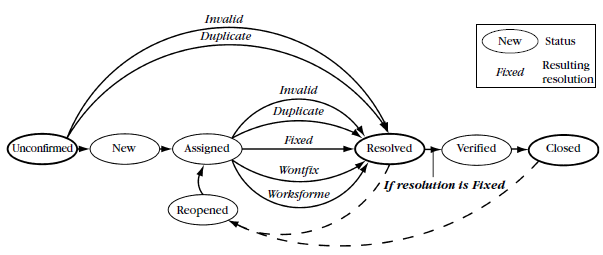
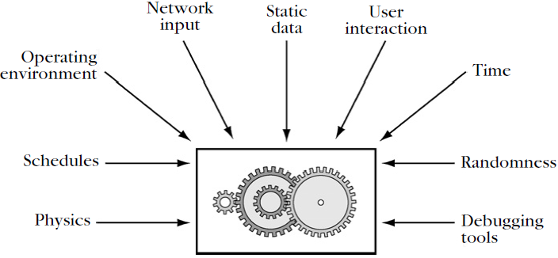

Resources
=========

How Failures Come to Be
=======================

-   When the code is executed, the defect causes an infection in the program state, which later becomes visible as a failure

MY PROGRAM DOES NOT WORK!
-------------------------

-   bugs are inherent parts of the programs we produce

FROM DEFECTS TO FAILURES
------------------------

-   four stages

1.  The programmer creates a defect - a piece of the code that can cause an infection
2.  The defect causes an infection - after execution of the defect, the program state differs from what the programmer intended
    -   The defective code must be executed,and it must be executed under such conditions that the infection actually occurs

3.  The infection propagates. An infection does not necessarily propagate continuously. It may be overwritten, masked, or corrected by some later program action
4.  The infection causes a failure. an externally observable error in the program behavior caused by an infection in the program state

-   Each program state consists of the values of the program variables, as well as the current execution position (program counter)
-   Not every defect results in an infection,and not every infection results in a failure
-   **having no failures does not imply having no defects. testing can only show the presence of defects,but never their absence**
-   the cause–effect chain from defect to failure is called an infection chain
-   The issue of debugging is thus to identify the infection chain, to find its root cause (the defect), and to remove the defect such that the failure no longer occurs

LOST IN TIME AND SPACE
----------------------

1.  **Track** the problem in in a problem database
2.  '''Reproduce ''' the failure
3.  **Automate** and simplify the test case
4.  **Find** possible infection origins
5.  **Focus** on the most likely origins
    -   Known infections
    -   Causes in state, code, and input
    -   Anomalies
    -   Code smells

6.  **Isolate** the infection chain
7.  **Correct** the defect

-   This is a search in space (as we have to find out which part of the state is infected) as well as in time (as we have to find out when the infection takes place)
    -   where each state consists of dozens, thousands, or even millions of variables
-   debugging is largely a search problem driven by two principles
    1.  Separate sane from infected
    2.  Separate relevant from irrelevant

AUTOMATED DEBUGGING TECHNIQUES
------------------------------

-   ASKIGOR - Given an executable, a failing invocation, and a passing invocation, ASKIGOR automatically produces a diagnosis consisting of a cause–effect chain from invocation to failure
    -   **Delta debugging**'

BUGS, FAULTS, OR DEFECTS?
-------------------------

-   reasons to avoid the word bug
    -   it suggests something humans can touch and remove (and are probably not responsible for)
    -   its lack of precision because it can mean an incorrect
        -   program code
        -   program state
        -   program execution
-   more accurate terms
    -   **Defect** - An incorrect program code (a bug in the code) - (IEEE: fault or bug)
    -   **Infection** - An incorrect program state (a bug in the state) - (synonyms: error and fault)
    -   **Failure** - An observable incorrect program behavior (a bug in the behavior) - (synonyms: issues or problems)
    -   design or architecture defect - flaw

Tracking Problems
=================

OH! ALL THESE PROBLEMS
----------------------

-   a defect is created at the moment the programmer writes the appropriate code
-   and its actual life cycle begins when some human spots the defect itself or one of its effects
-   the problem could be
    -   a misunderstanding
    -   caused by external components we cannot control
-   The Challenge - **HOW CAN WE ORGANIZE THE LARGE-SCALE DEBUGGING PROCESS?**

REPORTING PROBLEMS
------------------

-   To fix a problem, the developer must first be able to reproduce it
-   information required for this task is called a problem report (PR) or Change Request (CR) or bug report
-   and it needs to state all relevant (for reproducing the problem) facts

### Problem Facts

-   The problem history
    -   what has to be done to reproduce the problem
-   Diagnostic information as produced by the program
    -   collect information for diagnostic purposes while executing
    -   record important events in a log file
    -   the OS is frequently able to produce a stack trace
-   A description of the experienced behavior
    -   the symptoms of the problem
    -   what has happened in contrast to the expected behavior
-   A description of the expected behavior

### Product Facts

-   product release
-   operating environment
-   system resources (memory, disk space, etc)
-   Querying Facts Automatically
    -   Internal information (such as a core dump) cannot be interpreted by the user at all, and thus brings the greatest risk of an unwanted breach of privacy
    -   log files about user interactions can be misused for all types of purposes

MANAGING PROBLEMS
-----------------

-   use a problem database (ex BUGZILLA)

CLASSIFYING PROBLEMS
--------------------

-   Severity
    -   Blocker (showstopper) - Blocks development and/or testing work
    -   Critical - Crashes, loss of data, and severe memory leak
    -   Major - Major loss of function
    -   Normal - some standard problem
    -   Minor - an easy workaround is present
    -   Trivial - cosmetic problem
    -   Enhancement - a desired feature (not to be confused with missing functionality)
-   Priority
    -   The higher the sooner the problem is going to be addressed

PROCESSING PROBLEMS
-------------------

-   the problem report runs through a life cycle from UNCONFIRMED to CLOSED
-   A NEW problem need not necessarily be reproducible

MANAGING PROBLEM TRACKING
-------------------------

-   a problem-tracking system is a great management asset when it comes to **decide whether a system is ready for release**
-   can also be used for historical insights
    -   finding out what the most important problems were and how they could have been avoided

MANAGING DUPLICATES
-------------------

-   is not always easy to spot duplicates because
    -   A problem report includes as many facts as possible
    -   Identifying duplicates requires as few facts as possible. it makes it easier to spot the similarity

RELATING PROBLEMS AND FIXES
---------------------------

-   use a version control system to support the task of being able to recreate any given configuration any time
-   a good thing about version control systems is the management of branches for storing fixes. separate the evolution into two parts
    -   A main trunk in which new features are tested and added
    -   Branches in which fixes (and only fixes) are added to stable versions
-   Eventually, all fixes from the branch can be merged back into the main trunk such that they will also be present in the next major releases

RELATING PROBLEMS AND TESTS
---------------------------

-   keep test outcomes separate from problem reports
-   Suppose a test fails. If you can find the defect and fix it right away, there is no need to enter a record in the problem-tracking system
-   **Test cases make problem reports obsolete**
    -   If a problem occurs during development, do not enter it into the problem-tracking system
    -   write a test case that exposes the problem
-   use the problem-tracking system for storing ideas and feature requests
-   Kolawa (2002)
    -   problem-tracking systems "should be used exclusively as a place to store feedback when you cannot immediately modify the code."
    -   Otherwise, you should create a reproducible test case

Making Programs Fail
====================

TESTING FOR DEBUGGING
---------------------

-   most problems are found by testing
    -   the process of executing a program with the intent of producing some problem
    -   it is called "testing for validation"
    -   and it is geared toward uncovering yet unknown problems
-   **In the context of debugging, testing is geared toward uncovering a known problem**
-   automate tests as much as possible
-   it also enables additional automated debugging techniques

CONTROLLING THE PROGRAM
-----------------------

-   In general, an automated test must simulate the environment of the program
-   If the environment involves users who interact with the program, the automated test must simulate actual users (including all of their capabilities)
-   decompose the program into alternate interfaces, where control and assessment are easier to automate
    -   presentation layer
    -   functionality layer
    -   unit layer

TESTING AT THE PRESENTATION LAYER
---------------------------------

-   How to test at the presentation layer?
    -   simulating the input and monitoring the output
-   user interaction can be simulated
    -   at a low level (expressing interaction as a sequence of mouse and keyboard events)
    -   at a higher level,denoting interaction using graphical user controls of the application.

### Low-Level Interaction

-   user input becomes a stream of mouse and keyboard events
-   event streams can be captured and replayed
-   ANDROID Script containing commands (keyUp, keyDown, keyPress) and hardcoded coordinates
    -   the recorded information is fragile (The slightest change makes the recorded scripts obsolete)

### System-Level Interaction

-   One way of overcoming the problem of fragility is to control not only the single application but the entire machine
    -   using a virtual machine!
-   it is still easier to administer and configure virtual rather than real machines

### Higher-Level Interaction

-   A more robust way is controlling the application not by means of coordinates but by actual graphical user controls
-   APPLESCRIPT references user controls by position but by names such as Open Web Location and relative numbers such as menu bar 1
-   it makes the script much more robust against size or position changes
-   **Any single renaming or rearrangement of controls causes all scripts to become obsolete**

### Assessing Test Results

-   one major problem remains: Our simulation must still examine the program’s output for purposes of
    -   synchronization
    -   result assessment
-   one should use the presentation layer for testing only if
    -   the problem occurs in the presentation
    -   the presentation layer is easily used by computers
    -   there is no other choice (no clear separation between presentation and functionality)
-   The friendlier an interface is to humans, the less friendly it is to computers

TESTING AT THE FUNCTIONALITY LAYER
----------------------------------

-   it is much preferable to have an interface that is designed for automation
-   It easier to incorporate an existing interpreter for a powerful scripting language (python, perl)
-   the big advantage is that the results can be easily accessed and evaluated
-   In case of older programs without presentation or functionality layers, there are three choices
    -   go through the presentation layer
    -   do a major redesign to separate presentation and functionality
    -   decompose the program and access the individual units directly

TESTING AT THE UNIT LAYER
-------------------------

-   Any nontrivial program can be decomposed into a number of individual units
    -   subprograms, functions, libraries, modules, objects, classes, packages, components, beans
    -   that communicate via interfaces
-   automating the unit in isolation is frequently easier than automating the entire program
-   the disadvantage is that one must count on the unit producing the problem in isolation
-   When a single unit test executes, three things happen
    -   It sets up an environment for embedding the unit
    -   It tests the unit
    -   It tears down the environment again

ISOLATING UNITS
---------------

-   this automation requires separate functionality and presentation
-   there are programs in which the functionality depends on the presentation, such that it is impossible to separate them
-   How do we break dependences that keep us from isolating units?
    -   **depending on abstractions rather than details** (dependency injection)

DESIGNING FOR DEBUGGING
-----------------------

-   all software design methods attempt to minimize dependences between units, using the same two principles
    -   High cohesion
    -   Low coupling
-   A good design will make it easier to test and to debug

PREVENTING UNKNOWN PROBLEMS
---------------------------

-   Any problem that escapes into the wild (and is experienced by a user) indicates that the product has not been tested (or reviewed or proven) well enough
-   debugging is the cure of known problems
-   basic rules of testing and quality assurance
    -   Specify - Attempt specifications that cover the entire behavior, including exceptions
    -   Test early
    -   Test first
    -   Test often
    -   Test enough - Measure the coverage of your tests
    -   Have others test - it makes an author unsuited to test his or her own code

Reproducing Problems
====================

THE FIRST TASK IN DEBUGGING
---------------------------

-   the first task of any debugging activity is to **reproduce the problem**
    -   it must occur in the very same way as stated in the original problem report
    -   it is important for two reasons
        -   To observe the problem. if you can't reproduce it your only chance is to **deduce** from the program code what **might** have happened to cause the problem
        -   To check whether the problem is fixed - Without reproducing it, you can never know that the problem has been fixed

REPRODUCING THE PROBLEM ENVIRONMENT
-----------------------------------

-   one of the toughest problems in debugging
-   two main steps of reproducing
    -   the problem environment
    -   the problem history (the steps necessary to create the problem)
-   Reproducing the Problem Environment is the best place to study the problem is exactly the environment where the problem occurs
-   it offers the best chance of reproducing the problem
-   it typically does not happen due to
    -   **Privacy** - users/corporations may simply not wish others to operate their machines
    -   Ease of development - lack of development environment, debuggers
    -   Cost of maintenance - you cannot simply take a machine out of production to maintain the software
    -   Risk of experiments - running experiments on a user's machine may cause damage
-   a maintainer tipically should follow an iterative process
    1.  Attempt to reproduce the problem in your environment, using the product release as specified in the problem report. do not start working on a problem that is different from the user's problem
    2.  If the problem does not occur yet,adopt more and more circumstances from the problem environment, one after the other. configuration files or anything else that might possibly influence the execution of the product
    3.  Adopt one circumstance after the other until
        -   you could reproduce the problem
        -   or your environment is identical to the problem environment - meaning the problem report is incomplete or wrong or there still is a difference between your environment and the problem environment

REPRODUCING PROGRAM EXECUTION
-----------------------------

-   The execution of a program is determined by its code (which we assume constant) and its input
-   If the input differs, so does the execution of the program
    -   to reproduce a specific execution,we must thus reproduce the program input
    -   it must be observed and controlled by the programmer
    -   **when the input is under control the execution become deterministic**

-   Process and thread schedules
    -   Normally should not interfere with the program's execution. However, if the program has a defect they may
-   Debugging tools
    -   Typically interfere with the program execution, and thus may uncover but also mask problems
-   The general pattern for controlling these inputs is
    -   set up a control layer between the real input and the input as perceived by the program
    -   it isolates the program under observation from its environment

### Reproducing Data

-   three issues to be aware of
    -   Get all the data you need, including configuration data such as registries or configuration files
    -   Get only the data you need
    -   Take care of privacy issues
        -   Data under the user's control may contain private or confidential information

### Reproducing User Interaction

-   Modern programs use complex user interfaces, and these make it difficult to observe and control the user's input
-   The standard approach is to use a capture/replay tool
    -   by intercepting calls to library or system functions providing input
-   the scripts simulate user input
    -   as a (fragile) "low-level" stream of events that should not be used beyond a single short-term debugging session
    -   as a "higher-level" sequence of interactions with user controls

### Reproducing Communications

-   specialized tools can capture, inspect, reconstruct, and replay network traffic
    -   may alter the performance of your program and its communications
    -   especially if there are much data to be captured and replayed
-   altering the performance may mask problems that would occur otherwise

### Reproducing Time

-   if there is some indication that the problem depends on the time of day, one must be able to execute the program under an arbitrary time of day
-   make time a configurable item
    -   useful for reproducing problems and very helpful for creating automatic tests
-   obtain control over input sources such that they can be reproduced at will

### Reproducing Randomness

-   nondeterminism is part of the design
-   ex: games and cryptographic applications
-   randomness must be controlled and made reproducible
-   If randomness is obtained from a series of pseudorandom numbers, one can capture (and replay) the initial seed of the random number generator
-   Cryptographic applications depend on more than just a pseudorandom number generator
    -   organize your program such that developers can replace the source of randomness by a deterministic source

### Reproducing Operating Environments

-   the operating system controls all inputs and outputs of a program
-   the boundary between program and operating system comes as a natural place at which to monitor, control, and possibly record and replay program executions
-   An alternative to tracing all of the interaction from scratch is to use checkpoints
    -   it basically records the entire state of a program such that it can be restored later
    -   done when the program has reached some stable state
    -   the trade-off is that states are huge
    -   one must decide when to prefer checkpoints over recorded interaction

### Reproducing Schedules

-   programs typically consist of several concurrent threads or processes
-   the schedule is defined by the runtime or operating system
-   Nondeterminism introduced by thread or process schedules is among the worst problems to face in debugging
-   treat a schedule just like another input source,recording it and replaying it at will
-   attempt to uncover differences in execution as induced by schedule differences
    -   massive random testing can uncover problems due to differing schedules

### Physical Influences

-   they are not supposed to influence the execution of the program

### Effects of Debugging Tools

-   observing or examining the problem can cause the problem to disappear
    -   or to be replaced by another problem
-   **Heisenbugs**
    -   differences between the debugging environment and the production environment
    -   undefined behavior
    -   almost always caused by a defect
    -   C and C++ are more prone to Heisenbugs
-   You do not necessarily need a debugger to trigger a Heisenbug
    -   examining a program (interactively or not) can introduce timing issues
    -   Recompilation for debugging might trigger bugs in the tool chain
-   double check and observe the program by at least two independent means

REPRODUCING SYSTEM INTERACTION
------------------------------

-   the more information the program and environment exchange and the more the program depends on this information, the more difficult it will be to reproduce a given problem
-   to record and replay every single aspect of the physical machine executing the program
    -   virtual machines!!!
-   virtualization adds an overhead to execution time
-   recording adds another overhead

FOCUSING ON UNITS
-----------------

-   dealing with the coupling between program and environment
-   search for alternative interfaces that may be
    -   controlled
    -   recorded
    -   replayed
-   The idea is to reproduce the execution of a specific unit
    -   advantage
        -   controlling the unit in isolation may be easier than controlling the entire program
    -   disadvantage
        -   you can only reproduce the behavior of the given unit

### Setting Up a Control Layer

-   set up a layer that isolates the unit from its other units
    -   can be used to monitor, record, and replay the input
-   an attempt to isolate arbitrary program units from their environment
-   used to isolate bottom-level units
    -   with services that are being used frequently by higher-level units
    -   that do not rely on services provided by other units
-   record and replay the interaction at the unit boundary
    -   rather than reproducing the entire behavior of the application that uses the unit

### Mock Objects

-   automatically examine the object interfaces and add recording and playback facilities

### Controlling More Unit Interaction

-   the more possibilities there are for an application to alter the behavior of a unit the more difficult it becomes to isolate the unit from the application
-   a good program design has a positive impact on debugging efforts
    -   it makes a program easier to understand, maintain, restructure, and reuse, but also to debug

REPRODUCING CRASHES
-------------------

-   When a program crashes, recording and replaying has shown to be both efficient and effective
-   the original concept of reproducing crashes was developed as part of design by contract
    -   every single function of the program is checked for its pre and postconditions
-   **test case extraction**
    -   takes a crashing program run and automatically generates a test case that reproduces the crash
    -   All we need is a snapshot of the state at the moment of invocation
    -   We must monitor the original calls and the state of the moment of the call, a technique that can quickly get expensive
    -   **Java tool called ReCrash**
-   three approaches

### Keep a copy of the calling stack

-   keeping a shadow copy induces overhead
-   this overhead being the lowest if just references are copied,and getting higher the deeper the shadow copy is
-   between 11 and 42% for just references
-   12000 and 638000% for deep state copies
-   used fields mode had a overhead of 13–50%, and was able to reproduce all crashes faithfully

### Use the failing state instead of the invocation state

-   no monitoring at all is required
-   overhead occurs at the time of the crash, when the entire state is copied for later reproduction
-   The disadvantage is that the failing state may not be a surrogate for the invocation state
-   ETH team was able to reproduce 90 percent of the failures using the state at failure time

### Wait for a second chance

-   the original program is not monitored at all
    -   only after the crash, monitoring is activated only for those very locations involved in the crash
    -   when the failure occurs a second time, it will be monitored
-   disadvantages
    -   can only reproduce a failure the second time it occurred
    -   activating monitoring in an already deployed program may be complicated
-   advantages
    -   zero monitoring overhead in the original (failing) run
    -   after monitoring is activated, the overhead stays low, as it focuses only on specific parts of program and state
    -   overhead of around 1%

TOOLS
-----

-   [Revirt](http://www.eecs.umich.edu/virtual/)
-   [Checkpointing](http://www.checkpointing.org/) Tools
    -   [ReCrash](http://pag.csail.mit.edu/ReCrash)
-   DEJAVU tool that allows for deterministic replay of multithreaded and even distributed JAVA applications
