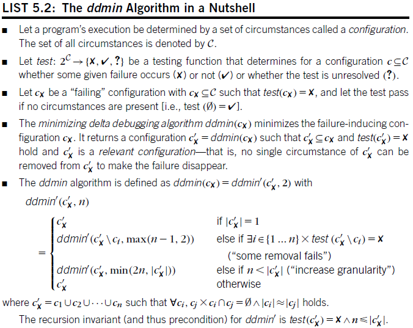
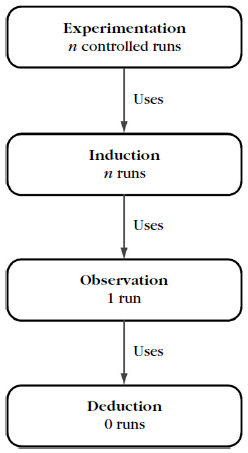

Simplifying Problems
====================

-   Once we have reproduced a problem, we must simplify it
-   we must find out which circumstances are not relevant for the problem and can thus be omitted
-   This process results in a test case that contains only the relevant circumstances
-   **delta debugging**

SIMPLIFYING THE PROBLEM
-----------------------

-   A test case contains the relevant details only
-   the value of simplification is less in the remaining parts but rather in all parts that have been taken away
-   A circumstance is any aspect that may influence the problem
    -   Aspects of the problem environment
    -   Individual steps in the problem history
-   How does one check whether a circumstance is relevant?
    -   **experimenting**

THE GECKO BUGATHON
------------------

-   Loading obfuscated HTML code into Gecko HTML input made MOZILLA fail
-   at least three further good reasons for simplifying
    1.  A simplified test case is easier to communicate
        -   The simpler a test case, the less time it takes to write it down, to read its description, and to reproduce it

    2.  A simplified test case facilitates debugging -
        -   a simplified test case means less input and less interaction with the environment

    3.  Simplified test cases identify duplicate problem reports
-   Gecko BugAThon
    -   Volunteers would help the MOZILLA programmers by creating simplified test cases

MANUAL SIMPLIFICATION
---------------------

1.  Proceed by binary search
2.  Throw away half the input and see if the output is still wrong
3.  if not, go back to the previous state and discard the other half of the input

AUTOMATIC SIMPLIFICATION
------------------------

-   Simplification is
    -   tedious
    -   boring
-   What do we do if neither half fails the test?
    -   A simple binary search does not suffice any longer
    -   not to cut away halves of the input, but smaller parts - quarters, for instance
    -   instead of cutting away the first half,we cut away the first quarter, the second quarter, and so on

A SIMPLIFICATION ALGORITHM
--------------------------

-   Our aim is to find a minimal set of circumstances under which the failure occurs
-   we want to minimize a failure-inducing configuration
-   ddmin algorithm
    -   an instance of delta debugging
    -   a general approach to isolate failure causes by narrowing down differences (deltas) between runs
        -   Delta debugging again is is an instance of adaptive testinga series of tests in which each test depends on the results of earlier tests



-   every configuration returned by ddmin is relevant because ddmin can return c'x only after it tried removing every single element and the failure did not occur for any such configuration

```java
import java.util.*;
import org.apache.commons.collections.*;


public abstract class DDMin<T> {

    public abstract Outcome test(List<T> configuration);

    public List<T> doIt(List<T> arg) {
        List<T> circumstances = arg;
        int n = 2;

        while (circumstances.size() >= 2) {
            List<List<T>> subsets = split(circumstances, n);

            boolean someComplementIsFailing = false;
            for (List<T> subset : subsets) {
                List<T> complement = new ArrayList<T>(CollectionUtils.subtract(circumstances, subset));

                if (test(complement) == Outcome.fail) {
                    circumstances = complement;
                    n = Math.max(n-1, 2);
                    someComplementIsFailing = true;
                    break;
                }
            }

            if (!someComplementIsFailing) {
                if (n == circumstances.size()) {
                    break;
                }
                n = Math.min(n * 2, circumstances.size());
            }
        }
        return circumstances;
    }

    private List<List<T>> split(List<T> c, int n) {
        List<List<T>> subSets = new ArrayList<List<T>>();
        int start = 0;

        for (int i = 0; i < n; i++) {
            List<T> subSet = c.subList(start, start + (c.size() - start) / (n - i));
            subSets.add(subSet);
            start += subSet.size();
        }
        return subSets;
    }
}
```

SIMPLIFYING USER INTERACTION
----------------------------

-   Delta debugging can be applied to all inputs
-   delta debugging can be applied to circumstances as they occur during the program run or during the program development

RANDOM INPUT SIMPLIFIED
-----------------------

-   Another application of automated simplification is to use it in conjunction with random testing
-   The basic idea is to generate large random inputs that trigger a failure and then to simplify the input to reveal the relevant part
-   sending fuzz input to test the robustness of UNIX utilities and services

SIMPLIFYING FASTER
------------------

-   the number of tests required increased with the length of the simplified input
-   how to reduce the number of test cases and to improve the speed?
-   simplifying a configuration cx with ddmin requires at least |c'x| tests, as every single circumstance in the resulting c'x must be tested once
-   In the worst case, the number of tests can even be quadratic with respect to |cx|, resulting in a maximum number of tests t = ( |cx|^2 + 7 |cx| ) / 2
-   Caching
    -   By using a cache to store test outcomes, one could return the earlier test outcome whenever a test is repeated
-   Stop Early
    -   one can simply stop the simplification process
        -   When a certain granularity has been reached ("We don't care about removing single characters")
        -   When no progress has been made ("In the last 100 iterations, the size of the input has been reduced by 1% only")
        -   When a certain amount of time has elapsed ("One hour of automatic simplification suffices")
-   Syntactic Simplification
    -   One effective way of speeding up simplification is to simplify not by characters but by larger entities
    -   This idea of grouping circumstances can be taken further by simplifying input not at the lexical level (i.e., characters,words, or lines) but at a syntactical level
        -   simplifying while preserving the syntactic structure of the input
    -   turn the input into a tree (formally, a syntax tree) and to simplify the tree rather than the input string
    -   then we make every node a circumstance
    -   the splitting of a configuration into subsets can be set up to take constraints into account
-   Isolate Differences, Not Circumstances
    -   Instead of simplifying all circumstances, one can also simplify a difference between a configuration thatworks and a configuration that fails
    -   Why would one want to simplify differences? There are two answers
        -   Focusing - a small difference can pinpoint the problem cause in a common context
        -   Efficiency - each passing test can be exploited to reduce the difference

TOOLS
-----

-   [Simplification Library](http://freshmeat.net/projects/delta/)

Scientific Debugging
====================

HOW TO BECOME A DEBUGGING GURU
------------------------------

-   intuition comes from experience with earlier errors
-   we want a method of finding an explanation for the failure
    -   no need of experience from earlier errors
    -   Works in a systematic and reproducible fashion such that we can be sure to eventually find the cause and reproduce it at will
-   HOW DO WE SYSTEMATICALLY FIND AN EXPLANATION FOR A FAILURE?

THE SCIENTIFIC METHOD
---------------------

-   Having a program fail also means that our abstraction fails
    -   We can no longer rely on our model of the program, but rather must explore the program independently from the model
-   a theory is a conceptual framework that explains earlier observations and predicts future observations
-   In this debugging context, the scientific method operates as follows
    1.  Observe a failure
    2.  Invent a hypothesis as to the failure cause that is consistent with the observations
    3.  Use the hypothesis to make predictions
    4.  Test the hypothesis by experiments and further observations
        -   If the experiment satisfies the predictions, refine the hypothesis
        -   If the experiment does not satisfy the predictions, create an alternate hypothesis

    5.  Repeat steps 3 and 4 until the hypothesis can no longer be refined
-   such a theory is called a diagnosis

APPLYING THE SCIENTIFIC METHOD
------------------------------

-   Preparation
    -   We start with writing down the problem
    -   what happened in the failing run and how it failed to meet our expectations
-   in programs more complex we would have to validate that the fix does not introduce new problems

EXPLICIT DEBUGGING
------------------

-   Being explicit is an important means toward understanding the problem at hand, starting with the problem statement
-   stating the problem in whatever way makes you rethink your assumptions
    -   and often reveals the essential clues to the solution
-   many programmers do not explicitly keep track of experiments and outcomes

KEEPING A LOGBOOK
-----------------

-   write down all hypotheses and observations - keep a logbook
-   with a well-kept logbook You can always quit work and resume the next day
-   your notes should include the following points
    -   Statement of the problem
    -   Hypotheses as to the cause of the problem
    -   Predictions of the hypotheses
    -   Experiments designed to test the predictions
    -   Observed results of the experiments
    -   Conclusions from the results of the experiments

DEBUGGING QUICK-AND-DIRTY
-------------------------

-   Simple problems should be solved in a simple manner
-   The problem with such an implicit "quick-and-dirty" process is to know when to use it
-   It is not always easy to tell in advance whether a problem is simple or not
    -   set up a time limit

ALGORITHMIC DEBUGGING
---------------------

-   automate it
    -   at least partially
-   algorithmic debugging is to have a tool that guides the user along the debugging process interactively
-   need human input to decide what is correct, right, or true
-   has not been demonstrated to be effective for real-world applications
    -   The process does not scale
        -   In a large imperative program, there are millions and millions of functions being executed
        -   algorithmic debugging works best for functional and logical programming languages
        -   that have few or no side effects
    -   Programmers prefer driving to being driven
        -   The algorithmic debugging process is extremely rigid
        -   a process that provides assistance to programmers is an open research issue
-   scientific method still needs human interaction

DERIVING A HYPOTHESIS
---------------------

-   within each iteration of the scientific method we must come up with a new hypothesis
-   the creative part of debugging
    -   **thinking about the many ways a failure could have come to be**
-   being creative is not enough: We must also be effective
-   The Description of the Problem
    -   Without a concise description of the problem, you will not be able to tell whether the problem is solved or not
-   The Program Code
    -   is the basis for almost all debugging techniques
    -   Lack of program code makes understanding (and thus debugging) much more difficult
-   The Failing Run
    -   debugging becomes much easier once one can talk about a concrete (failing) run
-   Alternate Runs
    -   we need a means of focusing on specific aspects of the execution
    -   we must know which "normal" runs exist, what their common features are, and how these differ in the failing run
    -   with a sufficient number of alternate runs we can classify what is "normal" or not
-   Earlier Hypotheses
    -   Any new hypothesis must also explain all earlier observations, regardless of whether the experiment succeeded or failed
    -   To automate the process, we would like to reuse earlier hypotheses without asking the user for assistance
    -   can be conducted systematically by narrowing the difference between a passing and a failing scenario

REASONING ABOUT PROGRAMS
------------------------



-   hierarchy of reasoning techniques to learn about programs
-   Deduction
    -   is reasoning from the general to the particular
    -   deduction is used for reasoning from the program code to concrete runs
    -   does not require any knowledge about the concrete, it is not required that the program in question actually be executed
    -   **static techniques predict approximations of a program's future; dynamic analysis remembers approximations of a program's past**
    -   debugging techniques fall into the "dynamic" categories
-   Observation
    -   allows the programmer to inspect arbitrary aspects of an individual program run
    -   dynamic
    -   brings in actual facts of a program execution
-   Induction
    -   is reasoning from the particular to the general
    -   used to summarize multiple program runs
    -   every inductive technique makes use of observation
-   Experimentation
    -   implies multiple program runs that are controlled by the reasoning process
    -   every experimental technique uses induction and thus observation

Deducing Errors
===============

ISOLATING VALUE ORIGINS
-----------------------

-   One of the main applications of program code during debugging
    -   is to identify relevant statements that could have caused the failure
    -   and identify the irrelevant statements that could not have caused the failure in any way
-   relevant statements are found by following back the possible origins of the result
-   By deducing from the code, we can abstract over all (or at least several) runs to determine properties that hold for all runs

UNDERSTANDING CONTROL FLOW
--------------------------

-   The first thing to reason about when tracking value origins through source code is to identify those regions of code that could have influenced the value simply because they were executed
-   earlier statements may influence later statements (but not vice versa)
-   **control flow graph**
    -   Each statement of a program is mapped to a node
    -   Edges connecting the nodes represent the possible control flow between the statements
    -   An entry and exit node represent the beginning and the end of the program or function
-   **Control Flow Caveats**
    -   Jumps and gotos - make the control flow graph unstructured or irreducible
    -   Indirect jumps - computed goto
    -   Dynamic dispatch
        -   found in object-oriented languages
        -   The actual destination of the call is resolved at runtime, depending on the class of the object
    -   Exceptions
        -   one must be aware that control may never reach the "official" end of a function but be transferred directly to the caller

TRACKING DEPENDENCES
--------------------

-   The control flow graph shows how information propagates along the sequence of statements

### Effects of Statements

-   every statement of the program must (at least potentially) affect the information flow in some way
-   two types of effects
-   **Write**
    -   A statement can change the program state (i.e., assign a value to a variable)
    -   the "program state" becomes the state of the world
        -   printing some text on an output device changes the state of the device
        -   Sending a message across the network changes the state of attached devices
    -   it is useful to limit the considered state - for instance, to the hardware boundaries
-   **Control**
    -   A statement may change the program counter
        -   determine which statement is to be executed next
    -   locations in the program state, and locations in the program code, are treated conceptually as separate dimensions of space and time

### Affected Statements

-   Affecting the information flow by writing state or controlling execution represents the active side of howa statement affects the information flow
-   statements are also passively affected by other statements
-   **Read**
    -   A statement can read the program state (i.e.,read a value from a variable)
    -   reading some text from an input device reads the state of the device
    -   Reading a message across the network reads the state of attached devices
-   **Execution**
    -   if the execution of a statement B is potentially controlled by another statement A, then B is affected by A

### Statement Dependences

-   Given the effects of statements, as well as the statements thereby affected, we can construct dependences between statements
-   two types of dependences
-   **Data dependence**
    -   A statement B is data dependent on a statement A if
        -   A writes some variable V that is being read by B
        -   and there is at least one path in the control flow graph from A to B in which V is not being written by some other statement
    -   the outcome of A can influence the data read by B
-   **Control dependence**
    -   the outcome of statement A determines whether statement B is executed
    -   The control and data dependences of a program form the program-dependence graph

### Following Dependences

-   Following the control and data dependences in the program-dependence graph can answer two important questions
-   **Where does this value go to?**
    -   Given a statement S writing a variable V, we can determine the impact of S by checking which other statements are dependent on S
-   **Where does this value come from?**
    -   Given a statement S reading a variable V, we can determine the statements that possibly influenced V by following back the dependences of S

### Leveraging Dependences

-   programmers implicitly determine dependences while reading the code
-   Assessing the effect of each statement is part of understanding the program
-   dependences become an important guide for navigating through the code

SLICING PROGRAMS
----------------

-   Using dependences, one can check for specific defect patterns and focus on specific subsets of the program being debugged
-   a subset is called a slice, and the corresponding operation is called slicing

### Forward Slices

-   By following all dependences from a given statement A, one eventually reaches all statements of which the read variables or execution could ever be influenced by A
-   This set of statements is called a program slice
    -   more specifically the forward slice of S^F(A)
-   it consists of all statements that (transitively) depend on A
-   **the originating statement A is called the slicing criterion**

### Backward Slices

-   To compute the backward slice of C, one proceeds backward along the dependences
-   to determine all statements that could have influenced C
-   useful in determining where the program state at execution of C could have come from
-   the backward slice S^B(C)
-   C is called the slicing criterion of S^B(C)
-   Having all statements being included in the backward slice of a returned value is quite typical
    -   if some statement would not contribute to the computation this would be a code smell

### Slice Operations

-   **Chops**
    -   intersection between a forward and a backward slice
    -   useful for finding out how some statement A (originating the forward slice) influences another statement B (originating the backward slice)
-   **Backbones**
    -   intersection between two slices
    -   useful for finding out those parts of an application that contribute to the computation of several values
    -   are central parts of the computation
    -   finding a backbone is most useful if one has multiple infected values at different places and wants to determine a possible common origin
-   **Dices**
    -   difference between two slices
    -   useful for finding out how the backward slice of some variable differs from the backward slice of some other variable
    -   most useful if the program is "largely correct"
        -   most of the values it computes are correct but some are not
    -   By subtracting the backward slices of the correct variables from the backward slices of the infected variables one can focus on those statements that only contribute to the infected values

### Leveraging Slices

-   slices can be used to explicitly ignore those parts of a program that are irrelevant for a specific behavior
-   In addition to displaying slices, CODESURFER can perform slice operations

DEDUCING CODE SMELLS
--------------------

-   a number of common errors can be directly detected from the dependence graph
    -   deduced from the program code alone
-   Reading Uninitialized Variables
-   Unused Values
    -   typically limited to local variables
-   Unreachable Code
-   Memory leaks
    -   Just as we tracked the effects of statements on variables, we can track the effects of statements on dynamic memory
    -   If there is a path in the control flow graph from an allocation to a statement where a chunk becomes dead without going througha deallocation first, this is a memory leak
-   Interface misuse
    -   An input/output stream is first opened, but must be closed when it is no longer used
    -   Checking for such conditions uses the same mechanisms as memory leaks
    -   Similar techniques apply to resources such as locks, sockets, devices, and so on
-   Null pointers
-   Given a control flow graph, and basic data and control dependences, a tool that checks for such common errors is not too difficult to build
    -   FINDBUGS in Java
        -   false positives in average of 50%

LIMITS OF STATIC ANALYSIS
-------------------------

-   The reason for the imprecision of FINDBUGS is that there are a number of language constructs that make computing precise data dependences difficult, if not impossible
-   static analysis tools must resort to conservative approximations
-   an approximation saying that any write to the array a\[\] may influence any read from the array a\[\]
    -   the drawback of such approximations is that dependences are difficult to track
-   and there are risks simply by being based on abstraction
    -   Risk of code mismatch
        -   Using source code to deduce facts in a concrete program run requires that the run actually be created from this very source code
    -   Risk of abstracting away
        -   In rare instances failures can be caused by a defect in the environment and therefore, deducing an error from source code will be impossible
    -   Risk of imprecision
        -   On average, a static slice encompasses about 30 percent of the program code, which is a significant reduction but still a huge amount of code
        -   can be easily taken care of by establishing precise configuration management
        -   can be addressed by two mechanisms: Verification and Observation (from concrete program runs)

### Data Flow Caveats

-   Indirect access
    -   To determine that a write to a variable V influences a later read of this variable requires that V be precisely determined
    -   If V is a location that is determined at runtime one has to resort to approximations
-   Functions
    -   Including function calls in the analysis results in dependences between the arguments at the call sites (the context) and the formal parameters at the function entries
    -   one can choose to inline the function body at each call site, resulting in precise dependences
        -   it fails for large numbers of functions
        -   is also infeasible for recursive functions
-   Object Orientation
-   Concurrency

### Source Code Caveats

-   Source mismatch
    -   must make sure that the source code being read actually corresponds to the program being executed
-   Undefined behavior
    -   Some programming languages deliberately do not specify the semantics of some constructs
-   Aspects
    -   adding an aspect to a program can cause arbitrary changes in behavior
    -   can also seriously hamper our ability to understand the code

Observing Facts
===============

-   observation determines facts about what has happened in a concrete run

OBSERVING STATE
---------------

-   To find out what is actually happening
-   some general principles
    -   Do not interfere
        -   Whatever you observe should be an effect of the original run
        -   Otherwise, Heisenbugs!
    -   Know what and when to observe
        -   effective only if you know
        -   Which part of the state to observe (what)
        -   At which moments during execution to observe (when)
    -   Proceed systematically
        -   let your search be guided by scientific method

LOGGING EXECUTION
-----------------

-   To observe facts about a run,we must make the facts accessible to the programmer
-   The simplest way is by inserting appropriate logging statements in the code
-   the most widespread debugging technique
-   several drawbacks as an observation technique
    -   Cluttered code
        -   programmers frequently remove logging statements once the observation is done
    -   Cluttered output
        -   can produce a great deal of output
    -   Slowdown
        -   this changes the program under test and introduces the risk of Heisenbugs
    -   Loss of data
        -   output is typically buffered before actually being written to the output device

### Logging with Aspects

-   The concern of logging is separate from the concern of computation
-   Each aspect holds only the code for its individual concern
-   A logging aspect thus holds the logging code in one syntactical entity called an advice
-   The interesting thing about aspects is that the same advice may be woven in at multiple locations in the program

### Logging at the Binary Level

-   we instrument binary code rather than source code
-   PIN framework (Intel) allows arbitrary C or C++ code to be injected at arbitrary places in the executable
-   it allows us to access context information such as register content, symbol, and debug information
-   you can think of PIN as aspects at the binary level

USING DEBUGGERS
---------------

-   The logging techniques require writing and integrating code into the program to be debugged
-   An alternative mechanism is to use an external observation tool that hooks into the execution of the program and observes the state at specific moments in time
    -   without changing the original program code in any way
-   benefits
    -   Getting started fast
        -   no need for recompilation
    -   Flexible observation
    -   Transient sessions
        -   single shots
        -   quick results
-   Debuggers
    -   Execute the program and make it stop on specified conditions
    -   Observe the state of the stopped program
    -   Change the state of the stopped program
    -   GDB provides a step(into) and a next(step over)

### Postmortem Debugging

-   operating systems can be set up such that when a program crashes they dump its memory content to a special file
-   This memory dump can be read in by a debugger such that you may examine the state of the program at the moment it crashed
-   The most important hint of a memory dump is the backtrace, as it records the functions executing at the time of the crash
-   Even if a program does not leave a memory dump, repeating the run from within the debugger yields the same results

### Logging Data

-   GDB allowus to execute a prerecorded sequence of commands when a breakpoint has been reached
-   useful for realizing logging of variables from within the debugger

### Debugger Caveats

-   debuggers have a certain toylike quality
-   it is simply fascinating for the creator to see his or her program in action and to exercise total control
    -   This can easily distract from solving the problem at hand
-   Even when working with an interactive debugger, one should always be explicit about the current hypothesis, and the steps required to validate it
-   Debuggers can be excellent tools - but only when combined with good thinking

QUERYING EVENTS
---------------

-   some hypotheses cannot be attached to such a precise location (ie: specific line of code)
-   the location may well be the subject of a query itself
-   What one needs in this situation is a means of having the program stop at a location that is implied by acondition
    -   using aspects, define a point cut

### Watchpoints

-   Using languages without aspect support such as C we must resort to debuggers to catch assignments to specific variables
-   GDB provides data breakpoints (or watchpoints)
-   Watchpoints are expensive Because the debugger must verify the value of the watched expression after each instruction
    -   implies a switch between the debugged processes and the debugger process for each instruction step
    -   slows down program execution by a factor of 1,000 or more
-   some processors provide hardware watchpoints that can automatically monitor a small number of locations for changes without degrading performance

### Uniform Event Queries

-   The distinction among watchpoints, breakpoints, and conditional breakpoints is purely motivated by the technique by which these concepts are implemented
-   we can generalize these concepts to have a uniform query mechanism that stops program execution as soon as a specific condition is met
    -   such attempt was realized by the COCA debugger - a front end to GDB that provides a uniform query for arbitrary events during execution

HOOKING INTO THE INTERPRETER
----------------------------

-   Such hooks, provided for the implementation of debuggers, can also be used to implement arbitrary observation techniques
    -   are available in all interpreted languages that offer interactive debugging facilities
-   JVM has an interface for monitoring the access of object attributes
    -   It can interrupt the execution whenever some specific attribute is read or written
    -   there are no limits on the number of monitors
    -   the performance loss is not as dramatic compared with debugger watchpoints
    -   java.lang.instrumentation provides so-called Java agents who can observe and hook into arbitrary aspects of the execution

VISUALIZING STATE
-----------------

-   Although textual output is useful for keeping track of scalar values,it is hardly useful when it comes to tracking relationships between objects
    -   especially inclusions and references
    -   some debuggers allow us to visualize these relationships
    -   GNU Data Display Debugger (DDD)

TOOLS
-----

-   [JAVA SPIDER](http://sourceforge.net/projects/javaspider/)
    -   If you are interested in visualizing the JAVA state
