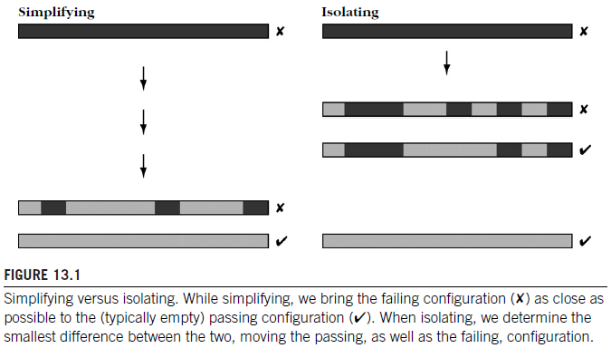
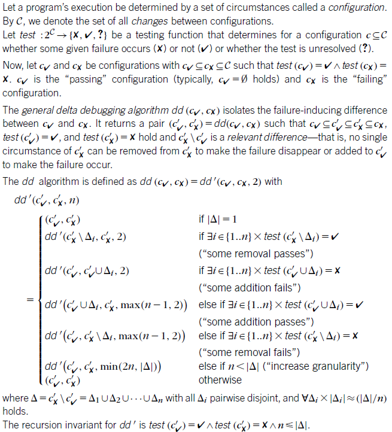
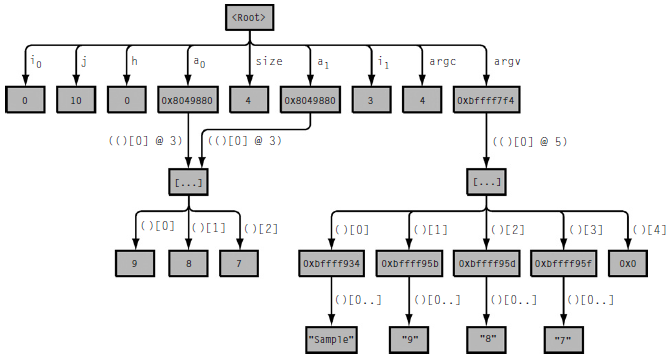

Isolating Failure Causes
========================

ISOLATING CAUSES AUTOMATICALLY
------------------------------

-   we should aim at narrowing down failure causes automatically
-   All it takes is
    -   an automated test that checks whether the failure is still present
    -   a means of narrowing down the difference
    -   and a strategy for proceeding
-   HOW DO I ISOLATE FAILURE CAUSES AUTOMATICALLY?

ISOLATING VERSUS SIMPLIFYING
----------------------------

-   In simplifying, we get a test case where each single circumstance is relevant for producing the failure
-   **Isolating**
    -   produces a pair of test cases
    -   one passing the test,one failing the test
    -   with a minimal difference between them that is an actual cause
-   each time a test case fails
    -   the smaller test case is used as the new failing test case
    -   add circumstances to the passing test case to obtain a new (larger) passing test case
-   Simplifying results in a simplified failing test case
-   isolation results in a passing and a failing test case with a minimal difference
-   an allegory
    -   Simplifying a flight test returns the set of circumstances required to make the plane fly (and eventually crash)
    -   Isolating returns two sets of circumstances that differ by a minimum
        -   one set that makes the plane fly
        -   a set that makes the plane crash
    -   The difference is a failure cause, and being minimal, it is even an actual failure cause



-   The greater efficiency of isolation comes at a price
    -   An isolated difference can come in a large context, which may require more effort to understand
        -   especially if the isolated cause is not an error

AN ISOLATION ALGORITHM
----------------------



-   the original ddmin algorithm can easily be extended to compute a minimal difference rather than a minimal test case
-   dd algorithm returns a pair of configurations C'x, C'v that both lie between the original Cx and Cv
    -   and the difference of which Delta = C'x\\C'v is 1 minimal
    -   each difference in Delta is relevant for producing the failure
    -   in practice Delta frequently contains only one difference
    -   Delta may contain multiple differences
        -   which must all be applied to C'v in order to produce C'x
-   The more test cases that pass or fail the more efficient dd becomes

```java
import java.util.*;
import org.apache.commons.collections.*;


public abstract class GenericDD<T> {

    public abstract Outcome test(List<T> configuration);

    public DDResult<T> doIt(List<T> successTests, List<T> failureTests) {

        List<T> success = successTests;
        List<T> failure = failureTests;
        int n = 2;

        while (true) {
            List<T> delta = new ArrayList<T>(CollectionUtils.subtract(failure, success));

            if (n > delta.size()) {
                return new DDResult<T>(success, failure, delta);
            }

            List<List<T>> deltas = split(delta, n);
            int offset = 0;
            int j = 0;

            while (j < n) {
                int i = (j + offset) % n;
                List<T> nextSuccess = new ArrayList<T>(CollectionUtils.union(success, deltas.get(i)));
                List<T> nextFailure = new ArrayList<T>(CollectionUtils.subtract(failure, deltas.get(i)));

                if (test(nextFailure) == Outcome.fail && n == 2) {
                    failure = nextFailure;
                    n = 2;
                    offset = 0;
                    break;

                } else if (test(nextFailure) == Outcome.pass) {
                    success = nextFailure;
                    n = 2;
                    offset = 0;
                    break;

                } else if (test(nextSuccess) == Outcome.fail) {
                    failure = nextSuccess;
                    n = 2;
                    offset = 0;
                    break;

                } else if (test(nextFailure) == Outcome.fail) {
                    failure = nextFailure;
                    n = Math.max(n-1, 2);
                    offset = i;
                    break;

                } else if (test(nextSuccess) == Outcome.pass) {
                    success = nextSuccess;
                    n = Math.max(n-1, 2);
                    offset = i;
                    break;

                } else {
                    j++;
                }
            }
            if (j >= n) {
                if (n >= delta.size()) {
                    return new DDResult<T>(success, failure, delta);
                }
                n = Math.min(n*2, delta.size());
            }
        }

    }

    private List<List<T>> split(List<T> c, int n) {
        List<List<T>> subSets = new ArrayList<List<T>>();
        int start = 0;

        for (int i = 0; i < n; i++) {
            List<T> subSet = c.subList(start, start + (c.size() - start) / (n - i));
            subSets.add(subSet);
            start += subSet.size();
        }
        return subSets;
    }
}
```

ISOLATING FAILURE-INDUCING INPUT
--------------------------------

-   Applying dd on the fuzz inputs yields even more substantial savings

ISOLATING FAILURE-INDUCING SCHEDULES
------------------------------------

-   we can apply isolation on all circumstances that influence the program execution
    -   provided we have a means of controlling and reproducing them
-   schedules of process and threads can result in failures that are difficult to debug
    -   With a means of recording and replaying schedules
    -   and a means of isolating failure-inducing differences
    -   such defects become far easier to track down
-   once one has automated testing, automated isolation of failure causes is a minor step

ISOLATING FAILURE-INDUCING CHANGES
----------------------------------

-   Failure-inducing inputs and thread schedules cause different executions of the program
    -   can cause the failure
-   thread switches can be directly associated with code
    -   the code executed at the moment the thread switch occurs
    -   the programmer can immediately focus on this part of the program code
-   Rather than having two different inputs for the same program
    -   we have one input for two versions of the program
    -   one version where the test passes
    -   and one version where it fails
    -   The goal of delta debugging is now
        -   to isolate the failure-inducing difference between the two versions
        -   the change that turns a failing version into a passing version
    -   Where should I get the passing version from?
        -   some "old" version of a program passed a test that a "new" version fails
-   It is slow and dumb,but it will come up with a result

PROBLEMS AND LIMITATIONS
------------------------

-   How do we choose the alternate world?
    -   If we want to search for causes in the input, we should use a passing run with a different input
    -   If we want to search for causes in the configuration,we should search a passing run with an alternate configuration
    -   we should choose an alternate world that is as close as possible to the actual world
        -   in order to keep the initial search space as small as possible
-   How do we decompose configurations?
    -   A text decomposes into lines
    -   an HTML page decomposes into head and body sections
    -   a schedule decomposes into thread switches
    -   and a code difference decomposes into locations
    -   image processing
        -   What is the difference between the failure-inducing image and the passing ones?
-   When do we know a failure is the failure?
    -   the changed input may cause a different failure than the original test case
    -   the program may fail at a different location, produce an alternate error message or produce a behavior that is considered "failing"
        -   such different failures are called artifacts
        -   ignoring artifacts may be legitimate, as a program must not crash under any input
    -   a better protection is to take into account the backtrace
-   How do we disambiguate between multiple causes?
    -   It is fairly easy to extend dd such that it considers other alternatives
    -   a trade-off between performance and convenience
-   How do I get to the defect?
    -   Every failure-inducing difference returned by delta debugging is an actual cause
    -   the cause delta debugging isolates is seldom an error
    -   the correction is induced by the cause
    -   and the cause certainly helps in designing and motivating the correction

TOOLS
-----

-   [Delta Debugging Plug-ins for ECLIPSE](http://www.st.cs.uni-saarland.de/eclipse/)

Isolating Cause-Effect Chains
=============================

-   By extracting and comparing program states
    -   delta debugging automatically isolates the variables and values that cause the failure
    -   resulting in a cause–effect chain of the failure

USELESS CAUSES
--------------

-   There are cases where a difference in the input gives few clues, if any, to the nature of the error
    -   particularly true if program processes input at several places
    -   it is difficult to relate a difference to some specific code
    -   typical example: compiler
-   Consider a program execution as a series of states
    -   A difference in the input causes a difference in the following states
    -   As the computation progresses, these state differences again cause differences in later states
    -   the differences propagate through the computation until they become observable by the user
    -   as the difference that makes the program fail
    -   the chain of differences forms a cause–effect chain along the computation
-   Can we actually leverage such differences by comparing program states?
-   how do we capture program states up front?
-   How to
    -   capture program states as memory graphs
    -   compare program states to reveal differences
    -   narrow down these differences to reveal causes
    -   combine the causes into cause–effect chains
-   HOW DO WE ISOLATE CAUSES IN PROGRAM STATE OR CODE?

CAPTURING PROGRAM STATES
------------------------

-   To see how differences propagate along program states
-   At the lowest level
    -   As the program stores its state in c omputer memory, all one needs is a dump of that memory region
-   we want to use the same abstraction level as when observing a program state
    -   we want to compare the program state in terms of variables, values, and structures
-   We must
    -   record the values of references
    -   and take into account the data structures being referenced
-   simple approach
    -   unfold the program state
    -   follow all references until the state reaches a fix point
-   Base and derived variables form the entire program state
-   show the program state not as pairs of name and values but as a
    -   graph in which variable values are represented by vertices and references by edges
    -   Vertices stand for variable values
        -   Each memory location that is accessible via some base or derived variable becomes a vertex
    -   Edges stand for references
        -   Each reference points to the location being referenced. Its expression shows how to access the location



COMPARING PROGRAM STATES
------------------------

-   Once we can extract program states as separate entities
    -   We can observe them
    -   we can check whether they satisfy specific properties
    -   we can compare them against program states observed in different runs or from different program versions
-   How does one compute such differences?
    -   compute a matching between both memory graphs Gv and Gx
-   A vertex in Gv matches a vertex Gx if
    -   both vertices are not pointers, and have the same type, value, and size
    -   or both vertices are pointers of the same type and are NULL
    -   or both vertices are pointers of the same type and are non-NULL
-   An edge in Gv matches an edge in Gx if
    -   the edge expressions are equal
    -   and the source and target vertices match each other
-   Any vertex or edge that is not matched thus becomes a difference
-   How do we establish the best possible matching?
    -   an instance of the largest common subgraph problem
        -   NP-complete!
        -   running time that is exponential in the number of vertices
    -   alternative is compute a large common subgraph (and thus a large matching) by parallel traversal
    -   The resulting common subgraphs are not necessarily the largest but are sufficiently large for practical purposes

ISOLATING RELEVANT PROGRAM STATES
---------------------------------

-   Can we apply delta debugging to automatically isolate actual causes in the program state?
    -   we can see each program state as input to the remainder of the program run
-   we may be able to isolate failure-inducing differences in the state just as we did within the original input
-   we need a difference we can
    -   apply to change the passing state into the failing state
    -   and decompose into smaller differences to narrow down the actual cause
-   to apply differences
    -   we need to translate the state differences between Gv and Gx into debugger commands that alter the state
-   Because the program state determines the remainder of the execution, the remaining behavior is exactly the behavior of the failing run
-   If we
    -   apply no differences, we get the unchanged passing run
    -   apply all differences, we get the failing run
-   one or more of the differences in the program state must form the actual cause of the failure
-   operate at a higher level of abstraction
    -   Take a subset of the memory graph differences
    -   Compute the appropriate debugger commands
    -   Apply them to the passing run
    -   Resume execution
    -   See whether the failure still occurs or not

ISOLATING CAUSE–EFFECT CHAINS
-----------------------------

-   At which locations should we compare executions?
    -   we require comparable states
-   the current program counters and the backtraces of the two locations to be compared must be identical
-   Because the causes propagate through the run, the cause–effect chain can be observed at any location

ISOLATING FAILURE-INDUCING CODE
-------------------------------

-   we are looking for causes in the program code
    -   the defect that causes the failure
-   This implies searching in time for the moment the defect executed and originated the infection chain
-   search for statements that cause the failure inducing state
    -   when we find a cause in the program state, we search the code that created this very cause
-   look at the variables associated with the cause in the program state
    -   Assume there is a point where a variable A ceases to be a failure cause, and a variable B begins (isolated using delta debugging)
    -   Such a cause transition from A to B is an origin of B as a failure cause.
-   cause transitions cannot always pinpoint a defect
    -   because neither delta debugging nor the isolation of cause transitions has any notion of what is correct, right, or true
-   cause transitions are frequently also defects

ISSUES AND RISKS
----------------

-   issues also valid for applying delta debugging to program states
    -   The alternate (passing) run should be as close as possible to the actual (failing) run
    -   One may be unable to decompose large differences
    -   One should take extra care to avoid artifacts
    -   The actual cause reported may be one of multiple actual causes
    -   The actual cause need not be an error
-   own issues
    -   How do we capture an accurate state?
        -   In C and C++, most of memory management is done by convention
        -   nonexistent for languages with managed memory such as JAVA or C\#
    -   Where does a state end?
    -   What is my cost?
        -   Determining cause transitions is very expensive
        -   states are very huge
        -   a large number of test runs is required
        -   you get what you pay for
-   **there is no chance we will ever be able to automate the entire debugging process**
    -   because there can be no automated way of determining the defect that causes a failure
    -   not until we find a way of writing programs automatically

Fixing the Defect
=================

LOCATING THE DEFECT
-------------------

-   induction and experimentation can determine causes they cannot tell where the defect is
    -   because they have no notion of correctness
-   we must combine induction and experimentation with observation
    -   such that the programmer can tell (or specify) what is correct or not
    -   and fix the program

FOCUSING ON THE MOST LIKELY ERRORS
----------------------------------

-   Whenever we have a choice of multiple origins (hypotheses)
    -   can use automatic induction and experimentation techniques to help us focus on the most likely origin
-   techniques that are most likely to find the defect
    -   Focus on infections
        -   If you already know that some origin is faulty focus on this one first and check whether the infection causes the failure
    -   Focus on causes
        -   If delta debugging or any other form of experimentation has highlighted some state or input as a failure cause, focus on these causes and check whether they are infected
    -   Focus on anomalies
        -   more likely to contain errors
    -   Focus on code smells
        -   check whether it causes infection and/or failure
    -   Focus on dependences
        -   check the backward slice for infections, starting with the closest statements
-   Each potential origin must then be verified whether it is infected or not, and we repeat the process for the infected origin
    -   we make larger gaps
    -   toward the boundaries of functions or packages
        -   These are places where communication is restricted which makes it easier to assess whether the state is sane or not
-   If we find that some state is sane,we need not consider earlier states
    -   we search forward for the moment in time the infection takes place

VALIDATING THE DEFECT
---------------------

-   whenever we focus on a potentially erroneous origin
    -   we must also check whether it actually causes the failure
    -   Finding an error is not enough
    -   we must also show that the error causes the failure
-   we must show at each step
    -   The origin is infected
        -   the variable value is incorrect or otherwise unexpected
    -   The origin causes the infection chain
        -   changing the variable value makes the failure no longer occur

### Does the Error Cause the Failure?

-   if we find an origin that is infected but does not cause the failure we are being put on the wrong track
    -   especially dangerous when dealing with "suspicious" origins
-   you should ensure that the origin actually causes the error
    -   by replacing its value with a nonsuspicious one and checking whether the failure no longer occurs

### Is the Cause Really an Error?

-   failure causes that are not errors
-   break the cause–effect chain in such a way that we prevent as many failures as possible
-   we want our fix to actually correct the program
-   **debugging into existence**
    -   The "technique" of twisting and fiddling with the code until the failure miraculously goes away
    -   We change the code although we have not fully understood how the failure came to be
    -   induce new defects

### Think Before You Code

-   you should have understood the infection chain to a point such that your hypothesis about the problem cause becomes a theory
-   a theory that allows you to exactly predict
    -   How your change to the code will break the infection chain
    -   How this will make the failure no longer occur

CORRECTING THE DEFECT
---------------------

-   Before you apply the correction save the original code using the version control system
-   As soon as you have applied your correction, you must take care of four problems

### Does the Failure No Longer Occur?

-   After correcting the code, you must ensure that the correction makes the failure no longer occur
    -   If the original problem no longer occurs with the changed code, the correction was successful
-   If the program still fails
    -   there is still a defect that must be fixed
-   a failure is caused by multiple defects, and that removing the first defect causes the second defect to become active
-   there is also a chance that
    -   the code you fixed was not a defect at all
    -   and that your understanding of the infection chain was wrong
-   work through your earlier observations and experiments, as noted in the debugging logbook
-   If you conclude that the defect might be elsewhere
    -   bring back the code to its original state before continuing
    -   so that earlier observations will not be invalidated by the code change

### Did the Correction Introduce New Problems?

-   ensure that the correction did not introduce new problems
-   Practices that are most useful include
    -   Having corrections peer reviewed
    -   Having a regression test ready that detects unwanted behavior changes
-   Do not attempt to fix multiple defects at the same time

### Was the Same Mistake Made Elsewhere?

-   Check for possible defects that may be caused by the same mistake

WORKAROUNDS
-----------

-   In some cases, locating a defect is not difficult, but correcting the defect is
    -   Unable to change the program in question (3rd party)
    -   The correction induces huge risks (large changes throughout the system)
    -   The problem is not in the code, but in the overall design
-   use a workaround rather than a correction
    -   can take care to detect and handle situations that would make the defect cause a failure
    -   can also take place after the defect has been executed, correcting any undesired behavior
-   not a permanent solution
-   it is important to keep the problem open in the tracking system so as to later implement a proper solution
-   Common Workarounds
    -   Spam filters
    -   Virus scanners

Learning from Mistakes
======================

WHERE THE DEFECTS ARE
---------------------

-   an uneven distribution of defects is typical for software projects
-   **Pareto's law**
    -   80 percent of the defects are found in 20 percent of the modules
    -   also holds if one focuses on specific subsets of defects
-   with a defect distribution, we can use it to guide the debugging process toward the usual suspects
-   the previous defect history becomes an important factor in prioritizing the search
-   The main usage of defect distributions is to use them to learn from the past
    -   By focusing on those components with the most defects
        -   we can check whether we have multiple defects with common properties
        -   and learn from such defect patterns to avoid them in the future

MINING THE PAST
---------------

-   how to obtain data on earlier defects
-   The first source is the version archive, which records all changes to the system
    -   automate by setting up or adapting appropriate fact extractors for the situation at hand
        -   distinguish the different types of changes
        -   we only want the subset that are fixes
-   ways to extract just the fixes
    -   Relate changes to problems
        -   log message
        -   the closing time of the problem report
        -   relating bug and change databases is that it provides additional information about the original defect, such as its severity
    -   Check for changes in maintenance branches
        -   advantage is that it provides precise information without requiring a problem database
        -   disadvantage is that it requires discipline and effort to set up and keep up the standards
    -   Check the message log for keywords
        -   "fix", "bug", "problem", "defect", "crash"
        -   advantage is that it is very lightweight
        -   disadvantage is that it does not provide information about the original problem, and where it was discovered

WHERE DEFECTS COME FROM
-----------------------

-   by examining past defects and where they occurred, we will be able to determine common origins and cross-cutting concerns
-   Which modules have had the most defects?
-   When are most defects introduced?
    -   requirements/design/coding phase?
-   Which types of errors occur most often?
    -   extracted from descriptions of the defect
    -   using tools that check for these types of errors
-   Who introduced the defects?
-   If developers find that information in problem or version archives is used against them, they will no longer use these tools
    -   create an environment that focuses on finding errors
-   **to fix the development process rather than just its product**

ERRORS DURING SPECIFICATION
---------------------------

-   The more requirements and constraints there are to be met
    -   the higher the chance of making a mistake
    -   and the higher the probability of a defect in the resulting program

### What You Can Do

-   If you find that several defects are due to specification issues:
    -   Improve quality assurance
        -   Improve better quality assurance on specification documents
        -   Check specifications early
    -   Increase the precision
        -   Introduce semiformal or formal methods that allow you to catch inconsistencies or incomplete specifications early
    -   Increase the degree of automation
        -   Consider contracts, assertions, and other forms of specifications that can be validated automatically

### What You Should Focus On

-   focus on those problems that hurt most
-   those components where the most defects related to specification issues have been found
    -   it requires a manual classification of the origin of the problem
-   If specification comes in natural language human assessment will always be necessary
-   Formal specifications can be checked for internal consistency and completeness but may still miss the client's requirements
-   measure problems with specifications
    -   A history of frequent changes is a symptom of changing or incomplete specifications
        -   components that are frequently changed should be checked whether their specification can be made more stable and precise
    -   Some problem domains are more complex than others, resulting in more complex specifications
        -   a higher chance of defects

ERRORS DURING PROGRAMMING
-------------------------

-   In a program, the functionality as originally specified is spread and detailed across several components
-   The more possible paths a computation can take (both controlwise and datawise)
    -   the longer these paths
    -   and the more components involved in the computation
    -   the greater the chance of
        -   introducing an infection in one of these paths
        -   a failure

### What You Can Do

-   Improve programming as you improve specifying
-   Reduce complexity
    -   The higher the structural complexity of a program
        -   the more ways there are for some part of the program to influence another
        -   the easier it is for infections to spread
    -   Limiting the information flow and the amount of interaction between components
        -   Reduces the chance of an infection becoming a failure
        -   Makes it easier to validate the possible paths and behaviors
        -   Facilitates program understanding and reviewing
-   Improve documentation
    -   understanding how a piece of software works is a frequent cause of problems when using or changing it
    -   Assertions combine documentation and validation in a single attractive package
-   Set up assertions
    -   Consider keeping assertions active in production code
-   Improve training
-   Change your programming language
    -   Most features in new programming languages are designed to avoid the programming errors as experienced by the users or older programming languages

### What You Should Focus On

-   Recent code changes before release
    -   code changed at the last minute may not be as thoroughly tested as older code
-   the set of components interacted with
    -   vulnerable components share similar sets of imports
-   Software complexity metrics
    -   the more items, the higher the complexity
-   the presence of cyclic dependencies
    -   increases the number of defects

ERRORS DURING QUALITY ASSURANCE
-------------------------------

-   any problem that escapes into production also implies a problem in quality assurance
-   all quality-assurance techniques are limited
    -   testing can only cover a limited set of executions
    -   there is always a chance to miss some specific aspect of the behavior
-   No technique can be both concrete enough to capture all aspects of real life and abstract enough to capture all possible executions
-   complexity in specification or programs directly translates into complexity in quality assurance

### What You Can Do

-   Improve your test suite
-   Test early, test often
-   Review your code
-   Improve your analysis tools
    -   tools that detect code smells
    -   tools that verify system assertions
-   Checking programs statically
-   Calibrate coverage metrics
    -   a high-coverage metric does not say much about the true quality of your code
    -   it is better to focus on those components that need most of your attention
    -   rather than spending lots of effort on some piece of code that never showed any problems so far
-   Consider mutation testing
    -   It automatically seeds artificial defects into the product and then checks whether quality assurance detects the mutant
    -   computationally expensive
    -   a good simulation of a defect's life cycle
    -   results are much more meaningful than artificial coverage metrics
    -   chaos monkey!

### What You Should Focus On

-   Components that have shown risk in the past
    -   you need to also assess
        -   likelihood of a potential defect causing a failure
        -   The severity of the induced failure
-   Components that are similar to risky ones
-   Code that is not covered yet by quality assurance
-   all this focusing applies as long as there is a Pareto effect
    -   Once the risk is spread evenly, quality assurance should be spread evenly too

PREDICTING PROBLEMS
-------------------

### A Cache for Bugs

-   how individual defects may be related
    -   If a componentwas changed recently, it will tend to show defects soon
    -   If a component has been added recently, it will tend to show defects soon
    -   If a component showed a defect recently,it will tend to showother defects soon
    -   If a component showed a defect recently, "nearby" components will also tend to show defects soon
        -   a "nearby" component is a component that is frequently changed at the same time
-   basic idea
    -   Starting with an empty cache, the model processes the event history
    -   Every time an event is detected to satisfy one of the hypotheses, the concerned components are loaded into the cache
        -   if the component already is in the cache, its entry is refreshed
    -   The cache only holds up to 10 percent of all components
        -   if the cache is full, the least recently refreshed components are discarded
    -   At any time, the cache holds those components predicted to be most defect prone
-   Kim et al. found that the 10% of cached components accounted for 73–95% of all defects

### Recommendation Systems

-   mining change and defect data as well as predictions can be made automatically
    -   integrate the appropriate prediction right into the development environment
-   HATARI!
    -   the risk that some change introduces a defect

### A Word of Warning

-   **predictions can only rely on correlations, not on causations**
-   with every correlation you observe
    -   you should have a good theory on why this correlation might be a causation
    -   and how removing the supposed cause would change the effect
-   the most experienced developers make the most mistakes
    -   because they get the riskiest jobs
    -   because they are experienced
-   Assigning risky tasks to novices would increase the overall risk
    -   this is why the relationship between experience and defects is only a correlation, not a causation

FIXING THE PROCESS
------------------

-   To achieve perfection, never stop thinking about how you could improve the process
-   The more data you gather, and the better the data are organized
    -   the more you will be able to discover about your code's strengths
    -   and weaknesses and of your development process
-   Gather data on problems, tasks, defects,and effort as much as you can
    -   and use it to continuously review and improve

FURTHER READING
---------------

-   mining software repositories
    -   an attempt to make software development more systematic by means of empirical observations, laws and theories
-   [how the space shuttle software people write their software](http://www.fastcompany.com/online/06/writestuff.html)
